# IHM 樓宇維修資助計劃系統 — 數據庫字典（完整版）

> **版本**：2026-08-14（Asia/Macau）
> **適用對象**：項目領導、政府部門審閱
> **數據來源**：系統 Oracle 數據庫真實結構（`xepdb1` / `ihmdbusr`，97 張表 / 806 個字段）+ 應用程序代碼（Eloquent 關係、業務邏輯）
> **說明**：本系統數據庫表之間**未使用數據庫外鍵約束**，表間關係由**應用程序代碼**定義。本字典已將程序級關係逐一核查並以圖形展示（詳見「逐表詳情」）。
> **維護方式**：`tables/` 子文檔（97 份，字段清單＋關係證據＋ER 圖）為**唯一維護入口**；主文檔「逐表詳情」中的「關係證據（代碼位置）」小節由 `scripts/merge_tables_into_dict.py` 自動合併生成——修改子文檔後重跑該腳本即可刷新，請勿手改「關係證據」小節（重跑會被覆蓋）。

## 目錄

- [1. 系統概覽與術語](#1-系統概覽與術語)
- [2. 表清單（按業務域）](#2-表清單按業務域)
- [3. 核心關係總圖](#3-核心關係總圖)
- [4. 逐表詳情（97 張表）](#4-逐表詳情97-張表)
  - [4.1 核心個案域（Application Core）](#41-核心個案域application-core)
  - [4.2 收件與文件域（Receive & Documents）](#42-收件與文件域receive-documents)
  - [4.3 DOB 技術分析/查察/意見域](#43-dob-技術分析查察意見域)
  - [4.4 DAF 財務/隊列/建議書域](#44-daf-財務隊列建議書域)
  - [4.5 公文函件域（Official Letters）](#45-公文函件域official-letters)
  - [4.6 用戶/角色/權限域](#46-用戶角色權限域)
  - [4.7 消息/通知域](#47-消息通知域)
  - [4.8 OneAccount 進度域](#48-oneaccount-進度域)
  - [4.9 模擬/仿真域](#49-模擬仿真域)
  - [4.10 輔助/配置/流程支撐域](#410-輔助配置流程支撐域)
  - [4.11 框架與系統表](#411-框架與系統表)
- [5. 檢查發現（數據質量與代碼問題）](#5-檢查發現數據質量與代碼問題)
- [附錄：表與子文檔對照](#附錄表與子文檔對照)

---

## 1. 系統概覽與術語

### 1.1 系統概覽

本系統為澳門房屋局（IHM）樓宇維修資助計劃的項目管理系統，支撐從申請受理、部門審批、技術分析、財務撥款到竣工跟進的完整個案生命周期。核心數據實體為**個案（APPLICATIONS）**，圍繞它展開：

- **申請階段（DAPE 樓宇管理支援處）**：受理申請、資料處理、收件（RECEIVE_DOCUMENTS）、申請項目（APPLICATION_ITEMS）
- **技術分析階段（DOB 樓宇處）**：技術分析（TECHNICAL_ANALYSES）、現場查察（CORROBORATIONS）、小組意見（GROUP_MATE/LEADER_OPINIONS）
- **財務階段（DAF 行政財政處）**：預留金額隊列（CASE_QUEUE_ENTITIES）、付款狀態（APPLICATION_PAYMENT_STATES）、建議書（PROPOSALS）
- **對外文書**：公函（OFFICIAL_LETTERS / GENERATED_DOCUMENTS）、電子通知（MESSAGES / NOTIFICATION_MESSAGES）
- **線上服務（OneAccount 一戶通）**：線上申請進度（PROGRESS / MILESTONES / ACTIONS / RESULTS）

### 1.2 術語表

| 術語 | 含義 |
|---|---|
| 個案（Application） | 一份資助申請的完整記錄（`APPLICATIONS` 表），系統核心實體 |
| 流程（Process） | 個案在不同階段的 Flowable 工作流實例（申請/聽證/補交/竣工/取消等） |
| 收件（Receive Document） | DAPE 受理的申請文件批次，含收件編號與文件明細 |
| TA（技術分析） | DOB 對個案工程項目的技術審查記錄，含指派、期限、處長審批 |
| 查察（Corroboration） | DOB 現場查察記錄，附查察項目與照片 |
| 意見書（Opinion） | 小組意見書 / 組長意見書，DOB 審批依據 |
| 建議書（Proposal） | DAF 編製的資助建議（Prop01-Prop11 系列文書） |
| OFI 公函 | 對外正式函件（OFI-01 補交文件 / OFI-02 歸檔 / OFI-03 聽證通知等） |
| CA | 資助審批委員會（個案預留金額審批） |
| DAPE / DOB / DAF / DI | 樓宇管理支援處 / 樓宇處 / 行政財政處 / 稽查處 |
| OneAccount（一戶通） | 政府統一線上帳戶平台，線上申請人身份與進度查詢渠道 |

### 1.3 如何閱讀本字典

- **第 2 節**：97 張表按 11 個業務域分組的完整清單（含一句話用途；`#` 列與第 4 節全局編號一一對應）。
- **第 3 節**：核心業務實體之間的宏觀關係圖。
- **第 4 節**：逐表詳情——每張表帶**全局編號（1-97）**，可隨時知道總表數與閱讀進度；每張表含**關係圖**（以該表為中心：組成/歸屬）、**字段定義表**（列名、類型、可空、默認值、業務含義）與**關係證據**（代碼位置）。
- **第 5 節**：核查中發現的數據質量與代碼問題（20 條），供決策參考。
- **圖例**：實線 `-->|"1:N 外鍵"|` = 本表擁有子表（組成）；`父表 -->|"N:1 外鍵"| 本表` = 本表屬於父表（歸屬）；虛線 = 多態/中間表/業務關聯。

---

## 2. 表清單（按業務域）

全系統共 **97 張表 / 806 個字段**。

| # | 業務域 | 表名 | 用途 |
| --- | --- | --- | --- |
| 1 | **核心個案域（Application Core）** | `APPLICANT_TYPES` | 申請人類型字典 |
| 2 | **核心個案域（Application Core）** | `APPLICATION_ITEM_ADJUSTMENTS` | 申請項目調整記錄（DAF 調整預留金額等） |
| 3 | **核心個案域（Application Core）** | `APPLICATION_ITEMS` | 申請項目（資助項目明細），關聯申請類型與資助類型 |
| 4 | **核心個案域（Application Core）** | `APPLICATION_MEETING` | 個案與會議關聯的中間表（聽證會議） |
| 5 | **核心個案域（Application Core）** | `APPLICATION_MULTI_APPLICATION_PROCESS` | 個案與多流程關聯的中間表 |
| 6 | **核心個案域（Application Core）** | `APPLICATION_NOTES` | 個案內部備註（聯繫方式分類 PHONE/FTF/INTERNALREMARK） |
| 7 | **核心個案域（Application Core）** | `APPLICATION_PAYMENT_STATE_MULTI_APPLICATION_PROCESS` | 付款狀態與多流程關聯的中間表 |
| 8 | **核心個案域（Application Core）** | `APPLICATION_PAYMENT_STATES` | 個案付款狀態（分期付款：一期/30%/70% 等） |
| 9 | **核心個案域（Application Core）** | `APPLICATION_PROCESSES` | 個案流程表：一個個案可有多個流程（申請/聽證/補交/竣工/取消等），記錄 Flowable 流程實例與業務關聯 |
| 10 | **核心個案域（Application Core）** | `APPLICATION_SUPPLEMENTARY_DOCUMENTS` | 補交申請文件表（補交申請流程的文件記錄） |
| 11 | **核心個案域（Application Core）** | `APPLICATION_TYPES` | 申請類型字典（資助計劃類型），含每周配額限制 |
| 12 | **核心個案域（Application Core）** | `APPLICATION_UPDATE_REQUESTS` | 更改個案資料申請（申請人發起修改請求，DAPE 審批） |
| 13 | **核心個案域（Application Core）** | `APPLICATIONS` | 個案主表：樓宇維修資助申請的完整生命周期，含申請人、樓宇、公司、狀態、期限等全部核心信息（91 列，事實上的聚合根） |
| 14 | **核心個案域（Application Core）** | `MULTI_APPLICATION_PROCESSES` | 多個案合併流程表（同一個流程處理多個個案） |
| 15 | **核心個案域（Application Core）** | `RELATED_APPLICATIONS` | 關聯個案表（重複申請關聯） |
| 16 | **收件與文件域（Receive & Documents）** | `DOCUMENTS` | 文檔表（個案相關文件） |
| 17 | **收件與文件域（Receive & Documents）** | `RECEIVE_DOCUMENTS` | 收件記錄表：DAPE 受理收件（含線上收件、補交收件），dape_submitted_at 為 DAPE 提交給 DOB 的接手時刻 |
| 18 | **收件與文件域（Receive & Documents）** | `RECEIVE_ITEM_FILES` | 收件明細附件文件 |
| 19 | **收件與文件域（Receive & Documents）** | `RECEIVE_ITEMS` | 收件明細（一份收件含多個文件項目） |
| 20 | **收件與文件域（Receive & Documents）** | `REJECT_ITEMS` | 退回項目（DAPE 退回 DOB 的拒絕項/意見） |
| 21 | **收件與文件域（Receive & Documents）** | `UPLOAD_DOCUMENTS` | 上傳文檔（多態關聯各業務實體的上傳文件） |
| 22 | **收件與文件域（Receive & Documents）** | `UPLOAD_PHOTOS` | 上傳照片（多態關聯，查察/意見等） |
| 23 | **DOB 技術分析/查察/意見域** | `CORROBORATION_ITEM_DETAILS` | 查察項目明細 |
| 24 | **DOB 技術分析/查察/意見域** | `CORROBORATION_ITEMS` | 查察項目 |
| 25 | **DOB 技術分析/查察/意見域** | `CORROBORATION_UPLOAD_DOCUMENTS` | 查察上傳文檔 |
| 26 | **DOB 技術分析/查察/意見域** | `CORROBORATION_UPLOAD_PHOTOS` | 查察上傳照片 |
| 27 | **DOB 技術分析/查察/意見域** | `CORROBORATIONS` | 查察（現場查察記錄，DOB 查察員） |
| 28 | **DOB 技術分析/查察/意見域** | `DAPE_ANALYSES` | DAPE 分析（申請處理階段的 DAPE 分析記錄） |
| 29 | **DOB 技術分析/查察/意見域** | `DOB_CONCLUSION_TEMPLATES` | DOB 結論模板 |
| 30 | **DOB 技術分析/查察/意見域** | `DOB_DOWNLOADABLE_FILES` | DOB 可下載文件（意見書/查察圖片/查察報告） |
| 31 | **DOB 技術分析/查察/意見域** | `DOB_QUESTIONNAIRE_TYPES` | DOB 問卷類型字典（查察問卷） |
| 32 | **DOB 技術分析/查察/意見域** | `DOB_REASON_TEMPLATE_FUNDING_TYPE` | DOB 理由模板與資助類型關聯表 |
| 33 | **DOB 技術分析/查察/意見域** | `DOB_REASON_TEMPLATES` | DOB 理由模板（退回/不批理由） |
| 34 | **DOB 技術分析/查察/意見域** | `GROUP_LEADER_OPINION_ITEM_DETAILS` | 組長意見項目明細 |
| 35 | **DOB 技術分析/查察/意見域** | `GROUP_LEADER_OPINION_ITEMS` | 組長意見項目 |
| 36 | **DOB 技術分析/查察/意見域** | `GROUP_LEADER_OPINION_UPLOAD_DOCUMENTS` | 組長意見上傳文檔 |
| 37 | **DOB 技術分析/查察/意見域** | `GROUP_LEADER_OPINIONS` | 組長意見書（個人負責人/組長意見） |
| 38 | **DOB 技術分析/查察/意見域** | `GROUP_MATE_OPINION_ITEM_DETAILS` | 組員意見項目明細 |
| 39 | **DOB 技術分析/查察/意見域** | `GROUP_MATE_OPINION_ITEMS` | 組員意見項目 |
| 40 | **DOB 技術分析/查察/意見域** | `GROUP_MATE_OPINIONS` | 組員意見書（小組成員編寫的意見） |
| 41 | **DOB 技術分析/查察/意見域** | `GROUP_MEMBER_LISTS` | 個案小組成員名單 |
| 42 | **DOB 技術分析/查察/意見域** | `TECHNICAL_ANALYSES` | 技術分析（TA）：DOB 對個案的核心分析記錄，含指派/期限/處長審批生命周期 |
| 43 | **DOB 技術分析/查察/意見域** | `TECHNICAL_ANALYSIS_GROUP_APPROVAL_DETAILS` | TA 小組審批明細（成員審批意見） |
| 44 | **DOB 技術分析/查察/意見域** | `TECHNICAL_ANALYSIS_GROUP_APPROVALS` | TA 小組審批記錄（個案小組審閱節點） |
| 45 | **DOB 技術分析/查察/意見域** | `TECHNICAL_ANALYSIS_REJECT_REASONS` | TA 退回原因 |
| 46 | **DAF 財務/隊列/建議書域** | `CA_APPROVALS` | CA 審批記錄 |
| 47 | **DAF 財務/隊列/建議書域** | `CASE_QUEUE_ENTITIES` | 個案隊列表（DAF 預留金額隊列，狀態機 Processing→ProposalReady→WaitingForCa→ResourcePending→ResourceConfirm… |
| 48 | **DAF 財務/隊列/建議書域** | `FUNDING_TYPES` | 資助類型字典 |
| 49 | **DAF 財務/隊列/建議書域** | `PROPOSALS` | 建議書字典（Flowable 任務定義鍵 → 建議書名稱映射，非業務主數據表） |
| 50 | **公文函件域（Official Letters）** | `GENERATED_DOCUMENT_TYPES` | 生成文檔類型字典 |
| 51 | **公文函件域（Official Letters）** | `GENERATED_DOCUMENTS` | 生成文檔表（TA/意見書/建議書等生成的 DOCX/PDF，含電子通知狀態） |
| 52 | **公文函件域（Official Letters）** | `OFFICIAL_LETTERS` | 公函表（OFI 系列公函，type 區分 OFI-01/02/03/04/05/06 等） |
| 53 | **用戶/角色/權限域** | `COMPANIES` | 工程公司表（承攬人/供應商） |
| 54 | **用戶/角色/權限域** | `DEPARTMENT_ROLE_USERS` | 部門-角色-用戶中間表 |
| 55 | **用戶/角色/權限域** | `DEPARTMENT_ROLES` | 部門-角色表 |
| 56 | **用戶/角色/權限域** | `DEPARTMENTS` | 部門表（DAPE/DOB/DAF/DI） |
| 57 | **用戶/角色/權限域** | `PERMISSIONS` | 權限表 |
| 58 | **用戶/角色/權限域** | `POSITIONS` | 職位表 |
| 59 | **用戶/角色/權限域** | `ROLE_PERMISSION` | 角色-權限中間表 |
| 60 | **用戶/角色/權限域** | `ROLES` | 角色表 |
| 61 | **用戶/角色/權限域** | `USERS` | 用戶表（系統用戶，LDAP 登錄，含角色/職位/部門） |
| 62 | **消息/通知域** | `EXECUTION_MESSAGE_EVENTS` | 流程執行消息事件（Flowable 事件觸發的通知） |
| 63 | **消息/通知域** | `MESSAGES` | 站內消息（通知申請人/內部消息） |
| 64 | **消息/通知域** | `NOTIFICATION_MESSAGES` | 通知消息（電子通知服務） |
| 65 | **OneAccount 進度域** | `ACTIONS` | 進度動作（申請人可執行的動作按鈕：上傳文件等） |
| 66 | **OneAccount 進度域** | `APPLICANTS` | OneAccount 申請人（euid 關聯線上帳戶） |
| 67 | **OneAccount 進度域** | `MILESTONES` | 進度里程碑（提交/審核中/提交竣工文件/資金撥付/完成） |
| 68 | **OneAccount 進度域** | `PROGRESS` | OneAccount 進度主表（線上申請進度展示，state 驅動） |
| 69 | **OneAccount 進度域** | `PROGRESS_MILESTONE_RESULTS` | 舊版進度里程碑結果（舊架構） |
| 70 | **OneAccount 進度域** | `PROGRESS_MILESTONES` | 舊版進度里程碑（舊架構） |
| 71 | **OneAccount 進度域** | `PROGRESS_STATE_ACTIONS` | 舊版進度狀態動作（舊架構） |
| 72 | **OneAccount 進度域** | `PROGRESS_STATES` | 舊版進度狀態（舊架構） |
| 73 | **OneAccount 進度域** | `PROGRESSES` | 舊版進度表（2025-09 舊架構，已被 PROGRESS 取代，保留歷史數據） |
| 74 | **OneAccount 進度域** | `RESULTS` | 進度里程碑結果 |
| 75 | **模擬/仿真域** | `CT_NUMBERS` | CT 編號（線上收件 CT 編號生成） |
| 76 | **模擬/仿真域** | `SIMULATE_FINANCE_ACCOUNT_RESERVE_ITEMS` | 模擬財務帳戶預留明細 |
| 77 | **模擬/仿真域** | `SIMULATE_FINANCE_ACCOUNTS` | 模擬財務帳戶（仿真系統） |
| 78 | **模擬/仿真域** | `SIMULATED_DEPT_INFO` | 模擬部門信息（仿真 LDAP/組織架構） |
| 79 | **模擬/仿真域** | `SIMULATED_STAFF_INFO` | 模擬員工信息（仿真 LDAP/人員） |
| 80 | **輔助/配置/流程支撐域** | `ACTION_LOGS` | 操作日誌（多態 loggable，記錄 submit/approve/assign/undo 等動作） |
| 81 | **輔助/配置/流程支撐域** | `CASE_ASSIGN_SETTINGS` | 個案指派設置（DOB 重新指派 V2 槽位設置） |
| 82 | **輔助/配置/流程支撐域** | `CHECK_AUTHORITY_REQUESTS` | 檢查授權書請求（線上授權核驗） |
| 83 | **輔助/配置/流程支撐域** | `ECO_TYPES` | 經濟房屋類型字典 |
| 84 | **輔助/配置/流程支撐域** | `EXCLUSIVE_TASKS` | 排他任務 |
| 85 | **輔助/配置/流程支撐域** | `HOLIDAYS` | 假期表（工作日計算 RemainingDaysService 用） |
| 86 | **輔助/配置/流程支撐域** | `MEETING_TASKS` | 會議任務 |
| 87 | **輔助/配置/流程支撐域** | `MEETINGS` | 會議表（聽證會） |
| 88 | **輔助/配置/流程支撐域** | `TASK_NAME_MAPPINGS` | 任務節點名映射（BPMN 節點名稱 ↔ 系統 key） |
| 89 | **輔助/配置/流程支撐域** | `TEMPORARY_DATA` | 臨時數據（跨節點暫存，PENDING/APPROVED/REJECTED） |
| 90 | **輔助/配置/流程支撐域** | `UNDO_RESTRICTIONS` | 撤銷限制（流程撤回限制規則） |
| 91 | **輔助/配置/流程支撐域** | `WORKBENCH_PROCESS_DEFINITION_KEYS` | 工作台流程定義 key |
| 92 | **框架與系統表** | `FAILED_JOBS` | Laravel 失敗隊列任務表 |
| 93 | **框架與系統表** | `JOBS` | Laravel 隊列任務表 |
| 94 | **框架與系統表** | `MIGRATIONS` | Laravel 遷移記錄表 |
| 95 | **框架與系統表** | `PASSWORD_RESET_TOKENS` | Laravel 密碼重置令牌表 |
| 96 | **框架與系統表** | `PERSONAL_ACCESS_TOKENS` | Laravel Sanctum 個人訪問令牌表 |
| 97 | **框架與系統表** | `VERSIONS` | 版本記錄表（Laravel 擴展） |

---

## 3. 核心關係總圖

> 以核心個案為主線的宏觀關係（程序級關係，非數據庫外鍵）。完整逐表關係見第 4 節。

```mermaid
erDiagram
    APPLICATIONS {
        NUMBER id PK
    }
    APPLICATION_PROCESSES {
        NUMBER id PK
    }
    APPLICATION_TYPES {
        NUMBER id PK
    }
    APPLICANT_TYPES {
        NUMBER id PK
    }
    APPLICATION_ITEMS {
        NUMBER id PK
    }
    RECEIVE_DOCUMENTS {
        NUMBER id PK
    }
    TECHNICAL_ANALYSES {
        NUMBER id PK
    }
    DAPE_ANALYSES {
        NUMBER id PK
    }
    REJECT_ITEMS {
        NUMBER id PK
    }
    CORROBORATIONS {
        NUMBER id PK
    }
    GROUP_MATE_OPINIONS {
        NUMBER id PK
    }
    GROUP_LEADER_OPINIONS {
        NUMBER id PK
    }
    GROUP_MEMBER_LISTS {
        NUMBER id PK
    }
    CASE_QUEUE_ENTITIES {
        NUMBER id PK
    }
    PROPOSALS {
        NUMBER id PK
    }
    CA_APPROVALS {
        NUMBER id PK
    }
    COMPANIES {
        NUMBER id PK
    }
    USERS {
        NUMBER id PK
    }
    OFFICIAL_LETTERS {
        NUMBER id PK
    }
    GENERATED_DOCUMENTS {
        NUMBER id PK
    }
    UPLOAD_DOCUMENTS {
        NUMBER id PK
    }
    UPLOAD_PHOTOS {
        NUMBER id PK
    }
    APPLICATIONS ||--o{ APPLICATION_PROCESSES : ""
    APPLICATIONS ||--o{ APPLICATION_ITEMS : ""
    APPLICATIONS ||--o{ TECHNICAL_ANALYSES : ""
    APPLICATIONS ||--o{ RECEIVE_DOCUMENTS : ""
    APPLICATIONS ||--o{ GENERATED_DOCUMENTS : ""
    APPLICATIONS ||--o{ CASE_QUEUE_ENTITIES : ""
    APPLICATIONS ||--o{ CA_APPROVALS : ""
    APPLICATIONS ||--o{ APPLICATION_PAYMENT_STATES : ""
    APPLICATION_PROCESSES ||--o{ RECEIVE_DOCUMENTS : ""
    APPLICATION_PROCESSES ||--o{ DAPE_ANALYSES : ""
    TECHNICAL_ANALYSES ||--o{ CORROBORATIONS : ""
    TECHNICAL_ANALYSES ||--o{ GROUP_MATE_OPINIONS : ""
    TECHNICAL_ANALYSES ||--o{ GROUP_LEADER_OPINIONS : ""
    TECHNICAL_ANALYSES ||--o{ GROUP_MEMBER_LISTS : ""
    TECHNICAL_ANALYSES ||--o{ REJECT_ITEMS : ""
    CORROBORATIONS ||--o{ CORROBORATION_ITEMS : ""
    CORROBORATIONS ||--o{ CORROBORATION_ITEM_DETAILS : ""
    GROUP_MATE_OPINIONS ||--o{ GROUP_MATE_OPINION_ITEMS : ""
    GROUP_MATE_OPINIONS ||--o{ GROUP_MATE_OPINION_ITEM_DETAILS : ""
    GROUP_LEADER_OPINIONS ||--o{ GROUP_LEADER_OPINION_ITEMS : ""
    GROUP_LEADER_OPINIONS ||--o{ GROUP_LEADER_OPINION_ITEM_DETAILS : ""
    RECEIVE_DOCUMENTS ||--o{ RECEIVE_ITEMS : ""
    APPLICATION_TYPES ||--o{ APPLICATIONS : ""
    APPLICANT_TYPES ||--o{ APPLICATIONS : ""
    COMPANIES ||--o{ APPLICATIONS : ""
    USERS ||--o{ TECHNICAL_ANALYSES : ""
    CASE_QUEUE_ENTITIES ||--o{ PROPOSALS : ""
```

---

## 4. 逐表詳情（97 張表）

> 每張表包含：基本信息、**關係圖**（以本表為中心的組成/歸屬）、**字段定義**（含業務含義）、**關係證據（代碼位置）**（由 `scripts/merge_tables_into_dict.py` 從 `tables/` 子文檔自動合併，含關係方法/外鍵字段/代碼位置/使用點；更新子文檔後重跑腳本即可刷新）。

### 4.1 核心個案域（Application Core）

#### 1. `APPLICANT_TYPES` — 申請人類型字典

- **用途**：申請人類型字典
- **主鍵**：`ID` ｜ **唯一鍵**：`—` ｜ **數據庫外鍵**：無（關係由程序層定義）
- **索引**：APPLICANT_TYPES_ID_PK(ID) UNIQUE

**關係圖**（實線=組成/歸屬，虛線=多態/中間表/業務關聯）：

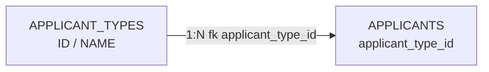
**字段定義**：

| 列名 | 類型 | 可空 | 默認 | 業務含義 |
|---|---|---|---|---|
| `ID` | NUMBER(19) | N | — | 主鍵 |
| `NAME` | VARCHAR2(255 CHAR) | N | — | 申請人類型名稱 |

##### 關係證據（代碼位置）

> 來源：`tables/APPLICANT_TYPES.md`（子文檔自動生成，勿手改；本節由 `docs/database-dictionary/scripts/merge_tables_into_dict.py` 自動合併，更新後重跑即可）

##### 业务外键关系（数据库无外键，从代码找）

###### 组成关系（APPLICANT_TYPES 为父，子表引用其 ID）

| 子表 | 关系方法 | 外键字段 | 代码位置 |
| ---- | ---- | ---- | ---- |
| APPLICANTS | `Application::applicantType(): BelongsTo` | applicant_type_id | app/Models/Application.php:349-351（`BelongsTo(ApplicantType::class)`，Eloquent 按方法名推断外键 `applicant_type_id`） |

- 外键列定义：`database/migrations/2023_10_10_155301_add_applicant_type_id_to_application_table.php:14`（`$table->unsignedBigInteger('applicant_type_id')->nullable()`，应用层外键、可空、无 DB 级约束）
- 写入点：
  - `app/Http/Controllers/External/OnlinePmApplicationController.php:223-225,236`（np/ma/le 映射 TYPE_OWNER/TYPE_ENTITY/TYPE_COMPANY 后写入 `applicant_type_id`）
  - `app/Repository/Request/ApplicationRelationsUpdateRequest.php:43-45`（`ApplicantType::findOrFail($this->data['applicant_type'])` 校验后更新 `applicant_type_id`）
- 读取点：
  - `app/Repository/ApplicationRepository.php:626`（个案列表查询字段）
  - `app/Models/Application.php:81`（$fillable）
- 业务分支使用点（按 applicant_type_id 值 1/2/3 分流，均经 `Application::applicantType` 读取）：
  - `app/Models/Proposal/Proposal.php:86,92,110,115`（提案文书按类型渲染）
  - `app/Models/OneAccount/Progress/PmProgressRepository.php:22,51,54,65`（TYPE_COMPANY 服务代码/平台分支）
  - `app/Http/Controllers/OneAccount/MessageStatusController.php:162,165`（TYPE_OWNER/TYPE_ENTITY 走 euid，TYPE_COMPANY 走 applicant_entity_code）
  - `app/Services/OnlineStepProcessCompletedProcessors/Pm/PmStepProcessCompletedProcessor.php:38,84`（TYPE_COMPANY 分支）
- 测试数据：`database/factories/ApplicationFactory.php:26`（random 1-3）

###### 归属关系（APPLICANT_TYPES 为子，引用父表）

无。APPLICANT_TYPES 为最上游字典表，自身无任何 Eloquent 关系方法（app/Models/ApplicantType.php 仅有 HasFactory + 常量 + fillable），数据由 seeder 直接插入（database/seeders/ApplicantTypeSeeder.php:17-30），不存在归属父表。

###### 多态/中间表关系

无。全仓 grep `ApplicantType` / `applicant_type_id` 未发现 belongsToMany 中间表或多态关联（related_applications 为 Application 自关联中间表，与 APPLICANT_TYPES 无关；Application::actionLogs() MorphMany 亦无关）。

> 詳細關係證據（代碼位置）：`tables/APPLICANT_TYPES.md`

---

---

#### 2. `APPLICATION_ITEM_ADJUSTMENTS` — 申請項目調整記錄（DAF 調整預留金額等）

- **用途**：申請項目調整記錄（DAF 調整預留金額等）
- **主鍵**：`ID` ｜ **唯一鍵**：`—` ｜ **數據庫外鍵**：無（關係由程序層定義）
- **索引**：APPLICATION_ITEM_ADJUSTMENTS_ID_PK(ID) UNIQUE

**關係圖**（實線=組成/歸屬，虛線=多態/中間表/業務關聯）：

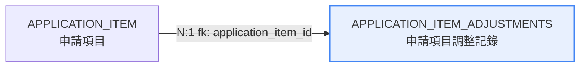
**字段定義**：

| 列名 | 類型 | 可空 | 默認 | 業務含義 |
|---|---|---|---|---|
| `ID` | NUMBER(19) | N | — | 主鍵 |
| `APPLICATION_ITEM_ID` | NUMBER(19) | N | — | 申請項目 → application_items.id |
| `AMOUNT` | NUMBER(12,2) | N | — | 調整金額 |
| `IS_SUBTRACTION` | CHAR(1) | N | — | 是否扣減（true=減少預留） |
| `REASON` | VARCHAR2(2000 CHAR) | Y | — | 調整原因 |
| `CREATED_AT` | TIMESTAMP(6) | Y | — | 創建時間 |
| `UPDATED_AT` | TIMESTAMP(6) | Y | — | 更新時間 |

##### 關係證據（代碼位置）

> 來源：`tables/APPLICATION_ITEM_ADJUSTMENTS.md`（子文檔自動生成，勿手改；本節由 `docs/database-dictionary/scripts/merge_tables_into_dict.py` 自動合併，更新後重跑即可）

##### 业务外键关系（从代码找）

###### 组成关系（本表为父 → 子表）

无。全量 grep `ApplicationItemAdjustment`（app/ + tests/）未发现任何 Model 定义指向本表的关系（hasMany/belongsTo 目标为本表的子模型不存在）。

###### 归属关系（父表 → 本表）

| 父表 | 关系方法 | 外键字段 | 代码位置 |
| --- | --- | --- | --- |
| APPLICATION_ITEM | `ApplicationItemAdjustment::applicationItem()` belongsTo | `application_item_id` | app/Models/ApplicationItemAdjustment.php:19-22 |
| APPLICATION_ITEM | `ApplicationItem::adjustmentItems()` hasMany | `application_item_id` | app/Models/ApplicationItem.php:37-40 |

`application_item_id` 业务使用点（证据）：

| 使用点 | 代码位置 |
| --- | --- |
| 竣工流程（IHM-PM-COMPLETION）：按 application_item_id 批量删除旧调整记录 | app/Services/StepProcesses/Pm/Dob/DobHeadApproval.php:159 |
| 竣工流程：`new ApplicationItemAdjustment` 重建调整记录（amount=0, is_subtraction=true） | app/Services/StepProcesses/Pm/Dob/DobHeadApproval.php:168-169 |
| 調整總額匯總：`ApplicationItemAdjustment::whereIn('application_item_id', ...)->sum('amount')` | app/Http/Controllers/ApplicationController.php:158 |
| Prop11 意見書生成：`with('applicationItem.fundingType')->whereHas('applicationItem', ...)` 按申請項目取調整項 | app/Models/Proposal/Prop11.php:140 |
| 調整項搜索組件：`withWhereHas('applicationItem', ...)` | app/Http/Controllers/Components/SearchAdjustmentItemController.php:44 |
| 竣工複核：`ApplicationItemAdjustment::findOrFail($item['id'])` 修改調整項 | app/Services/StepProcesses/Pm/Completion/DapeReviewCompletion.php:61 |
| 申請明細匯總 SQL：`sum((select sum(application_item_adjustments.amount) ... where application_item_id = application_items.id)) as adjustment_total` | app/Repository/ApplicationRepository.php:229 |

###### 多态/中间表关系

无。未发现 morphTo/morphMany/morphMap 等指向本表的使用；本表非中间表（拥有独立 Model 与业务语义）。

> 詳細關係證據（代碼位置）：`tables/APPLICATION_ITEM_ADJUSTMENTS.md`

---

---

#### 3. `APPLICATION_ITEMS` — 申請項目（資助項目明細），關聯申請類型與資助類型

- **用途**：申請項目（資助項目明細），關聯申請類型與資助類型
- **主鍵**：`ID` ｜ **唯一鍵**：`—` ｜ **數據庫外鍵**：無（關係由程序層定義）
- **索引**：APPLICATION_ITEMS_ID_PK(ID) UNIQUE

**關係圖**（實線=組成/歸屬，虛線=多態/中間表/業務關聯）：

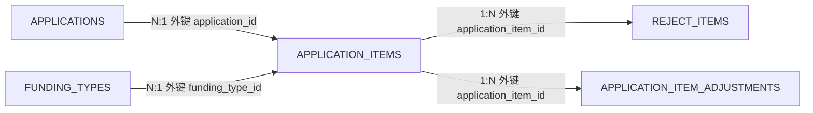
**字段定義**：

| 列名 | 類型 | 可空 | 默認 | 業務含義 |
|---|---|---|---|---|
| `ID` | NUMBER(19) | N | — | 主鍵 |
| `FUNDING_TYPE_ID` | NUMBER(19) | Y | — | 資助類型 → funding_types.id |
| `APPLICATION_ID` | NUMBER(19) | N | — | 個案 → applications.id |
| `APPLY_AMOUNT` | NUMBER(12,2) | N | — | 申請金額 |
| `APPLY_CATEGORY` | VARCHAR2(255 CHAR) | N | — | 申請類別 |
| `TOTAL` | NUMBER(10) | Y | — | 總金額 |
| `CREATED_AT` | TIMESTAMP(6) | Y | — | 創建時間 |
| `UPDATED_AT` | TIMESTAMP(6) | Y | — | 更新時間 |
| `ORIGINAL_AMOUNT` | NUMBER(12,2) | Y | — | 原始金額 |

##### 關係證據（代碼位置）

> 來源：`tables/APPLICATION_ITEMS.md`（子文檔自動生成，勿手改；本節由 `docs/database-dictionary/scripts/merge_tables_into_dict.py` 自動合併，更新後重跑即可）

##### 业务外键关系（代码证据）

数据库无外键约束，关系在程序中维护。本表外键字段：`APPLICATION_ID`（→ applications.id）、`FUNDING_TYPE_ID`（→ funding_types.id）；子表外键字段：`APPLICATION_ITEM_ID`（→ application_items.id，仅 REJECT_ITEMS / APPLICATION_ITEM_ADJUSTMENTS 两表）。

###### 组成关系（APPLICATION_ITEMS 为父，1:N）

| 子表 | 关系方法 | 外键字段 | 代码位置 |
| --- | --- | --- | --- |
| REJECT_ITEMS | ApplicationItem::rejectItems() hasMany(RejectItem::class)（未显式传外键，按约定 application_item_id） | APPLICATION_ITEM_ID | app/Models/ApplicationItem.php:27-30；迁移 database/migrations/2023_08_07_015412_create_reject_items_table.php:15（unsignedBigInteger('application_item_id')）；反向 belongsTo app/Models/RejectItem.php:24 |
| APPLICATION_ITEM_ADJUSTMENTS | ApplicationItem::adjustmentItems() hasMany(ApplicationItemAdjustment::class)（未显式传外键，按约定 application_item_id） | APPLICATION_ITEM_ID | app/Models/ApplicationItem.php:37-40；迁移 database/migrations/2023_11_07_155131_create_application_item_adjustments_table.php:15（foreignId('application_item_id')）；反向 belongsTo app/Models/ApplicationItemAdjustment.php:21 |

引用证据（application_item_id 使用点）：

- app/Http/Controllers/ApplicationController.php:113 `$item->rejectItems->where('application_item_id', $item->id)->sum('amount')`（拒绝金额汇总）
- app/Http/Controllers/ApplicationController.php:158 `ApplicationItemAdjustment::whereIn('application_item_id', $applicationItemIds)`（调整金额汇总）
- app/Services/IHM/FinanceService.php:123,128 `reject_items` 子查询按 application_item_id 分组 join application_items
- app/Repository/ApplicationRepository.php:216,229 汇总 SQL `inner join application_items on reject_items.application_item_id = application_items.id` / `application_item_adjustments.application_item_id = application_items.id`
- app/Repository/RejectItemRepository.php:22 与 app/trait/DapeTrait.php:33 按 application_id+funding_type_id 反查 application_items.id 回填 reject_item.application_item_id
- app/Services/StepProcesses/Pm/Dob/DobHeadApproval.php:151,159,169 重建/删除/写入 application_item_adjustments.application_item_id
- app/Models/Proposal/Prop11.php:142,199,207,238 按 application_item_id 归并调整明细生成文書
- app/Services/MeetingService.php:291,296 会议拒绝项按 application_item_id 匹配

###### 归属关系（APPLICATION_ITEMS 为子，N:1）

| 父表 | 关系方法 | 外键字段 | 代码位置 |
| --- | --- | --- | --- |
| APPLICATIONS | ApplicationItem::application() —— 声明为 hasOne(Application::class, 'application_id', 'id')，**语义应为 belongsTo（外键 application_id 在本表，多 items 指向一个 application）**，照实标注声明与语义不一致 | APPLICATION_ID | app/Models/ApplicationItem.php:22-25；反向 Application::applicationItems() HasMany app/Models/Application.php:165-167 |
| FUNDING_TYPES | ApplicationItem::fundingType() belongsTo(FundingType::class)（未显式传外键，按约定 funding_type_id） | FUNDING_TYPE_ID | app/Models/ApplicationItem.php:32-35 |

引用证据（application_id / funding_type_id 查询点）：

- app/Exports/Sheets/DOBAnalysisRecordSheet.php:59 `ApplicationItem::where('application_id', ...)`
- app/Models/Application.php:196,257,275,291 `ApplicationItem::where('application_id', $this->id)->with('adjustmentItems'/'rejectItems')`
- app/Repository/ApplicationRepository.php:213-214,232,237 按 application_items.application_id join、按 funding_type_id 分列汇总与 whereIn 过滤
- app/Services/StepProcesses/Pm/Dob/DobHeadApproval.php:93 `ApplicationItem::select('id', 'funding_type_id')->whereNotNull('funding_type_id')`
- app/Services/StepProcesses/Pm/Listening/UpdateApplicationItemRequest.php:110-111 按 application_id+funding_type_id 定位 item
- app/Repository/RejectItemRepository.php:22-24 与 app/trait/DapeTrait.php:33-35 按 application_id+funding_type_id 反查

###### 多态/中间表关系

无证据。检索结果：

- schema.json 全表扫描：含 APPLICATION_ITEM_ID 列的表仅有 REJECT_ITEMS、APPLICATION_ITEM_ADJUSTMENTS（均已归入组成关系），无其他中间表引用本表；
- 多态检索：morph 关系仅 ActionLog（app/Models/ActionLog/ActionLog.php:27 morphTo 'loggable'）挂在 Application（app/Models/Application.php:485 morphMany），ApplicationItem 无 morph 关系；
- belongsToMany 检索：无涉及 application_items 的中间表关系。

> 詳細關係證據（代碼位置）：`tables/APPLICATION_ITEMS.md`

---

---

#### 4. `APPLICATION_MEETING` — 個案與會議關聯的中間表（聽證會議）

- **用途**：個案與會議關聯的中間表（聽證會議）
- **主鍵**：`ID` ｜ **唯一鍵**：`—` ｜ **數據庫外鍵**：APPLICATION_ID, MEETING_ID
- **索引**：APPLICATION_MEETING_ID_PK(ID) UNIQUE

**關係圖**（實線=組成/歸屬，虛線=多態/中間表/業務關聯）：


**字段定義**：

| 列名 | 類型 | 可空 | 默認 | 業務含義 |
|---|---|---|---|---|
| `ID` | NUMBER(19) | N | — | 主鍵 |
| `MEETING_ID` | NUMBER(19) | N | — | 會議 → meetings.id |
| `APPLICATION_ID` | NUMBER(19) | N | — | 個案 → applications.id |
| `CREATED_AT` | TIMESTAMP(6) | Y | — | 創建時間 |
| `UPDATED_AT` | TIMESTAMP(6) | Y | — | 更新時間 |

##### 關係證據（代碼位置）

> 來源：`tables/APPLICATION_MEETING.md`（子文檔自動生成，勿手改；本節由 `docs/database-dictionary/scripts/merge_tables_into_dict.py` 自動合併，更新後重跑即可）

##### 关系分析（证据：文件:行号）

###### 组成关系（APPLICATION_MEETING 为父）

| 子表 | 关系方法 | 外键字段 | 代码位置 |
| --- | --- | --- | --- |
| （无） | - | - | - |

说明：`meeting_tasks`（`2023_12_14_101724_create_meeting_tasks_table.php`）與本表同屬 meeting 域，但其 Model（`app/Models/MeetingTask.php`）無任何關係定義，且屬 `meetings` 的直接子表，與 `application_meeting` 無代碼關聯，不計入。

###### 归属关系（APPLICATION_MEETING 为子）

| 父表 | 关系方法 | 外键字段 | 代码位置 |
| --- | --- | --- | --- |
| meetings | `foreignId('meeting_id')->constrained()` | MEETING_ID | database/migrations/2023_12_13_182247_create_application_meeting_table.php:15 |
| applications | `foreignId('application_id')->constrained()` | APPLICATION_ID | database/migrations/2023_12_13_182247_create_application_meeting_table.php:16 |

###### 多态/中间表关系

| 目标表 | 关系方法 | 说明 | 代码位置 |
| --- | --- | --- | --- |
| meetings ↔ applications | `Meeting::applications(): BelongsToMany` | 多對多 pivot：Meeting 側定義，默認中間表 application_meeting，外鍵 meeting_id（本表側）/ application_id（對方側）；Controller 用 attach/sync/detach 寫入；MeetingService 讀取 | app/Models/Meeting.php:20-22；app/Http/Controllers/MeetingController/MeetingController.php:46,65,75；app/Services/MeetingService.php:103 |

- Application 側**無**反向 `meetings()` 關係（grep `app/Models/Application.php` 無 `belongsToMany(Meeting` 命中）——關係是單向定義。
- 全項目無 `application_meeting` 字面量查詢（grep app/ config/ routes/ 0 命中），訪問全部經由 Eloquent 關係。

> 詳細關係證據（代碼位置）：`tables/APPLICATION_MEETING.md`

---

---

#### 5. `APPLICATION_MULTI_APPLICATION_PROCESS` — 個案與多流程關聯的中間表

- **用途**：個案與多流程關聯的中間表
- **主鍵**：`ID` ｜ **唯一鍵**：`—` ｜ **數據庫外鍵**：無（關係由程序層定義）
- **索引**：APPLICATION_MULTI_APPLICATION_PROCESS_ID_PK(ID) UNIQUE

**關係圖**（實線=組成/歸屬，虛線=多態/中間表/業務關聯）：

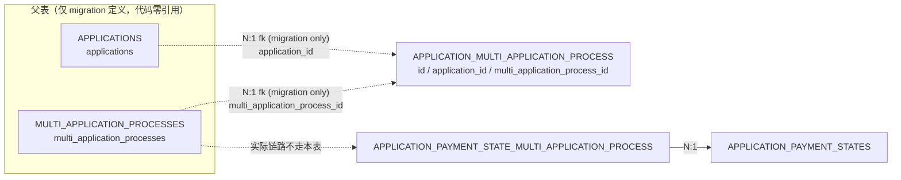
**字段定義**：

| 列名 | 類型 | 可空 | 默認 | 業務含義 |
|---|---|---|---|---|
| `ID` | NUMBER(19) | N | — | 主鍵 |
| `APPLICATION_ID` | NUMBER(19) | N | — | 個案 → applications.id |
| `MULTI_APPLICATION_PROCESS_ID` | NUMBER(19) | N | — | 多流程 → multi_application_processes.id |
| `CREATED_AT` | TIMESTAMP(6) | Y | — | 創建時間 |
| `UPDATED_AT` | TIMESTAMP(6) | Y | — | 更新時間 |

##### 關係證據（代碼位置）

> 來源：`tables/APPLICATION_MULTI_APPLICATION_PROCESS.md`（子文檔自動生成，勿手改；本節由 `docs/database-dictionary/scripts/merge_tables_into_dict.py` 自動合併，更新後重跑即可）

##### 业务外键关系（代码证据，重点）

> 说明：本表**没有任何代码引用**（全项目 grep `application_multi_application_process` 仅命中 migration 自身，app/、routes/、tests/、*.sql 均零命中）。下方归属关系仅依据 migration 的 `foreignId` 定义列明目标表，**无 Eloquent 关系方法、无读写证据**；按"无证据不写"原则，关系方法列如实标注"无"。

###### 组成关系（本表拥有的子表，hasMany/hasOne）

| 子表 | 关系方法 | 外键字段 | 代码位置 |
| --- | --- | --- | --- |
| （无） | - | - | 全量 grep 无任何子表通过本表 ID 反查的证据 |

###### 归属关系（本表属于的父表，belongsTo）

| 父表 | 关系方法 | 外键字段 | 代码位置 |
| --- | --- | --- | --- |
| MULTI_APPLICATION_PROCESSES | 无（仅 migration foreignId 定义） | multi_application_process_id | database/migrations/2023_11_29_105855_...php:16；目标表定义 database/migrations/2023_11_29_105016_create_application_upcoming_year_processes_table.php:13 |
| APPLICATIONS | 无（仅 migration foreignId 定义） | application_id | database/migrations/2023_11_29_105855_...php:15 |

###### 多态/中间表关系

| 目标表 | 关系方法 | 说明 | 代码位置 |
| --- | --- | --- | --- |
| （无） | - | 无 morphMany/morphTo；本表虽为中间表形态（双外键），但无任何 Eloquent belongsToMany 指向它 | 全量 grep 无证据 |

###### 附注（证据之外的发现——真实业务链路）

1. **业务实际使用的中间表是 `application_payment_state_multi_application_process`**：`MultiApplicationProcess::application_payment_states()` belongsToMany(ApplicationPaymentState::class) **未指定表名**（app/Models/MultiApplicationProcess.php:20-22），Laravel 按惯例推断中间表 = `application_payment_state_multi_application_process`（字母序），对应 migration 2023_12_27_124020_create_application_payment_state_multi_application_process_table.php:14-17；写入证据 app/Http/Controllers/CaseController/CaseController.php:490（`$multiApplicationProcess->application_payment_states()->attach(...)`）。
2. **Application ↔ MultiApplicationProcess 的间接链路**：MultiApplicationProcess → application_payment_states（belongsToMany，中间表见上）→ ApplicationPaymentState.application() belongsTo（app/Models/ApplicationPaymentState.php:46）。即"個案-多流程"关系实际由 **APPLICATION_PAYMENT_STATE_MULTI_APPLICATION_PROCESS + APPLICATION_PAYMENT_STATES** 两级承载，本表未被使用。
3. **MultiApplicationProcess 其他关联**：`generatedDocument()` hasOne(GeneratedDocument::class)（app/Models/MultiApplicationProcess.php:24-26），外键 GeneratedDocument.multi_application_process_id（fillable app/Models/GeneratedDocument.php:34；migration 2023_11_30_100139_...php:16；使用证据 app/Models/Proposal/PropShiftYear.php:37,44）。
4. **MultiApplicationProcess 与 Flowable 关联方式**：按 process_instance_id 查（app/trait/FlowableResponseTrait.php:38,95，流程类型 IHM-PM-UPCOMING-YEAR；app/Repository/MultiApplicationProcessRepository.php:25-32）。
5. **遗留风险**：本表 APPLICATION_ID / MULTI_APPLICATION_PROCESS_ID 均 NOT NULL，但无代码写入 → 若历史数据存在，无程序消费；若为空表，属建表遗留（2023-11-29 建表，恰为 multi_application_processes 次日，疑为最初设计中的 Application-MultiApplicationProcess 直连中间表，后改走 ApplicationPaymentState 链路）。

> 詳細關係證據（代碼位置）：`tables/APPLICATION_MULTI_APPLICATION_PROCESS.md`

---

---

#### 6. `APPLICATION_NOTES` — 個案內部備註（聯繫方式分類 PHONE/FTF/INTERNALREMARK）

- **用途**：個案內部備註（聯繫方式分類 PHONE/FTF/INTERNALREMARK）
- **主鍵**：`ID` ｜ **唯一鍵**：`—` ｜ **數據庫外鍵**：APPLICATION_ID
- **索引**：APPLICATION_NOTES_ID_PK(ID) UNIQUE

**關係圖**（實線=組成/歸屬，虛線=多態/中間表/業務關聯）：

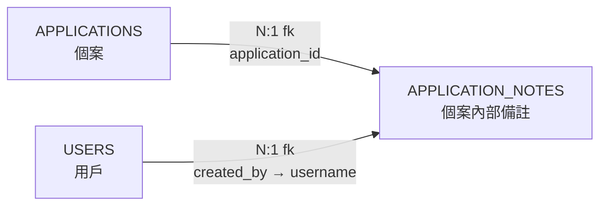
**字段定義**：

| 列名 | 類型 | 可空 | 默認 | 業務含義 |
|---|---|---|---|---|
| `ID` | NUMBER(19) | N | — | 主鍵 |
| `APPLICATION_ID` | NUMBER(19) | N | — | 個案 → applications.id |
| `CONTACT` | NUMBER(3) | N | — | 聯繫方式分類：1=PHONE 2=FTF(面談) 3=INTERNALREMARK(內部備註) |
| `VALUE` | VARCHAR2(4000 CHAR) | N | — | 備註內容 |
| `CREATED_BY` | VARCHAR2(255 CHAR) | N | — | 創建人 |
| `CREATED_AT` | TIMESTAMP(6) | Y | — | 創建時間 |
| `UPDATED_AT` | TIMESTAMP(6) | Y | — | 更新時間 |

##### 關係證據（代碼位置）

> 來源：`tables/APPLICATION_NOTES.md`（子文檔自動生成，勿手改；本節由 `docs/database-dictionary/scripts/merge_tables_into_dict.py` 自動合併，更新後重跑即可）

##### 业务外键关系（从代码找）

###### 组成关系（APPLICATION_NOTES → 子表，1:N）

无。全库 grep 无 `application_note_id` 引用，无任何子表/明细表指向本表。

###### 归属关系（父表 → APPLICATION_NOTES，N:1）

| 父表 | 关系方法 | 外键字段 | 代码位置 |
| --- | --- | --- | --- |
| APPLICATIONS | `ApplicationNote::application()` → `belongsTo(Application::class)` | APPLICATION_ID | app/Models/ApplicationNote.php:25-27 |
| USERS | `ApplicationNote::user()` → `belongsTo(User::class, 'created_by', 'username')` | CREATED_BY | app/Models/ApplicationNote.php:30-32 |

反向确认：`Application::applicationNotes()` → `hasMany(ApplicationNote::class)`，app/Models/Application.php:623-625（省略外键声明，默认按 `application_id` 匹配）。

###### 多态/中间表关系

无。代码中无 morphMany/morphTo/morphedByMany 涉及本模型。

##### 其他使用点（证据补充，非新关系）

| 使用点 | 代码位置 |
| --- | --- |
| 资源路由 `application-notes` → ApplicationNoteController | routes/api.php:82 |
| 列表页 eager load `with('application', 'user')` | app/Http/Controllers/ApplicationNoteController.php:20 |
| 個案详情 eager load `applicationNotes`（按 created_at desc） | app/Repository/ApplicationRepository.php:470 |
| 個案列表 eager load `applicationNotes` | app/Services/ApplicationList/ApplicationListServiceImpl.php:1310 |
| Factory 默认数据（contact 随机 1/2/3） | database/factories/ApplicationNoteFactory.php:20-23 |
| 建表 migration（foreignId constrained + timestamps） | database/migrations/2023_12_21_114758_create_application_notes_table.php:13-23 |

> 詳細關係證據（代碼位置）：`tables/APPLICATION_NOTES.md`

---

---

#### 7. `APPLICATION_PAYMENT_STATE_MULTI_APPLICATION_PROCESS` — 付款狀態與多流程關聯的中間表

- **用途**：付款狀態與多流程關聯的中間表
- **主鍵**：`ID` ｜ **唯一鍵**：`—` ｜ **數據庫外鍵**：無（關係由程序層定義）
- **索引**：APPLICATION_PAYMENT_STATE_MULTI_APPLICATION_PROCESS_ID_PK(ID) UNIQUE

**關係圖**（實線=組成/歸屬，虛線=多態/中間表/業務關聯）：

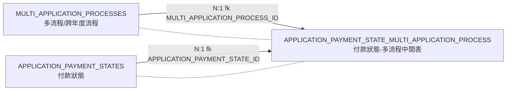
**字段定義**：

| 列名 | 類型 | 可空 | 默認 | 業務含義 |
|---|---|---|---|---|
| `ID` | NUMBER(19) | N | — | 主鍵 |
| `APPLICATION_PAYMENT_STATE_ID` | NUMBER(19) | N | — | 付款狀態 → application_payment_states.id |
| `MULTI_APPLICATION_PROCESS_ID` | NUMBER(19) | N | — | 多流程 → multi_application_processes.id |
| `CREATED_AT` | TIMESTAMP(6) | Y | — | 創建時間 |
| `UPDATED_AT` | TIMESTAMP(6) | Y | — | 更新時間 |

##### 關係證據（代碼位置）

> 來源：`tables/APPLICATION_PAYMENT_STATE_MULTI_APPLICATION_PROCESS.md`（子文檔自動生成，勿手改；本節由 `docs/database-dictionary/scripts/merge_tables_into_dict.py` 自動合併，更新後重跑即可）

##### 业务外键关系

###### 组成关系（本表 1:N 子表）

无。本表為純中間表，代碼中未發現以本表 ID 為外鍵的 Eloquent 關係（MultiApplicationProcess 僅有 belongsToMany + hasOne GeneratedDocument；ApplicationPaymentState 僅有 belongsTo Application）。

###### 归属关系（父表 N:1 本表）

| 父表 | 关系方法 | 外键字段 | 代码位置 |
| --- | --- | --- | --- |
| MULTI_APPLICATION_PROCESSES | MultiApplicationProcess::application_payment_states() belongsToMany(ApplicationPaymentState::class)（默认约定中间表名 + 外键名） | MULTI_APPLICATION_PROCESS_ID | app/Models/MultiApplicationProcess.php:20-22；database/migrations/2023_12_27_124020:16 |
| APPLICATION_PAYMENT_STATES | 同上 belongsToMany 右侧（ApplicationPaymentState 模型未显式声明反向关系，由 belongsToMany 默认约定 + attach 写入点证实） | APPLICATION_PAYMENT_STATE_ID | database/migrations/2023_12_27_124020:15；app/Http/Controllers/CaseController/CaseController.php:490 |

###### 多态/中间表关系

| 目标表 | 关系方法 | 说明 | 代码位置 |
| --- | --- | --- | --- |
| MULTI_APPLICATION_PROCESSES ↔ APPLICATION_PAYMENT_STATES（M:N） | MultiApplicationProcess::application_payment_states() belongsToMany(ApplicationPaymentState::class) | 本表即該 M:N 的 pivot 表（默认约定表名 application_payment_state_multi_application_process，无自定义 pivot 字段）。业务场景：跨年度流程（createUpcomingYearProcess）一次 attach 多個付款狀態，PropShiftYear / Prop11 按流程讀取多個付款狀態生成文書 | app/Models/MultiApplicationProcess.php:20-22 |

中间表使用点（证据）：
- **写入（唯一写入点）**：app/Http/Controllers/CaseController/CaseController.php:490 `$multiApplicationProcess->application_payment_states()->attach(ApplicationPaymentState::whereIn('id', $request->application_payment_state_ids)->get())`（createUpcomingYearProcess，下年度流程創建時綁定多個付款狀態）
- **读取**：app/Models/Proposal/PropShiftYear.php:81-94 `$this->multi_process->application_payment_states`（遍歷生成跨年文書）；app/Models/Proposal/Prop11.php:55 `$shift_process->application_payment_states()->where('application_id', ...)`（取 shift 後年份）
- **预加载**：app/Http/Controllers/CaseController/MultiProcessWorkItem.php:27 `$this->multiApplicationProcess->application_payment_states`（工作台返回）；app/Models/MultiApplicationProcess.php:31-33 全局作用域 `with('application_payment_states')`（所有查詢自動預載）
- **建表**：database/migrations/2023_12_27_124020:14-18（`$table->id()` + 2×`foreignId()` + `timestamps()`，無 constrained、無複合唯一索引）

> 詳細關係證據（代碼位置）：`tables/APPLICATION_PAYMENT_STATE_MULTI_APPLICATION_PROCESS.md`

---

---

#### 8. `APPLICATION_PAYMENT_STATES` — 個案付款狀態（分期付款

- **用途**：個案付款狀態（分期付款：一期/30%/70% 等）
- **主鍵**：`ID` ｜ **唯一鍵**：`—` ｜ **數據庫外鍵**：無（關係由程序層定義）
- **索引**：APPLICATION_PAYMENT_STATES_APP_NO_INDEX(APP_NO), APPLICATION_PAYMENT_STATES_ID_PK(ID) UNIQUE

**關係圖**（實線=組成/歸屬，虛線=多態/中間表/業務關聯）：

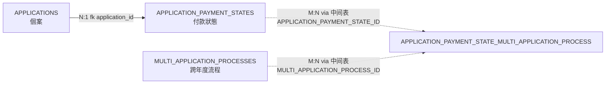
**字段定義**：

| 列名 | 類型 | 可空 | 默認 | 業務含義 |
|---|---|---|---|---|
| `ID` | NUMBER(19) | N | — | 主鍵 |
| `APP_NO` | VARCHAR2(50 CHAR) | N | — | 個案編號 |
| `STATE` | NUMBER(3) | N | — | 付款狀態 |
| `ORIGINAL_PROPOSAL_NO` | VARCHAR2(20 CHAR) | N | — | 原始建議書編號 |
| `PROPOSAL_NO` | VARCHAR2(20 CHAR) | Y | — | 格式化建議書編號（發送財務系統） |
| `INVOICE_NO` | VARCHAR2(20 CHAR) | Y | — | 發票號 |
| `RESERVED_AMOUNT` | NUMBER(10,2) | N | '0' | 預留金額 |
| `CREATED_AT` | TIMESTAMP(6) | Y | — | 創建時間 |
| `UPDATED_AT` | TIMESTAMP(6) | Y | — | 更新時間 |
| `APPLICATION_ID` | NUMBER(19) | N | — | 個案 → applications.id |
| `RESERVE_TYPE` | VARCHAR2(3 CHAR) | Y | — | 預留類型 |
| `BILL_CODE` | VARCHAR2(255 CHAR) | Y | — | 帳單代碼 |
| `YEAR` | VARCHAR2(255 CHAR) | Y | — | 年份 |
| `EFFECTIVE_DATE` | DATE | Y | — | 生效日期 |
| `TRANSACTION_DATE` | DATE | Y | — | 交易日期 |

##### 關係證據（代碼位置）

> 來源：`tables/APPLICATION_PAYMENT_STATES.md`（子文檔自動生成，勿手改；本節由 `docs/database-dictionary/scripts/merge_tables_into_dict.py` 自動合併，更新後重跑即可）

##### 业务外键关系

###### 组成关系（本表 1:N 子表）

无。代码中未发现以 `application_payment_state_id` 为外键指向本表的 Eloquent 关系或查询（唯一持有本表 ID 的 APPLICATION_PAYMENT_STATE_MULTI_APPLICATION_PROCESS 为多对多中间表，见下方）。

###### 归属关系（父表 N:1 本表）

| 父表 | 关系方法 | 外键字段 | 代码位置 |
| --- | --- | --- | --- |
| APPLICATIONS | Application::applicationPaymentStates() hasMany(ApplicationPaymentState::class) | application_id | app/Models/ApplicationPaymentState.php:34-36（belongsTo Application）；app/Models/Application.php:478-482 |

归属侧代码引用（证据）：
- app/Models/Official/OfiDAF.php:36 `$this->application->applicationPaymentStates()->where('reserve_type', ...)->where('state', PaymentState::Paid)`
- app/Models/Proposal/Prop11.php:51,55 `whereHas('application_payment_states', fn($q) => $q->where('application_id', $this->application->id))`
- app/Models/Proposal/Prop10.php:110 `$this->application->applicationPaymentStates()->whereIn('state', [Reserved, Activated])->where('year', ...)`
- app/Models/Proposal/Proposal.php:286 `$item->applicationPaymentStates()->where('state', Paid)->where('reserve_type', ...)->first()->original_proposal_no`
- app/Repository/ApplicationRepository.php:292,322,352 `join('application_payment_states', 'application_payment_states.application_id', '=', 'applications.id')`
- app/Repository/ApplicationRepository.php:705 `$app->applicationPaymentStates->first()?->reserved_amount`
- app/Repository/ApplicationRepository.php:1121-1127 `ApplicationPaymentState::where('year', $nextYear)->whereIn('state', [Reserved, Activated])->sum('reserved_amount')`
- app/Http/Controllers/Components/ApplicationHistoryController.php:23-26 `whereHas('applicationPaymentStates', ...)` / `with(...)`
- app/Http/Controllers/ApplicationController.php:92,134,146（详情接口预加载）
- app/Http/Controllers/DafProcessController/DafProcessRequest.php:135 `$this->application->applicationPaymentStates()->where('state', Activated)->first()`
- app/Services/StepProcesses/Pm/Completion/DafCompletionInputInstallmentTransactionDate.php:18、DafCompletionInputTransactionDate.php:28 `ApplicationPaymentState::where('application_id', ...)`

###### 多态/中间表关系

| 目标表 | 关系方法 | 说明 | 代码位置 |
| --- | --- | --- | --- |
| APPLICATION_PAYMENT_STATE_MULTI_APPLICATION_PROCESS | MultiApplicationProcess::application_payment_states() belongsToMany(ApplicationPaymentState::class) | 多对多中间表（默认约定表名 application_payment_state_multi_application_process；中间表字段 APPLICATION_PAYMENT_STATE_ID + MULTI_APPLICATION_PROCESS_ID，schema 实测）。用于「跨年度流程」把多個付款狀態綁定到一個 MultiApplicationProcess | app/Models/MultiApplicationProcess.php:20-23 |
| MULTI_APPLICATION_PROCESSES（跨年度流程，经中间表） | 同上 belongsToMany | 使用点：CaseController 创建跨年度流程时 attach 付款狀態；PropShiftYear 读取多個付款狀態生成文書 | app/Http/Controllers/CaseController/CaseController.php:490 `$multiApplicationProcess->application_payment_states()->attach(...)`；app/Models/Proposal/PropShiftYear.php:81-94 `$this->multi_process->application_payment_states`；app/Http/Controllers/CaseController/MultiProcessWorkItem.php:27 |

业务键（非 FK）说明：`invoice_no` 为付款成功後由財務系統回填的业务键——app/Services/IHM/FinanceService.php:385-403 `generalPayment()` 中 `$paymentState->update(['state' => PaymentState::Paid, 'invoice_no' => $response->getInvoiceNo()])`；`app_no` 有数据库索引（业务编号）。

> 詳細關係證據（代碼位置）：`tables/APPLICATION_PAYMENT_STATES.md`

---

---

#### 9. `APPLICATION_PROCESSES` — 個案流程表

- **用途**：個案流程表：一個個案可有多個流程（申請/聽證/補交/竣工/取消等），記錄 Flowable 流程實例與業務關聯
- **主鍵**：`ID` ｜ **唯一鍵**：`—` ｜ **數據庫外鍵**：無（關係由程序層定義）
- **索引**：APPLICATION_PROCESSES_ID_PK(ID) UNIQUE

**關係圖**（實線=組成/歸屬，虛線=多態/中間表/業務關聯）：

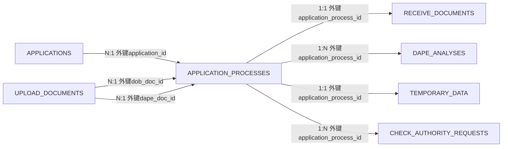
**字段定義**：

| 列名 | 類型 | 可空 | 默認 | 業務含義 |
|---|---|---|---|---|
| `ID` | NUMBER(19) | N | — | 主鍵 |
| `APPLICATION_ID` | NUMBER(19) | N | — | 個案 → applications.id |
| `DAPE_ANALYSIS_ID` | NUMBER(19) | Y | — | DAPE 分析 → dape_analyses.id |
| `PROCESS_TYPE` | VARCHAR2(255 CHAR) | N | — | 流程類型（IHM-PM-APPLICATION/ONLINE-APPLICATION/DOB/DAF/COMPLETION/CANCEL 等） |
| `PROCESS_INSTANCE_ID` | VARCHAR2(255 CHAR) | N | — | Flowable 流程實例 ID |
| `PROCESS_BUSINESS_KEY` | VARCHAR2(255 CHAR) | N | — | Flowable business key |
| `CREATED_AT` | TIMESTAMP(6) | Y | — | 創建時間 |
| `UPDATED_AT` | TIMESTAMP(6) | Y | — | 更新時間 |
| `DOB_DOC_ID` | VARCHAR2(255 CHAR) | Y | — | DOB 文檔 → upload_documents.id |
| `DAPE_DOC_ID` | VARCHAR2(255 CHAR) | Y | — | DAPE 文檔 → upload_documents.id |
| `HAS_DAPE_DOC` | CHAR(1) | N | '0' | 是否含 DAPE 文檔 |
| `HAS_DOB_DOC` | CHAR(1) | N | '0' | 該流程是否含 DOB 文檔（收件時按文檔部門==DOB 置 true，dob_days 接手日統計依據） |
| `SUPPLEMENTARY_TYPE` | VARCHAR2(255 CHAR) | Y | — | 補交類型 |
| `AUTHORITY_STATE` | NUMBER(10) | N | '0' | 授權狀態（線上授權核驗） |
| `DOB_NEXT_NODE` | VARCHAR2(255 CHAR) | Y | — | DOB 下一節點（DOB 流程跳轉） |

##### 關係證據（代碼位置）

> 來源：`tables/APPLICATION_PROCESSES.md`（子文檔自動生成，勿手改；本節由 `docs/database-dictionary/scripts/merge_tables_into_dict.py` 自動合併，更新後重跑即可）

##### 业务外键关系（代码证据，重点）

###### 组成关系（本表拥有的子表，hasMany/hasOne）

| 子表 | 关系方法 | 外键字段 | 代码位置 |
| --- | --- | --- | --- |
| RECEIVE_DOCUMENTS | `receiveDocument()` HasOne | application_process_id | app/Models/ApplicationProcess.php:55；反向显式声明 app/Models/ReceiveDocument.php:47（`belongsTo(ApplicationProcess::class, 'application_process_id', 'id')`）；表定义 RECEIVE_DOCUMENTS.APPLICATION_PROCESS_ID NOT NULL |
| DAPE_ANALYSES | `dapeAnalyses()` HasMany | application_process_id | app/Models/ApplicationProcess.php:60；表定义 DAPE_ANALYSES.APPLICATION_PROCESS_ID NOT NULL；fillable app/Models/DapeAnalysis.php:16 |
| TEMPORARY_DATA | `temporaryData()` HasOne | application_process_id | app/Models/ApplicationProcess.php:115；表定义 TEMPORARY_DATA.APPLICATION_PROCESS_ID NOT NULL；查询证据 app/Http/Controllers/TemporaryDataController.php:21（`TemporaryData::where('application_process_id', $applicationProcess->id)`） |
| CHECK_AUTHORITY_REQUESTS | 无 Eloquent 关系方法（代码引用确认） | application_process_id | 写入 app/Services/Online/CheckAuthorizationService.php:43；反查 app/Services/StepProcesses/Pm/Online/CheckAuthorization.php:43（`ApplicationProcess::where('id', $checkAuthRequest->application_process_id)`）；表定义 CHECK_AUTHORITY_REQUESTS.APPLICATION_PROCESS_ID NOT NULL |

###### 归属关系（本表属于的父表，belongsTo）

| 父表 | 关系方法 | 外键字段 | 代码位置 |
| --- | --- | --- | --- |
| APPLICATIONS | `application()` belongsTo | application_id | app/Models/ApplicationProcess.php:50；反向 app/Models/Application.php:159（`applicationProcesses()` HasMany）；表定义 APPLICATION_ID NOT NULL |
| UPLOAD_DOCUMENTS | `docDocument()` belongsTo | dob_doc_id | app/Models/ApplicationProcess.php:65；赋值 `$applicationProcess->dob_doc_id = $uploadDocument->id` app/Services/Online/OnlineUploadFileProcessor.php:154、app/Http/Controllers/Components/DobReviewFileController.php:155、app/trait/DapeTrait.php:46；按 upload_document.id 反查 app/Http/Controllers/Components/HandleFileController.php:58-59 |
| UPLOAD_DOCUMENTS | `dapeDocument()` belongsTo | dape_doc_id | app/Models/ApplicationProcess.php:70；赋值 app/Services/Online/OnlineUploadFileProcessor.php:142、app/Http/Controllers/Components/DobReviewFileController.php:159、app/trait/DapeTrait.php:49；反查 app/Http/Controllers/Components/HandleFileController.php:58-59 |

###### 多态/中间表关系

| 目标表 | 关系方法 | 说明 | 代码位置 |
| --- | --- | --- | --- |
| （无） | - | ApplicationProcess 模型无 morphMany/belongsToMany；库中中间表 APPLICATION_MULTI_APPLICATION_PROCESS / APPLICATION_PAYMENT_STATE_MULTI_APPLICATION_PROCESS 均挂 multi_application_processes（MultiApplicationProcess），与本表无外键关联 | 全量 grep 无证据 |

###### 附注（证据之外的发现）

1. **类型不一致坑**：DOB_DOC_ID / DAPE_DOC_ID 定义为 VARCHAR2(255 CHAR)，而目标 UPLOAD_DOCUMENTS.ID 为 NUMBER(19)——代码将 `$uploadDocument->id`（数字）写入 varchar 列，依赖 Oracle 隐式转换，无数据库约束保障。
2. **遗留列**：DAPE_ANALYSIS_ID（NUMBER(19) 可空）在建表 migration 中存在（database/migrations/2023_07_19_082108_create_application_processes_table.php:16），但全代码 grep `dape_analysis_id` 零引用，属未启用遗留列，不计入关系。
3. 原 migration 中的 `receive_document_id` 列已被 2023_10_18_115649 迁移移除，现关系反转为 RECEIVE_DOCUMENTS.application_process_id。

> 詳細關係證據（代碼位置）：`tables/APPLICATION_PROCESSES.md`

---

---

#### 10. `APPLICATION_SUPPLEMENTARY_DOCUMENTS` — 補交申請文件表（補交申請流程的文件記錄）

- **用途**：補交申請文件表（補交申請流程的文件記錄）
- **主鍵**：`ID` ｜ **唯一鍵**：`—` ｜ **數據庫外鍵**：DOCUMENT_ID, APPLICATION_ID
- **索引**：APPLICATION_SUPPLEMENTARY_DOCUMENTS_ID_PK(ID) UNIQUE

**關係圖**（實線=組成/歸屬，虛線=多態/中間表/業務關聯）：

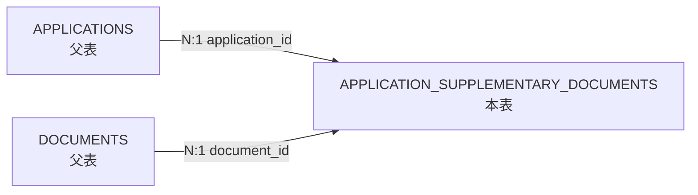
**字段定義**：

| 列名 | 類型 | 可空 | 默認 | 業務含義 |
|---|---|---|---|---|
| `ID` | NUMBER(19) | N | — | 主鍵 |
| `APPLICATION_ID` | NUMBER(19) | N | — | 個案 → applications.id |
| `DOCUMENT_ID` | NUMBER(19) | N | — | 文檔 → documents.id |
| `DOCUMENT_NAME` | VARCHAR2(255 CHAR) | Y | — | 文檔名稱 |
| `CREATED_AT` | TIMESTAMP(6) | Y | — | 創建時間 |
| `UPDATED_AT` | TIMESTAMP(6) | Y | — | 更新時間 |

##### 關係證據（代碼位置）

> 來源：`tables/APPLICATION_SUPPLEMENTARY_DOCUMENTS.md`（子文檔自動生成，勿手改；本節由 `docs/database-dictionary/scripts/merge_tables_into_dict.py` 自動合併，更新後重跑即可）

##### 业务外键关系

###### 组成关系

| 子表 | 关系方法 | 外键字段 | 代码位置 |
| --- | --- | --- | --- |
| （无） | - | - | - |

> 本表无 hasMany/hasOne 出向关系（SupplementaryDocument.php 全文无相关方法）。

###### 归属关系

| 父表 | 关系方法 | 外键字段 | 代码位置 |
| --- | --- | --- | --- |
| documents | SupplementaryDocument::document() BelongsTo | document_id（默认推断，与列名一致） | app/Models/SupplementaryDocument.php:18-21 |
| applications | SupplementaryDocument::application() BelongsTo | application_id（默认推断，与列名一致） | app/Models/SupplementaryDocument.php:23-26 |
| applications | Application::supplementaryDocuments() HasMany（反向） | application_id | app/Models/Application.php:628-631 |

###### 多态/中间表关系

| 目标表 | 关系方法 | 说明 | 代码位置 |
| --- | --- | --- | --- |
| applications ↔ documents | （无 Eloquent 中间表关系方法，见说明） | 业务上作为 Application 与 Document 的「多对多補交文件快照」中间表：更新时先 `supplementaryDocuments()->delete()` 再逐条 `create()`；`document_name` 冗余快照。实现上是两段 belongsTo + 一段反向 hasMany，非 belongsToMany / 非 morph。Document 模型无反向关系方法 | app/Services/StepProcesses/Pm/NewApplication/UpdateApplicationSupplementaryDocumentRequest.php:36-45 |

**引用点证据（grep）**：
- 写入：`UpdateApplicationSupplementaryDocumentRequest::update()` 先刪後建（document_id / document_name / application_id）— UpdateApplicationSupplementaryDocumentRequest.php:36-45；校验 `application_id exists:applications,id`、`document_list.*.id exists:documents,id` — 同文件:11-22
- 触发点：DapeReview.php:96-97（新申請 DAPE 審查）、DapeReviewCompletion.php:71（竣工 DAPE 審查）、ProcessApplicantData.php:152（線上申請處理）
- 读取：Ofi1.php:126（OFI 公函讀取補交清單）、CompletionRequireSupplementaryNotification.php:214、DapeSendOfi01.php:222,226（pluck document_id + 遍歷）、NotifyCompanyUploadDocs.php:155（線上通知公司上傳文件遍歷）

> 詳細關係證據（代碼位置）：`tables/APPLICATION_SUPPLEMENTARY_DOCUMENTS.md`

---

---

#### 11. `APPLICATION_TYPES` — 申請類型字典（資助計劃類型），含每周配額限制

- **用途**：申請類型字典（資助計劃類型），含每周配額限制
- **主鍵**：`ID` ｜ **唯一鍵**：`—` ｜ **數據庫外鍵**：無（關係由程序層定義）
- **索引**：APPLICATION_TYPES_ID_PK(ID) UNIQUE

**關係圖**（實線=組成/歸屬，虛線=多態/中間表/業務關聯）：

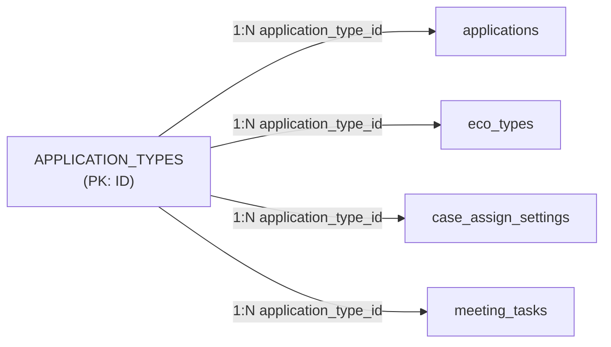
**字段定義**：

| 列名 | 類型 | 可空 | 默認 | 業務含義 |
|---|---|---|---|---|
| `ID` | NUMBER(19) | N | — | 主鍵 |
| `NAME` | VARCHAR2(30 CHAR) | N | — | 申請類型名稱 |
| `CREATED_AT` | TIMESTAMP(6) | Y | — | 創建時間 |
| `UPDATED_AT` | TIMESTAMP(6) | Y | — | 更新時間 |
| `WEEKLY_LIMIT` | NUMBER(10) | N | '0' | 每周配額上限（2025-07 新增） |
| `CODE` | VARCHAR2(255 CHAR) | N | — | 申請類型代碼 |

##### 關係證據（代碼位置）

> 來源：`tables/APPLICATION_TYPES.md`（子文檔自動生成，勿手改；本節由 `docs/database-dictionary/scripts/merge_tables_into_dict.py` 自動合併，更新後重跑即可）

##### 业务外键关系（代码证据）

数据库无外键约束（schema.json 中 `fk: []`；注：ECO_TYPES、MEETING_TASKS 的 schema fk 列表含 APPLICATION_TYPE_ID，且迁移中确有 `->constrained()`/`->foreign()` 声明，但生产库未落约束）。关系在程序中维护。

schema.json 全库扫描：仅 4 张表含 `APPLICATION_TYPE_ID` 列 —— **APPLICATIONS**（可空）、**CASE_ASSIGN_SETTINGS**（非空）、**ECO_TYPES**（非空）、**MEETING_TASKS**（非空）。

###### 组成关系（hasMany/hasOne 子表）

| 子表 | 关系方法 | 外键字段 | 代码位置 |
| ---- | ---- | ---- | ---- |
| applications | `ApplicationType::applications()` hasMany（无显式外键参数，走 Laravel 惯例 `application_type_id`） | application_type_id | app/Models/ApplicationType.php:24-26 |
| applications | `Application::applicationType()` belongsTo（反向） | application_type_id | app/Models/Application.php:316-318 |
| eco_types | `EcoType::applicationType()` belongsTo（ApplicationType 侧无反向 hasMany 方法） | application_type_id | app/Models/EcoType.php:22-24 |
| case_assign_settings | 无 Eloquent 关系方法（仅 fillable 声明 + 仓库/控制器直接查询） | application_type_id | app/Models/CaseAssignSetting.php:18；app/Repository/CaseAssignSettingRepository.php:28,48；app/Http/Controllers/CaseAssignSettingController.php:32,69,150 |
| meeting_tasks | 无 Eloquent 关系方法（模型为空壳，仅有迁移外键声明） | application_type_id | database/migrations/2023_12_14_101724_create_meeting_tasks_table.php:16 |

迁移证据（列定义 + 外键声明）：

| 子表迁移 | 列定义 | 代码位置 |
| ---- | ---- | ---- |
| create_applications_table | `unsignedBigInteger('application_type_id')->nullable()` | database/migrations/2023_06_20_033344_create_applications_table.php:16 |
| create_eco_types_table | `unsignedInteger('application_type_id')` + `foreign()->references('id')->on('application_types')` | database/migrations/2023_10_17_184810_create_eco_types_table.php:16,20 |
| create_meeting_tasks_table | `foreignId('application_type_id')->constrained()` | database/migrations/2023_12_14_101724_create_meeting_tasks_table.php:16 |
| create_case_assign_settings_table | `unsignedBigInteger('application_type_id')`（无约束声明） | database/migrations/2025_07_21_173341_create_case_assign_settings_table.php:16 |

其他代码引用（校验/查询侧证据）：

- `StoreEcoTypeRequest`：`application_type_id` 校验 `integer|required|exists:application_types,id` → app/Http/Requests/StoreEcoTypeRequest.php:26
- `UpdateEcoTypeRequest`：`integer|exists:application_types,id` → app/Http/Requests/UpdateEcoTypeRequest.php:26
- `ApplicationRepository::getApplicationsByType`：`where('application_type_id', $applicationTypeId)` → app/Repository/ApplicationRepository.php:856
- 创建侧写入：`SeederTrait`（app/trait/SeederTrait.php:76）、`OnlinePmApplicationController`（app/Http/Controllers/External/OnlinePmApplicationController.php:237）、`CaseController`（app/Http/Controllers/CaseController/CaseController.php:143）、`EcoTypeSeeder`（database/seeders/EcoTypeSeeder.php:20）、`ApplicationFactory`（database/factories/ApplicationFactory.php:25）、`CaseAssignSettingFactory`（database/factories/CaseAssignSettingFactory.php:29）
- 业务读取：`DafProcessController`（app/Http/Controllers/DafProcessController/DafProcessController.php:287,99）、`FinanceService`（app/Services/IHM/FinanceService.php:230）

###### 归属关系（belongsTo 父表）

`ApplicationType` 模型**无任何 belongsTo/hasOne 父表关系**（模型仅含 `applications()` hasMany），无父表证据，本项为空。

| 父表 | 关系方法 | 外键字段 | 代码位置 |
| ---- | ---- | ---- | ---- |
| （无） | — | — | — |

###### 多态/中间表关系

无证据：`ApplicationType` 模型无 morphTo/morphMany；schema.json 全库无 pivot/中间表含 `APPLICATION_TYPE_ID` 列（已全库扫描确认仅 4 张业务子表引用）。

| 目标表 | 关系方法 | 说明 | 代码位置 |
| ---- | ---- | ---- | ---- |
| （无） | — | — | — |

> 詳細關係證據（代碼位置）：`tables/APPLICATION_TYPES.md`

---

---

#### 12. `APPLICATION_UPDATE_REQUESTS` — 更改個案資料申請（申請人發起修改請求，DAPE 審批）

- **用途**：更改個案資料申請（申請人發起修改請求，DAPE 審批）
- **主鍵**：`ID` ｜ **唯一鍵**：`—` ｜ **數據庫外鍵**：無（關係由程序層定義）
- **索引**：APPLICATION_UPDATE_REQUESTS_ID_PK(ID) UNIQUE

**關係圖**（實線=組成/歸屬，虛線=多態/中間表/業務關聯）：


**字段定義**：

| 列名 | 類型 | 可空 | 默認 | 業務含義 |
|---|---|---|---|---|
| `ID` | NUMBER(19) | N | — | 主鍵 |
| `APPLICATION_ID` | NUMBER(19) | N | — | 個案 → applications.id |
| `REASON` | VARCHAR2(1000 CHAR) | N | — | 修改原因 |
| `CREATED_AT` | TIMESTAMP(6) | Y | — | 創建時間 |
| `UPDATED_AT` | TIMESTAMP(6) | Y | — | 更新時間 |

##### 關係證據（代碼位置）

> 來源：`tables/APPLICATION_UPDATE_REQUESTS.md`（子文檔自動生成，勿手改；本節由 `docs/database-dictionary/scripts/merge_tables_into_dict.py` 自動合併，更新後重跑即可）

##### 业务外键关系

###### 归属关系

| 父表 | 关系方法 | 外键字段 | 代码位置 |
| --- | --- | --- | --- |
| APPLICATIONS | `Application::applicationUpdateRequests(): HasMany`（hasMany ApplicationUpdateRequest::class） | application_id（Eloquent 惯例，模型侧无显式 foreign key 声明） | app/Models/Application.php:659-662 |

> ⚠️ 证据备注：`app/Models/ApplicationUpdateRequest.php`（全文 8-13 行）**未定义** `application()` belongsTo 关系方法；父侧 hasMany + 迁移 `application_id` 字段 + 使用点共同佐证该外键语义。`app/Models/Official/OfiRequestModify.php:56` 的 `$this->application` 是该类构造器（:20）查询赋值的属性，并非本表模型关系。

###### 组成关系

无。未发现任何表/模型以本表为父表（grep `ApplicationUpdateRequest` 全仓，无其他模型持有指向本表的外键关系）。

###### 多态/中间表关系

无。本表无 morph 关联、无中间表（pivot）使用。

###### 关键使用点（非关系定义，供业务溯源）

| 位置 | 行为 |
| --- | --- |
| app/Services/StepProcesses/Pm/Online/ProcessApplicantData.php:180（saveDataWithModifyRequest） | 在线申請「要求修改」时 `ApplicationUpdateRequest::create(['application_id'=>…,'reason'=>modify_reason])` 写入本表 |
| app/Models/Official/OfiRequestModify.php:56（getUpdateReason） | 生成「要求修改申請資料」OFI 公函时按 application_id 取 reason 填入文书 |
| app/Services/StepProcesses/Pm/UpdateRequest/UpdateRequestDapeHeadApproval.php:57 | DAPE 處長核准更新流程——⚠️ 此处 `ApplicationUpdateRequest` 为同名 **Repository 类**（`App\Repository\Request\ApplicationUpdateRequest`，:12 use），非本表模型 |
| app/Repository/Request/ApplicationUpdateRequest.php:8 | 同名 Repository（update 直接写 APPLICATIONS），与数据表无外键关系 |
| database/factories/ApplicationUpdateRequestFactory.php:10 | 测试工厂 |
| tests/Feature/OfiRequestModifyTest.php:64、tests/Feature/StepProcesses/Pm/Online/ProcessApplicantDataTest.php:412 | 测试引用/断言 |

> 詳細關係證據（代碼位置）：`tables/APPLICATION_UPDATE_REQUESTS.md`

---

---

#### 13. `APPLICATIONS` — 個案主表

- **用途**：個案主表：樓宇維修資助申請的完整生命周期，含申請人、樓宇、公司、狀態、期限等全部核心信息（91 列，事實上的聚合根）
- **主鍵**：`ID` ｜ **唯一鍵**：`APP_NO` ｜ **數據庫外鍵**：無（關係由程序層定義）
- **索引**：APPLICATIONS_APP_NO_UK(APP_NO) UNIQUE, APPLICATIONS_ID_PK(ID) UNIQUE

**關係圖**（實線=組成/歸屬，虛線=多態/中間表/業務關聯）：

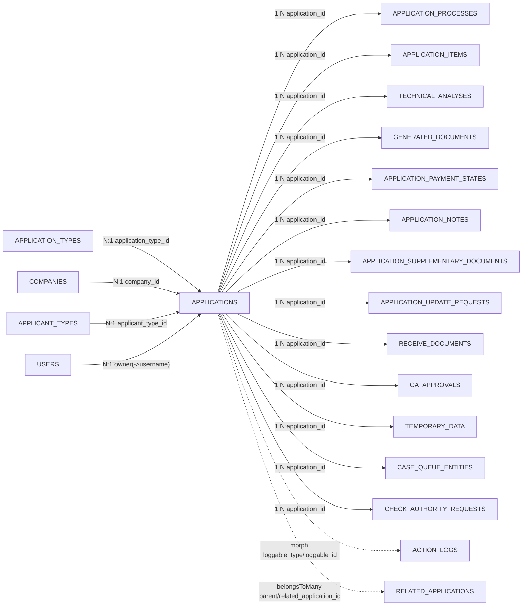
**字段定義**：

| 列名 | 類型 | 可空 | 默認 | 業務含義 |
|---|---|---|---|---|
| `ID` | NUMBER(19) | N | — | 主鍵 |
| `APP_NO` | VARCHAR2(50 CHAR) | N | — | 個案編號（唯一，如 23202600076） |
| `APPLICATION_TYPE_ID` | NUMBER(19) | Y | — | 申請類型 → application_types.id |
| `COMPANY_ID` | NUMBER(19) | Y | — | 工程公司 → companies.id |
| `COMPANY_BANK_ACCOUNT` | VARCHAR2(100 CHAR) | Y | — | 工程公司銀行帳號 |
| `APPLICANT_NAME_ZH` | VARCHAR2(200 CHAR) | Y | — | 申請人姓名（中文） |
| `APPLICANT_NAME_PT` | VARCHAR2(200 CHAR) | Y | — | 申請人姓名（葡文） |
| `IDENTITY_DOCUMENT_TYPE` | VARCHAR2(20 CHAR) | Y | — | 身份證明文件類型 |
| `IDENTITY_DOCUMENT_NO` | VARCHAR2(100 CHAR) | Y | — | 身份證明文件號碼 |
| `CONTACT_NO` | VARCHAR2(20 CHAR) | Y | — | 聯絡電話 |
| `CONTACT_BUILDING_NAME` | VARCHAR2(255 CHAR) | Y | — | 聯絡地址-樓宇名稱 |
| `CONTACT_BUILDING_ADDRESS` | VARCHAR2(255 CHAR) | Y | — | 聯絡地址 |
| `CONTACT_FAX` | VARCHAR2(100 CHAR) | Y | — | 傳真 |
| `CONTACT_MOBILE` | VARCHAR2(20 CHAR) | Y | — | 手提電話 |
| `CONTACT_OTHERS` | VARCHAR2(100 CHAR) | Y | — | 其他聯絡方式 |
| `SMS_NOTIFICATION` | VARCHAR2(20 CHAR) | Y | — | SNS 通知選項（短信/社交通知） |
| `BUILDING_UNITS_PER_BLOCK` | CHAR(1) | Y | — | 每幢單位數 |
| `CONSTRUCTION_DURATION` | NUMBER(10) | Y | — | 施工工期 |
| `PREDICT_CONSTRUCTION_START_DATE` | DATE | Y | — | 預計施工開始日期 |
| `PREDICT_CONSTRUCTION_END_DATE` | DATE | Y | — | 預計施工結束日期 |
| `IS_INSTALLMENT_PAYMENT` | CHAR(1) | Y | — | 是否分期付款 |
| `OWNER` | VARCHAR2(100 CHAR) | Y | — | 業主 |
| `STATUS` | NUMBER(3) | N | '1' | 個案狀態：1=處理中(processing) 2=完成(complete) 3=已取消(cancelled) 4=等待上傳(waitingForUpload) |
| `REMARK` | VARCHAR2(1000 CHAR) | Y | — | 備註 |
| `CREATED_AT` | TIMESTAMP(6) | Y | — | 創建時間 |
| `UPDATED_AT` | TIMESTAMP(6) | Y | — | 更新時間 |
| `BUILDING_ID` | VARCHAR2(20 CHAR) | Y | — | 樓宇 ID（IHM Building API） |
| `REFERENCE_ID` | VARCHAR2(20 CHAR) | Y | — | 參考 ID（樓宇 API） |
| `BUILDING_NAME_ZH` | VARCHAR2(100 CHAR) | Y | — | 樓宇名稱（中文） |
| `BUILDING_NAME_PT` | VARCHAR2(100 CHAR) | Y | — | 樓宇名稱（葡文） |
| `BUILDING_ADDRESS` | VARCHAR2(200 CHAR) | Y | — | 樓宇地址 |
| `BUILDING_ADDRESS_ZH` | VARCHAR2(200 CHAR) | Y | — | 樓宇地址（中文） |
| `BUILDING_ADDRESS_PT` | VARCHAR2(200 CHAR) | Y | — | 樓宇地址（葡文） |
| `BUILDING_ESTATE_NO` | VARCHAR2(20 CHAR) | Y | — | 屋苑編號 |
| `BUILDING_TOTAL_UNITS` | NUMBER(10) | Y | — | 樓宇總單位數 |
| `LICENSE_DATE` | DATE | Y | — | 准照日期 |
| `BUILDING_PROP_DESC` | VARCHAR2(20 CHAR) | Y | — | 樓宇性質（E=經濟房屋 S=社會房屋 P=私人樓宇） |
| `BUILDING_USAGE_DESC` | VARCHAR2(20 CHAR) | Y | — | 樓宇用途 |
| `APPLIER_TYPE` | NUMBER(3) | N | '0' | 申請人類型（tinyint，默認 0） |
| `BUILDING_UNITS_PER_BLOCK_OPINION` | VARCHAR2(255 CHAR) | Y | — | 每幢單位數（意見書用） |
| `APPLICANT_TYPE_ID` | NUMBER(19) | Y | — | 申請人類型 → applicant_types.id |
| `ADVISORY_STATUS` | NUMBER(10) | Y | — | 輪候/預留狀態：0=未開始 1=輪候 2=預留 |
| `EXPIRY_DATE` | DATE | Y | — | 對外截止日期（各節點期限統一承載，供 dape_days 使用） |
| `BUILDING_COMPOSITION` | VARCHAR2(100 CHAR) | Y | — | 樓宇組成 |
| `BUILDING_COMPOSITION_ZH` | VARCHAR2(100 CHAR) | Y | — | 樓宇組成（中文） |
| `BUILDING_COMPOSITION_PT` | VARCHAR2(100 CHAR) | Y | — | 樓宇組成（葡文） |
| `CONTACT_NAME` | VARCHAR2(100 CHAR) | Y | — | 聯絡人姓名 |
| `MANAGEMENT_AGENCY_MEMBER` | VARCHAR2(400 CHAR) | Y | — | 管理機關成員 |
| `OFI03_RECEIVED_DATE` | DATE | Y | — | OFI-03 簽收日期（聽證通知） |
| `HAVE_APPLICANT_OPINIONS` | CHAR(1) | Y | — | 是否有申請人意見 |
| `IS_APPLICANT_OPINION_EXPIRED` | CHAR(1) | Y | — | 申請人意見是否過期 |
| `LISTENING_RESULT` | NUMBER(3) | Y | — | 聽證結果：1=不批 2=批准 3=部分批准 |
| `FULL_PAYMENT_YEAR` | NUMBER(10) | Y | — | 全額付款年份 |
| `INSTALLMENT_YEAR_30` | NUMBER(10) | Y | — | 分期 30% 年份 |
| `INSTALLMENT_YEAR_70` | NUMBER(10) | Y | — | 分期 70% 年份 |
| `CA_RESERVE_APPROVAL_DATE` | DATE | Y | — | CA 預留審批日期 |
| `CA_CASE_APPROVAL_STATUS` | NUMBER(3) | Y | — | CA 個案審批狀態：1=拒絕 2=批准 3=部分批准 |
| `OFI04_RECEIVED_DATE` | DATE | Y | — | OFI-04 簽收日期 |
| `OWNER_NICKNAME` | VARCHAR2(50 CHAR) | Y | — | 業主暱稱 |
| `LISTENING_PROCESS_STATUS` | NUMBER(3) | N | '1' | 聽證流程狀態：1=缺席 2=處理中 3=完成 |
| `APPLICATION_RESULT` | NUMBER(3) | Y | — | 審批結果（tinyint，2023-11 新增） |
| `COMPANY_NAME_ZH` | VARCHAR2(255 CHAR) | Y | — | 工程公司承攬人（中文） |
| `COMPANY_NAME_PT` | VARCHAR2(255 CHAR) | Y | — | 工程公司承攬人（葡文） |
| `COMPANY_TAXPAYER` | VARCHAR2(255 CHAR) | Y | — | 工程公司納稅人 |
| `COMPANY_BANK_NAME` | VARCHAR2(255 CHAR) | Y | — | 工程公司銀行名稱 |
| `COMPANY_BANK_ACCOUNT_NAME` | VARCHAR2(255 CHAR) | Y | — | 工程公司銀行帳戶名稱 |
| `INVOICE_NO_FULL` | VARCHAR2(30 CHAR) | Y | — | 全額發票號 |
| `INVOICE_NO_30` | VARCHAR2(30 CHAR) | Y | — | 30% 發票號 |
| `INVOICE_NO_70` | VARCHAR2(30 CHAR) | Y | — | 70% 發票號 |
| `INVOICE_SUPPLEMENTAL_FUNDING` | VARCHAR2(255 CHAR) | Y | — | 補充資助發票號 |
| `CANCEL_APPLICATION_REQUEST_TYPE` | NUMBER(3) | Y | — | 取消申請類型：1=申請人取消 2=IHM 取消 |
| `OBJECTION_ADVISORY_STATUS` | NUMBER(10) | Y | '0' | 反對意見輪候狀態 |
| `CASE_STATUS` | VARCHAR2(255 CHAR) | Y | 'PROCESSING' | 業務階段狀態（PROCESSING/APPROVED/REJECTED/CANCELLED/LISTENING_APPROVED/DISBURSED） |
| `COMPANY_SUPPLIER_NO` | VARCHAR2(255 CHAR) | Y | — | 工程公司供應商編號 |
| `COMPANY_SEQ_NO` | VARCHAR2(255 CHAR) | Y | — | 工程公司編號 |
| `CA_EXTRA_RESERVE_APPROVAL_DATE` | DATE | Y | — | CA 額外預留審批日期 |
| `CASE_EXTRA_STATUS` | VARCHAR2(255 CHAR) | Y | — | 個案額外狀態（CA 額外預留） |
| `PROPOSAL_APPROVED` | CHAR(1) | N | '0' | 建議書是否已批准（boolean，默認 false） |
| `APPLICATION_BUILDING_NAME` | VARCHAR2(255 CHAR) | Y | — | 申請樓宇名稱 |
| `APPLICATION_BUILDING_ADDRESS` | VARCHAR2(255 CHAR) | Y | — | 申請樓宇地址 |
| `EUID` | VARCHAR2(255 CHAR) | Y | — | 一戶通 euid（線上申請人） |
| `CHANNEL` | NUMBER(3) | N | '2' | 渠道：1=線上 2=線下 |
| `IS_AUTHORIZED_UPLOAD` | CHAR(1) | N | '0' | 是否授權代交上傳 |
| `HAS_COMPANY_RELATIONSHIP` | CHAR(1) | N | '0' | 是否與公司有關聯 |
| `COMPANY_RELATIONSHIP` | VARCHAR2(255 CHAR) | Y | — | 與公司關聯描述 |
| `BR_NO` | VARCHAR2(255 CHAR) | Y | — | 商業登記編號 |
| `APPLICANT_ENTITY_CODE` | VARCHAR2(255 CHAR) | Y | — | 申請人實體代碼（一戶通） |
| `AUTHORIZE_ENTITY_CODE` | VARCHAR2(255 CHAR) | Y | — | 授權實體代碼 |
| `CASE_PROGRESS_STATUS` | VARCHAR2(255 CHAR) | Y | — | 進度狀態（管理層視角，與 process_status 雙軌） |
| `APPLICATION_BUILDING_NAME_PT` | VARCHAR2(255 CHAR) | Y | — | 申請樓宇名稱（葡文） |
| `APPLICATION_BUILDING_ADDRESS_PT` | VARCHAR2(255 CHAR) | Y | — | 申請樓宇地址（葡文） |

##### 關係證據（代碼位置）

> 來源：`tables/APPLICATIONS.md`（子文檔自動生成，勿手改；本節由 `docs/database-dictionary/scripts/merge_tables_into_dict.py` 自動合併，更新後重跑即可）

##### 业务外键关系（代码证据，重点）

> 数据库无外键约束（schema fk=[]），以下关系全部来自代码证据（Eloquent 关系方法 / 反向 belongsTo / 业务查询）。

###### 组成关系（本表拥有的子表，hasMany/hasOne）

| 子表 | 关系方法 | 外键字段 | 代码位置 |
| --- | --- | --- | --- |
| APPLICATION_PROCESSES | applicationProcesses() | application_id | app/Models/Application.php:159-161 (HasMany) |
| APPLICATION_ITEMS | applicationItems() | application_id | app/Models/Application.php:164-166 (HasMany) |
| TECHNICAL_ANALYSES | technicalAnalyses() | application_id | app/Models/Application.php:321-323 (HasMany) |
| TECHNICAL_ANALYSES | technicalAnalysis() | application_id | app/Models/Application.php:326-328 (HasOne, latest) |
| GENERATED_DOCUMENTS | generatedDocuments() | application_id | app/Models/Application.php:359-361 (HasMany) |
| APPLICATION_PAYMENT_STATES | applicationPaymentStates() | application_id | app/Models/Application.php:478-480 (HasMany) |
| APPLICATION_NOTES | applicationNotes() | application_id | app/Models/Application.php:623-625 (HasMany) |
| APPLICATION_SUPPLEMENTARY_DOCUMENTS | supplementaryDocuments() | application_id | app/Models/Application.php:628-630 (HasMany) |
| APPLICATION_UPDATE_REQUESTS | applicationUpdateRequests() | application_id | app/Models/Application.php:658-660 (HasMany) |
| RECEIVE_DOCUMENTS | receiveDocuments() | application_id | app/Models/Application.php:673-675 (HasMany) |
| CA_APPROVALS | caApprovals() | application_id | app/Models/Application.php:678-680 (HasMany) |
| TEMPORARY_DATA | （无 Application.php 关系方法） | application_id | 反向证据 app/Models/TemporaryData.php:35 belongsTo(Application::class)；写入证据 app/Console/Commands/UpdateApplicationBuildingPtData.php:54 |
| CASE_QUEUE_ENTITIES | （无 Application.php 关系方法） | application_id | 反向证据 app/Models/CaseQueueEntity.php:33 belongsTo(Application::class) |
| CHECK_AUTHORITY_REQUESTS | （无 Eloquent 关系，业务直接查询） | application_id | app/Http/Controllers/Online/CheckAuthorityController.php:51；app/Services/StepProcesses/Pm/Online/CheckAuthorization.php:32；写入 app/Services/Online/CheckAuthorizationService.php:42 |

> 备注 1：APPLICATION_ITEMS 侧反向定义方向特殊——`ApplicationItem::application()` 声明为 hasOne(Application::class, 'application_id', 'id')（app/Models/ApplicationItem.php:22-26），语义上应为 belongsTo，但外键事实一致：APPLICATION_ITEMS.application_id → APPLICATIONS.id。
> 备注 2：APPLICATION_UPDATE_REQUESTS 无反向关系方法，但有 fillable application_id（app/Models/ApplicationUpdateRequest.php:13-16）且代码查询 `ApplicationUpdateRequest::where('application_id', ...)`（app/Models/Official/OfiRequestModify.php:56）。
> 备注 3：APPLICATION_MEETING 表虽有 APPLICATION_ID 列，但代码中未找到 Eloquent 关系或业务查询证据直接关联 APPLICATIONS，故不列入（证据优先）。

###### 归属关系（本表属于的父表，belongsTo）

| 父表 | 关系方法 | 外键字段 | 代码位置 |
| --- | --- | --- | --- |
| APPLICATION_TYPES | applicationType() | application_type_id | app/Models/Application.php:316-318 (BelongsTo) |
| COMPANIES | company() | company_id | app/Models/Application.php:331-333 (BelongsTo) |
| APPLICANT_TYPES | applicantType() | applicant_type_id | app/Models/Application.php:349-351 (BelongsTo) |
| USERS | user() | owner（引用 users.username，非 id） | app/Models/Application.php:354-357 (belongsTo(User::class, 'owner', 'username')) |

###### 多态/中间表关系

| 目标表 | 关系方法 | 说明 | 代码位置 |
| --- | --- | --- | --- |
| ACTION_LOGS | actionLogs() | morphMany，loggable_type + loggable_id 多态关联（schema 确认 ACTION_LOGS 含 LOGGABLE_TYPE/LOGGABLE_ID） | app/Models/Application.php:483-485 |
| RELATED_APPLICATIONS | relatedApplications() / repeatedApplications() | belongsToMany 自引用中间表，parent_application_id + related_application_id（schema 确认两列均 NOT NULL），withPivot('is_repeated') | app/Models/Application.php:336-346 |

> 詳細關係證據（代碼位置）：`tables/APPLICATIONS.md`

---

---

#### 14. `MULTI_APPLICATION_PROCESSES` — 多個案合併流程表（同一個流程處理多個個案）

- **用途**：多個案合併流程表（同一個流程處理多個個案）
- **主鍵**：`ID` ｜ **唯一鍵**：`—` ｜ **數據庫外鍵**：無（關係由程序層定義）
- **索引**：MULTI_APPLICATION_PROCESSES_ID_PK(ID) UNIQUE

**關係圖**（實線=組成/歸屬，虛線=多態/中間表/業務關聯）：

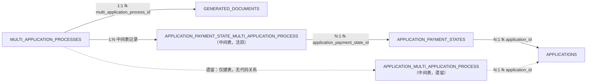
**字段定義**：

| 列名 | 類型 | 可空 | 默認 | 業務含義 |
|---|---|---|---|---|
| `ID` | NUMBER(19) | N | — | 主鍵 |
| `PROCESS_TYPE` | VARCHAR2(255 CHAR) | N | — | 流程類型 |
| `PROCESS_INSTANCE_ID` | VARCHAR2(255 CHAR) | N | — | Flowable 流程實例 ID |
| `PROCESS_BUSINESS_KEY` | VARCHAR2(255 CHAR) | N | — | Flowable business key |
| `CREATED_AT` | TIMESTAMP(6) | Y | — | 創建時間 |
| `UPDATED_AT` | TIMESTAMP(6) | Y | — | 更新時間 |

##### 關係證據（代碼位置）

> 來源：`tables/MULTI_APPLICATION_PROCESSES.md`（子文檔自動生成，勿手改；本節由 `docs/database-dictionary/scripts/merge_tables_into_dict.py` 自動合併，更新後重跑即可）

##### 业务外键关系

###### 组成关系（MULTI_APPLICATION_PROCESSES 拥有子记录）

| 子表 | 关系方法 | 外键字段 | 代码位置 |
| --- | --- | --- | --- |
| GENERATED_DOCUMENTS | `generatedDocument(): hasOne(GeneratedDocument::class)`（默认外键 `multi_application_process_id`） | `GENERATED_DOCUMENTS.MULTI_APPLICATION_PROCESS_ID → MULTI_APPLICATION_PROCESSES.ID` | 关系定义 `app/Models/MultiApplicationProcess.php:19-21`；外键列加入 `database/migrations/2023_11_30_100139_update_generated_document_table_to_handle_multi_process.php:9-10`（nullable bigInteger）；fillable `app/Models/GeneratedDocument.php:34`；写入点 `app/Models/Proposal/PropShiftYear.php:38,40`（`application_id=null` + `multi_application_process_id=$multi_process_id`，二者互斥二选一） |

###### 归属关系（父表指向 MULTI_APPLICATION_PROCESSES）

| 父表 | 关系方法 | 外键字段 | 代码位置 |
| --- | --- | --- | --- |
| （无） | MultiApplicationProcess 模型无任何 `belongsTo` 关系方法；schema 亦无 FK 约束 | - | `app/Models/MultiApplicationProcess.php:10-33`（仅 belongsToMany + hasOne） |

###### 多态/中间表关系

| 目标表 | 关系方法 | 说明 | 代码位置 |
| --- | --- | --- | --- |
| APPLICATION_PAYMENT_STATE_MULTI_APPLICATION_PROCESS | `application_payment_states(): belongsToMany(ApplicationPaymentState::class)`（默认中间表名，未显式传参） | 活跃多对多中间表：`multi_application_process_id` + `application_payment_state_id`；一个多個案流程聚合多个個案的付款状态，由此间接触达 `APPLICATION_PAYMENT_STATES.APPLICATION_ID` 对应的多个 `APPLICATIONS`；attach 发生在创建流程时；另有全局 scope 强制预加载 | 关系定义 `app/Models/MultiApplicationProcess.php:15-17`；建表 `database/migrations/2023_12_27_124020_create_application_payment_state_multi_application_process_table.php:13-18`（两个 foreignId）；attach 调用 `app/Http/Controllers/CaseController/CaseController.php:490`；全局 scope `app/Models/MultiApplicationProcess.php:23-29` |
| APPLICATION_MULTI_APPLICATION_PROCESS | 无 Eloquent 关系方法（历史遗留表） | 仅 migration 建表（`application_id` + `multi_application_process_id`）；当前代码无任何模型/关系引用，仅 `CaseController::getReservedCase` 有一段注释掉的 SQL 引用该表；schema 中表与列均存在但代码层未使用 | 建表 `database/migrations/2023_11_29_105855_create_application_upcoming_year_process_application_table.php:12-17`；遗留注释 SQL `app/Http/Controllers/CaseController/CaseController.php:519-521` |

##### 关键代码位置索引

| 用途 | 文件:行号 |
| --- | --- |
| 模型 + 关系 + 全局 scope | `app/Models/MultiApplicationProcess.php:10-33` |
| Repository（save / 分页 / 按 process_instance_ids 查） | `app/Repository/MultiApplicationProcessRepository.php:11-33` |
| 保存请求（process_type/instance_id/business_key） | `app/Repository/Request/MultiApplicationProcessRepositorySaveRequest.php:13-26` |
| 创建多個案流程 + attach 付款状态 | `app/Http/Controllers/CaseController/CaseController.php:488-491` |
| 多個案列表（工作项组装） | `app/Http/Controllers/CaseController/CaseController.php:499-504`、`app/Http/Controllers/CaseController/MultiProcessWorkItem.php:18-42` |
| 工作台按部门/用户拉取 | `app/Services/MultiApplicationProcessService.php:24-44` |
| Flowable 实例解析（IHM-PM-UPCOMING-YEAR → 本表） | `app/trait/FlowableResponseTrait.php:38,43,95-99` |
| 流程类型兜底解析 | `app/Services/ProcessOperation/ProcessOperationServiceImpl.php:4691-4700` |
| 公文生成（PropShiftYear 挂 multi_application_process_id） | `app/Services/StepProcesses/Pm/NewApplication/AutomaticallyGenerateDocumentRequest.php:112-114`、`app/Models/Proposal/PropShiftYear.php:35-41,63` |
| 跨年流程各审批节点 | `app/Services/StepProcesses/Pm/UpcomingYear/UpcomingYearDapeGenerateProposal.php:28-31`、`UpcomingYearDapeHeadProposalApproval.php:33-36`、`UpcomingYearCaApproval.php:35-59` |
| 移位年信息回写 Prop11 | `app/Models/Proposal/Prop11.php:51-52` |
| ActionLog 提交 | `app/Http/Controllers/SubmitController.php:82` |

> 詳細關係證據（代碼位置）：`tables/MULTI_APPLICATION_PROCESSES.md`

---

---

#### 15. `RELATED_APPLICATIONS` — 關聯個案表（重複申請關聯）

- **用途**：關聯個案表（重複申請關聯）
- **主鍵**：`ID` ｜ **唯一鍵**：`—` ｜ **數據庫外鍵**：無（關係由程序層定義）
- **索引**：RELATED_APPLICATIONS_ID_PK(ID) UNIQUE

**關係圖**（實線=組成/歸屬，虛線=多態/中間表/業務關聯）：

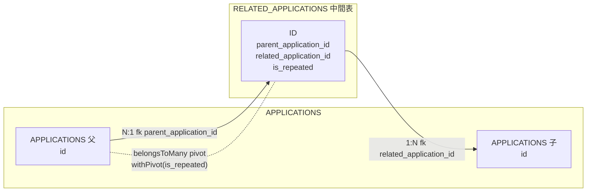
**字段定義**：

| 列名 | 類型 | 可空 | 默認 | 業務含義 |
|---|---|---|---|---|
| `ID` | NUMBER(19) | N | — | 主鍵 |
| `PARENT_APPLICATION_ID` | NUMBER(19) | N | — | 父個案 → applications.id |
| `RELATED_APPLICATION_ID` | NUMBER(19) | N | — | 關聯個案 → applications.id |
| `IS_REPEATED` | CHAR(1) | N | '0' | 是否重複申請 |
| `CREATED_AT` | TIMESTAMP(6) | Y | — | 創建時間 |
| `UPDATED_AT` | TIMESTAMP(6) | Y | — | 更新時間 |

##### 關係證據（代碼位置）

> 來源：`tables/RELATED_APPLICATIONS.md`（子文檔自動生成，勿手改；本節由 `docs/database-dictionary/scripts/merge_tables_into_dict.py` 自動合併，更新後重跑即可）

##### 業務外鍵關係

證據鏈：

- 關係方法：`app/Models/Application.php:336-341` `relatedApplications()` → `belongsToMany(Application::class, 'related_applications', 'parent_application_id', 'related_application_id')->withPivot('is_repeated')->withTimestamps()`
- 過濾方法：`app/Models/Application.php:343-347` `repeatedApplications()` → 同表 + `wherePivot('is_repeated', true)`
- Migration：`database/migrations/2023_09_21_142425_create_related_application_table.php:14-22`（`$table->id()`、`parent_application_id`、`related_application_id`、`is_repeated` 默認 false、timestamps）
- 反向（related → parent）無獨立方法證據（grep 無 `parentApplications` 等），兩端均指向 `applications`。

###### 組成關係

| 子表 | 關係方法 | 外鍵字段 | 代碼位置 |
| --- | --- | --- | --- |
| applications | `relatedApplications()` | related_application_id | app/Models/Application.php:336-341 |

- 使用證據：`app/Models/Proposal/Prop2.php:60`（`$this->application->relatedApplications`）；`app/Models/Proposal/Proposal.php:282`；`app/Models/DobAnalysis/FinalDecision.php:111,190`；`app/Console/Commands/RegenerateV2OpinionDocuments.php:433,668`；`app/Repository/ApplicationRepository.php:473`（with 預載）。

###### 歸屬關係

| 父表 | 關係方法 | 外鍵字段 | 代碼位置 |
| --- | --- | --- | --- |
| applications | `relatedApplications()`（正向 parent→related） | parent_application_id | app/Models/Application.php:336-341 |

- 寫入證據（父側 attach / sync）：`app/Http/Controllers/CaseController/CaseController.php:185`（`relatedApplications()->attach`）；`app/Services/StepProcesses/Pm/NewApplication/DapeInput.php:99`（`sync`）；`app/Services/StepProcesses/Pm/Online/ProcessApplicantData.php:163`（`sync`）。

###### 多態/中間表關係

| 目標表 | 關係方法 | 說明 | 代碼位置 |
| --- | --- | --- | --- |
| applications（自引用 pivot） | `belongsToMany` | 非多態。RELATED_APPLICATIONS 是 Application↔Application 自引用 belongsToMany 的中間表；`withPivot('is_repeated')` 攜帶業務標記（重複申請）；`repeatedApplications()` 用 `wherePivot('is_repeated', true)` 過濾重複項 | app/Models/Application.php:336-347 |

- 使用證據：`app/Services/StepProcesses/Pm/NewApplication/AutomaticallyGenerateDocumentRequest.php:120`（`repeatedApplications()->count() > 0` 判斷重複申請）。

> 詳細關係證據（代碼位置）：`tables/RELATED_APPLICATIONS.md`

---

---

### 4.2 收件與文件域（Receive & Documents）

#### 16. `DOCUMENTS` — 文檔表（個案相關文件）

- **用途**：文檔表（個案相關文件）
- **主鍵**：`ID` ｜ **唯一鍵**：`—` ｜ **數據庫外鍵**：無（關係由程序層定義）
- **索引**：DOCUMENTS_ID_PK(ID) UNIQUE

**關係圖**（實線=組成/歸屬，虛線=多態/中間表/業務關聯）：

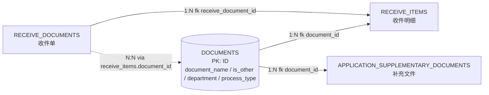
**字段定義**：

| 列名 | 類型 | 可空 | 默認 | 業務含義 |
|---|---|---|---|---|
| `ID` | NUMBER(19) | N | — | 主鍵 |
| `DOCUMENT_NAME` | VARCHAR2(100 CHAR) | N | — | 文檔名稱 |
| `IS_OTHER` | CHAR(1) | N | '0' | 是否其他 |
| `DEPARTMENT` | VARCHAR2(50 CHAR) | Y | — | 所屬部門（DOB 文檔判定用） |
| `PROCESS_TYPE` | VARCHAR2(255 CHAR) | Y | — | 流程類型 |

##### 關係證據（代碼位置）

> 來源：`tables/DOCUMENTS.md`（子文檔自動生成，勿手改；本節由 `docs/database-dictionary/scripts/merge_tables_into_dict.py` 自動合併，更新後重跑即可）

##### 业务外键关系

###### 组成关系（DOCUMENTS 1 → N 子表，子表持 document_id 外键）

| 子表 | 关系方法 | 外键字段 | 代码位置 |
| --- | --- | --- | --- |
| RECEIVE_ITEMS | `ReceiveItem::document()` belongsTo(Document) | document_id（NOT NULL） | app/Models/ReceiveItem.php:29；迁移 database/migrations/2023_07_18_100302_create_receive_items_table.php:17 |
| APPLICATION_SUPPLEMENTARY_DOCUMENTS | `SupplementaryDocument::document()` belongsTo(Document) | document_id（NOT NULL） | app/Models/SupplementaryDocument.php:22；迁移 database/migrations/2024_01_12_161019_create_application_supplementary_document_table.php:16（foreignId→constrained） |

###### 归属关系（业务父表 N:1 归属 DOCUMENTS）

| 父表 | 关系方法 | 外键字段 | 代码位置 |
| --- | --- | --- | --- |
| RECEIVE_DOCUMENTS | `ReceiveDocument::documents()` belongsToMany(Document, 'receive_items', 'receive_document_id', 'document_id') | receive_items.document_id（中间表承载） | app/Models/ReceiveDocument.php:52 |

###### 多态/中间表关系

| 目标表 | 关系方法 | 说明 | 代码位置 |
| --- | --- | --- | --- |
| RECEIVE_ITEMS（中间表） | `ReceiveDocument::document()` through('receiveItem')->has('document') | has-many-through 经 receive_items 对 DOCUMENTS 的存在性查询（has），语义=该收件单存在指向文档字典的收件明细 | app/Models/ReceiveDocument.php:37 |
| RECEIVE_ITEMS（中间表） | `ReceiveItem::uploadDocument()` belongsTo(UploadDocument) | receive_items 另持 UPLOAD_DOCUMENT_ID 指向 upload_documents 表，**非** DOCUMENTS（排除项，防误判） | app/Models/ReceiveItem.php:32 |

> 检索证明：schema.json 全表 97 表中，含 DOCUMENT_ID 列的仅有 RECEIVE_ITEMS 与 APPLICATION_SUPPLEMENTARY_DOCUMENTS 两表；GENERATED_DOCUMENTS / CORROBORATION_UPLOAD_DOCUMENTS / GROUP_LEADER_OPINION_UPLOAD_DOCUMENTS 中的 UPLOAD_DOCUMENT_ID 均指向 upload_documents，与 DOCUMENTS 无外键关系。

> 詳細關係證據（代碼位置）：`tables/DOCUMENTS.md`

---

---

#### 17. `RECEIVE_DOCUMENTS` — 收件記錄表

- **用途**：收件記錄表：DAPE 受理收件（含線上收件、補交收件），dape_submitted_at 為 DAPE 提交給 DOB 的接手時刻
- **主鍵**：`ID` ｜ **唯一鍵**：`—` ｜ **數據庫外鍵**：無（關係由程序層定義）
- **索引**：RECEIVE_DOCUMENTS_ID_PK(ID) UNIQUE

**關係圖**（實線=組成/歸屬，虛線=多態/中間表/業務關聯）：

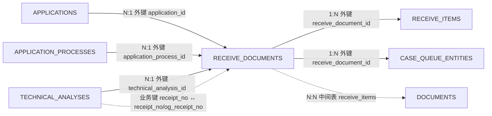
**字段定義**：

| 列名 | 類型 | 可空 | 默認 | 業務含義 |
|---|---|---|---|---|
| `ID` | NUMBER(19) | N | — | 主鍵 |
| `APPLICATION_PROCESS_ID` | NUMBER(19) | N | — | 關聯流程 → application_processes.id |
| `APPLICATION_ID` | NUMBER(19) | Y | — | 個案 → applications.id |
| `RECEIPT_NO` | VARCHAR2(50 CHAR) | N | — | 收件編號（唯一） |
| `RECEIVE_BY` | VARCHAR2(255 CHAR) | Y | — | 收件人 |
| `CREATED_AT` | TIMESTAMP(6) | Y | — | 創建時間 |
| `UPDATED_AT` | TIMESTAMP(6) | Y | — | 更新時間 |
| `TECHNICAL_ANALYSIS_ID` | NUMBER(10) | Y | — | 技術分析 → technical_analyses.id |
| `ONLINE_FILE_SYNC_STATUS` | NUMBER(3) | N | '0' | 線上文件同步狀態：0=無文件 1=待同步 2=已同步 -1=錯誤 |
| `ONLINE_RECEIPT_NO` | VARCHAR2(50 CHAR) | Y | — | 線上收件編號 |
| `DAPE_SUBMITTED_AT` | DATE | Y | — | DAPE 提交給 DOB 的時刻（DOB 接手日數據源，dob_days 計算） |

##### 關係證據（代碼位置）

> 來源：`tables/RECEIVE_DOCUMENTS.md`（子文檔自動生成，勿手改；本節由 `docs/database-dictionary/scripts/merge_tables_into_dict.py` 自動合併，更新後重跑即可）

##### 业务外键关系（代码证据）

数据库层面：`RECEIVE_DOCUMENTS` 自身 **无外键约束**（schema.json `fk: []`）；但子表 `CASE_QUEUE_ENTITIES` 在数据库中**确实声明了外键** `RECEIVE_DOCUMENT_ID → receive_documents.id`（schema.json `fk: ['RECEIVE_DOCUMENT_ID','APPLICATION_ID']`，迁移 `2023_10_12_200853_create_case_queue_entities_table.php:21`），与"数据库无外键"的笼统印象不符，特此标注。其余关系均由程序维护。

模型入口：`app/Models/ReceiveDocument.php`（关系方法 `receiveItem` / `application` / `applicationProcess` / `documents`，另有过期迁移线索：APPLICATIONS 与 APPLICATION_PROCESSES 的 `receive_document_id` 列均已在后续迁移删除，当前 schema 无此列，不构成关系）。

###### 组成关系（RECEIVE_DOCUMENTS 为父，1:N）

| 子表 | 关系方法 | 外键字段 | 代码位置 |
| --- | --- | --- | --- |
| RECEIVE_ITEMS | `ReceiveDocument::receiveItem()` hasMany | `receive_items.receive_document_id` | app/Models/ReceiveDocument.php:30-33；反向 `ReceiveItem::receiveDocument()` belongsTo app/Models/ReceiveItem.php:22-24 |
| CASE_QUEUE_ENTITIES | 父侧无反向方法；子侧 `CaseQueueEntity::receiveDocument()` belongsTo | `case_queue_entities.receive_document_id` | app/Models/CaseQueueEntity.php:36-38；DB 外键 database/migrations/2023_10_12_200853_create_case_queue_entities_table.php:21；写入点 app/Services/CaseQueueService.php:40 |

###### 归属关系（RECEIVE_DOCUMENTS 为子，N:1）

| 父表 | 关系方法 | 外键字段 | 代码位置 |
| --- | --- | --- | --- |
| APPLICATIONS | `ReceiveDocument::application()` belongsTo | `receive_documents.application_id` | app/Models/ReceiveDocument.php:40-43；查询点 app/trait/DapeTrait.php:173、app/trait/MailTrait.php:45、app/Services/RemainingDaysService.php:117、app/Models/Proposal/Prop4.php:102 |
| APPLICATION_PROCESSES | `ReceiveDocument::applicationProcess()` belongsTo | `receive_documents.application_process_id` | app/Models/ReceiveDocument.php:45-48；查询点 app/Repository/ApplicationRepository.php:424、app/Http/Controllers/ApplicationController.php:43、app/Http/Controllers/DafProcessController/DafProcessController.php:111 |
| TECHNICAL_ANALYSES | 父侧 `TechnicalAnalysis::supplementary_receipts()` hasMany（约定 FK） | `receive_documents.technical_analysis_id` | app/Models/TechnicalAnalysis.php:86-88；join 证据 app/Repository/TechnicalAnalysisRepository.php:116 |
| TECHNICAL_ANALYSES（业务键，非 ID） | 无关系方法，业务代码按 `receipt_no` 匹配 | `receive_documents.receipt_no ↔ technical_analyses.receipt_no / og_receipt_no` | 写入 app/Services/ProcessOperation/ProcessOperationServiceImpl.php:4879,4905-4906；反查 app/Services/StepProcesses/Pm/Supplementary/SupplementaryDapeInput.php:244-246 |

###### 多态/中间表关系

| 目标表 | 关系方法 | 说明 | 代码位置 |
| --- | --- | --- | --- |
| DOCUMENTS | `ReceiveDocument::documents()` belongsToMany | 通过中间表 `receive_items` 多对多关联文件（pivot: `receive_document_id` + `document_id`）；另有 `document()` through 快捷关系 | app/Models/ReceiveDocument.php:50-53（documents）、35-36（through）；pivot 侧 `ReceiveItem::document()` belongsTo app/Models/ReceiveItem.php:26-28 |

> 詳細關係證據（代碼位置）：`tables/RECEIVE_DOCUMENTS.md`

---

---

#### 18. `RECEIVE_ITEM_FILES` — 收件明細附件文件

- **用途**：收件明細附件文件
- **主鍵**：`ID` ｜ **唯一鍵**：`—` ｜ **數據庫外鍵**：無（關係由程序層定義）
- **索引**：RECEIVE_ITEM_FILES_ID_PK(ID) UNIQUE

**關係圖**（實線=組成/歸屬，虛線=多態/中間表/業務關聯）：


**字段定義**：

| 列名 | 類型 | 可空 | 默認 | 業務含義 |
|---|---|---|---|---|
| `ID` | NUMBER(19) | N | — | 主鍵 |
| `RECEIVE_ITEM_ID` | NUMBER(19) | N | — | 收件明細 → receive_items.id |
| `FILE_PATH` | VARCHAR2(255 CHAR) | N | — | 文件路徑 |
| `FILE_TYPE` | VARCHAR2(4 CHAR) | N | 'pdf' | 文件類型 |
| `THUMBNAIL_PATH` | VARCHAR2(255 CHAR) | Y | — | 縮略圖路徑 |
| `CREATED_AT` | TIMESTAMP(6) | Y | — | 創建時間 |
| `UPDATED_AT` | TIMESTAMP(6) | Y | — | 更新時間 |

##### 關係證據（代碼位置）

> 來源：`tables/RECEIVE_ITEM_FILES.md`（子文檔自動生成，勿手改；本節由 `docs/database-dictionary/scripts/merge_tables_into_dict.py` 自動合併，更新後重跑即可）

##### 业务外键关系（代码证据）

数据库层面：`RECEIVE_ITEM_FILES` 自身 **无外键约束**（schema.json `fk: []`）。唯一外键关系 `RECEIVE_ITEM_ID → receive_items.id` 由 Eloquent 程序维护，无 DB 级约束。

模型入口：`app/Models/ReceiveItemFile.php`（关系方法 `receiveItem`，另有 `toUploadFile()` 格式化输出方法）。

###### 组成关系（RECEIVE_ITEM_FILES 为父，1:N）

无。全仓 grep 无任何表模型引用 `ReceiveItemFile` 作为父（`hasMany` 反向不存在），schema.json `fk` 为空——本表为叶子表。

###### 归属关系（RECEIVE_ITEM_FILES 为子，N:1）

| 父表 | 关系方法 | 外键字段 | 代码位置 |
| --- | --- | --- | --- |
| RECEIVE_ITEMS | `ReceiveItemFile::receiveItem()` belongsTo | `receive_item_files.receive_item_id` | app/Models/ReceiveItemFile.php:28-30；反向 `ReceiveItem::itemFiles()` hasMany app/Models/ReceiveItem.php:39；使用点 app/Http/Controllers/Online/CheckAuthorityController.php:23,30（`with('itemFiles')` 加载检查授权书附件）；写入点 app/Jobs/SyncIdImageFile.php:98、app/Jobs/SyncOnlineUploadFiles.php:112（`ReceiveItemFile::create`）；工厂 database/factories/ReceiveItemFileFactory.php:10 |

###### 多态/中间表关系

无。本表仅单点归属 RECEIVE_ITEMS，无 morphTo/morphMany、无 belongsToMany 中间表角色。

> 詳細關係證據（代碼位置）：`tables/RECEIVE_ITEM_FILES.md`

---

---

#### 19. `RECEIVE_ITEMS` — 收件明細（一份收件含多個文件項目）

- **用途**：收件明細（一份收件含多個文件項目）
- **主鍵**：`ID` ｜ **唯一鍵**：`—` ｜ **數據庫外鍵**：無（關係由程序層定義）
- **索引**：RECEIVE_ITEMS_ID_PK(ID) UNIQUE

**關係圖**（實線=組成/歸屬，虛線=多態/中間表/業務關聯）：

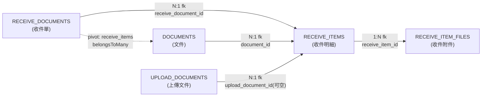
**字段定義**：

| 列名 | 類型 | 可空 | 默認 | 業務含義 |
|---|---|---|---|---|
| `ID` | NUMBER(19) | N | — | 主鍵 |
| `RECEIVE_DOCUMENT_ID` | NUMBER(19) | N | — | 收件 → receive_documents.id |
| `DOCUMENT_TYPE` | NUMBER(19) | Y | — | 文檔類型 |
| `DOCUMENT_ID` | NUMBER(19) | N | — | 文檔 → documents.id |
| `UPLOAD_DOCUMENT_ID` | NUMBER(19) | Y | — | 上傳文檔 → upload_documents.id |
| `DOCUMENT_NAME` | VARCHAR2(255 CHAR) | Y | — | 文檔名稱 |
| `DOCUMENT_PATH` | VARCHAR2(255 CHAR) | Y | — | 文檔路徑 |
| `NOT_NEEDED_REASON` | VARCHAR2(255 CHAR) | Y | — | 不需要的原因（退回） |
| `CREATED_AT` | TIMESTAMP(6) | Y | — | 創建時間 |
| `UPDATED_AT` | TIMESTAMP(6) | Y | — | 更新時間 |

##### 關係證據（代碼位置）

> 來源：`tables/RECEIVE_ITEMS.md`（子文檔自動生成，勿手改；本節由 `docs/database-dictionary/scripts/merge_tables_into_dict.py` 自動合併，更新後重跑即可）

##### 业务外键关系

###### 组成关系（RECEIVE_ITEMS → 子表，1:N）

| 子表 | 关系方法 | 外键字段 | 代码位置 |
|---|---|---|---|
| RECEIVE_ITEM_FILES | ReceiveItem::itemFiles() hasMany(ReceiveItemFile, 'receive_item_id', 'id') | receive_item_files.receive_item_id → receive_items.id | app/Models/ReceiveItem.php:37-39；反向 belongsTo app/Models/ReceiveItemFile.php:21-23；migration database/migrations/2025_08_12_193855_create_receive_item_files_table.php:15；写入点 app/Jobs/SyncIdImageFile.php:98-99、app/Jobs/SyncOnlineUploadFiles.php:112-113、app/Services/Online/OnlineUploadFileProcessor.php:87 |

###### 归属关系（父表 → RECEIVE_ITEMS，N:1）

| 父表 | 关系方法 | 外键字段 | 代码位置 |
|---|---|---|---|
| RECEIVE_DOCUMENTS | ReceiveItem::receiveDocument() belongsTo(ReceiveDocument, 'receive_document_id', 'id') | receive_items.receive_document_id → receive_documents.id | app/Models/ReceiveItem.php:22-24；反向 hasMany app/Models/ReceiveDocument.php:32；migration database/migrations/2023_07_18_100302_create_receive_items_table.php:15；写入点 app/Repository/ReceiveDocumentRepository.php:71,102,181,208、查询点 :140,175；业务查询 app/Models/Proposal/Prop6.php:44 |
| DOCUMENTS | ReceiveItem::document() belongsTo(Document)（默认外键 document_id） | receive_items.document_id → documents.id | app/Models/ReceiveItem.php:27-29；migration database/migrations/2023_07_18_100302_create_receive_items_table.php:17 |
| UPLOAD_DOCUMENTS | ReceiveItem::uploadDocument() belongsTo(UploadDocument)（默认外键 upload_document_id，可空） | receive_items.upload_document_id → upload_documents.id | app/Models/ReceiveItem.php:32-34；migration database/migrations/2023_07_18_100302_create_receive_items_table.php:18 |

###### 多态/中间表关系

| 目标表 | 关系方法 | 说明 | 代码位置 |
|---|---|---|---|
| DOCUMENTS（经 RECEIVE_ITEMS 中间表） | ReceiveDocument::documents() belongsToMany(Document, 'receive_items', 'receive_document_id', 'document_id') | receive_items 表兼任 receive_documents ↔ documents 的 pivot 中间表（按收件單查其文件集合）；配合 scopeOfDepartment 过滤部门收件 | app/Models/ReceiveDocument.php:40-42 |
| （无多态关系） | - | ReceiveItem 无 morphTo/morphMany；document 为普通 belongsTo，非多态 | app/Models/ReceiveItem.php 全文件 |

##### 备注

- RECEIVE_ITEMS 是收件單（RECEIVE_DOCUMENTS）→ 文件条目（RECEIVE_ITEM_FILES）之间的核心明细层：一条收件單含多条收件明細，每条明細可挂多个附件文件。
- 字段语义：DOCUMENT_TYPE（文件类型枚举，可空）、DOCUMENT_NAME/DOCUMENT_PATH（文件名称/路径，冗余快照）、NOT_NEEDED_REASON（无需文件理由）、UPLOAD_DOCUMENT_ID（线上申请上传文件关联，可空）。
- 表同时被 DapeTrait.php:43 及多个 DapeInput 服务（NewApplication/Listening/Objection/Supplementary/Completion 等）以 `receive_items` 数据键消费。

> 詳細關係證據（代碼位置）：`tables/RECEIVE_ITEMS.md`

---

---

#### 20. `REJECT_ITEMS` — 退回項目（DAPE 退回 DOB 的拒絕項/意見）

- **用途**：退回項目（DAPE 退回 DOB 的拒絕項/意見）
- **主鍵**：`ID` ｜ **唯一鍵**：`—` ｜ **數據庫外鍵**：無（關係由程序層定義）
- **索引**：REJECT_ITEMS_ID_PK(ID) UNIQUE

**關係圖**（實線=組成/歸屬，虛線=多態/中間表/業務關聯）：

```mermaid
graph LR
    subgraph 归属[N:1 归属关系]
        APP_ITEMS[APPLICATION_ITEMS] -->|"N:1 fk APPLICATION_ITEM_ID"| REJ[REJECT_ITEMS]
        TA[TECHNICAL_ANALYSES] -->|"N:1 fk TECHNICAL_ANALYSIS_ID"| REJ
    end
    REJ -->|"1:N fk"| SUB_NONE[无子表引用]
```
**字段定義**：

| 列名 | 類型 | 可空 | 默認 | 業務含義 |
|---|---|---|---|---|
| `ID` | NUMBER(19) | N | — | 主鍵 |
| `APPLICATION_ITEM_ID` | NUMBER(19) | N | — | 申請項目 → application_items.id |
| `ITEM_NO` | VARCHAR2(255 CHAR) | N | — | 項目編號 |
| `DOB_REJECTION_REASON` | VARCHAR2(2000 CHAR) | N | — | DOB 拒絕原因 |
| `DETAILS` | VARCHAR2(255 CHAR) | Y | — | 詳情 |
| `AMOUNT` | NUMBER(12,2) | Y | — | 金額 |
| `LISTENING_APPROVED_AMOUNT` | NUMBER(12,2) | Y | — | 聽證批准金額 |
| `OBJECTION_APPROVED_AMOUNT` | NUMBER(12,2) | Y | — | 反對批准金額 |
| `CREATED_AT` | TIMESTAMP(6) | Y | — | 創建時間 |
| `UPDATED_AT` | TIMESTAMP(6) | Y | — | 更新時間 |
| `TECHNICAL_ANALYSIS_ID` | NUMBER(19) | Y | — | 技術分析 → technical_analyses.id |

##### 關係證據（代碼位置）

> 來源：`tables/REJECT_ITEMS.md`（子文檔自動生成，勿手改；本節由 `docs/database-dictionary/scripts/merge_tables_into_dict.py` 自動合併，更新後重跑即可）

##### 业务外键关系（Eloquent + 引用点）

###### 组成关系（REJECT_ITEMS → 子表）

无证据：全仓未发现任何表/模型以 `reject_item_id` 引用 REJECT_ITEMS（grep `reject_item_id` 0 命中；migration 无 foreign/references）。`reject_item_block` 等命中为 DOCX 模板占位符（如 `app/Models/Official/Ofi1.php:70`），非表关系。

| 子表 | 关系方法 | 外键字段 | 代码位置 |
| --- | --- | --- | --- |
| （无） | - | - | - |

###### 归属关系（父表 → REJECT_ITEMS，N:1）

| 父表 | 关系方法 | 外键字段 | 代码位置 |
| --- | --- | --- | --- |
| APPLICATION_ITEMS | `ApplicationItem::rejectItems()` hasMany | APPLICATION_ITEM_ID | app/Models/ApplicationItem.php:28-31 |
| APPLICATION_ITEMS | `RejectItem::applicationItem()` belongsTo（反向） | APPLICATION_ITEM_ID | app/Models/RejectItem.php:23-26 |
| TECHNICAL_ANALYSES | `TechnicalAnalysis::rejectItems()` hasMany | TECHNICAL_ANALYSIS_ID | app/Models/TechnicalAnalysis.php:80-83 |

业务字段引用点证据：
- `TECHNICAL_ANALYSIS_ID`：`RejectItem::where('technical_analysis_id', $baseTechnicalAnalysisId)` — app/Services/StepProcesses/Pm/Dob/DobHeadApproval.php:129
- `LISTENING_APPROVED_AMOUNT` / `OBJECTION_APPROVED_AMOUNT`（聽證/異議後批准金額）：
  - app/Models/Proposal/Proposal.php:199、211、292-297（金额计算：`$reject->objection_approved_amount` / `$reject->listening_approved_amount`）
  - app/Models/Application.php:199-294（rejectAmount / extraAmount 汇总）
  - app/Models/Official/Ofi3.php:50、Ofi4.php:44、Ofi5.php:62（公函取 `$item['listening_approved_amount'] ?? $item['amount']`）
  - app/Services/IHM/FinanceService.php:123、128（`COALESCE(listening_approved_amount, reject_items.amount)`）
- `APPLICATION_ITEM_ID` 联表使用：app/Repository/ApplicationRepository.php:215-216、app/Services/IHM/FinanceService.php:123
- 写入路径：app/Repository/RejectItemRepository.php:30-62（updateRejectItems / updateListeningRejectItems / updateObjectionRejectItems）、app/trait/DapeTrait.php:20-23

###### 多态/中间表关系

无证据（无 morphTo/morphMany、无 pivot 表）。

| 目标表 | 关系方法 | 说明 | 代码位置 |
| --- | --- | --- | --- |
| （无） | - | - | - |

##### 附：业务语义速览

- REJECT_ITEMS 记录個案中被駁回的報價單項目（item_no 對應報價單款號，`報價單第{N}款`），一條 application_item 可有多條退回記錄。
- `dob_rejection_reason`：DOB 駁回理由（最长 2000 字符，2024-04-17 扩容）。
- `listening_approved_amount`：聽證環節批准金額；`objection_approved_amount`：異議環節批准金額（见 Proposal.php:292-297 递减逻辑）。
- `technical_analysis_id`：2023-09-26 新增，关联 DOB 技術分析（DobHeadApproval.php:129 按 TA 查已存在退回項）。

> 詳細關係證據（代碼位置）：`tables/REJECT_ITEMS.md`

---

---

#### 21. `UPLOAD_DOCUMENTS` — 上傳文檔（多態關聯各業務實體的上傳文件）

- **用途**：上傳文檔（多態關聯各業務實體的上傳文件）
- **主鍵**：`ID` ｜ **唯一鍵**：`—` ｜ **數據庫外鍵**：無（關係由程序層定義）
- **索引**：UPLOAD_DOCUMENTS_ID_PK(ID) UNIQUE

**關係圖**（實線=組成/歸屬，虛線=多態/中間表/業務關聯）：

```mermaid
graph LR
    UD["UPLOAD_DOCUMENTS<br/>(上傳文檔)"]
    RI["RECEIVE_ITEMS<br/>(收件明細)"]
    CUD["CORROBORATION_UPLOAD_DOCUMENTS<br/>(查察上傳文檔)"]
    GUD["GROUP_LEADER_OPINION_UPLOAD_DOCUMENTS<br/>(組長意見上傳文檔)"]
    GD["GENERATED_DOCUMENTS<br/>(已生成文書)"]
    AP["APPLICATION_PROCESSES<br/>(個案流程)"]
    COR["CORROBORATIONS<br/>(查察)"]
    GLO["GROUP_LEADER_OPINIONS<br/>(組長意見)"]
    GLOI["GROUP_LEADER_OPINION_ITEMS<br/>(意見項目)"]

    UD -->|"1:N fk<br/>upload_document_id(可空)"| RI
    UD -->|"1:N fk<br/>upload_document_id"| CUD
    UD -->|"1:N fk<br/>upload_document_id"| GUD
    UD -->|"1:N fk<br/>upload_document_id(可空)"| GD
    UD -->|"1:N fk<br/>dob_doc_id / dape_doc_id(可空)"| AP
    UD -. "pivot: corroboration_upload_documents<br/>双外键" .-> COR
    UD -. "pivot: group_leader_opinion_upload_documents<br/>双外键" .-> GLO
    GLOI -. "⚠️ hasMany 默认外键 group_leader_opinion_item_id<br/>表无此列(死关系)" .-> GUD
```
**字段定義**：

| 列名 | 類型 | 可空 | 默認 | 業務含義 |
|---|---|---|---|---|
| `ID` | NUMBER(19) | N | — | 主鍵 |
| `NAME` | VARCHAR2(50 CHAR) | N | — | 文件名 |
| `PATH` | VARCHAR2(100 CHAR) | N | — | 存儲路徑 |
| `DISK` | VARCHAR2(30 CHAR) | N | — | 存儲磁盤 |
| `CREATED_AT` | TIMESTAMP(6) | Y | — | 創建時間 |
| `UPDATED_AT` | TIMESTAMP(6) | Y | — | 更新時間 |

##### 關係證據（代碼位置）

> 來源：`tables/UPLOAD_DOCUMENTS.md`（子文檔自動生成，勿手改；本節由 `docs/database-dictionary/scripts/merge_tables_into_dict.py` 自動合併，更新後重跑即可）

##### 业务外键关系

###### 组成关系（UPLOAD_DOCUMENTS → 子表，1:N；子表持 upload_document_id 外键）

| 子表 | 关系方法 | 外键字段 | 代码位置 |
| --- | --- | --- | --- |
| RECEIVE_ITEMS | ReceiveItem::uploadDocument() belongsTo(UploadDocument)（默认外键） | receive_items.upload_document_id → upload_documents.id（可空） | app/Models/ReceiveItem.php:32-34；migration database/migrations/2023_07_18_100302_create_receive_items_table.php:18；消费点 app/trait/DapeTrait.php:44（findOrFail）、app/Http/Controllers/Components/DobReviewFileController.php:119（校验） |
| CORROBORATION_UPLOAD_DOCUMENTS | CorroborationUploadDocument::uploadDocument() belongsTo(UploadDocument)（默认外键） | corroboration_upload_documents.upload_document_id → upload_documents.id | app/Models/CorroborationUploadDocument.php:23-25；migration database/migrations/2026_03_21_180000_create_corroboration_upload_documents_table.php:17；写入点 app/Repository/CorroborationRepository.php:166-169,368-369 |
| GROUP_LEADER_OPINION_UPLOAD_DOCUMENTS | GroupLeaderOpinionUploadDocument::uploadDocument() belongsTo(UploadDocument)（默认外键） | group_leader_opinion_upload_documents.upload_document_id → upload_documents.id | app/Models/GroupLeaderOpinionUploadDocument.php:23-25；migration database/migrations/2023_09_15_095330_create_group_leader_opinion_upload_documents_table.php:16；写入点 app/Repository/GroupLeaderOpinionRepository.php:168-169 |
| GENERATED_DOCUMENTS | GeneratedDocument::uploadDocument() hasOne(UploadDocument, 'id', 'upload_document_id')（子表持 fk，模型用 hasOne 反向表达 1:1） | generated_documents.upload_document_id → upload_documents.id（可空，2025-09-09 新增列） | app/Models/GeneratedDocument.php:74-76；migration database/migrations/2025_09_09_155117_add_upload_doc_on_generated_documents.php:14；写入点 app/Services/StepProcesses/Pm/Completion/DafSendOfiDaf02.php:46-52、app/Services/StepProcesses/Pm/NewApplication/DapeSendOfi01.php:42-48、app/Services/StepProcesses/Pm/Completion/CompletionRequireSupplementary.php:41-46 等 OFI 公函服务 |
| APPLICATION_PROCESSES | ApplicationProcess::docDocument()/dapeDocument() belongsTo(UploadDocument, 'dob_doc_id'/'dape_doc_id') | application_processes.dob_doc_id / dape_doc_id → upload_documents.id（string 类型、可空，2023-09-22 新增列） | app/Models/ApplicationProcess.php:65-67,70-72；migration database/migrations/2023_09_22_121147_add_group_upload_column_to_application_process_table.php:15-16；写入点 app/trait/DapeTrait.php:44-49、app/Http/Controllers/Components/DobReviewFileController.php:155-159、app/Services/Online/OnlineUploadFileProcessor.php:142,154；查询点 app/Repository/ApplicationRepository.php:429-434、app/Http/Controllers/Components/HandleFileController.php:58-64（按 id 反查 DOB/DAPE 类型） |

###### 归属关系（父表 → UPLOAD_DOCUMENTS，N:1）

无。UPLOAD_DOCUMENTS 自身无任何父表外键列（columns 仅 ID/NAME/PATH/DISK/CREATED_AT/UPDATED_AT），是纯"被引用"文件资源表，不归属任何父表。

###### 多态/中间表关系

| 目标表 | 关系方法 | 说明 | 代码位置 |
| --- | --- | --- | --- |
| CORROBORATIONS（经 CORROBORATION_UPLOAD_DOCUMENTS 中间表） | Corroboration::corroborationUploadDocuments() hasMany(CorroborationUploadDocument) | corroboration_upload_documents 兼任 Corroboration ↔ UploadDocument 的 pivot：持 corroboration_id + upload_document_id 双外键，无其他业务列，是纯多对多中间表 | app/Models/Corroboration.php:40-42；反向 belongsTo app/Models/CorroborationUploadDocument.php:18-21,23-25 |
| GROUP_LEADER_OPINIONS（经 GROUP_LEADER_OPINION_UPLOAD_DOCUMENTS 中间表） | GroupLeaderOpinion::groupLeaderOpinionUploadDocuments() hasMany(GroupLeaderOpinionUploadDocument) | group_leader_opinion_upload_documents 兼任 GroupLeaderOpinion ↔ UploadDocument 的 pivot：持 group_leader_opinion_id + upload_document_id 双外键，无其他业务列 | app/Models/GroupLeaderOpinion.php:59-61；反向 belongsTo app/Models/GroupLeaderOpinionUploadDocument.php:18-21,23-25 |
| GROUP_LEADER_OPINION_ITEMS（⚠️ 潜在偏差） | GroupLeaderOpinionItem::groupLeaderOpinionUploadDocuments() hasMany(GroupLeaderOpinionUploadDocument)（未指定外键 → Eloquent 默认 group_leader_opinion_item_id） | 表结构无 group_leader_opinion_item_id 列（migration 2023_09_15_095330 仅 group_leader_opinion_id + upload_document_id）→ 该关系运行时会查询不存在的列，属死代码/历史遗留 | app/Models/GroupLeaderOpinionItem.php:48-50；对照 migration database/migrations/2023_09_15_095330_create_group_leader_opinion_upload_documents_table.php:13-18 |
| （无多态关系） | - | UploadDocument 无 morphTo/morphMany；全库 morph 关系仅见于 ActionLog/Application（app/Models/ActionLog/ActionLog.php、app/Models/Application.php），与 UPLOAD_DOCUMENTS 无关 | app/Models/UploadDocument.php 全文件 |

##### 备注

- UPLOAD_DOCUMENTS 是 IHM 全系统的统一"上传文件元数据"表：收件明細（RECEIVE_ITEMS）、查察/組長意見的附件（两个中间表）、已生成公函的附加文件（GENERATED_DOCUMENTS）、個案流程的 DOB/DAPE 審查文件（APPLICATION_PROCESSES.dob_doc_id/dape_doc_id）均以本表 ID 为锚点，下载统一走 `route('download-document')`（app/Http/Controllers/Components/HandleFileController.php:52）。
- 模型层 UploadDocument 未定义任何 hasMany/hasOne 出向关系（app/Models/UploadDocument.php 全文件仅 url()/filepath() 两个辅助方法），所有关系均为子表侧 belongsTo 或 hasOne 反向表达——方向约定与常规"父表定义 hasMany"相反，检索时注意从子表入手。
- 无物理外键（Oracle fk=[]），删除 UPLOAD_DOCUMENTS 记录不会触发级联，5 张引用表可能残留悬空 ID。
- APPLICATION_PROCESSES.dob_doc_id/dape_doc_id 迁移定义为 string（2023_09_22_121147:15-16），与其余表 numeric 外键类型不一致，ORM 层无碍但直接 SQL JOIN 时需注意隐式转换。

> 詳細關係證據（代碼位置）：`tables/UPLOAD_DOCUMENTS.md`

---

---

#### 22. `UPLOAD_PHOTOS` — 上傳照片（多態關聯，查察/意見等）

- **用途**：上傳照片（多態關聯，查察/意見等）
- **主鍵**：`ID` ｜ **唯一鍵**：`—` ｜ **數據庫外鍵**：無（關係由程序層定義）
- **索引**：UPLOAD_PHOTOS_ID_PK(ID) UNIQUE

**關係圖**（實線=組成/歸屬，虛線=多態/中間表/業務關聯）：

```mermaid
graph LR
    UP[UPLOAD_PHOTOS 上傳照片]
    CUP[CORROBORATION_UPLOAD_PHOTOS 查察上傳照片聯結表]
    CORR[CORROBORATIONS 查察]

    UP -->|"1:N fk upload_photo_id"| CUP
    CORR -->|"1:N fk corroboration_id"| CUP
    UP -.- CORR
```
**字段定義**：

| 列名 | 類型 | 可空 | 默認 | 業務含義 |
|---|---|---|---|---|
| `ID` | NUMBER(19) | N | — | 主鍵 |
| `NAME` | VARCHAR2(50 CHAR) | N | — | 文件名 |
| `PATH` | VARCHAR2(100 CHAR) | N | — | 存儲路徑 |
| `DISK` | VARCHAR2(30 CHAR) | N | — | 存儲磁盤 |
| `EXTENSION` | VARCHAR2(20 CHAR) | N | — | 擴展名 |
| `CREATED_AT` | TIMESTAMP(6) | Y | — | 創建時間 |
| `UPDATED_AT` | TIMESTAMP(6) | Y | — | 更新時間 |

##### 關係證據（代碼位置）

> 來源：`tables/UPLOAD_PHOTOS.md`（子文檔自動生成，勿手改；本節由 `docs/database-dictionary/scripts/merge_tables_into_dict.py` 自動合併，更新後重跑即可）

##### 業務外鍵關係

> 命名約定：Eloquent 中「子表側 belongsTo → 父表」與「父表側 hasMany → 子表」互為同一個 1:N 關係的兩端；本報告以 UPLOAD_PHOTOS 為中心整理。

###### 組成關係（UPLOAD_PHOTOS 為父表，1:N → 子表）

| 子表 | 關係方法 | 外鍵欄位 | 程式位置 |
| --- | --- | --- | --- |
| CORROBORATION_UPLOAD_PHOTOS | （父表側未建模；子表側 `CorroborationUploadPhoto::uploadPhoto()` `belongsTo(UploadPhoto::class)`） | CORROBORATION_UPLOAD_PHOTOS.UPLOAD_PHOTO_ID → UPLOAD_PHOTOS.ID | app/Models/CorroborationUploadPhoto.php:19-22；app/Models/CorroborationUploadPhoto.php:14（fillable）；database/migrations/2023_08_30_102121_create_corroboration_upload_photos_table.php:16（欄位）；app/Repository/CorroborationRepository.php:101、295（`upload_photo_id => $uploadPhoto['id']` 寫入點） |

註：資料庫無 FK 約束（schema.json 中 CORROBORATION_UPLOAD_PHOTOS `fk: []`），關係由應用層保證。

###### 歸屬關係（UPLOAD_PHOTOS 為子表，N:1 → 父表）

無。`UploadPhoto` 模型無 `belongsTo` 關係方法，`upload_photos` 表亦無指向其他表的外鍵欄位（僅 ID/NAME/PATH/DISK/EXTENSION/CREATED_AT/UPDATED_AT）。

###### 多態/中間表關係

| 目標表 | 關係方法 | 說明 | 程式位置 |
| --- | --- | --- | --- |
| CORROBORATIONS | `Corroboration::corroborationUploadPhotos()` `hasMany(CorroborationUploadPhoto::class)`（:35-37）；`CorroborationUploadPhoto::corroboration()` `belongsTo(Corroboration::class)`（:24-27） | CORROBORATION_UPLOAD_PHOTOS 為 UPLOAD_PHOTOS ↔ CORROBORATIONS 之間的聯結表（每列 = corroboration_id + upload_photo_id + remark + order_number）；Eloquent 側以 hasMany/belongsTo 建模（非 belongsToMany）。無多型（無 morphTo/morphMany 證據）。 | app/Models/Corroboration.php:35-37；app/Models/CorroborationUploadPhoto.php:24-27；database/migrations/2023_08_30_102121_create_corroboration_upload_photos_table.php:13-19；database/migrations/2024_03_25_162025_add_order_coloumn_to_corroboratin_image_table.php:14（order_number） |

> 詳細關係證據（代碼位置）：`tables/UPLOAD_PHOTOS.md`

---

---

### 4.3 DOB 技術分析/查察/意見域

#### 23. `CORROBORATION_ITEM_DETAILS` — 查察項目明細

- **用途**：查察項目明細
- **主鍵**：`ID` ｜ **唯一鍵**：`—` ｜ **數據庫外鍵**：無（關係由程序層定義）
- **索引**：CORROBORATION_ITEM_DETAILS_ID_PK(ID) UNIQUE

**關係圖**（實線=組成/歸屬，虛線=多態/中間表/業務關聯）：

```mermaid
%% 图例
%% 归属关系（父表 N:1 → 本表）: 父表 -->|"N:1 fk"| CORROBORATION_ITEM_DETAILS
%% 多态 / 异常 / 无关系定义的概念外键: -.->

graph LR
    CID["CORROBORATION_ITEM_DETAILS"]
    CI["CORROBORATION_ITEMS"]
    COR["CORROBORATIONS"]
    TA["TECHNICAL_ANALYSES"]
    FT["FUNDING_TYPES"]

    CI -->|"N:1 fk corroboration_item_id"| CID
    COR -->|"N:1 fk corroboration_id"| CI
    TA -->|"N:1 fk technical_analysis_id"| COR
    COR -.->|"HasManyThrough 经 CORROBORATION_ITEMS"| CID
    TA -.->|"HasManyThrough 'id','id' 参数异常 无调用点"| CID
    FT -.->|"funding_type_id 无 Eloquent 关系"| CID
```
**字段定義**：

| 列名 | 類型 | 可空 | 默認 | 業務含義 |
|---|---|---|---|---|
| `ID` | NUMBER(19) | N | — | 主鍵 |
| `CORROBORATION_ITEM_ID` | NUMBER(19) | N | — | 查察項目 → corroboration_items.id |
| `SEQ_NO` | VARCHAR2(30 CHAR) | Y | — | 序號 |
| `AMOUNT` | NUMBER(12,2) | Y | — | 金額 |
| `VALUE` | CLOB | N | — | 數值 |
| `CREATED_AT` | TIMESTAMP(6) | Y | — | 創建時間 |
| `UPDATED_AT` | TIMESTAMP(6) | Y | — | 更新時間 |
| `FUNDING_TYPE_ID` | NUMBER(19) | Y | — | 資助類型 → funding_types.id |
| `ORDER` | NUMBER(10) | Y | — | 排序 |
| `DAPE_DISPLAY_REASON` | VARCHAR2(250 CHAR) | Y | — | DAPE 顯示原因（退回理由展示） |

##### 關係證據（代碼位置）

> 來源：`tables/CORROBORATION_ITEM_DETAILS.md`（子文檔自動生成，勿手改；本節由 `docs/database-dictionary/scripts/merge_tables_into_dict.py` 自動合併，更新後重跑即可）

##### 业务外键关系（代码证据）

数据库无外键约束（`fk: []`），以下关系均为 Eloquent 关系或代码引用证据。

###### 组成关系（CORROBORATION_ITEM_DETAILS 1:N → 子表）

**无**。模型 `app/Models/CorroborationItemDetail.php` 仅含 BelongsTo（`corroborationItem()`），无任何 hasMany/hasManyThrough 指向子表；grep 全项目 `CorroborationItemDetail` 未见子表关系定义。

###### 归属关系（父表 N:1 → CORROBORATION_ITEM_DETAILS）

| 父表 | 关系方法 | 外键字段 | 代码位置 |
| --- | --- | --- | --- |
| CORROBORATION_ITEMS | corroborationItem() BelongsTo（本表方向）；corroborationItemDetails() HasMany（父表方向） | corroboration_item_id | CorroborationItemDetail.php:20-22（BelongsTo）；CorroborationItem.php:32-34（HasMany） |
| CORROBORATIONS | corroborationItemDetails() HasManyThrough（经 CorroborationItem） | corroboration_item_id（默认键） | Corroboration.php:30-33；调用点 CorroborationReport.php:125、DobHeadApproval.php:263/271 |
| TECHNICAL_ANALYSES | corroborationItemsDetails() HasManyThrough（through=Corroboration，显式传 `'id','id'`） | ⚠️ 参数与表结构不符 | TechnicalAnalysis.php:50-53；本表无 CORROBORATION_ID 列、corroborations 关联 TA 的字段是 technical_analysis_id → 该关系实际执行会 ORA-00904；grep 全项目**无调用点**（仅定义处） |

###### 多态/中间表关系

**无**。模型中无 morphTo/morphMany/belongsToMany 定义。

###### 补充：FUNDING_TYPE_ID 无 Eloquent 关系（代码事实）

- 模型 `CorroborationItemDetail.php` **没有** `fundingType()` 关系（对比 `GroupMateOpinionItemDetail.php:27-29` 有 `fundingType() BelongsTo`——同名姊妹表有、本表没有）；
- 该列被 fillable 接受（CorroborationItemDetail.php:12）并在 `CorroborationItem::createItemDetail()` 写入（CorroborationItem.php:39-46）；
- 业务上作为資種标记被读取（CorroborationReport.php:131、DobHeadApproval.php:255-258 `$mapItem` 取 `funding_type_id`），概念指向 FUNDING_TYPES，但**无代码关系定义**。

###### 主要业务引用点（grep 证据）

| 引用场景 | 代码位置 |
| --- | --- |
| 删除明细：`$item->corroborationItemDetails()->delete()` | DobCorroboratorInput.php:159、DobCompletionCorroboratorInput.php:177、DobComponentController.php:111/520/984 |
| 读取 OVERSTEP / ADJUSTMENT 明细：`CorroborationItemDetail::whereHas('corroborationItem', ...)` | CorroborationReport.php:125-140、DobHeadApproval.php:263-277 |
| 级联预加载：`with('corroborationItems.corroborationItemDetails')` | TechnicalAnalysisRepository.php:19、SchemaController.php:103、DobAssignmentDataCopier.php:141 |
| 复制明细（DOB 指派数据拷贝） | DobAssignmentDataCopier.php:156 |
| 明细级 whereHas（有明细才生成/补文书） | CompletionFinalDecision.php:80、RegenerateV2OpinionDocuments.php:480 |
| 报告渲染：`$corroborationItem->corroborationItemDetails()->get()` | CorroborationCompletionReport.php:45/55/60/99、CorroborationApplicationReport.php:73、CorroborationApplicationReportV2.php:65 |

> 詳細關係證據（代碼位置）：`tables/CORROBORATION_ITEM_DETAILS.md`

---

---

#### 24. `CORROBORATION_ITEMS` — 查察項目

- **用途**：查察項目
- **主鍵**：`ID` ｜ **唯一鍵**：`—` ｜ **數據庫外鍵**：無（關係由程序層定義）
- **索引**：CORROBORATION_ITEMS_ID_PK(ID) UNIQUE

**關係圖**（實線=組成/歸屬，虛線=多態/中間表/業務關聯）：

```mermaid
graph LR
    %% 归属关系（父表 N:1 → CORROBORATION_ITEMS）
    CORROBORATIONS -->|"1:N fk corroboration_id"| CORROBORATION_ITEMS
    DOB_QUESTIONNAIRE_TYPES -->|"1:N fk dob_questionnaire_type_id"| CORROBORATION_ITEMS

    %% 组成关系（CORROBORATION_ITEMS 1:N → 子表）
    CORROBORATION_ITEMS -->|"1:N fk corroboration_item_id"| CORROBORATION_ITEM_DETAILS

    %% 多态/中间表关系（HasManyThrough 跨度）
    CORROBORATIONS -.-|"HasManyThrough 中间表=corroboration_items"| CORROBORATION_ITEM_DETAILS
    TECHNICAL_ANALYSES -.-|"HasManyThrough 中间表=corroborations"| CORROBORATION_ITEMS
    TECHNICAL_ANALYSES -.-|"HasManyThrough 两级中间表"| CORROBORATION_ITEM_DETAILS

    %% 代码异常引用（疑似死代码）
    GROUP_LEADER_OPINION_ITEM_DETAILS -.->|"代码写入 corroboration_item_id（schema 无此列）"| CORROBORATION_ITEMS
```
**字段定義**：

| 列名 | 類型 | 可空 | 默認 | 業務含義 |
|---|---|---|---|---|
| `ID` | NUMBER(19) | N | — | 主鍵 |
| `CORROBORATION_ID` | NUMBER(19) | N | — | 查察 → corroborations.id |
| `DOB_QUESTIONNAIRE_TYPE_ID` | NUMBER(19) | N | — | 問卷類型 → dob_questionnaire_types.id |
| `VALUE` | NUMBER(3) | Y | — | 數值 |
| `CREATED_AT` | TIMESTAMP(6) | Y | — | 創建時間 |
| `UPDATED_AT` | TIMESTAMP(6) | Y | — | 更新時間 |

##### 關係證據（代碼位置）

> 來源：`tables/CORROBORATION_ITEMS.md`（子文檔自動生成，勿手改；本節由 `docs/database-dictionary/scripts/merge_tables_into_dict.py` 自動合併，更新後重跑即可）

##### 业务外键关系（代码证据）

数据库无外键约束（`fk: []`），以下关系均为 Eloquent 关系或代码赋值/过滤引用证据。

###### 组成关系（CORROBORATION_ITEMS 1:N → 子表）

| 子表 | 关系方法 | 外键字段 | 代码位置 |
| --- | --- | --- | --- |
| CORROBORATION_ITEM_DETAILS | corroborationItemDetails() HasMany | corroboration_item_id | CorroborationItem.php:32-35（hasMany）；反向 belongsTo CorroborationItemDetail.php:23-26；建表 FK 列 migration 2023_08_30_101710_create_corroboration_item_details_table.php:15；写入点 createItemDetail CorroborationItem.php:37-50（:41 赋值）；复制写入 DobAssignmentDataCopier.php:158 |

###### 归属关系（父表 N:1 → CORROBORATION_ITEMS）

| 父表 | 关系方法 | 外键字段 | 代码位置 |
| --- | --- | --- | --- |
| CORROBORATIONS | corroboration() BelongsTo | corroboration_id | CorroborationItem.php:22-25（belongsTo 默认外键 corroboration_id）；反向 Corroboration::corroborationItems() HasMany Corroboration.php:25-28；创建写入 Corroboration::createItem() `'corroboration_id' => $this->id` Corroboration.php:50-57 |
| DOB_QUESTIONNAIRE_TYPES | dobQuestionnaireType() BelongsTo | dob_questionnaire_type_id | CorroborationItem.php:27-30（belongsTo 显式外键/主键 dob_questionnaire_type_id→id）；DobQuestionnaireType.php 无反向关系方法；创建写入 Corroboration::createItem() `'dob_questionnaire_type_id' => $item->getDobQuestionnaireType()->id` Corroboration.php:50-57；业务过滤引用 FinalDecision.php:142（`where('dob_questionnaire_type_id', REQUIRE_EXCHANGE)`） |

###### 多态/中间表关系（HasManyThrough 跨度 / 多态共享代码引用）

| 目标表 | 关系方法 | 说明 | 代码位置 |
| --- | --- | --- | --- |
| CORROBORATION_ITEM_DETAILS | corroborationItemDetails() HasManyThrough | CORROBORATIONS 经中间表 corroboration_items 跨度到 details | Corroboration.php:30-33 |
| CORROBORATION_ITEMS | corroborationItems() HasManyThrough | TECHNICAL_ANALYSES 经中间表 corroborations 跨度到 items | TechnicalAnalysis.php:45-48 |
| CORROBORATION_ITEM_DETAILS | corroborationItemsDetails() HasManyThrough | TECHNICAL_ANALYSES 跨两层中间表（corroborations→corroboration_items）到 details | TechnicalAnalysis.php:50-53 |
| GROUP_LEADER_OPINION_ITEM_DETAILS | GroupLeaderOpinionItemDetail::createItemDetail() | ⚠️ 代码异常引用：写入键 `'corroboration_item_id' => $item->id`，但 GROUP_LEADER_OPINION_ITEM_DETAILS 表 schema 无 corroboration_item_id 列（其 FK 应为 group_leader_opinion_item_id，见 schema.json 该表字段清单）；且经 DobTrait::saveDetail 多态分派（DobTrait.php:28-31）时 $parent 为 GroupLeaderOpinionItem 会命中 GroupLeaderOpinionItem::createItemDetail（GroupLeaderOpinionItem.php:36-44，正确写 group_leader_opinion_item_id），此方法疑似死代码/潜在 Bug | GroupLeaderOpinionItemDetail.php:36 |

##### 检查结论

- 字段 6 个，主键 ID，无数据库级外键（全部关系由 Eloquent 维护）。
- 真实业务链路：TECHNICAL_ANALYSES →(HasMany) CORROBORATIONS →(HasMany) CORROBORATION_ITEMS →(HasMany) CORROBORATION_ITEM_DETAILS；CORROBORATION_ITEMS 每行通过 DOB_QUESTIONNAIRE_TYPE_ID 关联问卷类型字典（DOB_QUESTIONNAIRE_TYPES，1-23 常量见 DobQuestionnaireType.php:11-38）。
- ⚠️ 发现 1 处代码异常引用：GroupLeaderOpinionItemDetail.php:36 向不存在 corroboration_item_id 列的表写入该键（疑似从 CorroborationItem::createItemDetail 复制残留，且该方法是死代码路径）。

> 詳細關係證據（代碼位置）：`tables/CORROBORATION_ITEMS.md`

---

---

#### 25. `CORROBORATION_UPLOAD_DOCUMENTS` — 查察上傳文檔

- **用途**：查察上傳文檔
- **主鍵**：`ID` ｜ **唯一鍵**：`—` ｜ **數據庫外鍵**：無（關係由程序層定義）
- **索引**：CORROBORATION_UPLOAD_DOCUMENTS_ID_PK(ID) UNIQUE

**關係圖**（實線=組成/歸屬，虛線=多態/中間表/業務關聯）：

```mermaid
graph LR
  CORROBORATIONS["CORROBORATIONS<br/>查察主表"] -->|"N:1 fk CORROBORATION_ID"| CUD["CORROBORATION_UPLOAD_DOCUMENTS<br/>查察上傳文檔中間表"]
  UPLOAD_DOCUMENTS["UPLOAD_DOCUMENTS<br/>上傳文檔表"] -->|"N:1 fk UPLOAD_DOCUMENT_ID"| CUD
  CUD -.-|"中间表：无 belongsToMany<br/>两侧 BelongsTo 建模"| UPLOAD_DOCUMENTS
  CORROBORATIONS -.->|"hasMany 反向<br/>corroborationUploadDocuments"| CUD
```
**字段定義**：

| 列名 | 類型 | 可空 | 默認 | 業務含義 |
|---|---|---|---|---|
| `ID` | NUMBER(19) | N | — | 主鍵 |
| `CORROBORATION_ID` | NUMBER(19) | N | — | 查察 → corroborations.id |
| `UPLOAD_DOCUMENT_ID` | NUMBER(19) | N | — | 上傳文檔 → upload_documents.id |
| `CREATED_AT` | TIMESTAMP(6) | Y | — | 創建時間 |
| `UPDATED_AT` | TIMESTAMP(6) | Y | — | 更新時間 |

##### 關係證據（代碼位置）

> 來源：`tables/CORROBORATION_UPLOAD_DOCUMENTS.md`（子文檔自動生成，勿手改；本節由 `docs/database-dictionary/scripts/merge_tables_into_dict.py` 自動合併，更新後重跑即可）

##### 业务外键关系

###### 组成关系（本表为父表，指向子表）

无。grep 全库无任何表以 CORROBORATION_UPLOAD_DOCUMENTS 为父表（无 hasMany/belongsTo 指向它的子表关系）。

###### 归属关系（本表为子表，指向父表）

| 父表 | 关系方法 | 外键字段 | 代码位置 |
| --- | --- | --- | --- |
| CORROBORATIONS | CorroborationUploadDocument::corroboration() BelongsTo | CORROBORATION_ID | app/Models/CorroborationUploadDocument.php:16-19 |
| UPLOAD_DOCUMENTS | CorroborationUploadDocument::uploadDocument() BelongsTo | UPLOAD_DOCUMENT_ID | app/Models/CorroborationUploadDocument.php:21-24 |

反向关系（父表侧）：

| 父表 | 关系方法 | 代码位置 |
| --- | --- | --- |
| CORROBORATIONS | corroborationUploadDocuments() HasMany | app/Models/Corroboration.php:40-43 |
| UPLOAD_DOCUMENTS | （无反向关系） | — |

###### 多态/中间表关系

| 目标表 | 关系方法 | 说明 | 代码位置 |
| --- | --- | --- | --- |
| CORROBORATIONS ↔ UPLOAD_DOCUMENTS | （无 belongsToMany） | 纯中间表：Eloquent 未定义 belongsToMany，仅用两个 BelongsTo + 父表 HasMany 建模，未声明中间表关联 | app/Models/CorroborationUploadDocument.php:16-24 |
| （多态） | （无 morphTo/morphMany） | 无多态关联 | — |

同构类比表：CorroborationUploadPhoto（CORROBORATION_ID + UPLOAD_PHOTO_ID + remark + order_number，同样两个 BelongsTo 建模）app/Models/CorroborationUploadPhoto.php:11-30。

###### 引用点（业务使用）

| 引用位置 | 用途 | 证据 |
| --- | --- | --- |
| app/trait/DobVersionTrait.php:95-99 | saveUploadDocumentForCorroboration：firstOrCreate 写中间表（避免 Oracle ID 问题） | :97-98 写 corroboration_id + upload_document_id |
| app/Services/StepProcesses/Pm/Dob/DobAssignmentDataCopier.php:173-175 | 查察数据复制：corroborationUploadDocuments 遍历 replicate 复制文档关联 | :153/:173 复制 corroboration_id |
| app/Repository/CorroborationRepository.php:166-167, 368-369 | 保存查察时按 upload_document_id 调 saveUploadDocumentForCorroboration | :167/:369 |
| app/Http/Controllers/Components/DobComponentController.php:773 | 按 corroboration_id 查询（上游过滤） | :773 |
| tests/Feature/DobCorroborationNewVersionTest.php:310-313 | 测试创建中间表记录 | :310 |
| tests/Feature/DobAssignmentDataCopierTest.php:9 | 测试引用模型 | :9 |

> 詳細關係證據（代碼位置）：`tables/CORROBORATION_UPLOAD_DOCUMENTS.md`

---

---

#### 26. `CORROBORATION_UPLOAD_PHOTOS` — 查察上傳照片

- **用途**：查察上傳照片
- **主鍵**：`ID` ｜ **唯一鍵**：`—` ｜ **數據庫外鍵**：無（關係由程序層定義）
- **索引**：CORROBORATION_UPLOAD_PHOTOS_ID_PK(ID) UNIQUE

**關係圖**（實線=組成/歸屬，虛線=多態/中間表/業務關聯）：

```mermaid
graph LR
    CORROBORATIONS -->|"N:1 fk corroboration_id"| CORROBORATION_UPLOAD_PHOTOS
    UPLOAD_PHOTOS -->|"N:1 fk upload_photo_id"| CORROBORATION_UPLOAD_PHOTOS
```
**字段定義**：

| 列名 | 類型 | 可空 | 默認 | 業務含義 |
|---|---|---|---|---|
| `ID` | NUMBER(19) | N | — | 主鍵 |
| `CORROBORATION_ID` | NUMBER(19) | N | — | 查察 → corroborations.id |
| `UPLOAD_PHOTO_ID` | NUMBER(19) | N | — | 上傳照片 → upload_photos.id |
| `REMARK` | CLOB | Y | — | 備註 |
| `CREATED_AT` | TIMESTAMP(6) | Y | — | 創建時間 |
| `UPDATED_AT` | TIMESTAMP(6) | Y | — | 更新時間 |
| `ORDER_NUMBER` | NUMBER(10) | Y | — | 排序 |

##### 關係證據（代碼位置）

> 來源：`tables/CORROBORATION_UPLOAD_PHOTOS.md`（子文檔自動生成，勿手改；本節由 `docs/database-dictionary/scripts/merge_tables_into_dict.py` 自動合併，更新後重跑即可）

##### 业务外键关系（代码证据）

数据库无外键约束（`fk: []`），以下关系均为 Eloquent 关系或代码赋值/过滤引用证据。

###### 组成关系（CORROBORATION_UPLOAD_PHOTOS 1:N → 子表）

无。`CorroborationUploadPhoto` 模型仅有两个 `belongsTo`（`uploadPhoto` / `corroboration`），无 `hasMany` / `hasOne` / `morphMany` 子表关系方法（全文件见 app/Models/CorroborationUploadPhoto.php:1-29）。

###### 归属关系（父表 N:1 → CORROBORATION_UPLOAD_PHOTOS）

| 父表 | 关系方法 | 外键字段 | 代码位置 |
| --- | --- | --- | --- |
| CORROBORATIONS | corroboration() BelongsTo | corroboration_id | CorroborationUploadPhoto.php:24-26；反向 Corroboration::corroborationUploadPhotos() HasMany Corroboration.php:35-37；fillable CorroborationUploadPhoto.php:13 |
| UPLOAD_PHOTOS | uploadPhoto() BelongsTo | upload_photo_id | CorroborationUploadPhoto.php:20-22；fillable CorroborationUploadPhoto.php:14；注意 UploadPhoto.php 无反向关系方法（全文仅 url()，UploadPhoto.php:20-22） |

写入/删除佐证（同一表批量语义）：
- 保存：`CorroborationUploadPhoto::updateOrCreate(['upload_photo_id'=>…,'corroboration_id'=>…], ['remark'=>…,'order_number'=>…])`，CorroborationRepository.php:100、294
- 删除：`$corroboration->corroborationUploadPhotos()->delete()`，DobComponentController.php:114、523、987；DobCorroboratorInput.php:162；DobCompletionCorroboratorInput.php:180
- 复制：`$corroboration->corroborationUploadPhotos->each(...)` 复制照片至新查察记录，DobAssignmentDataCopier.php:141、164
- 读取（带排序）：`corroborationUploadPhotos()->with('uploadPhoto')->orderBy('order_number')`，CorroborationImages.php:108；SchemaController.php:106、111

###### 多态/中间表关系

无。未发现 `morphTo` / `morphMany` / `morphs` 命中；本表与 UPLOAD_PHOTOS 的关联为显式实体 `belongsTo` 模式（非 `belongsToMany` 中间表模式），已归入上表归属关系。

> 数据库迁移佐证：`corroboration_upload_photos` 建表含 `corroboration_id`、`upload_photo_id`、`remark`、timestamps（migrations/2023_08_30_102121_create_corroboration_upload_photos_table.php:13-20）；2024-03-25 追加 `order_number`（migrations/2024_03_25_162025_add_order_coloumn_to_corroboratin_image_table.php:14-17）。迁移同样未定义数据库级外键约束。

> 詳細關係證據（代碼位置）：`tables/CORROBORATION_UPLOAD_PHOTOS.md`

---

---

#### 27. `CORROBORATIONS` — 查察（現場查察記錄，DOB 查察員）

- **用途**：查察（現場查察記錄，DOB 查察員）
- **主鍵**：`ID` ｜ **唯一鍵**：`—` ｜ **數據庫外鍵**：無（關係由程序層定義）
- **索引**：CORROBORATIONS_ID_PK(ID) UNIQUE

**關係圖**（實線=組成/歸屬，虛線=多態/中間表/業務關聯）：

```mermaid
graph LR
  CORROBORATIONS -->|"1:N corroboration_id"| CORROBORATION_ITEMS
  CORROBORATIONS -->|"1:N corroboration_id"| CORROBORATION_UPLOAD_PHOTOS
  CORROBORATIONS -->|"1:N corroboration_id"| CORROBORATION_UPLOAD_DOCUMENTS
  CORROBORATIONS -.->|"1:N 经中间表 CORROBORATION_ITEMS"| CORROBORATION_ITEM_DETAILS
  USERS -->|"N:1 user_id"| CORROBORATIONS
  TECHNICAL_ANALYSES -->|"N:1 technical_analysis_id"| CORROBORATIONS
  CORROBORATIONS -->|"N:1 source_id 自引用"| CORROBORATIONS
  CORROBORATION_ITEMS -.->|"N:1 dob_questionnaire_type_id"| DOB_QUESTIONNAIRE_TYPES
  CORROBORATION_UPLOAD_PHOTOS -.->|"N:1 upload_photo_id"| UPLOAD_PHOTOS
  CORROBORATION_UPLOAD_DOCUMENTS -.->|"N:1 upload_document_id"| UPLOAD_DOCUMENTS
  CORROBORATION_ITEM_DETAILS -.->|"N:1 corroboration_item_id"| CORROBORATION_ITEMS
```
**字段定義**：

| 列名 | 類型 | 可空 | 默認 | 業務含義 |
|---|---|---|---|---|
| `ID` | NUMBER(19) | N | — | 主鍵 |
| `TECHNICAL_ANALYSIS_ID` | NUMBER(19) | N | — | 技術分析 → technical_analyses.id |
| `USER_ID` | NUMBER(19) | N | — | 查察員 → users.id |
| `UPDATED_BY` | NUMBER(19) | N | — | 更新人 |
| `INTERNAL_REMARK` | CLOB | Y | — | 內部備註 |
| `CREATED_AT` | TIMESTAMP(6) | Y | — | 創建時間 |
| `UPDATED_AT` | TIMESTAMP(6) | Y | — | 更新時間 |
| `CHECKED_DATE` | DATE | Y | — | 查察日期 |
| `SOURCE_ID` | NUMBER(19) | Y | — | 來源 ID（歷史文檔復用/來源 TA） |

##### 關係證據（代碼位置）

> 來源：`tables/CORROBORATIONS.md`（子文檔自動生成，勿手改；本節由 `docs/database-dictionary/scripts/merge_tables_into_dict.py` 自動合併，更新後重跑即可）

##### 业务外键关系（代码证据）

数据库无外键约束（`fk: []`），以下关系均为 Eloquent 关系或代码赋值/过滤引用证据。

###### 组成关系（CORROBORATIONS 1:N → 子表）

| 子表 | 关系方法 | 外键字段 | 代码位置 |
| --- | --- | --- | --- |
| CORROBORATION_ITEMS | corroborationItems() HasMany | corroboration_id | Corroboration.php:25-28；反向 belongsTo CorroborationItem.php:22-25；fillable CorroborationItem.php:17；updateOrCreate 佐证 CorroborationRepository.php:102 |
| CORROBORATION_UPLOAD_PHOTOS | corroborationUploadPhotos() HasMany | corroboration_id | Corroboration.php:35-38；反向 belongsTo CorroborationUploadPhoto.php:24-27；fillable CorroborationUploadPhoto.php:13 |
| CORROBORATION_UPLOAD_DOCUMENTS | corroborationUploadDocuments() HasMany | corroboration_id | Corroboration.php:40-43；反向 belongsTo CorroborationUploadDocument.php:18-21；fillable CorroborationUploadDocument.php:14 |

###### 归属关系（父表 N:1 → CORROBORATIONS）

| 父表 | 关系方法 | 外键字段 | 代码位置 |
| --- | --- | --- | --- |
| USERS | user() BelongsTo | user_id | Corroboration.php:45-48；创建语义：user_id 取查察人员（GroupMemberList CASE_CORROBORATOR），DobComponentController.php:170-176 |
| TECHNICAL_ANALYSES | technicalAnalysis() BelongsTo | technical_analysis_id | Corroboration.php:59-62；反向 TechnicalAnalysis::corroborations() HasMany TechnicalAnalysis.php:40-42；业务约束「每个 TA 只能一条」DobComponentController.php:164-166（先查重后创建，防并发） |
| CORROBORATIONS（自引用） | （无 Eloquent 关系方法） | source_id | 复制数据时 `$newCorroboration->source_id = $corroboration->id` 指向原始记录，DobAssignmentDataCopier.php:147；fillable 声明 Corroboration.php:17 |

###### 多态/中间表关系

| 目标表 | 关系方法 | 说明 | 代码位置 |
| --- | --- | --- | --- |
| CORROBORATION_ITEM_DETAILS | corroborationItemDetails() HasManyThrough | 经中间表 CORROBORATION_ITEMS 间接 1:N（corroboration_items.corroboration_id → corroboration_item_details.corroboration_item_id） | Corroboration.php:30-33 |
| DOB_QUESTIONNAIRE_TYPES | CorroborationItem::dobQuestionnaireType() BelongsTo | 子表桥接：corroboration_items.dob_questionnaire_type_id → dob_questionnaire_types.id | CorroborationItem.php:27-30 |
| UPLOAD_PHOTOS | CorroborationUploadPhoto::uploadPhoto() BelongsTo | 子表桥接：corroboration_upload_photos.upload_photo_id → upload_photos.id | CorroborationUploadPhoto.php:19-22 |
| UPLOAD_DOCUMENTS | CorroborationUploadDocument::uploadDocument() BelongsTo | 子表桥接：corroboration_upload_documents.upload_document_id → upload_documents.id | CorroborationUploadDocument.php:23-26 |
| CORROBORATION_ITEMS | CorroborationItemDetail::corroborationItem() BelongsTo | 孙表反向引用：corroboration_item_details.corroboration_item_id → corroboration_items.id | CorroborationItemDetail.php:23-26 |

> 多态（morph）关系：未发现（无 morphTo/morphs 命中）。

> 詳細關係證據（代碼位置）：`tables/CORROBORATIONS.md`

---

---

#### 28. `DAPE_ANALYSES` — DAPE 分析（申請處理階段的 DAPE 分析記錄）

- **用途**：DAPE 分析（申請處理階段的 DAPE 分析記錄）
- **主鍵**：`ID` ｜ **唯一鍵**：`—` ｜ **數據庫外鍵**：無（關係由程序層定義）
- **索引**：DAPE_ANALYSES_ID_PK(ID) UNIQUE

**關係圖**（實線=組成/歸屬，虛線=多態/中間表/業務關聯）：

```mermaid
graph LR
    %% 归属：父表 APPLICATION_PROCESSES 1:N 拥有 DAPE_ANALYSES（DAPE_ANALYSES 视角 N:1）
    APPLICATION_PROCESSES -->|"1:N fk application_process_id"| DAPE_ANALYSES

    %% 遗留列（schema 存在、代码未使用，虚线标注）
    APPLICATION_PROCESSES -. "dape_analysis_id 遗留列（代码未使用）" .-> DAPE_ANALYSES
```
**字段定義**：

| 列名 | 類型 | 可空 | 默認 | 業務含義 |
|---|---|---|---|---|
| `ID` | NUMBER(19) | N | — | 主鍵 |
| `APPLICATION_PROCESS_ID` | NUMBER(19) | N | — | 流程 → application_processes.id |
| `DAPE_CHECK_1` | CHAR(1) | N | — | DAPE 檢查項 1 |
| `DAPE_CHECK_2` | CHAR(1) | N | — | DAPE 檢查項 2 |
| `REASON` | VARCHAR2(255 CHAR) | Y | — | 原因 |
| `CREATED_AT` | TIMESTAMP(6) | Y | — | 創建時間 |
| `UPDATED_AT` | TIMESTAMP(6) | Y | — | 更新時間 |

##### 關係證據（代碼位置）

> 來源：`tables/DAPE_ANALYSES.md`（子文檔自動生成，勿手改；本節由 `docs/database-dictionary/scripts/merge_tables_into_dict.py` 自動合併，更新後重跑即可）

##### 业务外键关系

###### 组成关系（DAPE_ANALYSES → 子表）

| 子表 | 关系方法 | 外键字段 | 代码位置 |
| --- | --- | --- | --- |
| （无） | - | - | 全仓无 `hasMany(DapeAnalysis)` 于 DapeAnalysis 的子表引用；schema.json `fk` 为空，无任何表 FK 指向 DAPE_ANALYSES.ID |

###### 归属关系（父表 → DAPE_ANALYSES）

| 父表 | 关系方法 | 外键字段 | 代码位置 |
| --- | --- | --- | --- |
| APPLICATION_PROCESSES | `ApplicationProcess::dapeAnalyses()`：`hasMany(DapeAnalysis::class)`（未指定外键，Laravel 惯例 = `application_process_id`，与实表 `APPLICATION_PROCESS_ID` 一致） | application_process_id | `app/Models/ApplicationProcess.php:61-63` |

补充证据（非 Eloquent 关系，仅 schema/migration 层）：
- `application_processes.dape_analysis_id`（nullable）为历史遗留反向指针列：`database/migrations/2023_07_19_082108_create_application_processes_table.php:16`；实表 schema.json `APPLICATION_PROCESSES` 中仍存在 `DAPE_ANALYSIS_ID`。全仓代码**无任何 Eloquent 关系使用该列**（无 belongsTo/hasOne 引用），仅作备注。
- DapeAnalysis 模型自身**无关系方法**（`app/Models/DapeAnalysis.php` 仅 `$fillable`，无 `applicationProcess()`）——"applicationProcess？" 答案为否。
- 业务写入点（证据）：`DapeCheck::saveData()` → `DapeAnalysis::create(['application_process_id' => $applicationProcess->id, ...])`，`app/Services/StepProcesses/Pm/NewApplication/DapeCheck.php:56-62`。
- 测试断言：`tests/Feature/StepDapeCheckTest.php:67,86` `assertDatabaseHas('dape_analyses', ...)`。

###### 多态/中间表关系

| 目标表 | 关系方法 | 说明 | 代码位置 |
| --- | --- | --- | --- |
| （无） | - | 全仓无 morph 关系 / 中间表涉及 DAPE_ANALYSES | 无证据 |

> 詳細關係證據（代碼位置）：`tables/DAPE_ANALYSES.md`

---

---

#### 29. `DOB_CONCLUSION_TEMPLATES` — DOB 結論模板

- **用途**：DOB 結論模板
- **主鍵**：`ID` ｜ **唯一鍵**：`—` ｜ **數據庫外鍵**：無（關係由程序層定義）
- **索引**：DOB_CONCLUSION_TEMPLATES_ID_PK(ID) UNIQUE

**關係圖**（實線=組成/歸屬，虛線=多態/中間表/業務關聯）：

```mermaid
graph LR
    DOB_CONCLUSION_TEMPLATES["DOB_CONCLUSION_TEMPLATES<br/>(ID PK, CONTENT, CREATED_AT, UPDATED_AT)"]
```
**字段定義**：

| 列名 | 類型 | 可空 | 默認 | 業務含義 |
|---|---|---|---|---|
| `ID` | NUMBER(19) | N | — | 主鍵 |
| `CONTENT` | VARCHAR2(4000 CHAR) | N | — | 結論模板內容 |
| `CREATED_AT` | TIMESTAMP(6) | Y | — | 創建時間 |
| `UPDATED_AT` | TIMESTAMP(6) | Y | — | 更新時間 |

##### 關係證據（代碼位置）

> 來源：`tables/DOB_CONCLUSION_TEMPLATES.md`（子文檔自動生成，勿手改；本節由 `docs/database-dictionary/scripts/merge_tables_into_dict.py` 自動合併，更新後重跑即可）

##### 业务外键关系

###### 组成关系

| 子表 | 关系方法 | 外键字段 | 代码位置 |
| ---- | -------- | -------- | -------- |
| （无） | - | - | - |

证据：`app/Models/DobConclusionTemplate.php` 仅 `use HasFactory`，无任何关系方法（文件 8-10 行）。

###### 归属关系

| 父表 | 关系方法 | 外键字段 | 代码位置 |
| ---- | -------- | -------- | -------- |
| （无） | - | - | - |

证据：全项目 grep `belongsTo|hasMany|hasOne|belongsToMany|morphTo|morphMany|morphOne`，无任何模型引用 DobConclusionTemplate（唯一命中为 `app/Models/DobReasonTemplate.php:14` 的 `belongsToMany(FundingType::class)`，属另一张表 DOB_REASON_TEMPLATES，与本表无关）。

###### 多态/中间表关系

| 目标表 | 关系方法 | 说明 | 代码位置 |
| ------ | -------- | ---- | -------- |
| （无） | - | - | - |

证据：同一迁移 `2023_09_18_142448_create_template_table.php` 中创建的中间表 `dob_reason_template_funding_type` 仅关联 DOB_REASON_TEMPLATES（迁移文件 17-22 行），DOB_CONCLUSION_TEMPLATES 无任何中间表/多态关系。

##### 附：引用点清单（证据索引）

| 代码位置 | 用途 |
| -------- | ---- |
| app/Http/Controllers/DobConclusionTemplateController.php:12,17,26,42,54 | CRUD：index/show/store/update/destroy（仅读写本表，无关系调用） |
| routes/api.php:100 | 资源路由 `dob_conclusion_templates` |
| database/factories/DobConclusionTemplateFactory.php:10 | 测试工厂 |
| tests/Feature/DobConclusionTemplateControllerTest.php:33,60,77,89 | 功能测试（CRUD） |
| database/migrations/2023_09_18_142448_create_template_table.php:29-33 | 建表 |
| database/migrations/2023_12_18_112630_update_datatype_of_table_column.php:19-24 | content 改 VARCHAR2(4000) |
| database/seeders/LocalTestingSeeder.php:41 | 本地测试种子数据 |

> 詳細關係證據（代碼位置）：`tables/DOB_CONCLUSION_TEMPLATES.md`

---

---

#### 30. `DOB_DOWNLOADABLE_FILES` — DOB 可下載文件（意見書/查察圖片/查察報告）

- **用途**：DOB 可下載文件（意見書/查察圖片/查察報告）
- **主鍵**：`ID` ｜ **唯一鍵**：`—` ｜ **數據庫外鍵**：無（關係由程序層定義）
- **索引**：DOB_DOWNLOADABLE_FILES_ID_PK(ID) UNIQUE

**關係圖**（實線=組成/歸屬，虛線=多態/中間表/業務關聯）：

```mermaid
graph LR
    DOB[DOB_DOWNLOADABLE_FILES<br/>DOB 可下載文件配置表]

    %% 組成關係：無（全庫 0 FK 引用本表，模型無 hasMany）
    %% 歸屬關係：無（本表無 FK 列，模型無 belongsTo）
    %% 多態/中間表：無

    %% 邏輯匹配（非 DB FK，代碼實證）：
    DOB ==>|"task_definition_key 匹配<br/>DobDownloadableFileController.php:56<br/>DobStepProcess.php:127"| FT["Flowable 任務節點<br/>（如 DOB-CORROBORATOR-INPUT）"]
    DOB ==>|"process_type 匹配<br/>DobDownloadableFileController.php:57"| FP["Flowable 流程類型<br/>（如 IHM-PM-APPLICATION）"]
    DOB ==>|"name → 文書生成器<br/>DobDownloadableFileController.php:91-100"| GEN["文書生成器類<br/>（AdditionInfoNeeded / CorroborationImages 等）"]
```
**字段定義**：

| 列名 | 類型 | 可空 | 默認 | 業務含義 |
|---|---|---|---|---|
| `ID` | NUMBER(19) | N | — | 主鍵 |
| `NAME` | VARCHAR2(50 CHAR) | N | — | 文件名 |
| `TASK_DEFINITION_KEY` | VARCHAR2(50 CHAR) | N | — | 任務節點 key |
| `PROCESS_TYPE` | VARCHAR2(50 CHAR) | N | — | 流程類型 |
| `IS_FINAL_OPINION` | CHAR(1) | Y | — | 是否最終意見 |
| `FILE_TYPE` | NUMBER(3) | N | — | 文件類型：1=OWNER_OPINION 2=CORROBORATOR_IMAGES 3=CORROBORATOR_REPORT |

##### 關係證據（代碼位置）

> 來源：`tables/DOB_DOWNLOADABLE_FILES.md`（子文檔自動生成，勿手改；本節由 `docs/database-dictionary/scripts/merge_tables_into_dict.py` 自動合併，更新後重跑即可）

##### 業務外鍵關係

> ⚠️ **重要前置**：`DobDownloadableFile` 模型（`app/Models/DobDownloadableFile.php:6-9` 全文）無任何 Eloquent 關係方法；DOB_DOWNLOADABLE_FILES 無 DB 外鍵（schema.json `fk=[]`，全庫 0 表以 FK 引用本表——grep `dob_downloadable_files` 全倉僅命中 seeders、migration 與模型本身）。以下三類關係**均不存在**，為如實報告附證據。

###### 組成關係（DOB_DOWNLOADABLE_FILES → 子表，1:N）

**無**。本表為葉子配置表，無任何子表通過 FK 引用本表；模型無 `hasMany`。

證據：
- `app/Models/DobDownloadableFile.php:6-9`：模型僅 `use HasFactory`，無關係方法
- schema.json `DOB_DOWNLOADABLE_FILES.fk = []`，全庫無 FK 指向本表
- 全倉 grep `dob_downloadable_files`：僅命中 `database/seeders/*`（6 個 Seeder 寫入）、`database/migrations/2023_11_17_110218_create_dob_downloadable_files_table.php`，無其他表代碼引用本表主鍵作外鍵

###### 歸屬關係（父表 → DOB_DOWNLOADABLE_FILES，N:1）

**無**。本表無父表：模型無 `belongsTo`；本表 6 個字段中無任何 FK 列（`ID` 為自增主鍵；`TASK_DEFINITION_KEY` / `PROCESS_TYPE` 為字符串業務鍵，非 DB FK）。

證據：
- `app/Models/DobDownloadableFile.php:6-9`：模型無 `belongsTo`
- schema.json `fk=[]`：本表無外鍵列
- 全倉 grep `DobDownloadableFile::`（排除模型/enum 自身）：僅 `DobDownloadableFileController.php:56`、`DobStepProcess.php:127` 兩處 `where(...)` 查詢，均為按 `task_definition_key + process_type` 字符串匹配配置，非關聯查詢

###### 多態/中間表關係

**無**。無 morph 關係、無 pivot/中間表引用 DOB_DOWNLOADABLE_FILES。

證據：
- `app/Models/DobDownloadableFile.php:6-9`：無 `morphTo` / `morphMany` / `belongsToMany`
- schema.json 全庫掃描無中間表含指向本表的列；全倉 grep 無 `morph` 相關引用

> 詳細關係證據（代碼位置）：`tables/DOB_DOWNLOADABLE_FILES.md`

---

---

#### 31. `DOB_QUESTIONNAIRE_TYPES` — DOB 問卷類型字典（查察問卷）

- **用途**：DOB 問卷類型字典（查察問卷）
- **主鍵**：`ID` ｜ **唯一鍵**：`NAME` ｜ **數據庫外鍵**：無（關係由程序層定義）
- **索引**：DOB_QUESTIONNAIRE_TYPES_ID_PK(ID) UNIQUE, DOB_QUESTIONNAIRE_TYPES_NAME_UK(NAME) UNIQUE

**關係圖**（實線=組成/歸屬，虛線=多態/中間表/業務關聯）：

```mermaid
graph LR
    DOB_QUESTIONNAIRE_TYPES["DOB_QUESTIONNAIRE_TYPES<br/>(DOB 問卷類型字典)"]
    CORROBORATION_ITEMS["CORROBORATION_ITEMS<br/>(查察項)"]
    GROUP_LEADER_OPINION_ITEMS["GROUP_LEADER_OPINION_ITEMS<br/>(組長意見項)"]
    GROUP_MATE_OPINION_ITEMS["GROUP_MATE_OPINION_ITEMS<br/>(組員意見項)"]

    DOB_QUESTIONNAIRE_TYPES -->|"1:N fk dob_questionnaire_type_id"| CORROBORATION_ITEMS
    DOB_QUESTIONNAIRE_TYPES -->|"1:N fk dob_questionnaire_type_id"| GROUP_LEADER_OPINION_ITEMS
    DOB_QUESTIONNAIRE_TYPES -->|"1:N fk dob_questionnaire_type_id"| GROUP_MATE_OPINION_ITEMS
```
**字段定義**：

| 列名 | 類型 | 可空 | 默認 | 業務含義 |
|---|---|---|---|---|
| `ID` | NUMBER(19) | N | — | 主鍵 |
| `TYPE` | NUMBER(3) | N | — | 問卷類型 |
| `NAME` | VARCHAR2(50 CHAR) | N | — | 名稱 |
| `QUESTION` | VARCHAR2(100 CHAR) | N | — | 問題 |

##### 關係證據（代碼位置）

> 來源：`tables/DOB_QUESTIONNAIRE_TYPES.md`（子文檔自動生成，勿手改；本節由 `docs/database-dictionary/scripts/merge_tables_into_dict.py` 自動合併，更新後重跑即可）

##### 业务外键关系（数据库无外键约束，从代码找）

###### 组成关系（DOB_QUESTIONNAIRE_TYPES 为父，子表引用其 ID）

| 子表 | 关系方法 | 外键字段 | 代码位置 |
| ---- | ---- | ---- | ---- |
| CORROBORATION_ITEMS | `CorroborationItem::dobQuestionnaireType(): BelongsTo` | dob_questionnaire_type_id | app/Models/CorroborationItem.php:27-29（`belongsTo(DobQuestionnaireType::class, 'dob_questionnaire_type_id', 'id')`，显式外键+主键）；fillable 见 :18 |
| GROUP_LEADER_OPINION_ITEMS | `GroupLeaderOpinionItem::dobQuestionnaireType(): BelongsTo` | dob_questionnaire_type_id | app/Models/GroupLeaderOpinionItem.php:31-33（`belongsTo(DobQuestionnaireType::class)`，按方法名推断外键）；fillable 见 :17 |
| GROUP_MATE_OPINION_ITEMS | `GroupMateOpinionItem::dobQuestionnaireType(): BelongsTo` | dob_questionnaire_type_id | app/Models/GroupMateOpinionItem.php:27-29（`belongsTo(DobQuestionnaireType::class)`，按方法名推断外键）；fillable 见 :18 |

- 子表外键列确认（schema.json 全表扫描，仅此 3 张表含 `dob_questionnaire_type_id` 列）：CORROBORATION_ITEMS / GROUP_LEADER_OPINION_ITEMS / GROUP_MATE_OPINION_ITEMS，均无 DB 级 FK（`fk: []`），为应用层外键。
- 写入点（经子表关系回填字典 id）：
  - `app/Models/GroupLeaderOpinion.php:54`（`'dob_questionnaire_type_id' => $item->getDobQuestionnaireType()->id`）
  - `app/Models/GroupMateOpinion.php:48`（同上）
- 业务分支使用点（按字典值 1-23 分流，均经子表 `dobQuestionnaireType()` / 常量过滤）：
  - `app/Models/Official/Ofi1.php:39,52,76,84,100,108,115`（REPLENISH_DOCUMENT_OPINION=13 / REPLENISH_DOCUMENT=1 / HAS_RISING_LINE=19）
  - `app/Models/Proposal/Prop2.php:53,70,75,78,87,129,175` 与 `app/Models/Proposal/Prop4.php:85,90,91,94,106,163,166,169`（REQUIRE_EXCHANGE=3 / OVERSTEP=6 / OTHER_REJECT_REASON=18 / REPEATED_HISTORY=10 / HAS_RELATED_ITEMS=17）
  - `app/Models/DobAnalysis/FinalDecision.php:70,92,105,124` 与 `app/Models/DobAnalysis/CompletionFinalDecision.php`、`app/Models/DobAnalysis/NoUpdateFinalDecision.php`（IS_CONSTRUCTION_LICENSE=16 / FINAL_OPINION=14 / REPEATED_HISTORY=10 / OVERSTEP=6）
  - `app/Models/DobAnalysis/AdditionInfoNeeded.php:38,45,70,76,84,86,93` 与 `app/Models/DobAnalysis/CompletionAdditionInfoNeeded.php`（REPLENISH_DOCUMENT_OPINION=13 / REPLENISH_DOCUMENT=1 / HAS_RISING_LINE=19）
  - `app/Models/DobAnalysis/CorroborationApplicationReport.php`、`CorroborationApplicationReportV2.php`、`CorroborationCompletionReport.php`、`CorroborationReport.php`（查察报告渲染）
  - `app/Services/StepProcesses/Pm/Dob/DobCorroboratorInput.php`、`DobCompletionCorroboratorInput.php`、`DobHeadApproval.php`、`DobStepProcess.php`、`DobAssignmentDataCopier.php`、`app/trait/DobTrait.php:98`（父 item 判别 CORROBORATION_ADJUSTMENT=23）
  - `app/Console/Commands/RegenerateV2OpinionDocuments.php`、`app/Http/Controllers/Components/DobComponentController.php`、`app/Http/Controllers/DobDownloadableFileController.php`、`app/Repository/GroupLeaderOpinionRepository.php`、`app/Services/MeetingService.php`（读取/渲染入口）

###### 归属关系（DOB_QUESTIONNAIRE_TYPES 为子，引用父表）

| 父表 | 关系方法 | 外键字段 | 代码位置 |
| ---- | ---- | ---- | ---- |
| - | - | - | - |

无。DOB_QUESTIONNAIRE_TYPES 为最上游字典表：`app/Models/DobQuestionnaireType.php` 仅有 `HasFactory` + 23 个常量（:10-44），无任何 Eloquent 关系方法；schema.json `fk: []` 无外键；字段为 ID/TYPE/NAME/QUESTION 纯字典结构，不存在归属父表。

###### 多态/中间表关系

| 目标表 | 关系方法 | 说明 | 代码位置 |
| ---- | ---- | ---- | ---- |
| - | - | - | - |

无。schema.json 全表扫描确认含 `dob_questionnaire_type_id` 列的表仅 CORROBORATION_ITEMS / GROUP_LEADER_OPINION_ITEMS / GROUP_MATE_OPINION_ITEMS 三张，无 pivot 中间表；代码中无 `morphTo`/`morphMany`/`belongsToMany` 涉及本表（grep 全仓 `dob_questionnaire_type` 无多态关系方法）。

> 詳細關係證據（代碼位置）：`tables/DOB_QUESTIONNAIRE_TYPES.md`

---

---

#### 32. `DOB_REASON_TEMPLATE_FUNDING_TYPE` — DOB 理由模板與資助類型關聯表

- **用途**：DOB 理由模板與資助類型關聯表
- **主鍵**：`ID` ｜ **唯一鍵**：`—` ｜ **數據庫外鍵**：無（關係由程序層定義）
- **索引**：DOB_REASON_TEMPLATE_FUNDING_TYPE_ID_PK(ID) UNIQUE

**關係圖**（實線=組成/歸屬，虛線=多態/中間表/業務關聯）：

```mermaid
graph LR
    subgraph 中间表
        T[DOB_REASON_TEMPLATE_FUNDING_TYPE]
    end

    RT[DOB_REASON_TEMPLATES] -->|"N:1 fk DOB_REASON_TEMPLATE_ID"| T
    FT[FUNDING_TYPES] -->|"N:1 fk FUNDING_TYPE_ID"| T

    RT -. "belongsToMany fundingTypes() 多对多桥接" .-> FT
```
**字段定義**：

| 列名 | 類型 | 可空 | 默認 | 業務含義 |
|---|---|---|---|---|
| `ID` | NUMBER(19) | N | — | 主鍵 |
| `DOB_REASON_TEMPLATE_ID` | NUMBER(19) | N | — | 理由模板 → dob_reason_templates.id |
| `FUNDING_TYPE_ID` | NUMBER(19) | N | — | 資助類型 → funding_types.id |
| `CREATED_AT` | TIMESTAMP(6) | Y | — | 創建時間 |
| `UPDATED_AT` | TIMESTAMP(6) | Y | — | 更新時間 |

##### 關係證據（代碼位置）

> 來源：`tables/DOB_REASON_TEMPLATE_FUNDING_TYPE.md`（子文檔自動生成，勿手改；本節由 `docs/database-dictionary/scripts/merge_tables_into_dict.py` 自動合併，更新後重跑即可）

##### 业务外键关系

###### 组成关系（本表 → 子表）

无。该表是叶子中间表，代码中无任何子表引用（无 1:N 出边证据）。

###### 归属关系（父表 → 本表，N:1）

| 父表 | 关系方法 | 外键字段 | 代码位置 |
| --- | --- | --- | --- |
| DOB_REASON_TEMPLATES | `DobReasonTemplate::fundingTypes()` belongsToMany | DOB_REASON_TEMPLATE_ID | `app/Models/DobReasonTemplate.php:12-14`；建表 `database/migrations/2023_09_18_142448_create_template_table.php:24` |
| FUNDING_TYPES | （belongsToMany 目标侧，无显式模型方法） | FUNDING_TYPE_ID | 建表 `database/migrations/2023_09_18_142448_create_template_table.php:25`；`FundingType` 模型 `app/Models/FundingType.php`（表 funding_types，无反向关系方法） |

###### 多态/中间表关系（belongsToMany 多对多）

| 目标表 | 关系方法 | 说明 | 代码位置 |
| --- | --- | --- | --- |
| FUNDING_TYPES ↔ DOB_REASON_TEMPLATES | `DobReasonTemplate::fundingTypes()` | 理由模板与資助類型多对多，经本中间表；读侧 `with('fundingTypes')`，写侧 `attach()`/`sync()`；请求验证 `funding_types` 为 numeric 数组 | 读：`app/Http/Controllers/DobReasonTemplateController.php:18,28`；写：同文件 `:49`（attach）、`:67`（sync）；验证：`app/Http/Requests/UpdateAndStoreDobReasonTemplateRequest.php:29-30`；路由：`routes/api.php:99`（resource `dob_reason_templates`）；种子：`database/seeders/LocalTestingSeeder.php:71-72` |

> 注：`FundingType` 模型（`app/Models/FundingType.php`）未定义反向 `dobReasonTemplates()` 关系，该多对多目前仅在 `DobReasonTemplate` 侧单向使用。

> 詳細關係證據（代碼位置）：`tables/DOB_REASON_TEMPLATE_FUNDING_TYPE.md`

---

---

#### 33. `DOB_REASON_TEMPLATES` — DOB 理由模板（退回/不批理由）

- **用途**：DOB 理由模板（退回/不批理由）
- **主鍵**：`ID` ｜ **唯一鍵**：`—` ｜ **數據庫外鍵**：無（關係由程序層定義）
- **索引**：DOB_REASON_TEMPLATES_ID_PK(ID) UNIQUE

**關係圖**（實線=組成/歸屬，虛線=多態/中間表/業務關聯）：

```mermaid
graph LR
    DOB_REASON_TEMPLATES["DOB_REASON_TEMPLATES<br/>(PK: ID)"]
    DOB_REASON_TEMPLATE_FUNDING_TYPE["dob_reason_template_funding_type<br/>(ID, DOB_REASON_TEMPLATE_ID, FUNDING_TYPE_ID)"]
    FUNDING_TYPES["FUNDING_TYPES<br/>(PK: ID)"]

    DOB_REASON_TEMPLATES -. "M:N belongsToMany fundingTypes()<br/>DobReasonTemplate.php:10-12" .-> FUNDING_TYPES
    DOB_REASON_TEMPLATES -. "join (无DB级FK)<br/>migration 2023_09_18:22-28" .-> DOB_REASON_TEMPLATE_FUNDING_TYPE
    FUNDING_TYPES -. "join (无DB级FK)" .-> DOB_REASON_TEMPLATE_FUNDING_TYPE
```
**字段定義**：

| 列名 | 類型 | 可空 | 默認 | 業務含義 |
|---|---|---|---|---|
| `ID` | NUMBER(19) | N | — | 主鍵 |
| `CONTENT` | VARCHAR2(4000 CHAR) | N | — | 理由模板內容 |
| `ROLE` | VARCHAR2(255 CHAR) | Y | — | 適用角色 |
| `DAPE_DISPLAY_REASON` | VARCHAR2(4000 CHAR) | N | — | DAPE 顯示原因 |
| `CREATED_AT` | TIMESTAMP(6) | Y | — | 創建時間 |
| `UPDATED_AT` | TIMESTAMP(6) | Y | — | 更新時間 |
| `TYPE` | VARCHAR2(255 CHAR) | Y | — | 模板類型 |

##### 關係證據（代碼位置）

> 來源：`tables/DOB_REASON_TEMPLATES.md`（子文檔自動生成，勿手改；本節由 `docs/database-dictionary/scripts/merge_tables_into_dict.py` 自動合併，更新後重跑即可）

##### 业务外键关系

###### 组成关系（DOB_REASON_TEMPLATES 为父，1:N → 子表）

无。全仓库不存在 `DobReasonTemplate` 的 hasMany 关系，也没有任何模型以 `dob_reason_template_id` 作归属字段（中间表除外，见下）。

###### 归属关系（父表 N:1 → DOB_REASON_TEMPLATES）

无。全仓库不存在 `belongsTo(DobReasonTemplate::class)` 的模型；grep `DobReasonTemplate` 引用点仅有：Controller（CRUD）、Request（校验）、Factory、路由、测试。

###### 多态/中间表关系

| 目标表 | 关系方法 | 说明 | 代码位置 |
| --- | --- | --- | --- |
| FUNDING_TYPES | `fundingTypes()` belongsToMany | 多对多（单向，FundingType 模型无反向关系）；未显式指定表名/外键，靠 Laravel 默认约定 `dob_reason_template_funding_type` + `dob_reason_template_id`/`funding_type_id`，与实际迁移表结构一致 | app/Models/DobReasonTemplate.php:10-12 |
| dob_reason_template_funding_type（中间表） | — | 迁移创建中间表：`ID / DOB_REASON_TEMPLATE_ID / FUNDING_TYPE_ID / CREATED_AT / UPDATED_AT`，字段为裸 bigInteger，**无 DB 级外键约束**（schema.json 该表 `fk: []`） | database/migrations/2023_09_18_142448_create_template_table.php:22-28 |
| — | 使用点：index/show `with('fundingTypes')` | 列表/详情联查 funding types | app/Http/Controllers/DobReasonTemplateController.php:18、28 |
| — | 使用点：store `attach()` / update `sync()` | 新增/更新时维护中间表 | app/Http/Controllers/DobReasonTemplateController.php:49、67 |
| — | 使用点：请求校验 `funding_types` array | 校验入参 `funding_types.*` 为 numeric | app/Http/Requests/UpdateAndStoreDobReasonTemplateRequest.php:29-30 |
| — | 使用点：资源路由 `/api/dob_reason_templates` | REST CRUD 入口 | routes/api.php:99 |
| — | 使用点：中间表种子数据 | LocalTestingSeeder 写入 `dob_reason_template_id` | database/seeders/LocalTestingSeeder.php:72 |
| — | 测试使用点 | CRUD/过滤/删除断言覆盖 | tests/Feature/DobReasonTemplateControllerTest.php:33、41、66、73、86、93、106-108、116、121 |

> 詳細關係證據（代碼位置）：`tables/DOB_REASON_TEMPLATES.md`

---

---

#### 34. `GROUP_LEADER_OPINION_ITEM_DETAILS` — 組長意見項目明細

- **用途**：組長意見項目明細
- **主鍵**：`ID` ｜ **唯一鍵**：`—` ｜ **數據庫外鍵**：無（關係由程序層定義）
- **索引**：GROUP_LEADER_OPINION_ITEM_DETAILS_ID_PK(ID) UNIQUE

**關係圖**（實線=組成/歸屬，虛線=多態/中間表/業務關聯）：

```mermaid
graph LR
    DETAILS["GROUP_LEADER_OPINION_ITEM_DETAILS<br/>組長意見項目明細"]

    ITEMS["GROUP_LEADER_OPINION_ITEMS<br/>組長意見項目"] -->|"N:1 fk group_leader_opinion_item_id"| DETAILS
    FUNDING["FUNDING_TYPES<br/>資助類型"] -->|"N:1 fk funding_type_id"| DETAILS
    OPINIONS["GROUP_LEADER_OPINIONS<br/>組長意見"] -. "HasManyThrough 經ITEMS跨級穿透" .-> DETAILS
```
**字段定義**：

| 列名 | 類型 | 可空 | 默認 | 業務含義 |
|---|---|---|---|---|
| `ID` | NUMBER(19) | N | — | 主鍵 |
| `GROUP_LEADER_OPINION_ITEM_ID` | NUMBER(19) | N | — | 意見項目 → group_leader_opinion_items.id |
| `FUNDING_TYPE_ID` | NUMBER(19) | Y | — | 資助類型 → funding_types.id |
| `SEQ_NO` | VARCHAR2(30 CHAR) | Y | — | 序號 |
| `VALUE` | CLOB | N | — | 數值 |
| `CREATED_AT` | TIMESTAMP(6) | Y | — | 創建時間 |
| `UPDATED_AT` | TIMESTAMP(6) | Y | — | 更新時間 |
| `DAPE_DISPLAY_REASON` | VARCHAR2(4000 CHAR) | Y | — | DAPE 顯示原因 |
| `ORDER` | NUMBER(10) | Y | — | 排序 |

##### 關係證據（代碼位置）

> 來源：`tables/GROUP_LEADER_OPINION_ITEM_DETAILS.md`（子文檔自動生成，勿手改；本節由 `docs/database-dictionary/scripts/merge_tables_into_dict.py` 自動合併，更新後重跑即可）

##### 业务外键关系（从代码找）

###### 组成关系（GROUP_LEADER_OPINION_ITEM_DETAILS → 子表）

无。本表模型（app/Models/GroupLeaderOpinionItemDetail.php）无任何 HasMany 指向子表；全代码库亦无其他表以本表 ID 为外键（schema.json 无子表引用本表）。

###### 归属关系（父表 → GROUP_LEADER_OPINION_ITEM_DETAILS）

| 父表 | 关系方法 | 外键字段 | 代码位置 |
| --- | --- | --- | --- |
| GROUP_LEADER_OPINION_ITEMS | `groupLeaderOpinionItem(): BelongsTo` | group_leader_opinion_item_id | app/Models/GroupLeaderOpinionItemDetail.php:19-21 |
| FUNDING_TYPES | `fundingType(): BelongsTo` | funding_type_id | app/Models/GroupLeaderOpinionItemDetail.php:25-27 |
| GROUP_LEADER_OPINION_ITEMS（反向） | `groupLeaderOpinionItemDetails(): HasMany` | group_leader_opinion_item_details.group_leader_opinion_item_id | app/Models/GroupLeaderOpinionItem.php:23-25 |
| GROUP_LEADER_OPINIONS（跨级） | `groupLeaderOpinionItemDetails(): HasManyThrough`（经 GroupLeaderOpinionItem） | group_leader_opinion_item_details.group_leader_opinion_item_id → items.id → opinions.id | app/Models/GroupLeaderOpinion.php:47-49 |

###### 多态/中间表关系

| 目标表 | 关系方法 | 说明 | 代码位置 |
| --- | --- | --- | --- |
| GROUP_LEADER_OPINIONS | `groupLeaderOpinionItemDetails(): HasManyThrough` | 跨级穿透（经 GROUP_LEADER_OPINION_ITEMS 两跳聚合），非中间表/pivot、非 morph 多态；全代码库无 morph 关系引用本表 | app/Models/GroupLeaderOpinion.php:47-49 |

###### 死代码核验（用户要求如实核验）

`GroupLeaderOpinionItemDetail::createItemDetail()`（app/Models/GroupLeaderOpinionItemDetail.php:33-41）**确认死代码，其他 agent 标注属实**：

```php
return GroupLeaderOpinionItemDetail::create([
    'corroboration_item_id' => $item->id,   // ❌ 表中无此列（真实列为 GROUP_LEADER_OPINION_ITEM_ID）
    'seq_no' => $details->getSeqNo(),
    'amount' => $details->getAmount(),       // ❌ 表中无 AMOUNT 列
    'value' => $details->getValue(),
]);
```

证据：
- 表结构（schema.json GROUP_LEADER_OPINION_ITEM_DETAILS.columns）无 CORROBORATION_ITEM_ID、无 AMOUNT；写 `corroboration_item_id`/`amount` 若执行必触发 ORA-00904
- 全代码库无任何调用点：唯一写入入口 `DobTrait::saveDetail()`（app/trait/DobTrait.php:29-31）调用 `$parent->createItemDetail(...)`，`$parent` 类型为 `GroupLeaderOpinionItem|GroupMateOpinionItem|CorroborationItem`，实际命中三个 Item 类的正确版（GroupLeaderOpinionItem.php:36-44、GroupMateOpinionItem.php:37、CorroborationItem.php:37）
- 代码来源：明显自 CorroborationItem::createItemDetail（CorroborationItem.php:37 起）复制未适配——CORROBORATION_ITEM_DETAILS 表确有 CORROBORATION_ITEM_ID + AMOUNT 列，且正确版 GroupLeaderOpinionItem.php:36-44 已按本表列（group_leader_opinion_item_id / funding_type_id / dape_display_reason / order）适配
- 结论：建议删除该冗余方法；业务写入走 `DobTrait::saveDetail → GroupLeaderOpinionItem::createItemDetail`（正确版）

###### 代码引用点（grep 全代码库）

| 用途 | 文件:行号 |
| --- | --- |
| 读（whereHas 链，组長意見明細合併展示） | app/Models/Official/Ofi1.php:51,83；app/Models/Proposal/Prop2.php:52；app/Models/DobAnalysis/AdditionInfoNeeded.php:44,75；app/Models/DobAnalysis/FinalDecision.php:91,104；app/Models/DobAnalysis/CompletionAdditionInfoNeeded.php:45；app/Models/DobAnalysis/CorroborationReport.php:181,224；app/Models/DobAnalysis/CorroborationCompletionReport.php:83；app/Models/DobAnalysis/CompletionFinalDecision.php:57；app/Models/TechnicalAnalysis.php:142；app/Console/Commands/RegenerateV2OpinionDocuments.php:418,428,510,534,574 |
| 读（按 seq_no 过滤 / 单条取值） | app/Services/StepProcesses/Pm/Dob/DobHeadApproval.php:77（whereNotNull seq_no 分支）、:184（where group_leader_opinion_item_id firstOrFail） |
| 已注释引用 | app/Models/DobAnalysis/ListeningAdditionInfoNeeded.php:43；app/Models/DobAnalysis/ListeningFinalDecision.php:41 |
| 测试/工厂 | tests/Feature/TestTrait.php:26（use）；database/factories/GroupLeaderOpinionItemDetailFactory.php（空 definition） |

> 詳細關係證據（代碼位置）：`tables/GROUP_LEADER_OPINION_ITEM_DETAILS.md`

---

---

#### 35. `GROUP_LEADER_OPINION_ITEMS` — 組長意見項目

- **用途**：組長意見項目
- **主鍵**：`ID` ｜ **唯一鍵**：`—` ｜ **數據庫外鍵**：無（關係由程序層定義）
- **索引**：GROUP_LEADER_OPINION_ITEMS_ID_PK(ID) UNIQUE

**關係圖**（實線=組成/歸屬，虛線=多態/中間表/業務關聯）：

```mermaid
graph LR
    subgraph 归属父表
        GLO["GROUP_LEADER_OPINIONS 組長意見"]
        DQT["DOB_QUESTIONNAIRE_TYPES 問卷類型"]
    end

    GLO -->|"N:1 fk group_leader_opinion_id"| GLI["GROUP_LEADER_OPINION_ITEMS 組長意見項目"]
    DQT -->|"N:1 fk dob_questionnaire_type_id"| GLI

    GLI -->|"1:N fk group_leader_opinion_item_id"| GLID["GROUP_LEADER_OPINION_ITEM_DETAILS 意見明細"]
    GLI -. "死代码: hasMany 外鍵列不存在" .-> GLUD["GROUP_LEADER_OPINION_UPLOAD_DOCUMENTS 上傳文檔"]

    GLO -. "1:N HasManyThrough（跨級，經 GLI）" .-> GLID
```
**字段定義**：

| 列名 | 類型 | 可空 | 默認 | 業務含義 |
|---|---|---|---|---|
| `ID` | NUMBER(19) | N | — | 主鍵 |
| `GROUP_LEADER_OPINION_ID` | NUMBER(10) | N | — | 組長意見 → group_leader_opinions.id |
| `DOB_QUESTIONNAIRE_TYPE_ID` | NUMBER(19) | N | — | 問卷類型 → dob_questionnaire_types.id |
| `VALUE` | NUMBER(3) | Y | — | 數值 |
| `CREATED_AT` | TIMESTAMP(6) | Y | — | 創建時間 |
| `UPDATED_AT` | TIMESTAMP(6) | Y | — | 更新時間 |

##### 關係證據（代碼位置）

> 來源：`tables/GROUP_LEADER_OPINION_ITEMS.md`（子文檔自動生成，勿手改；本節由 `docs/database-dictionary/scripts/merge_tables_into_dict.py` 自動合併，更新後重跑即可）

##### 业务外键关系（Eloquent）

###### 组成关系（GROUP_LEADER_OPINION_ITEMS → 子表）

| 子表 | 关系方法 | 外键字段 | 代码位置 |
|------|----------|----------|----------|
| GROUP_LEADER_OPINION_ITEM_DETAILS | `groupLeaderOpinionItemDetails()` (HasMany) | `group_leader_opinion_item_id` | app/Models/GroupLeaderOpinionItem.php:17-20；子表列证据：schema.json GROUP_LEADER_OPINION_ITEM_DETAILS.GROUP_LEADER_OPINION_ITEM_ID（NUMBER 非空）；反向 belongsTo：app/Models/GroupLeaderOpinionItemDetail.php:24-27 |
| GROUP_LEADER_OPINION_UPLOAD_DOCUMENTS | `groupLeaderOpinionUploadDocuments()` (HasMany) **⚠ 死代码/坏关系** | 默认推断 `group_leader_opinion_item_id`（**表中无此列**） | app/Models/GroupLeaderOpinionItem.php:48-51 |

> ⚠ 死代码确认（与其他 agent 标注一致）：
> - `GroupLeaderOpinionItem::groupLeaderOpinionUploadDocuments()`（GroupLeaderOpinionItem.php:48-51）声明 hasMany 到 `GroupLeaderOpinionUploadDocument`，Eloquent 默认外键为 `group_leader_opinion_item_id`，但 `GROUP_LEADER_OPINION_UPLOAD_DOCUMENTS` 表仅有 `GROUP_LEADER_OPINION_ID` + `UPLOAD_DOCUMENT_ID`（schema.json 列清单），**无 group_leader_opinion_item_id 列**——调用即报错。
> - 全仓 grep `groupLeaderOpinionUploadDocuments` 的调用点全部挂在 `GroupLeaderOpinion`（父父表）实例上：DobComponentController.php:746,753,841,919,1047；DobTrait.php:66；DobAssignmentDataCopier.php:231,258；TechnicalAnalysisRepository.php:178；ApplicationRepository.php:535；均走 GroupLeaderOpinion.php:59-62 的正确关系，**无任何代码调用本表上的该方法**。
> - 结论：本方法为从 GroupLeaderOpinion 模型复制遗留的死代码，建议删除或改为指向 GroupLeaderOpinion。

###### 归属关系（父表 → GROUP_LEADER_OPINION_ITEMS）

| 父表 | 关系方法 | 外键字段 | 代码位置 |
|------|----------|----------|----------|
| GROUP_LEADER_OPINIONS | `groupLeaderOpinion()` (BelongsTo) | `group_leader_opinion_id` | app/Models/GroupLeaderOpinionItem.php:22-25；反向 `groupLeaderOpinionItems()` HasMany：app/Models/GroupLeaderOpinion.php:40-43；创建入口 `createItem()`：app/Models/GroupLeaderOpinion.php:50-55 |
| DOB_QUESTIONNAIRE_TYPES | `dobQuestionnaireType()` (BelongsTo) | `dob_questionnaire_type_id` | app/Models/GroupLeaderOpinionItem.php:27-30 |

> 跨级备注：GroupLeaderOpinion 还声明 `groupLeaderOpinionItemDetails()` HasManyThrough（GroupLeaderOpinion.php:45-48），经本表直达 GROUP_LEADER_OPINION_ITEM_DETAILS（业务上 = 組長意見的明細匯總），非本表直接关系。

###### 多态/中间表关系

| 目标表 | 关系方法 | 说明 | 代码位置 |
|--------|----------|------|----------|
| （无） | - | 模型内无 morphTo/morphMany/morphOne/morphMap/belongsToMany；无中间表 | 已 grep 全模型文件确认 |


##### 主要引用点（grep 证据）

**本表直接查询（GroupLeaderOpinionItem::where / create）：**
- app/Models/GroupLeaderOpinion.php:52（createItem 创建）
- app/Models/Proposal/Prop2.php:87；app/Models/Proposal/Prop4.php:106,169（OTHER_REJECT_REASON 其他拒絶原因文本检查）
- app/Models/DobAnalysis/FinalDecision.php:124,126,150（OVERSTEP 超價 / HAS_RELATED_ITEMS 相關項目 / 其他拒絶原因）
- app/Models/DobAnalysis/NoUpdateFinalDecision.php:221,232,255
- app/Services/MeetingService.php:154,252
- app/Services/StepProcesses/Pm/Dob/DobHeadApproval.php:181（組長意見項取值）
- app/Console/Commands/RegenerateV2OpinionDocuments.php:445,451,460（V2 文書再生成）

**经 groupLeaderOpinionItems() 关系链查询：**
- app/Http/Controllers/Components/DobComponentController.php:740,835（eager load）、915-918 / 1043-1046（先删 items 再删 opinion）
- app/Models/Official/Ofi1.php:99；app/Models/Proposal/Prop2.php:75,129,175；app/Models/Proposal/Prop4.php:90-91,163
- app/Models/DobAnalysis/AdditionInfoNeeded.php:84；app/Models/DobAnalysis/FinalDecision.php:70；app/Models/DobAnalysis/CompletionFinalDecision.php:85
- app/Repository/TechnicalAnalysisRepository.php:25；app/Repository/ApplicationRepository.php:530
- app/Services/StepProcesses/Pm/Dob/DobAssignmentDataCopier.php:231,245（DOB 指派複製組長意見項）；app/Services/StepProcesses/Pm/Dob/DobHeadApproval.php:293
- app/Console/Commands/RegenerateV2OpinionDocuments.php:230,409,547

**子表明細（GroupLeaderOpinionItemDetail）经 whereHas('groupLeaderOpinionItem') 间接引用本表：**
- app/Models/Official/Ofi1.php:51,83；app/Models/Proposal/Prop2.php:52；app/Models/DobAnalysis/FinalDecision.php:91,104；AdditionInfoNeeded.php:44,75；CompletionAdditionInfoNeeded.php:45；CorroborationReport.php:181,224；CorroborationCompletionReport.php:83；CompletionFinalDecision.php:57；TechnicalAnalysis.php:142；RegenerateV2OpinionDocuments.php:418,428,510
- （注释残留：ListeningAdditionInfoNeeded.php:43、ListeningFinalDecision.php:41 已注释）


##### 检查发现备注

1. **死代码坏关系**：`GroupLeaderOpinionItem::groupLeaderOpinionUploadDocuments()`（GroupLeaderOpinionItem.php:48-51）指向不存在的列，建议删除（所有真实调用走 GroupLeaderOpinion 上的同名关系）。
2. **复制残留疑似 bug**：`GroupLeaderOpinionItemDetail::createItemDetail()`（GroupLeaderOpinionItemDetail.php:33-41）写入键为 `corroboration_item_id`，不在 fillable（fillable 为 `group_leader_opinion_item_id`，见 :16），创建时该字段被忽略 → 该方法无法正确落库，疑似从 CorroborationItemDetail 复制遗留；与 `GroupLeaderOpinionItem::createItemDetail()`（GroupLeaderOpinionItem.php:34-44，写入 `group_leader_opinion_item_id`）形成对照。
3. **数据库无外键约束**：所有关系仅存在于应用层，删除父记录（如 DobComponentController 删除組長意見）时必须先手工删子记录，存在孤儿数据风险。

> 詳細關係證據（代碼位置）：`tables/GROUP_LEADER_OPINION_ITEMS.md`

---

---

#### 36. `GROUP_LEADER_OPINION_UPLOAD_DOCUMENTS` — 組長意見上傳文檔

- **用途**：組長意見上傳文檔
- **主鍵**：`ID` ｜ **唯一鍵**：`—` ｜ **數據庫外鍵**：無（關係由程序層定義）
- **索引**：GROUP_LEADER_OPINION_UPLOAD_DOCUMENTS_ID_PK(ID) UNIQUE

**關係圖**（實線=組成/歸屬，虛線=多態/中間表/業務關聯）：

```mermaid
graph LR
    GLOD["GROUP_LEADER_OPINION_UPLOAD_DOCUMENTS"]
    GLO["GROUP_LEADER_OPINIONS"]
    UD["UPLOAD_DOCUMENTS"]
    GLOI["GROUP_LEADER_OPINION_ITEMS"]

    GLO -->|"N:1 group_leader_opinion_id"| GLOD
    UD -.->|"N:1 upload_document_id"| GLOD
    GLOI -.->|"悬空: 默认外键 group_leader_opinion_item_id 不存在"| GLOD
```
**字段定義**：

| 列名 | 類型 | 可空 | 默認 | 業務含義 |
|---|---|---|---|---|
| `ID` | NUMBER(19) | N | — | 主鍵 |
| `GROUP_LEADER_OPINION_ID` | NUMBER(19) | N | — | 組長意見 → group_leader_opinions.id |
| `UPLOAD_DOCUMENT_ID` | NUMBER(19) | N | — | 上傳文檔 → upload_documents.id |
| `CREATED_AT` | TIMESTAMP(6) | Y | — | 創建時間 |
| `UPDATED_AT` | TIMESTAMP(6) | Y | — | 更新時間 |

##### 關係證據（代碼位置）

> 來源：`tables/GROUP_LEADER_OPINION_UPLOAD_DOCUMENTS.md`（子文檔自動生成，勿手改；本節由 `docs/database-dictionary/scripts/merge_tables_into_dict.py` 自動合併，更新後重跑即可）

##### 业务外键关系（从代码找）

###### 组成关系（GROUP_LEADER_OPINION_UPLOAD_DOCUMENTS → 子表）

**无**：schema.json 中无任何表的 fk/列名指向本表（全量扫描 `fk` 与 `*_UPLOAD_DOCUMENT_ID` 列名为 0 命中）；代码 grep `GroupLeaderOpinionUploadDocument|group_leader_opinion_upload_documents` 无任何子表引用。

###### 归属关系（父表 → GROUP_LEADER_OPINION_UPLOAD_DOCUMENTS）

| 父表 | 关系方法 | 外键字段 | 代码位置 |
| --- | --- | --- | --- |
| GROUP_LEADER_OPINIONS | `groupLeaderOpinionUploadDocuments(): HasMany` | group_leader_opinion_upload_documents.group_leader_opinion_id | app/Models/GroupLeaderOpinion.php:59-61 |
| GROUP_LEADER_OPINIONS | `groupLeaderOpinion(): BelongsTo`（本表侧） | group_leader_opinion_id | app/Models/GroupLeaderOpinionUploadDocument.php:19-21 |
| UPLOAD_DOCUMENTS | `uploadDocument(): BelongsTo`（本表侧） | upload_document_id | app/Models/GroupLeaderOpinionUploadDocument.php:23-25 |

注：UPLOAD_DOCUMENTS 侧无反向关系方法（`app/Models/UploadDocument.php` 仅有 `url()` / `filepath()` 两个非关系方法，grep 无 group 引用）。

###### 多态/中间表关系

| 目标表 | 关系方法 | 说明 | 代码位置 |
| --- | --- | --- | --- |
| GROUP_LEADER_OPINIONS ↔ UPLOAD_DOCUMENTS | 双向 `BelongsTo`（未用 belongsToMany） | 典型多对多关联中间表：仅两个业务外键，**无多态列（无 `*_type`）**；migration `foreignId` 未 `constrained()`，数据库层无 FK 约束 | app/Models/GroupLeaderOpinionUploadDocument.php:13-25；database/migrations/2023_09_15_095330_create_group_leader_opinion_upload_documents_table.php:13-20 |
| GROUP_LEADER_OPINION_ITEMS | `groupLeaderOpinionUploadDocuments(): HasMany` | **悬空关系**：hasMany 未指定外键，默认外键 `group_leader_opinion_item_id` 在本表 schema 中不存在（本表仅 ID/GROUP_LEADER_OPINION_ID/UPLOAD_DOCUMENT_ID/CREATED_AT/UPDATED_AT 5 列），调用该关系将报错（ORA-00904 列不存在）或返回异常 | app/Models/GroupLeaderOpinionItem.php:48-50；schema.json GROUP_LEADER_OPINION_UPLOAD_DOCUMENTS.columns |

###### 代码引用点（grep 证据）

| 位置 | 用途 |
| --- | --- |
| app/Services/StepProcesses/Pm/Dob/DobAssignmentDataCopier.php:18, 231 | use + eager load `groupLeaderOpinionUploadDocuments`（TA 复制时随 Opinion 一起加载） |
| app/Services/StepProcesses/Pm/Dob/DobAssignmentDataCopier.php:258-261 | 复制文档关联：replicate 后改 `group_leader_opinion_id` 为新 Opinion ID 再 save（实际业务使用点） |
| tests/Feature/DobComponentControllerTest.php:24, 870, 1452-1456 | use / assertDatabaseHas 断言写表 / create 构造中间表记录 |
| tests/Feature/DobAssignmentDataCopierTest.php:14 | use（复制器测试） |
| database/migrations/2023_09_15_095330_create_group_leader_opinion_upload_documents_table.php | 建表/删表 |

> 詳細關係證據（代碼位置）：`tables/GROUP_LEADER_OPINION_UPLOAD_DOCUMENTS.md`

---

---

#### 37. `GROUP_LEADER_OPINIONS` — 組長意見書（個人負責人/組長意見）

- **用途**：組長意見書（個人負責人/組長意見）
- **主鍵**：`ID` ｜ **唯一鍵**：`—` ｜ **數據庫外鍵**：無（關係由程序層定義）
- **索引**：GROUP_LEADER_OPINIONS_ID_PK(ID) UNIQUE

**關係圖**（實線=組成/歸屬，虛線=多態/中間表/業務關聯）：

```mermaid
graph LR
    GLO["GROUP_LEADER_OPINIONS"]

    GLO -->|"1:N fk group_leader_opinion_id"| ITEMS["GROUP_LEADER_OPINION_ITEMS"]
    GLO -->|"1:N fk group_leader_opinion_item_id 经ITEMS"| DETAILS["GROUP_LEADER_OPINION_ITEM_DETAILS"]
    GLO -->|"1:N fk group_leader_opinion_id"| UPLOAD["GROUP_LEADER_OPINION_UPLOAD_DOCUMENTS"]

    TA["TECHNICAL_ANALYSES"] -->|"N:1 fk technical_analysis_id"| GLO
    USERS -->|"N:1 fk user_id"| GLO
    USERS -->|"N:1 fk updated_by"| GLO

    GLO -.->|"自引用 source_id 复制来源"| GLO
    UPLOAD -.->|"N:1 fk upload_document_id"| DOC["UPLOAD_DOCUMENTS"]
```
**字段定義**：

| 列名 | 類型 | 可空 | 默認 | 業務含義 |
|---|---|---|---|---|
| `ID` | NUMBER(19) | N | — | 主鍵 |
| `TECHNICAL_ANALYSIS_ID` | NUMBER(19) | N | — | 技術分析 → technical_analyses.id |
| `USER_ID` | NUMBER(19) | N | — | 組長 → users.id |
| `UPDATED_BY` | NUMBER(19) | N | — | 更新人 |
| `INTERNAL_REMARK` | CLOB | Y | — | 內部備註 |
| `CREATED_AT` | TIMESTAMP(6) | Y | — | 創建時間 |
| `UPDATED_AT` | TIMESTAMP(6) | Y | — | 更新時間 |
| `IS_FINAL_OPINION` | CHAR(1) | N | — | 是否最終意見 |
| `SOURCE_ID` | NUMBER(19) | Y | — | 來源 ID |

##### 關係證據（代碼位置）

> 來源：`tables/GROUP_LEADER_OPINIONS.md`（子文檔自動生成，勿手改；本節由 `docs/database-dictionary/scripts/merge_tables_into_dict.py` 自動合併，更新後重跑即可）

##### 业务外键关系（从代码找）

###### 组成关系（GROUP_LEADER_OPINIONS → 子表）

| 子表 | 关系方法 | 外键字段 | 代码位置 |
| --- | --- | --- | --- |
| GROUP_LEADER_OPINION_ITEMS | `groupLeaderOpinionItems(): HasMany` | group_leader_opinion_items.group_leader_opinion_id | app/Models/GroupLeaderOpinion.php:64-67；migration 2023_09_09_125129:15 |
| GROUP_LEADER_OPINION_ITEM_DETAILS | `groupLeaderOpinionItemDetails(): HasManyThrough`（经 GroupLeaderOpinionItem） | group_leader_opinion_item_details.group_leader_opinion_item_id → items.id → opinions.id | app/Models/GroupLeaderOpinion.php:69-72；migration 2023_09_09_125144:15 |
| GROUP_LEADER_OPINION_UPLOAD_DOCUMENTS | `groupLeaderOpinionUploadDocuments(): HasMany` | group_leader_opinion_upload_documents.group_leader_opinion_id | app/Models/GroupLeaderOpinion.php:88-91；migration 2023_09_15_095330:15 |

###### 归属关系（父表 → GROUP_LEADER_OPINIONS）

| 父表 | 关系方法 | 外键字段 | 代码位置 |
| --- | --- | --- | --- |
| USERS | `user(): BelongsTo` | user_id（意見書填寫人） | app/Models/GroupLeaderOpinion.php:34-37 |
| USERS | `updateBy(): BelongsTo` | updated_by（最後更新人） | app/Models/GroupLeaderOpinion.php:39-42 |
| TECHNICAL_ANALYSES | `technicalAnalysis(): BelongsTo` | technical_analysis_id | app/Models/GroupLeaderOpinion.php:44-47 |
| TECHNICAL_ANALYSES（反向） | `groupLeaderOpinion(): HasOne` | group_leader_opinions.technical_analysis_id | app/Models/TechnicalAnalysis.php:60-63 |
| GROUP_LEADER_OPINIONS（自引用） | 无 Eloquent 方法（replicate 复制时直接赋值） | source_id = 被複製來源意見書的 id | app/Services/StepProcesses/Pm/Dob/DobAssignmentDataCopier.php:241（含 199 同模式 group_mate 佐證）；migration 2026_04_09:10-11 |

###### 多态/中间表关系

| 目标表 | 关系方法 | 说明 | 代码位置 |
| --- | --- | --- | --- |
| UPLOAD_DOCUMENTS | `uploadDocument(): BelongsTo` | GROUP_LEADER_OPINION_UPLOAD_DOCUMENTS 为中间表，GLO ↔ UPLOAD_DOCUMENTS 多对多；无 Eloquent morph 多态（全模型 grep morph 为空） | app/Models/GroupLeaderOpinionUploadDocument.php:23-26 |

##### 备注（检查发现，非关系定义）

- **可疑无效关系**：`GroupLeaderOpinionItem::groupLeaderOpinionUploadDocuments(): HasMany`（app/Models/GroupLeaderOpinionItem.php:48-51）——该关系默认外键 group_leader_opinion_item_id，但 `GROUP_LEADER_OPINION_UPLOAD_DOCUMENTS` 表仅有 group_leader_opinion_id / upload_document_id 两列（schema.json 实证），此关系在 DB 层无效；全仓调用点均为 GLO 侧（TechnicalAnalysisRepository.php:178、DobComponentController.php:753/919/1047、DobTrait.php:66），Item 侧关系疑似遗留死代码。
- **主要引用点**（业务使用）：TechnicalAnalysisRepository.php:106,117,136（leftJoin GLO 取 is_final_opinion）；DobComponentController.php:746-753,841,919,1047（意見書 CRUD/文件删除）；DobAssignmentDataCopier.php:241-260（TA 複製時整棵複製意見書樹）；HandleFileController.php:226（has_group_leader_opinion 判定）。

> 詳細關係證據（代碼位置）：`tables/GROUP_LEADER_OPINIONS.md`

---

---

#### 38. `GROUP_MATE_OPINION_ITEM_DETAILS` — 組員意見項目明細

- **用途**：組員意見項目明細
- **主鍵**：`ID` ｜ **唯一鍵**：`—` ｜ **數據庫外鍵**：無（關係由程序層定義）
- **索引**：GROUP_MATE_OPINION_ITEM_DETAILS_ID_PK(ID) UNIQUE

**關係圖**（實線=組成/歸屬，虛線=多態/中間表/業務關聯）：

```mermaid
graph LR
    GROUP_MATE_OPINION_ITEMS -->|"N:1 fk group_mate_opinion_item_id"| GROUP_MATE_OPINION_ITEM_DETAILS
    FUNDING_TYPES -->|"N:1 fk funding_type_id"| GROUP_MATE_OPINION_ITEM_DETAILS
    GROUP_MATE_OPINIONS -.->|"HasManyThrough 跨级(经 ITEMS)"| GROUP_MATE_OPINION_ITEM_DETAILS
```
**字段定義**：

| 列名 | 類型 | 可空 | 默認 | 業務含義 |
|---|---|---|---|---|
| `ID` | NUMBER(19) | N | — | 主鍵 |
| `GROUP_MATE_OPINION_ITEM_ID` | NUMBER(19) | N | — | 意見項目 → group_mate_opinion_items.id |
| `FUNDING_TYPE_ID` | NUMBER(19) | Y | — | 資助類型 → funding_types.id |
| `SEQ_NO` | VARCHAR2(30 CHAR) | Y | — | 序號 |
| `VALUE` | CLOB | N | — | 數值 |
| `CREATED_AT` | TIMESTAMP(6) | Y | — | 創建時間 |
| `UPDATED_AT` | TIMESTAMP(6) | Y | — | 更新時間 |
| `DAPE_DISPLAY_REASON` | VARCHAR2(4000 CHAR) | Y | — | DAPE 顯示原因 |
| `ORDER` | NUMBER(10) | Y | — | 排序 |

##### 關係證據（代碼位置）

> 來源：`tables/GROUP_MATE_OPINION_ITEM_DETAILS.md`（子文檔自動生成，勿手改；本節由 `docs/database-dictionary/scripts/merge_tables_into_dict.py` 自動合併，更新後重跑即可）

##### 业务外键关系（从代码找）

###### 组成关系（GROUP_MATE_OPINION_ITEM_DETAILS → 子表）

无。本表模型（app/Models/GroupMateOpinionItemDetail.php）无任何 HasMany 指向子表；全库 97 表扫描（schema.json）无任何表以本表 ID 为外键；grep `group_mate_opinion_item_detail_id` 在 app/ 与 database/ 均无命中。

###### 归属关系（父表 → GROUP_MATE_OPINION_ITEM_DETAILS）

| 父表 | 关系方法 | 外键字段 | 代码位置 |
| --- | --- | --- | --- |
| GROUP_MATE_OPINION_ITEMS | `groupMateOpinionItem(): BelongsTo` | group_mate_opinion_item_id | app/Models/GroupMateOpinionItemDetail.php:22-24 |
| FUNDING_TYPES | `fundingType(): BelongsTo` | funding_type_id | app/Models/GroupMateOpinionItemDetail.php:27-29 |
| GROUP_MATE_OPINION_ITEMS（反向） | `groupMateOpinionItemDetails(): HasMany` | group_mate_opinion_item_details.group_mate_opinion_item_id | app/Models/GroupMateOpinionItem.php:32-34 |
| GROUP_MATE_OPINIONS（跨级） | `groupMateOpinionItemDetails(): HasManyThrough`（经 GroupMateOpinionItem） | group_mate_opinion_item_details.group_mate_opinion_item_id → items.id → opinions.id | app/Models/GroupMateOpinion.php:39-41 |

###### 多态/中间表关系

| 目标表 | 关系方法 | 说明 | 代码位置 |
| --- | --- | --- | --- |
| GROUP_MATE_OPINIONS | `groupMateOpinionItemDetails(): HasManyThrough` | 跨级穿透（经 GROUP_MATE_OPINION_ITEMS 两跳聚合），非中间表/pivot、非 morph 多态；全代码库无 morph 关系引用本表 | app/Models/GroupMateOpinion.php:39-41 |

###### 写入入口核验

- 唯一写入入口：`GroupMateOpinionItem::createItemDetail()`（app/Models/GroupMateOpinionItem.php:37-49），由 `DobTrait::saveDetail()` 经 `$parent->createItemDetail(...)` 分发命中（$parent 类型含 GroupMateOpinionItem）。写入列 `group_mate_opinion_item_id / seq_no / funding_type_id / value / dape_display_reason / order` 与真实表列**全部匹配**，无死代码/错列问题（对比 GROUP_LEADER_OPINION_ITEM_DETAILS 的同名方法存在错列死代码，本表无此问题）。

###### 代码引用点（grep 全代码库）

| 用途 | 文件:行号 |
| --- | --- |
| 读（whereHas 链，組員意見明細合併展示） | app/Models/Official/Ofi1.php:38,75；app/Models/DobAnalysis/AdditionInfoNeeded.php:37,69；app/Models/DobAnalysis/CompletionAdditionInfoNeeded.php:36；app/Models/DobAnalysis/CorroborationReport.php:170；app/Models/DobAnalysis/CorroborationCompletionReport.php:74；app/Models/TechnicalAnalysis.php:135；app/Console/Commands/RegenerateV2OpinionDocuments.php:499,528,568 |
| 读（eager load with groupMateOpinionItem） | app/Models/DobAnalysis/CorroborationReport.php:170 |
| 读（when whereNotNull seq_no 分支） | app/Services/StepProcesses/Pm/Dob/DobHeadApproval.php:66 |
| 已注释引用 | app/Models/DobAnalysis/ListeningAdditionInfoNeeded.php:36；app/Models/DobAnalysis/ListeningFinalDecision.php:34 |
| 写入（createItemDetail → create） | app/Models/GroupMateOpinionItem.php:39 |
| Repository/Service use（间接） | app/Repository/GroupMateOpinionRepository.php:10；app/Services/StepProcesses/Pm/Dob/DobHeadApproval.php:13 |
| 测试/工厂 | database/factories/GroupMateOpinionItemDetailFactory.php（definition 为空） |

> 詳細關係證據（代碼位置）：`tables/GROUP_MATE_OPINION_ITEM_DETAILS.md`

---

---

#### 39. `GROUP_MATE_OPINION_ITEMS` — 組員意見項目

- **用途**：組員意見項目
- **主鍵**：`ID` ｜ **唯一鍵**：`—` ｜ **數據庫外鍵**：無（關係由程序層定義）
- **索引**：GROUP_MATE_OPINION_ITEMS_ID_PK(ID) UNIQUE

**關係圖**（實線=組成/歸屬，虛線=多態/中間表/業務關聯）：

```mermaid
graph LR
    subgraph 归属父表
        GMO["GROUP_MATE_OPINIONS 組員意見"]
        DQT["DOB_QUESTIONNAIRE_TYPES 問卷類型"]
    end

    GMO -->|"N:1 fk group_mate_opinion_id"| GMI["GROUP_MATE_OPINION_ITEMS 組員意見項目"]
    DQT -->|"N:1 fk dob_questionnaire_type_id"| GMI

    GMI -->|"1:N fk group_mate_opinion_item_id"| GMID["GROUP_MATE_OPINION_ITEM_DETAILS 意見明細"]

    GMO -. "1:N HasManyThrough（跨級，經 GMI）" .-> GMID
```
**字段定義**：

| 列名 | 類型 | 可空 | 默認 | 業務含義 |
|---|---|---|---|---|
| `ID` | NUMBER(19) | N | — | 主鍵 |
| `GROUP_MATE_OPINION_ID` | NUMBER(19) | N | — | 組員意見 → group_mate_opinions.id |
| `DOB_QUESTIONNAIRE_TYPE_ID` | NUMBER(19) | N | — | 問卷類型 → dob_questionnaire_types.id |
| `VALUE` | NUMBER(3) | Y | — | 數值 |
| `CREATED_AT` | TIMESTAMP(6) | Y | — | 創建時間 |
| `UPDATED_AT` | TIMESTAMP(6) | Y | — | 更新時間 |

##### 關係證據（代碼位置）

> 來源：`tables/GROUP_MATE_OPINION_ITEMS.md`（子文檔自動生成，勿手改；本節由 `docs/database-dictionary/scripts/merge_tables_into_dict.py` 自動合併，更新後重跑即可）

##### 业务外键关系（Eloquent）

###### 组成关系（GROUP_MATE_OPINION_ITEMS → 子表）

| 子表 | 关系方法 | 外键字段 | 代码位置 |
|------|----------|----------|----------|
| GROUP_MATE_OPINION_ITEM_DETAILS | `groupMateOpinionItemDetails()` (HasMany) | `group_mate_opinion_item_id` | app/Models/GroupMateOpinionItem.php:32-35；子表列证据：schema.json GROUP_MATE_OPINION_ITEM_DETAILS.GROUP_MATE_OPINION_ITEM_ID（NUMBER 非空）；子表 fillable：app/Models/GroupMateOpinionItemDetail.php:14；反向 belongsTo：app/Models/GroupMateOpinionItemDetail.php:22-25 |

> 子表写入入口：`createItemDetail()`（app/Models/GroupMateOpinionItem.php:37-47）显式写 `group_mate_opinion_item_id`。

###### 归属关系（父表 → GROUP_MATE_OPINION_ITEMS）

| 父表 | 关系方法 | 外键字段 | 代码位置 |
|------|----------|----------|----------|
| GROUP_MATE_OPINIONS | `groupMateOpinion()` (BelongsTo) | `group_mate_opinion_id` | app/Models/GroupMateOpinionItem.php:22-25；反向 `groupMateOpinionItems()` HasMany：app/Models/GroupMateOpinion.php:34-37；创建入口 `createItem()`：app/Models/GroupMateOpinion.php:44-51（写 group_mate_opinion_id + dob_questionnaire_type_id + value） |
| DOB_QUESTIONNAIRE_TYPES | `dobQuestionnaireType()` (BelongsTo) | `dob_questionnaire_type_id` | app/Models/GroupMateOpinionItem.php:27-30；反向关系：无（DobQuestionnaireType.php 仅定义常量 12-41，未声明任何 Eloquent 关系） |

> 跨级备注：GroupMateOpinion 还声明 `groupMateOpinionItemDetails()` HasManyThrough（GroupMateOpinion.php:39-42），经本表直达 GROUP_MATE_OPINION_ITEM_DETAILS（业务上 = 組員意見的明細匯總），非本表直接关系。

###### 多态/中间表关系

| 目标表 | 关系方法 | 说明 | 代码位置 |
|--------|----------|------|----------|
| （无） | - | 模型内无 morphTo/morphMany/morphOne/morphMap/belongsToMany；无中间表。注意：app/trait/DobTrait.php:28,33,71 的 `saveItem/saveDetail/saveType4` 对 Corroboration/GroupLeaderOpinion/GroupMateOpinion 三类同构结构复用（方法参数为联合类型），属「同构模式代码复用」而非 Eloquent 多态关联（DB 无 type/morph 列，schema.json 无相关字段） | 已 grep 全模型文件确认 |


##### 业务引用点（grep 证据，非关系）

- 超價判斷（`value <> 0` + `dob_questionnaire_type_id = OVERSTEP(6)` 计数）：app/Models/DobAnalysis/FinalDecision.php:125、app/Models/DobAnalysis/NoUpdateFinalDecision.php:226、app/Console/Commands/RegenerateV2OpinionDocuments.php:448、app/Services/MeetingService.php:155,253
- 子表反向查询（`GroupMateOpinionItemDetail::whereHas('groupMateOpinionItem', ...)`，经本表过滤）：app/Models/Official/Ofi1.php:38,75、app/Models/DobAnalysis/AdditionInfoNeeded.php:37,69、app/Models/DobAnalysis/CompletionAdditionInfoNeeded.php:36、app/Models/DobAnalysis/CorroborationReport.php:170、app/Models/TechnicalAnalysis.php:135、app/Console/Commands/RegenerateV2OpinionDocuments.php:499,528,568、app/Services/StepProcesses/Pm/Dob/DobHeadApproval.php:66
- 通用保存 trait：app/trait/DobTrait.php:28,33,71（saveItem/saveDetail/saveType4）、app/trait/DobVersionTrait.php:31,36（抽象签名）
- Repository：app/Repository/GroupMateOpinionRepository.php:9-10（use 本表模型）
- 拷贝/深拷贝：app/Services/StepProcesses/Pm/Dob/DobAssignmentDataCopier.php:210（明细重挂 group_mate_opinion_item_id）、app/Http/Controllers/Components/DobComponentController.php:466（明细深拷贝时 unset group_mate_opinion_item_id 等字段）

> 詳細關係證據（代碼位置）：`tables/GROUP_MATE_OPINION_ITEMS.md`

---

---

#### 40. `GROUP_MATE_OPINIONS` — 組員意見書（小組成員編寫的意見）

- **用途**：組員意見書（小組成員編寫的意見）
- **主鍵**：`ID` ｜ **唯一鍵**：`—` ｜ **數據庫外鍵**：無（關係由程序層定義）
- **索引**：GROUP_MATE_OPINIONS_ID_PK(ID) UNIQUE

**關係圖**（實線=組成/歸屬，虛線=多態/中間表/業務關聯）：

```mermaid
graph LR
  TA["TECHNICAL_ANALYSES"] -->|"N:1 fk technical_analysis_id"| GMO["GROUP_MATE_OPINIONS"]
  U["USERS"] -->|"N:1 fk user_id"| GMO
  GMO -->|"自引用 1:1 fk source_id（逻辑外键）"| GMO
  GMO -->|"1:N fk group_mate_opinion_id"| ITEMS["GROUP_MATE_OPINION_ITEMS"]
  GMO -->|"1:N 间接（HasManyThrough 经 ITEMS）"| DETAILS["GROUP_MATE_OPINION_ITEM_DETAILS"]
```
**字段定義**：

| 列名 | 類型 | 可空 | 默認 | 業務含義 |
|---|---|---|---|---|
| `ID` | NUMBER(19) | N | — | 主鍵 |
| `TECHNICAL_ANALYSIS_ID` | NUMBER(19) | N | — | 技術分析 → technical_analyses.id |
| `USER_ID` | NUMBER(19) | N | — | 組員 → users.id |
| `UPDATED_BY` | NUMBER(19) | N | — | 更新人 |
| `INTERNAL_REMARK` | CLOB | Y | — | 內部備註 |
| `CREATED_AT` | TIMESTAMP(6) | Y | — | 創建時間 |
| `UPDATED_AT` | TIMESTAMP(6) | Y | — | 更新時間 |
| `SOURCE_ID` | NUMBER(19) | Y | — | 來源 ID |

##### 關係證據（代碼位置）

> 來源：`tables/GROUP_MATE_OPINIONS.md`（子文檔自動生成，勿手改；本節由 `docs/database-dictionary/scripts/merge_tables_into_dict.py` 自動合併，更新後重跑即可）

##### 业务外键关系（代码证据）

数据库无外键约束（`fk: []`），以下关系均为 Eloquent 关系或代码引用证据。

###### 组成关系（GROUP_MATE_OPINIONS 1:N → 子表）

| 子表 | 关系方法 | 外键字段 | 代码位置 |
| --- | --- | --- | --- |
| GROUP_MATE_OPINION_ITEMS | groupMateOpinionItems() HasMany | group_mate_opinion_items.group_mate_opinion_id | GroupMateOpinion.php:31-33；反向 belongsTo GroupMateOpinionItem.php:17-19；写入 createItem() GroupMateOpinion.php:47-49 |
| GROUP_MATE_OPINION_ITEM_DETAILS | groupMateOpinionItemDetails() HasManyThrough | 链式间接：group_mate_opinion_items.group_mate_opinion_id → group_mate_opinion_item_details.group_mate_opinion_item_id | GroupMateOpinion.php:35-37（经 GroupMateOpinionItem 中转）；复制写入 DobAssignmentDataCopier.php:205-210 |

###### 归属关系（父表 N:1 → GROUP_MATE_OPINIONS）

| 父表 | 关系方法 | 外键字段 | 代码位置 |
| --- | --- | --- | --- |
| TECHNICAL_ANALYSES | technicalAnalysis() BelongsTo | group_mate_opinions.technical_analysis_id | GroupMateOpinion.php:24-26；反向 TechnicalAnalysis::groupMateOpinions() HasMany TechnicalAnalysis.php:55-57 |
| USERS | user() BelongsTo | group_mate_opinions.user_id | GroupMateOpinion.php:28-30（User 模型无反向定义，grep User.php=0） |
| GROUP_MATE_OPINIONS（自引用） | （无 Eloquent 方法，逻辑外键） | group_mate_opinions.source_id → 同表 ID | DobAssignmentDataCopier.php:199（复制时记录原始来源：`$newOpinion->source_id = $opinion->id`）；fillable GroupMateOpinion.php:17 |

###### 多态/中间表关系

| 目标表 | 关系方法 | 说明 | 代码位置 |
| --- | --- | --- | --- |
| （无） | — | GroupMateOpinion 模型无 morph 关系（`grep morph / Pivot` 无命中），无多态、无直接 pivot 中间表 | app/Models/GroupMateOpinion.php 全文 |

> 补充说明（不属于本表直接关系，仅子表链上的字典引用，供追溯）：
> - GROUP_MATE_OPINION_ITEMS.dob_questionnaire_type_id → DOB_QUESTIONNAIRE_TYPES：GroupMateOpinionItem::dobQuestionnaireType() BelongsTo（GroupMateOpinionItem.php:22-24）
> - GROUP_MATE_OPINION_ITEM_DETAILS.funding_type_id → FUNDING_TYPES：GroupMateOpinionItemDetail::fundingType() BelongsTo（GroupMateOpinionItemDetail.php:23-25）
> - UPDATED_BY：无 Eloquent 关系方法（逻辑外键指向 users.id，非空），赋值点 DobGroupMateOpinion.php:99-108（`'updated_by' => Auth::user()->id`）、DobComponentController.php:104/176/514/537/973/978（`'updated_by' => Auth::id()`）

> 詳細關係證據（代碼位置）：`tables/GROUP_MATE_OPINIONS.md`

---

---

#### 41. `GROUP_MEMBER_LISTS` — 個案小組成員名單

- **用途**：個案小組成員名單
- **主鍵**：`ID` ｜ **唯一鍵**：`—` ｜ **數據庫外鍵**：無（關係由程序層定義）
- **索引**：GROUP_MEMBER_LISTS_ID_PK(ID) UNIQUE

**關係圖**（實線=組成/歸屬，虛線=多態/中間表/業務關聯）：

```mermaid
graph LR
  TA["TECHNICAL_ANALYSES"] -->|"N:1 fk technical_analysis_id"| GML["GROUP_MEMBER_LISTS"]
  U["USERS"] -->|"N:1 fk user_id"| GML
  DR["DEPARTMENT_ROLES"] -.->|"死声明 fk department_role_id（列不存在/0 调用）"| GML
```
**字段定義**：

| 列名 | 類型 | 可空 | 默認 | 業務含義 |
|---|---|---|---|---|
| `ID` | NUMBER(19) | N | — | 主鍵 |
| `TECHNICAL_ANALYSIS_ID` | NUMBER(19) | N | — | 技術分析 → technical_analyses.id |
| `USER_ID` | NUMBER(19) | N | — |  |
| `GROUP_ROLE` | VARCHAR2(30 CHAR) | N | — | 小組角色（DepartmentRole 常量：1=組長 2=組員 3=助理 4=查察員 5=處長 6=副處長） |
| `CREATED_AT` | TIMESTAMP(6) | Y | — | 創建時間 |
| `UPDATED_AT` | TIMESTAMP(6) | Y | — | 更新時間 |

##### 關係證據（代碼位置）

> 來源：`tables/GROUP_MEMBER_LISTS.md`（子文檔自動生成，勿手改；本節由 `docs/database-dictionary/scripts/merge_tables_into_dict.py` 自動合併，更新後重跑即可）

##### 业务外键关系（代码证据）

数据库无外键约束（`fk: []`），以下关系均为 Eloquent 关系或代码引用证据。

###### 组成关系（GROUP_MEMBER_LISTS 1:N → 子表）

| 子表 | 关系方法 | 外键字段 | 代码位置 |
| --- | --- | --- | --- |
| （无） | — | — | 全仓 grep `group_member_list_id` 无任何子表外键列命中；仅命中 JSON 结构键 `'group_member_list'`（DOBAnalysisRecordSheet.php:90-92 导出嵌套数组）与流程配置字符串 `assignee.source = 'group_member_list'`（ProcessOperationServiceImpl.php:1746），均非数据库 FK 列 |

###### 归属关系（父表 N:1 → GROUP_MEMBER_LISTS）

| 父表 | 关系方法 | 外键字段 | 代码位置 |
| --- | --- | --- | --- |
| TECHNICAL_ANALYSES | technicalAnalysis() BelongsTo | group_member_lists.technical_analysis_id | GroupMemberList.php:30-32；反向 TechnicalAnalysis::groupMemberList() HasMany TechnicalAnalysis.php:35-37；SQL join 实证 TechnicalAnalysisRepository.php:44（`join('technical_analyses', 'technical_analyses.id', '=', 'group_member_lists.technical_analysis_id')`） |
| USERS | user() BelongsTo | group_member_lists.user_id | GroupMemberList.php:25-27（User 模型无反向定义，grep User.php=0）；SQL join 实证 TechnicalAnalysisRepository.php:43（`leftJoin('group_member_lists', 'users.id', '=', 'group_member_lists.user_id')`） |
| DEPARTMENT_ROLES | departmentRole() BelongsTo（**死声明**） | department_role_id（**数据库无此列**） | GroupMemberList.php:35-37；全项目 0 调用点（grep `departmentRole` 命中均为 User 类/DepartmentRoleUser 类方法，非本模型）；`$fillable` 幽灵字段 GroupMemberList.php:13,16 |

###### 多态/中间表关系

| 目标表 | 关系方法 | 说明 | 代码位置 |
| --- | --- | --- | --- |
| （无） | — | GroupMemberList 模型无 morph 关系（`grep morphTo/morphMany/morphOne` 无命中），无多态、无 Eloquent pivot 中间表；表本质为 TECHNICAL_ANALYSES × USERS 的业务关联行（每行=TA+用户+角色），由 hasMany/belongsTo 常规实现 | app/Models/GroupMemberList.php 全文 |

> 主要业务引用点（佐证上述关系与角色语义）：
> - 读：app/trait/DobTrait.php:153（`$technicalAnalysis->groupMemberList()->where('group_role', CASE_GROUP_LEADER)->first()`）、app/Console/Commands/SendDobExpiredNotification.php:53、app/Services/StepProcesses/Pm/Dob/DobAssignment.php:90-123（按 CASE_GROUP_LEADER/GROUP_MATE/CORROBORATOR/GROUP_MEMBER 四种角色查成员）
> - 写：app/Http/Controllers/Flowable/FlowableController.php:319（`updateGroupMemberList(ChangeCaseOwnerRequest, GroupMemberList)` 更换成員）、app/Services/GroupMemberUpdateService.php:43（`replaceMember()` 转移意见记录+更新名单）
> - 角色常量：app/Mail/DobAssignmentNotification.php:81-89；历史角色名变体兼容 `getGroupRoleVariants()` GroupMemberList.php:45-57；导出侧另有变体「輔助組員」DOBAnalysisRecordSheet.php:91
> - 成员工作量统计（SQL）：app/Repository/TechnicalAnalysisRepository.php:41-88

> 詳細關係證據（代碼位置）：`tables/GROUP_MEMBER_LISTS.md`

---

---

#### 42. `TECHNICAL_ANALYSES` — 技術分析（TA）

- **用途**：技術分析（TA）：DOB 對個案的核心分析記錄，含指派/期限/處長審批生命周期
- **主鍵**：`ID` ｜ **唯一鍵**：`—` ｜ **數據庫外鍵**：無（關係由程序層定義）
- **索引**：TECHNICAL_ANALYSES_ID_PK(ID) UNIQUE

**關係圖**（實線=組成/歸屬，虛線=多態/中間表/業務關聯）：

```mermaid
graph LR
    %% 图例：实线 --> = 外键关联（1:N / N:1）；虚线 -.-> = 中间表关系（HasManyThrough）
    TA["TECHNICAL_ANALYSES"]
    TA -->|"1:N 外键 technical_analysis_id"| GML["GROUP_MEMBER_LISTS"]
    TA -->|"1:N 外键 technical_analysis_id"| COR["CORROBORATIONS"]
    TA -->|"1:N 外键 technical_analysis_id"| GMO["GROUP_MATE_OPINIONS"]
    TA -->|"1:0/1 外键 technical_analysis_id"| GLO["GROUP_LEADER_OPINIONS"]
    TA -->|"1:N 外键 technical_analysis_id"| TGA["TECHNICAL_ANALYSIS_GROUP_APPROVALS"]
    TA -->|"1:N 外键 technical_analysis_id"| RI["REJECT_ITEMS"]
    TA -->|"1:N 外键 technical_analysis_id"| RD["RECEIVE_DOCUMENTS"]
    TA -->|"1:N 外键 technical_analysis_id"| TRR["TECHNICAL_ANALYSIS_REJECT_REASONS"]
    APP["APPLICATIONS"] -->|"N:1 外键 application_id"| TA
    TA -.->|"HasManyThrough via CORROBORATIONS"| CI["CORROBORATION_ITEMS"]
    TA -.->|"HasManyThrough via CORROBORATIONS"| CID["CORROBORATION_ITEM_DETAILS"]
```
**字段定義**：

| 列名 | 類型 | 可空 | 默認 | 業務含義 |
|---|---|---|---|---|
| `ID` | NUMBER(19) | N | — | 主鍵 |
| `APPLICATION_ID` | NUMBER(19) | N | — | 個案 → applications.id |
| `CREATED_AT` | TIMESTAMP(6) | Y | — | 創建時間 |
| `UPDATED_AT` | TIMESTAMP(6) | Y | — | 更新時間 |
| `TYPE` | VARCHAR2(30 CHAR) | N | — | TA 類型（DOB 技術分析類型） |
| `APPROVAL_DATE` | DATE | Y | — | 處長批准日期 |
| `EXPIRY_DATE` | DATE | Y | — | 分析截止日（創建=指派起第 10 個工作日；處長批准後置 null=完成標記） |
| `OG_RECEIPT_NO` | VARCHAR2(255 CHAR) | Y | — | 原始收件編號 |
| `RECEIPT_NO` | VARCHAR2(255 CHAR) | Y | — | 收件編號 |
| `ASSIGNMENT_DATE` | DATE | Y | — | DOB 開始分析日（首次指派時寫入；null=未開始） |
| `EMAIL_CONTENT` | CLOB | Y | — | 郵件內容 |
| `IS_SUPPLEMENTARY` | CHAR(1) | N | '0' | 是否補交分析 |
| `VERSION_NUMBER` | VARCHAR2(255 CHAR) | Y | — | 版本號 |
| `REMARK_CONTENT` | CLOB | Y | — | 備註內容 |

##### 關係證據（代碼位置）

> 來源：`tables/TECHNICAL_ANALYSES.md`（子文檔自動生成，勿手改；本節由 `docs/database-dictionary/scripts/merge_tables_into_dict.py` 自動合併，更新後重跑即可）

##### 业务外键关系（代码证据）

数据库无外键约束（`fk: []`），以下关系均为 Eloquent 关系或代码 SQL 引用证据。

###### 组成关系（TECHNICAL_ANALYSES 1:N → 子表）

| 子表 | 关系方法 | 外键字段 | 代码位置 |
| --- | --- | --- | --- |
| GROUP_MEMBER_LISTS | groupMemberList() HasMany | technical_analysis_id | TechnicalAnalysis.php:35-37；反向 belongsTo GroupMemberList.php:30-32 |
| CORROBORATIONS | corroborations() HasMany | technical_analysis_id | TechnicalAnalysis.php:40-42；反向 belongsTo Corroboration.php:59-61 |
| GROUP_MATE_OPINIONS | groupMateOpinions() HasMany | technical_analysis_id | TechnicalAnalysis.php:55-57；反向 belongsTo GroupMateOpinion.php:24-26 |
| GROUP_LEADER_OPINIONS | groupLeaderOpinion() HasOne（1:0/1） | technical_analysis_id | TechnicalAnalysis.php:60-62；反向 belongsTo GroupLeaderOpinion.php:35-37 |
| TECHNICAL_ANALYSIS_GROUP_APPROVALS | technicalAnalysisGroupApproval() HasMany | technical_analysis_id | TechnicalAnalysis.php:70-72；反向 belongsTo TechnicalAnalysisGroupApproval.php:19-21 |
| REJECT_ITEMS | rejectItems() HasMany | technical_analysis_id | TechnicalAnalysis.php:80-82（RejectItem 模型无反向关系，表列存在于 schema）；按 TA 过滤引用 Ofi3.php:45、Proposal.php:463 |
| RECEIVE_DOCUMENTS | supplementary_receipts() HasMany | technical_analysis_id | TechnicalAnalysis.php:85-87；ReceiveDocument.php:19（fillable）；leftJoin 佐证 TechnicalAnalysisRepository.php:116 |
| TECHNICAL_ANALYSIS_REJECT_REASONS | （无 Eloquent 关系） | technical_analysis_id | 仅迁移 database/migrations/2023_08_18_042624_create_technical_analysis_reject_reasons_table.php:13-19；app/ 下无模型与引用 |

###### 归属关系（父表 N:1 → TECHNICAL_ANALYSES）

| 父表 | 关系方法 | 外键字段 | 代码位置 |
| --- | --- | --- | --- |
| APPLICATIONS | application() BelongsTo | application_id | TechnicalAnalysis.php:65-67；反向 Application::technicalAnalyses() HasMany Application.php:321-323、Application::technicalAnalysis() HasOne Application.php:326-328 |

###### 多态/中间表关系

| 目标表 | 关系方法 | 说明 | 代码位置 |
| --- | --- | --- | --- |
| CORROBORATION_ITEMS | corroborationItems() HasManyThrough | 经中间表 CORROBORATIONS 间接 1:N（corroborations → corroboration_items） | TechnicalAnalysis.php:45-47 |
| CORROBORATION_ITEM_DETAILS | corroborationItemsDetails() HasManyThrough | 经中间表 CORROBORATIONS 间接 1:N，显式参数 (id, id) | TechnicalAnalysis.php:50-52 |

> 多态（morph）关系：未发现（`grep morphMany/morphTo/morphs app/Models` 无 technical 相关命中）。

> 詳細關係證據（代碼位置）：`tables/TECHNICAL_ANALYSES.md`

---

---

#### 43. `TECHNICAL_ANALYSIS_GROUP_APPROVAL_DETAILS` — TA 小組審批明細（成員審批意見）

- **用途**：TA 小組審批明細（成員審批意見）
- **主鍵**：`ID` ｜ **唯一鍵**：`—` ｜ **數據庫外鍵**：USER_ID, TECHNICAL_ANALYSIS_GROUP_APPROVAL_ID
- **索引**：TECHNICAL_ANALYSIS_GROUP_APPROVAL_DETAILS_ID_PK(ID) UNIQUE

**關係圖**（實線=組成/歸屬，虛線=多態/中間表/業務關聯）：

```mermaid
graph LR
    TAGA["TECHNICAL_ANALYSIS_GROUP_APPROVALS"] -->|"N:1 fk TECHNICAL_ANALYSIS_GROUP_APPROVAL_ID"| TAGAD["TECHNICAL_ANALYSIS_GROUP_APPROVAL_DETAILS"]
    U["USERS"] -->|"N:1 fk USER_ID"| TAGAD
```
**字段定義**：

| 列名 | 類型 | 可空 | 默認 | 業務含義 |
|---|---|---|---|---|
| `ID` | NUMBER(19) | N | — | 主鍵 |
| `TECHNICAL_ANALYSIS_GROUP_APPROVAL_ID` | NUMBER(19) | N | — | 小組審批 → technical_analysis_group_approvals.id |
| `USER_ID` | NUMBER(19) | N | — | 審批人 → users.id |
| `IS_APPROVED` | CHAR(1) | Y | — | 是否批准 |
| `REASON` | VARCHAR2(255 CHAR) | Y | — | 原因 |
| `CREATED_AT` | TIMESTAMP(6) | Y | — | 創建時間 |
| `UPDATED_AT` | TIMESTAMP(6) | Y | — | 更新時間 |
| `ROLE_NAME` | VARCHAR2(255 CHAR) | Y | — | 角色名 |

##### 關係證據（代碼位置）

> 來源：`tables/TECHNICAL_ANALYSIS_GROUP_APPROVAL_DETAILS.md`（子文檔自動生成，勿手改；本節由 `docs/database-dictionary/scripts/merge_tables_into_dict.py` 自動合併，更新後重跑即可）

##### 业务外键关系

###### 组成关系

| 子表 | 关系方法 | 外键字段 | 代码位置 |
| --- | --- | --- | --- |
| — | — | — | 未发现证据：本模型仅有 2 个 `BelongsTo`（app/Models/TechnicalAnalysisGroupApprovalDetail.php:16-24），无 hasMany/hasOne，不组成任何子表 |

###### 归属关系

| 父表 | 关系方法 | 外键字段 | 代码位置 |
| --- | --- | --- | --- |
| TECHNICAL_ANALYSIS_GROUP_APPROVALS | `technicalAnalysisGroupApproval()` BelongsTo | `technical_analysis_group_approval_id` | app/Models/TechnicalAnalysisGroupApprovalDetail.php:16-19（belongsTo）；app/Models/TechnicalAnalysisGroupApproval.php:24-27（反向 hasMany）；database/migrations/2023_12_05_151644_create_technical_analysis_group_approval_details_table.php:15（外键约束）；schema fk 声明 |
| USERS | `user()` BelongsTo | `user_id` | app/Models/TechnicalAnalysisGroupApprovalDetail.php:21-24（belongsTo）；database/migrations/2023_12_05_151644_create_technical_analysis_group_approval_details_table.php:16（外键约束）；schema fk 声明 |

###### 多态/中间表关系

未发现证据（schema 无 morphs 字段、无 pivot 中间表、代码无 BelongsToMany/MorphTo 引用），不列。

##### 业务说明（引用点佐证）

- 本表为 TA 小組審批**每輪的組員表決明細**：每行 = 一個審批輪次（`technical_analysis_group_approval_id`）下、一位組員（`user_id`）的表決（`is_approved` + `reason` + 表決時角色 `role_name`）。
- 写入点（创建明细）：
  - app/Services/StepProcesses/Pm/Dob/DobAssistantApproval.php:50（助理審批）
  - app/Services/StepProcesses/Pm/Dob/DobGroupLeaderOpinion.php:124（組長意見，排除 `CASE_CORROBORATOR` 角色）
  - app/Services/StepProcesses/Pm/Dob/DobHeadApproval.php:233（處長審批）
- 更新/读取点：
  - app/Services/StepProcesses/Pm/Dob/DobGroupMateReview.php:70（組員更新自身表決）、:146（檢查是否存在拒絕表決）
  - app/Repository/TechnicalAnalysisRepository.php:28、app/Repository/ApplicationRepository.php:543（`with('technicalAnalysisGroupApprovalDetails', fn => with('user'))` 預載組員明細）
  - app/Services/GroupMemberUpdateService.php:90（組員變更時同步明細關係）
  - app/Services/DobReassignmentService.php:10（use 引用，重新指派場景）
- 测试引用：tests/Feature/StepDobAssistantApprovalTest.php:38、StepDobGroupMateReviewTest.php:57、StepDobHeadApprovalTest.php:330,504、TestTrait.php:587。

> 詳細關係證據（代碼位置）：`tables/TECHNICAL_ANALYSIS_GROUP_APPROVAL_DETAILS.md`

---

---

#### 44. `TECHNICAL_ANALYSIS_GROUP_APPROVALS` — TA 小組審批記錄（個案小組審閱節點）

- **用途**：TA 小組審批記錄（個案小組審閱節點）
- **主鍵**：`ID` ｜ **唯一鍵**：`—` ｜ **數據庫外鍵**：TECHNICAL_ANALYSIS_ID
- **索引**：TECHNICAL_ANALYSIS_GROUP_APPROVALS_ID_PK(ID) UNIQUE

**關係圖**（實線=組成/歸屬，虛線=多態/中間表/業務關聯）：

```mermaid
graph LR
    TA["TECHNICAL_ANALYSES"] -->|"N:1 fk TECHNICAL_ANALYSIS_ID"| TAGA["TECHNICAL_ANALYSIS_GROUP_APPROVALS"]
    TAGA -->|"1:N fk technical_analysis_group_approval_id"| TAGAD["TECHNICAL_ANALYSIS_GROUP_APPROVAL_DETAILS"]
```
**字段定義**：

| 列名 | 類型 | 可空 | 默認 | 業務含義 |
|---|---|---|---|---|
| `ID` | NUMBER(19) | N | — | 主鍵 |
| `TECHNICAL_ANALYSIS_ID` | NUMBER(19) | N | — | 技術分析 → technical_analyses.id |
| `LOOP_COUNTER` | NUMBER(10) | N | '1' | 循環計數（多次小組審批） |
| `CREATED_AT` | TIMESTAMP(6) | Y | — | 創建時間 |
| `UPDATED_AT` | TIMESTAMP(6) | Y | — | 更新時間 |

##### 關係證據（代碼位置）

> 來源：`tables/TECHNICAL_ANALYSIS_GROUP_APPROVALS.md`（子文檔自動生成，勿手改；本節由 `docs/database-dictionary/scripts/merge_tables_into_dict.py` 自動合併，更新後重跑即可）

##### 业务外键关系

###### 组成关系

| 子表 | 关系方法 | 外键字段 | 代码位置 |
| --- | --- | --- | --- |
| TECHNICAL_ANALYSIS_GROUP_APPROVAL_DETAILS | `technicalAnalysisGroupApprovalDetails()` HasMany | `technical_analysis_group_approval_id` | app/Models/TechnicalAnalysisGroupApproval.php:24-27（hasMany）；app/Models/TechnicalAnalysisGroupApprovalDetail.php:21-24（反向 belongsTo）；database/migrations/2023_12_05_151644_create_technical_analysis_group_approval_details_table.php:15（外键约束） |

###### 归属关系

| 父表 | 关系方法 | 外键字段 | 代码位置 |
| --- | --- | --- | --- |
| TECHNICAL_ANALYSES | `technicalAnalysis()` BelongsTo | `technical_analysis_id` | app/Models/TechnicalAnalysisGroupApproval.php:19-22（belongsTo）；app/Models/TechnicalAnalysis.php:70-73（反向 hasMany）；database/migrations/2023_12_05_151456_create_technical_analysis_group_approvals_table.php:14（外键约束） |

###### 多态/中间表关系

未发现证据（schema 无 morphs 字段、无 pivot 中间表、代码无 BelongsToMany/MorphTo 引用），不列。

##### 业务说明（引用点佐证）

- 本表用于 TA 小組審批的**輪次記錄**（`loop_counter` 默認 1），每輪審批的組員表決存於子表 `TECHNICAL_ANALYSIS_GROUP_APPROVAL_DETAILS`。
- 写入/读取引用：app/Services/StepProcesses/Pm/Dob/DobGroupLeaderOpinion.php:118（创建轮次）、:125（创建明细）；DobAssistantApproval.php:50-51；DobHeadApproval.php:226,233-234；DobGroupMateReview.php:65（toggle 开关）；config/ihm.php:232（`ihm.toggle.technical_analysis_group_approvals`）。

> 詳細關係證據（代碼位置）：`tables/TECHNICAL_ANALYSIS_GROUP_APPROVALS.md`

---

---

#### 45. `TECHNICAL_ANALYSIS_REJECT_REASONS` — TA 退回原因

- **用途**：TA 退回原因
- **主鍵**：`ID` ｜ **唯一鍵**：`—` ｜ **數據庫外鍵**：無（關係由程序層定義）
- **索引**：TECHNICAL_ANALYSIS_REJECT_REASONS_ID_PK(ID) UNIQUE

**關係圖**（實線=組成/歸屬，虛線=多態/中間表/業務關聯）：

```mermaid
graph LR
    TECHNICAL_ANALYSES -.->|"N:1 推断: TECHNICAL_ANALYSIS_ID<br/>(无FK约束/无Model关系/无写入代码)"| TECHNICAL_ANALYSIS_REJECT_REASONS
```
**字段定義**：

| 列名 | 類型 | 可空 | 默認 | 業務含義 |
|---|---|---|---|---|
| `ID` | NUMBER(19) | N | — | 主鍵 |
| `TECHNICAL_ANALYSIS_ID` | NUMBER(19) | N | — | 技術分析 → technical_analyses.id |
| `REJECT_REASON` | CLOB | N | — | 退回原因 |
| `CREATED_AT` | TIMESTAMP(6) | Y | — | 創建時間 |
| `UPDATED_AT` | TIMESTAMP(6) | Y | — | 更新時間 |

##### 關係證據（代碼位置）

> 來源：`tables/TECHNICAL_ANALYSIS_REJECT_REASONS.md`（子文檔自動生成，勿手改；本節由 `docs/database-dictionary/scripts/merge_tables_into_dict.py` 自動合併，更新後重跑即可）

##### 业务外键关系

###### 组成关系

无。全库 grep `technical_analysis_reject_reasons` / `TechnicalAnalysisRejectReason` / `reject_reasons`（复数）仅命中 migration 自身（`database/migrations/2023_08_18_042624_...php:13,26`），无任何子表/Model 以本表为外键。

###### 归属关系

| 父表 | 关系方法 | 外键字段 | 代码位置 |
| --- | --- | --- | --- |
| TECHNICAL_ANALYSES | **无 Eloquent 关系方法**（仅字段命名/类型匹配推断） | TECHNICAL_ANALYSIS_ID | migration `2023_08_18_042624_...php:14`（`unsignedBigInteger('technical_analysis_id')`）；schema.json `columns[1]` |

证据说明（重要）：
- **无 DB 外键**：schema.json 该表 `fk: []`；migration 无 `->foreign()`。
- **无 Model 关系**：`app/Models/TechnicalAnalysis.php` 关系方法清单（groupMemberList/corroborations/corroborationItems/corroborationItemsDetails/groupMateOpinions/groupLeaderOpinion/application/technicalAnalysisGroupApproval/rejectItems/supplementary_receipts，`TechnicalAnalysis.php:35-88`）中**不存在**指向本表的关系；全库无 `TechnicalAnalysisRejectReason` 类。
- **无代码写入**：技术分析退回流程 `DapeReturnDobHandler.php`（DAPE 汇总退回 DOB，`app/Services/StepProcesses/Pm/RestartAnalysis/`）将退回原因写入 **ActionLog + Flowable return_records**（`DapeReturnDobHandler.php:32-34` 注释），不写本表。
- **同模式参照**：`REJECT_ITEMS.TECHNICAL_ANALYSIS_ID`（NUMBER, nullable）与 `TECHNICAL_ANALYSIS_GROUP_APPROVALS.TECHNICAL_ANALYSIS_ID`（NUMBER, not null）与本表字段模式一致，后两者分别有 `TechnicalAnalysis::rejectItems()`（`TechnicalAnalysis.php:80-82`）与 `TechnicalAnalysisGroupApproval` Model 支撑——本表无对应物。

###### 多态/中间表关系

无。表结构仅 1 个业务外键字段（TECHNICAL_ANALYSIS_ID），无 morphs 字段、无 pivot 特征，全库无多态关联代码引用。

> 詳細關係證據（代碼位置）：`tables/TECHNICAL_ANALYSIS_REJECT_REASONS.md`

---

---

### 4.4 DAF 財務/隊列/建議書域

#### 46. `CA_APPROVALS` — CA 審批記錄

- **用途**：CA 審批記錄
- **主鍵**：`ID` ｜ **唯一鍵**：`—` ｜ **數據庫外鍵**：無（關係由程序層定義）
- **索引**：CA_APPROVALS_ID_PK(ID) UNIQUE

**關係圖**（實線=組成/歸屬，虛線=多態/中間表/業務關聯）：

```mermaid
graph LR
    %% 归属关系
    APPLICATIONS["APPLICATIONS<br/>個案申請"] -->|"N:1 application_id"| CA_APPROVALS["CA_APPROVALS<br/>CA 審批記錄"]
```
**字段定義**：

| 列名 | 類型 | 可空 | 默認 | 業務含義 |
|---|---|---|---|---|
| `ID` | NUMBER(19) | N | — | 主鍵 |
| `APPLICATION_ID` | NUMBER(19) | N | — | 個案 → applications.id |
| `APPROVAL_TYPE` | VARCHAR2(255 CHAR) | Y | — | 審批類型 |
| `MEETING_NUMBER` | NUMBER(10) | Y | — | 會議編號 |
| `APPROVAL_DATE` | DATE | Y | — | 審批日期 |
| `CREATED_AT` | TIMESTAMP(6) | Y | — | 創建時間 |
| `UPDATED_AT` | TIMESTAMP(6) | Y | — | 更新時間 |

##### 關係證據（代碼位置）

> 來源：`tables/CA_APPROVALS.md`（子文檔自動生成，勿手改；本節由 `docs/database-dictionary/scripts/merge_tables_into_dict.py` 自動合併，更新後重跑即可）

##### 业务外键关系（Eloquent 关系 + 代码引用点）

###### 组成关系（本表为父表，子表外键指向本表）

无。全代码库中未发现任何模型以 `CaApproval` 为父表建立 `hasMany/hasOne(CaApproval::class)` 关系（`grep -rn "CaApproval" --include="*.php" app/` 无命中）。

###### 归属关系（本表为子表，外键指向父表）

| 父表 | 关系方法 | 外键字段 | 代码位置 |
| --- | --- | --- | --- |
| APPLICATIONS | `CaApproval::application()` BelongsTo | APPLICATION_ID | app/Models/CaApproval.php:35-37 |
| APPLICATIONS | `Application::caApprovals()` HasMany（反向） | APPLICATION_ID | app/Models/Application.php:678-680 |

###### 多态/中间表关系

无。无 morph/pivot 关系。

##### 代码引用点（CaApproval 使用点，grep 证据）

| 用途 | 代码位置 |
| --- | --- |
| 写入：CA 審批記錄統一創建入口 `createCaApprovalRecord()` / `createCaApprovalRecordForApplication()`（`CaApproval::create([application_id, meeting_number, approval_type, approval_date])`） | app/Services/StepProcesses/AbstractStepProcess.php:353-370 |
| 讀取：OFI-04 公函取 `ca_date` | app/Models/Official/Ofi4.php:61-63 |
| 讀取：OFI-05 公函取 `ca_date` | app/Models/Official/Ofi5.php:36-38 |
| 讀取：`getCaMeeting()`（會議編號補零 + 年）、`getCaApprovalDate()`、`getListeningCaApprovalWithFallback()`（按 approval_type + application_id 查聽證/申請審批，帶回退） | app/Models/Official/Official.php:180,188,193-201 |
| 讀取：Meeting 列表附載 `current_ca_approval` | app/Services/MeetingService.php:90 |
| 寫入節點：聽證審批（CA） | app/Services/StepProcesses/Pm/NewApplication/CaListeningApproval.php:51 |
| 寫入節點：聽證 OFI-05 確認 | app/Services/StepProcesses/Pm/Listening/CaOfi05Confirmation.php:46-47 |
| 寫入節點：竣工審批 | app/Services/StepProcesses/Pm/Completion/CompletionCaApproval.php:57 |
| 寫入節點：取消申請審批 | app/Services/StepProcesses/Pm/CancelApplication/CancellationCaApproval.php:12 |
| 寫入節點：DAF 個案隊列審批 | app/Services/StepProcesses/Pm/Daf/CaCaseQueueApproval.php:59 |
| 寫入節點：DAF 個案保留審批 | app/Services/StepProcesses/Pm/Daf/CaCaseReserveApproval.php:89-90 |
| 寫入節點：來年審批（含批量 `createCaApprovalRecordForApplication`） | app/Services/StepProcesses/Pm/UpcomingYear/UpcomingYearCaApproval.php:50,59 |
| 流程映射：`CA-COMPLETION-APPROVAL` → CompletionCaApproval | config/ihm.php:170 |
| 測試：`CaApprovalTest`（meeting_number 同年遞增/跨年重置/記錄創建） | tests/Feature/CaApprovalTest.php:9,87,112,162,169,176 |

> 詳細關係證據（代碼位置）：`tables/CA_APPROVALS.md`

---

---

#### 47. `CASE_QUEUE_ENTITIES` — 個案隊列表（DAF 預留金額隊列，狀態機 Processing→ProposalReady→WaitingForCa→ResourcePending→ResourceConfirmed）

- **用途**：個案隊列表（DAF 預留金額隊列，狀態機 Processing→ProposalReady→WaitingForCa→ResourcePending→ResourceConfirmed）
- **主鍵**：`ID` ｜ **唯一鍵**：`—` ｜ **數據庫外鍵**：RECEIVE_DOCUMENT_ID, APPLICATION_ID
- **索引**：CASE_QUEUE_ENTITIES_ID_PK(ID) UNIQUE

**關係圖**（實線=組成/歸屬，虛線=多態/中間表/業務關聯）：

```mermaid
graph LR
    APPLICATIONS["APPLICATIONS<br/>(applications.id)"] -->|"N:1 fk APPLICATION_ID"| CQE["CASE_QUEUE_ENTITIES"]
    RECEIVE_DOCUMENTS["RECEIVE_DOCUMENTS<br/>(receive_documents.id)"] -->|"N:1 fk RECEIVE_DOCUMENT_ID"| CQE
    CQE -. "join receipt_no 隊列排序（查詢層）" .-> RECEIVE_DOCUMENTS
    CQE -. "append 派生 advisory_status" .-> APPLICATIONS
```
**字段定義**：

| 列名 | 類型 | 可空 | 默認 | 業務含義 |
|---|---|---|---|---|
| `ID` | NUMBER(19) | N | — | 主鍵 |
| `APPLICATION_ID` | NUMBER(10) | N | — | 個案 → applications.id |
| `RECEIVE_DOCUMENT_ID` | NUMBER(10) | N | — | 收件 → receive_documents.id |
| `CASE_QUEUE_STATUS` | NUMBER(10) | N | — | 隊列狀態：1=Processing 2=ProposalReady 7=WaitingForCa 3=ResourceConfirmed 4=ResourcePending 5=Cancel 6=Done |
| `CREATED_AT` | TIMESTAMP(6) | Y | — | 創建時間 |
| `UPDATED_AT` | TIMESTAMP(6) | Y | — | 更新時間 |
| `IS_OBJECTION` | CHAR(1) | Y | — | 是否反對意見隊列 |

##### 關係證據（代碼位置）

> 來源：`tables/CASE_QUEUE_ENTITIES.md`（子文檔自動生成，勿手改；本節由 `docs/database-dictionary/scripts/merge_tables_into_dict.py` 自動合併，更新後重跑即可）

##### 業務外鍵關係（數據庫無實際外鍵，從代碼/遷移找）

###### 組成關係（CASE_QUEUE_ENTITIES → 子表 1:N）

**無（0 條）。** 證據：
- schema.json 全部 97 張表中，無任何表的列引用 `CASE_QUEUE_ENTITIES`（無 `CASE_QUEUE_ENTITIES_ID` 之類的列）。
- 代碼中無任何 Model 對 `CaseQueueEntity` 定義 `belongsTo`；`grep -rn "CaseQueueEntity" app/` 全部為查詢/控制器使用點，無 Eloquent 子關係。
- `app/Models/Application.php` 與 `app/Models/ReceiveDocument.php` 均未定義反向 `hasMany(CaseQueueEntity)`（grep 無匹配）。

###### 歸屬關係（父表 → CASE_QUEUE_ENTITIES N:1）

| 父表 | 關係方法 | 外鍵字段 | 代碼位置 |
| --- | --- | --- | --- |
| APPLICATIONS | `CaseQueueEntity::application()` belongsTo Application | APPLICATION_ID | `app/Models/CaseQueueEntity.php:28-30` |
| RECEIVE_DOCUMENTS | `CaseQueueEntity::receiveDocument()` belongsTo ReceiveDocument | RECEIVE_DOCUMENT_ID | `app/Models/CaseQueueEntity.php:32-34` |

遷移層外鍵定義（代碼聲明）：
- `database/migrations/2023_10_12_200853_create_case_queue_entities_table.php:20` — `$table->foreign('application_id')->references('id')->on('applications')`
- `database/migrations/2023_10_12_200853_create_case_queue_entities_table.php:21` — `$table->foreign('receive_document_id')->references('id')->on('receive_documents')`
- `IS_OBJECTION` 由 `2023_12_29_115012_add_advisory_status_to_case_queue_entities.php:14-16` 追加

###### 多態/中間表關係

**說明：無 Eloquent 多態**（無 `morphs`/`entity_type`/`entity_id` 列）。以下為查詢層/派生層關聯（代碼證據）：

| 目標表 | 關係方法 | 說明 | 代碼位置 |
| --- | --- | --- | --- |
| RECEIVE_DOCUMENTS | （查詢層 join，無 Eloquent 方法） | 隊列按 `receipt_no` 排序定位，`receipt_no` 經 append 屬性 `receiptNo()` 取自 ReceiveDocument | `app/Services/CaseQueueService.php:19-21, 73-75, 110-112, 128-130`（join 取 receipt_no）；`app/Models/CaseQueueEntity.php:55-57`（receiptNo Attribute） |
| APPLICATIONS | `advisoryStatus()` / `objectionAdvisoryStatus()`（Attribute，非表關係） | append 派生字段透傳 application 的 `advisory_status` / `objection_advisory_status`（審批意見狀態，DAF 隊列決策用） | `app/Models/CaseQueueEntity.php:22-26, 38-44` |
| APPLICATIONS（業務二分） | `enQueue(..., $isObjection)` / `checkQueueHasWaiting($isObjection)` | 同一 application 可同時存在「普通 + 異議」兩條隊列記錄，以 `IS_OBJECTION` 區分；`reQueue` 保留原 `is_objection` | `app/Services/CaseQueueService.php:36-44, 54`；`app/Services/StepProcesses/Pm/NewApplication/AutomaticallyGenerateDocumentRequest.php:216-228` |

**proposal_id 檢查**：全倉無 `proposal_id` 引用（schema 中僅 `APPLICATION_PAYMENT_STATES.PROPOSAL_NO`、`SIMULATE_FINANCE_ACCOUNT_RESERVE_ITEMS.PROPOSAL_NO` 等列，與本表無關）→ 無證據，不列。

##### 附：主要代碼引用點索引

| 用途 | 文件:行 |
| --- | --- |
| 隊列查詢（join receive_documents 取 receipt_no） | `app/Services/CaseQueueService.php:19-21, 73-75, 110-112, 128-130` |
| 入隊/重排/出隊/更新狀態 | `app/Services/CaseQueueService.php:36-44, 46-62, 64-69, 84-98` |
| 隊列頭部（DAF 當前處理對象） | `app/Repository/ApplicationRepository.php:551-553`；`app/Services/UpdateCaseQueueStatusRequest.php:24` |
| DAF 控制器（queue / 資源確認 / 更新待處理） | `app/Http/Controllers/DafProcessController/DafProcessController.php:73, 137, 191, 242, 254` |
| 隊列位置/異議過濾（聽證意見確認） | `app/Services/StepProcesses/Pm/NewApplication/AutomaticallyGenerateDocumentRequest.php:216-228` |
| 異議隊列清理（CA OFI-05 確認 / 取消申請） | `app/Services/StepProcesses/Pm/Listening/CaOfi05Confirmation.php:61`；`app/Services/StepProcesses/Pm/CancelApplication/DapeSendOfi02.php:138` |
| 補充申請出隊 | `app/Services/StepProcesses/Pm/Supplementary/SupplementaryDapeInput.php:196` |
| 異議調整（按 is_objection 查隊列） | `app/Services/StepProcesses/Pm/NewApplication/DapeHeadAdvisoryAdjustmentApproval.php:32` |
| 建表遷移 | `database/migrations/2023_10_12_200853_create_case_queue_entities_table.php` |

> 詳細關係證據（代碼位置）：`tables/CASE_QUEUE_ENTITIES.md`

---

---

#### 48. `FUNDING_TYPES` — 資助類型字典

- **用途**：資助類型字典
- **主鍵**：`ID` ｜ **唯一鍵**：`—` ｜ **數據庫外鍵**：無（關係由程序層定義）
- **索引**：FUNDING_TYPES_ID_PK(ID) UNIQUE

**關係圖**（實線=組成/歸屬，虛線=多態/中間表/業務關聯）：

```mermaid
graph LR
    FT[FUNDING_TYPES<br/>ID / NAME / NAME_ZH / LIMIT]
    AI[APPLICATION_ITEMS<br/>funding_type_id]
    GM[GROUP_MATE_OPINION_ITEM_DETAILS<br/>funding_type_id]
    GL[GROUP_LEADER_OPINION_ITEM_DETAILS<br/>funding_type_id]
    CD[CORROBORATION_ITEM_DETAILS<br/>funding_type_id]
    RT[DOB_REASON_TEMPLATES]
    PV[DOB_REASON_TEMPLATE_FUNDING_TYPE<br/>中间表]

    FT -->|"1:N fk funding_type_id"| AI
    FT -->|"1:N fk funding_type_id"| GM
    FT -->|"1:N fk funding_type_id"| GL
    FT -.->|"仅字段, 无关系方法"| CD
    RT -.->|"belongsToMany"| PV
    PV -.->|"funding_type_id"| FT
```
**字段定義**：

| 列名 | 類型 | 可空 | 默認 | 業務含義 |
|---|---|---|---|---|
| `ID` | NUMBER(19) | N | — | 主鍵 |
| `NAME` | VARCHAR2(40 CHAR) | N | — | 資助類型名稱 |
| `NAME_ZH` | VARCHAR2(40 CHAR) | N | — | 資助類型名稱（中文） |
| `LIMIT` | NUMBER(10) | Y | — | 上限 |
| `CREATED_AT` | TIMESTAMP(6) | Y | — | 創建時間 |
| `UPDATED_AT` | TIMESTAMP(6) | Y | — | 更新時間 |

##### 關係證據（代碼位置）

> 來源：`tables/FUNDING_TYPES.md`（子文檔自動生成，勿手改；本節由 `docs/database-dictionary/scripts/merge_tables_into_dict.py` 自動合併，更新後重跑即可）

##### 业务外键关系（数据库无 FK 约束，从代码找）

###### 组成关系（FUNDING_TYPES 为父，子表引用其 ID）

| 子表 | 关系方法 | 外键字段 | 代码位置 |
| ---- | ---- | ---- | ---- |
| APPLICATION_ITEMS | `ApplicationItem::fundingType(): BelongsTo` | funding_type_id | app/Models/ApplicationItem.php:32-34（`belongsTo(FundingType::class)`，Eloquent 按方法名推断外键） |
| GROUP_MATE_OPINION_ITEM_DETAILS | `GroupMateOpinionItemDetail::fundingType(): BelongsTo` | funding_type_id | app/Models/GroupMateOpinionItemDetail.php:27-29 |
| GROUP_LEADER_OPINION_ITEM_DETAILS | `GroupLeaderOpinionItemDetail::fundingType(): BelongsTo` | funding_type_id | app/Models/GroupLeaderOpinionItemDetail.php:28-30 |
| CORROBORATION_ITEM_DETAILS | 无关系方法（仅 $fillable 声明字段） | funding_type_id | app/Models/CorroborationItemDetail.php:18 |

- 外键列定义（均应用层外键、无 DB 级约束）：
  - `database/migrations/2023_07_18_102445_create_application_items.php:15`（`foreignId('funding_type_id')`，2023-09-25 改为 nullable：`2023_09_25_171150_change_application_item_table_allow_null_funding_type.php:15`）
  - `database/migrations/2023_08_30_101737_create_group_mate_opinion_item_details_table.php:16`（nullable）
  - `database/migrations/2023_09_09_125144_create_group_leader_opinion_item_details_table.php:16`（nullable）
  - `database/migrations/2023_11_09_175833_add_funding_type_id_column_corroboration_table.php:15`（nullable）
- 业务引用点（按 funding_type_id 分流/统计，均经 `FundingType` 常量或查询读取）：
  - `app/Repository/RejectItemRepository.php:20-23`（apply_category 时按 `FundingType` 查询 funding_type_id）
  - `app/Exports/Sheets/DOBAnalysisRecordSheet.php:60-67`（导出按 funding_type_id=2 电力分支，`match` 映射）
  - `app/Repository/ApplicationRepository.php:213-237`（`application_items.funding_type_id` 聚合统计图表）
  - `app/Mail/DobAssignmentNotification.php:133-134`（按 civil/electrical 分组判断 DOB 指派邮件内容）
  - `app/Models/DobAnalysis/CorroborationCompletionReport.php:100`（`where('funding_type_id', $type->id)`）
  - `app/Models/Proposal/Proposal.php:182,287`、`app/Models/Proposal/Prop2.php:94`（提案文书按 funding_type_id 分组取申请项）

###### 归属关系（FUNDING_TYPES 为子，引用父表）

无。`FundingType` 模型无任何 hasMany/hasOne 反向关系（app/Models/FundingType.php 仅有 HasFactory + 常量 + fillable + 两个静态分组方法），全仓 grep `hasMany(FundingType` / `hasOne(FundingType` 无结果。FUNDING_TYPES 为最上游字典表。

###### 多态/中间表关系

| 目标表 | 关系方法 | 说明 | 代码位置 |
| ---- | ---- | ---- | ---- |
| DOB_REASON_TEMPLATES | `DobReasonTemplate::fundingTypes()` belongsToMany(FundingType::class) | 多对多，中间表 `dob_reason_template_funding_type`（Laravel 默认按字母序拼接表名，与建表名一致），字段 `dob_reason_template_id` + `funding_type_id`，无 DB 级外键约束、无唯一约束 | app/Models/DobReasonTemplate.php:12-14；database/migrations/2023_09_18_142448_create_template_table.php:22-26 |

> 詳細關係證據（代碼位置）：`tables/FUNDING_TYPES.md`

---

---

#### 49. `PROPOSALS` — 建議書字典（Flowable 任務定義鍵 → 建議書名稱映射，非業務主數據表）

- **用途**：建議書字典（Flowable 任務定義鍵 → 建議書名稱映射，非業務主數據表）
- **主鍵**：`ID` ｜ **唯一鍵**：`—` ｜ **數據庫外鍵**：無（關係由程序層定義）
- **索引**：PROPOSALS_ID_PK(ID) UNIQUE

**關係圖**（實線=組成/歸屬，虛線=多態/中間表/業務關聯）：

```mermaid
graph LR
    FLOWABLE["Flowable 运行时任务<br/>(taskDefinitionKey)"] -.->|"① TASK_DEFINITION_KEY<br/>ProposalController.php:59"| PROPOSALS["PROPOSALS<br/>建議書字典"]
    PROPOSALS -.->|"② NAME<br/>ProposalController.php:60-61"| GDT["GENERATED_DOCUMENT_TYPES"]
    GDT -.->|"③ name=Prop* 类短名<br/>ProposalController.php:13-32"| PROP_CLASS["App\\Models\\Proposal\\Prop1~Prop11 / PropShiftYear<br/>(文書生成类·非表)"]
    PROP_CLASS -.->|"④ 编号落点<br/>Proposal.php 基类:57-76"| GD["GENERATED_DOCUMENTS<br/>document_no (建议书编号)"]
```
**字段定義**：

| 列名 | 類型 | 可空 | 默認 | 業務含義 |
|---|---|---|---|---|
| `ID` | NUMBER(19) | N | — | 主鍵 |
| `NAME` | VARCHAR2(255 CHAR) | N | — | 建議書名稱 |
| `TASK_DEFINITION_KEY` | VARCHAR2(255 CHAR) | N | — | 任務節點 key |

##### 關係證據（代碼位置）

> 來源：`tables/PROPOSALS.md`（子文檔自動生成，勿手改；本節由 `docs/database-dictionary/scripts/merge_tables_into_dict.py` 自動合併，更新後重跑即可）

##### 业务外键关系

###### 模型验证结论（前置）

| 模型 | 是否 Eloquent | 结论 |
| --- | --- | --- |
| app/Models/Proposal.php（根目录，179B） | ✅ 是（`class Proposal extends Model` + HasFactory，无 $table 指定 → 默认映射复数表 `proposals`） | **PROPOSALS 表的真实 ORM 映射**（空壳，无任何关系方法） |
| app/Models/Proposal/Proposal.php（子目录） | ❌ 否（`class Proposal` 无 extends Model，纯 PHP 类，PhpWord TemplateProcessor 文書生成基类） | **非表模型**，是 Prop1~Prop11/PropShiftYear 文書类的父类，构造时经 DocumentNumberService 取号写入 generated_documents（app/Models/Proposal/Proposal.php:33、:47-80） |

即：表模型在 `App\Models\Proposal`，文書生成器族在 `App\Models\Proposal\Prop*`（命名空间 `App\Models\Proposal`），同名不同类，切勿混淆。

###### 组成关系（PROPOSALS 为父表）

**无。** schema.json 中 PROPOSALS.fk=[] 且全库无任何表 FK 引用 PROPOSALS；Proposal.php 表模型无 hasMany/hasOne 关系方法。

###### 归属关系（PROPOSALS 为子表）

**无。** PROPOSALS 无数据库外键指向其他表；表模型无 belongsTo 关系方法。

###### 多态/中间表关系

**无。** 表模型无 morphTo/morphMany/belongsToMany 关系方法；PROPOSALS 无中间表参与。

###### 业务映射关系（非 DB 外键，代码级证据）

PROPOSALS 与外界的连接全部为**代码级字符串映射**，无数据库约束，逐条列出证据：

| 关联方向 | 关联字段 | 证据（文件:行号） |
| --- | --- | --- |
| Flowable 运行时任务 → PROPOSALS | 任务 `taskDefinitionKey` = `TASK_DEFINITION_KEY` | app/Http/Controllers/ProposalController.php:59 `Proposal::where('task_definition_key', $task->getTaskDefinitionKey())->firstOrFail()` |
| PROPOSALS.NAME → GENERATED_DOCUMENT_TYPES.name | NAME 字符串匹配 | app/Http/Controllers/ProposalController.php:60-61 `GeneratedDocumentType::where('name', $proposal->name)->firstOrFail()` |
| PROPOSALS.NAME → 文書生成类（非表） | NAME 即类短名 Prop1~Prop11/PropShiftYear | app/Http/Controllers/ProposalController.php:13-32（use App\Models\Proposal\Prop*）、:89 起注释保留的 match 实例化逻辑 |
| PROPOSALS.TASK_DEFINITION_KEY ↔ config/ihm.php 处理器键 | 同一 Flowable 任务键的双侧映射 | config/ihm.php:80-81（DAPE-GENERATE-PROP-05→DapeGenerateProp05）、:87-88、:129-130、:167-168、:183-184、:203-204、:215-220 |
| 建議書编号落点（proposal_no 业务键） | **不存在于 PROPOSALS 表**；建议书编号经 DocumentNumberService 生成后存于 `generated_documents.document_no`（基类 Proposal.php:57-76），跨年/分期编号另存 `application_payment_states.original_proposal_no` | app/Models/Proposal/Proposal.php:47-80；app/Models/Proposal/Prop11.php（payment_prop_no 取 original_proposal_no） |

###### 字典内容（seeders 实际写入的映射数据）

| NAME | TASK_DEFINITION_KEY（现行值） | 证据 |
| --- | --- | --- |
| Prop1 | DAPE-GENERATE-PROP-01 | database/seeders/UpdateProposalThirdSeeder.php:17-21 |
| Prop2 | DAPE-GENERATE-PROP-02-OFI-03 | database/seeders/UpdateProposalThirdSeeder.php:16 |
| Prop3 | DAPE-GENERATE-PROP-03-PROP-04 | database/seeders/UpdateProposalSeeder.php:16（由 DAPE-GENERATE-PROP03-PROP04 更新） |
| Prop5 | DAPE-GENERATE-PROP-05 | database/seeders/ProposalSeeder.php:16-24 |
| Prop6 | DAPE-GENERATE-PROP-06 | database/seeders/UpdateProposalThirdSeeder.php:17-21 |
| Prop10 | DAPE-GENERATE-PROP-10 | database/seeders/AddUpcomingYearAndObjectionProposalSeeder.php:16-20 |
| Prop11 | DAPE-GENERATE-PROP-11 | database/seeders/AddProp11ProposalSeeder.php:16 |
| PropShiftYear | DAPE-UPCOMING-YEAR-GENERATE-PROPOSAL | database/seeders/UpdateProposalSecondSeeder.php:16（由 UPCOMING-YEAR-DAPE-GENERATE-PROPOSAL 更新） |

> 注：Prop4 未见独立 seed 记录（Prop3/Prop4 共用任务键 DAPE-GENERATE-PROP-03-PROP-04，见 UpdateProposalSeeder.php:16）；Prop5=「申請建議書」业务名见 app/Models/GeneratedDocumentType.php:18、app/Http/Controllers/DafProcessController/DafProcessController.php:118。

> 詳細關係證據（代碼位置）：`tables/PROPOSALS.md`

---

---

### 4.5 公文函件域（Official Letters）

#### 50. `GENERATED_DOCUMENT_TYPES` — 生成文檔類型字典

- **用途**：生成文檔類型字典
- **主鍵**：`ID` ｜ **唯一鍵**：`—` ｜ **數據庫外鍵**：無（關係由程序層定義）
- **索引**：GENERATED_DOCUMENT_TYPES_ID_PK(ID) UNIQUE

**關係圖**（實線=組成/歸屬，虛線=多態/中間表/業務關聯）：

```mermaid
graph LR
    GENERATED_DOCUMENT_TYPES -->|"1:N fk generated_document_type_id"| GENERATED_DOCUMENTS
```
**字段定義**：

| 列名 | 類型 | 可空 | 默認 | 業務含義 |
|---|---|---|---|---|
| `ID` | NUMBER(19) | N | — | 主鍵 |
| `NAME` | VARCHAR2(255 CHAR) | N | — | 類型名稱 |
| `DOCUMENT_TYPE` | VARCHAR2(255 CHAR) | N | — | 文檔類型 |
| `CREATED_AT` | TIMESTAMP(6) | Y | — | 創建時間 |
| `UPDATED_AT` | TIMESTAMP(6) | Y | — | 更新時間 |

##### 關係證據（代碼位置）

> 來源：`tables/GENERATED_DOCUMENT_TYPES.md`（子文檔自動生成，勿手改；本節由 `docs/database-dictionary/scripts/merge_tables_into_dict.py` 自動合併，更新後重跑即可）

##### 业务外键关系

###### 组成关系（GENERATED_DOCUMENT_TYPES → 子表，1:N）

| 子表 | 关系方法 | 外键字段 | 代码位置 |
|------|----------|----------|----------|
| generated_documents | 父模型未定义 hasMany（GeneratedDocumentType.php 全文件仅有 getGeneratedDocumentChineseName()，无任何关系方法） | generated_document_type_id | 子表侧 belongsTo：app/Models/GeneratedDocument.php:54-56；建表（无 FK 约束的 bigInteger）：database/migrations/2023_10_28_115645_create_generated_documents_table.php:16；业务 join：app/Repository/ApplicationRepository.php:1132,1155,1195,1213,1406,1428 |

补充证据（generated_documents.generated_document_type_id 业务引用点，均为同一对子表）：
- 写入点：app/Models/Proposal/Proposal.php:53,60；app/Models/Official/Official.php:46,54；app/Models/DobAnalysis/DobAnalysis.php:36,41；app/Models/DobAnalysis/CorroborationReport.php:64；app/Models/DobAnalysis/CorroborationImages.php:32；app/Services/StepProcesses/AbstractStepProcess.php:219；app/Services/ProcessOperation/ProcessOperationServiceImpl.php:4261；database/factories/GeneratedDocumentFactory.php:22
- 查询点：app/Models/Application.php:620,655；app/Models/GeneratedDocument.php:139；app/Mail/CaseExpiredNotification.php:65-68；app/Models/Proposal/Prop1.php:35、Prop2.php:39、Prop3.php:36、Prop6.php:41、Prop11.php:75、PropShiftYear.php:36,42；app/Repository/ApplicationRepository.php:866（whereIn）；app/Services/StepProcesses/Pm/Completion/CompletionRequireSupplementary.php:50、Pm/NewApplication/DapeSendOfi01.php:61、DapeSendOfi05.php:62、Pm/Daf/DafSendInstallmentOfficialLetter.php:89；app/Http/Controllers/ApplicationController.php:177,185

###### 归属关系（父表 → GENERATED_DOCUMENT_TYPES，N:1）

无。GENERATED_DOCUMENT_TYPES 无任何外键列（ID/NAME/DOCUMENT_TYPE/CREATED_AT/UPDATED_AT，schema `fk: []`），模型未定义 belongsTo，不存在父表。

###### 多态/中间表关系

无。GeneratedDocumentType 模型无 morphTo/morphMany/belongsToMany；代码仓无相关中间表 migration（已全局 grep `generated_document_type_id`，除 generated_documents 外无第二张物理表引用该字典）。

##### 结论
- 字段数：5
- 关系数：组成 1（generated_documents）/ 归属 0 / 多态 0
- 数据库层无 FK，纯业务层关系；父模型缺 hasMany 是遗留缺口（非阻塞，代码均直接查询子表）。

> 詳細關係證據（代碼位置）：`tables/GENERATED_DOCUMENT_TYPES.md`

---

---

#### 51. `GENERATED_DOCUMENTS` — 生成文檔表（TA/意見書/建議書等生成的 DOCX/PDF，含電子通知狀態）

- **用途**：生成文檔表（TA/意見書/建議書等生成的 DOCX/PDF，含電子通知狀態）
- **主鍵**：`ID` ｜ **唯一鍵**：`—` ｜ **數據庫外鍵**：無（關係由程序層定義）
- **索引**：GENERATED_DOCUMENTS_ID_PK(ID) UNIQUE

**關係圖**（實線=組成/歸屬，虛線=多態/中間表/業務關聯）：

```mermaid
graph LR
    GEN_DOC[("GENERATED_DOCUMENTS<br/>PK: ID<br/>document_no / barcode / is_valid<br/>msg_subscribed_*")]

    %% 组成关系 1:1（本表持 upload_document_id）
    GEN_DOC -->|"1:1 fk upload_document_id"| UPLOAD_DOCS["UPLOAD_DOCUMENTS<br/>实体上传附件"]

    %% 归属关系 N:1（父表主键被本表引用）
    APPLICATIONS["APPLICATIONS<br/>申請個案"] -->|"N:1 fk application_id"| GEN_DOC
    GEN_DOC_TYPES["GENERATED_DOCUMENT_TYPES<br/>文檔類型 OFI/Prop"] -->|"N:1 fk generated_document_type_id"| GEN_DOC
    USERS["USERS<br/>创建人/更新人"] -->|"N:1 fk created_by / last_updated_by"| GEN_DOC
    MULTI_PROC["MULTI_APPLICATION_PROCESSES<br/>跨年度流程"] -->|"N:1 fk multi_application_process_id"| GEN_DOC
```
**字段定義**：

| 列名 | 類型 | 可空 | 默認 | 業務含義 |
|---|---|---|---|---|
| `ID` | NUMBER(19) | N | — | 主鍵 |
| `GENERATED_DOCUMENT_TYPE_ID` | NUMBER(19) | N | — |  |
| `BARCODE` | VARCHAR2(255 CHAR) | Y | — | 條碼 |
| `DOCUMENT_NO` | VARCHAR2(255 CHAR) | Y | — | 文檔編號 |
| `CREATED_BY` | NUMBER(19) | N | — | 創建人 |
| `LAST_UPDATED_BY` | NUMBER(19) | N | — | 最後更新人 |
| `APPLICATION_ID` | NUMBER(19) | Y | — |  |
| `CREATED_AT` | TIMESTAMP(6) | Y | — | 創建時間 |
| `UPDATED_AT` | TIMESTAMP(6) | Y | — | 更新時間 |
| `MULTI_APPLICATION_PROCESS_ID` | NUMBER(19) | Y | — | 多流程 → multi_application_processes.id |
| `IS_VALID` | CHAR(1) | Y | — | 是否有效 |
| `UPLOAD_DOCUMENT_ID` | NUMBER(19) | Y | — | 上傳文檔 → upload_documents.id |
| `MSG_SUBSCRIBED_APPLICANT` | CHAR(1) | Y | — | 電子通知-申請人訂閱 |
| `MSG_SUBSCRIBED_AUTHORIZED_COMPANY` | CHAR(1) | Y | — | 電子通知-授權公司訂閱 |
| `MSG_SUBSCRIBED_CHECKED_TIME` | TIMESTAMP(6) | Y | — | 電子通知檢查時間 |

##### 關係證據（代碼位置）

> 來源：`tables/GENERATED_DOCUMENTS.md`（子文檔自動生成，勿手改；本節由 `docs/database-dictionary/scripts/merge_tables_into_dict.py` 自動合併，更新後重跑即可）

##### 业务外键关系

###### 组成关系（GENERATED_DOCUMENTS 1 → 1 子表，本表持 upload_document_id 外键）

| 子表 | 关系方法 | 外键字段 | 代码位置 |
| --- | --- | --- | --- |
| UPLOAD_DOCUMENTS | `GeneratedDocument::uploadDocument()` hasOne(UploadDocument, 'id', 'upload_document_id') | upload_document_id（可空，生成文檔对应的实体上传附件） | app/Models/GeneratedDocument.php:72-74；迁移 2025_09_09_155117_add_upload_doc_on_generated_documents.php |

###### 归属关系（业务父表 N:1 归属 GENERATED_DOCUMENTS）

| 父表 | 关系方法 | 外键字段 | 代码位置 |
| --- | --- | --- | --- |
| APPLICATIONS | `GeneratedDocument::application()` belongsTo(Application)（默认外键 application_id）；反向 `Application::generatedDocuments()` hasMany(GeneratedDocument) | application_id（可空，線上/線下申請） | app/Models/GeneratedDocument.php:60-62；app/Models/Application.php:359-361 |
| GENERATED_DOCUMENT_TYPES | `GeneratedDocument::documentType()` belongsTo(GeneratedDocumentType, 'generated_document_type_id') | generated_document_type_id（NOT NULL，文檔類型：OFI-01/03、Prop 系列等） | app/Models/GeneratedDocument.php:56-58 |
| USERS | `GeneratedDocument::createdBy()` belongsTo(User, 'created_by') / `lastUpdatedBy()` belongsTo(User, 'last_updated_by') | created_by / last_updated_by（均 NOT NULL，创建人/更新人） | app/Models/GeneratedDocument.php:64-66、68-70 |
| MULTI_APPLICATION_PROCESSES | `MultiApplicationProcess::generatedDocument()` hasOne(GeneratedDocument)（反向关系，Eloquent 默认外键 multi_application_process_id） | multi_application_process_id（可空，跨年度/多申請流程场景，Prop11 用 `with('generatedDocument')` 取 shift_year_prop_no） | app/Models/MultiApplicationProcess.php:25-27；引用 app/Models/Proposal/Prop11.php:51、78-79 |

###### 多态/中间表关系

| 目标表 | 关系方法 | 说明 | 代码位置 |
| --- | --- | --- | --- |
| （无） | 未发现 | 模型无 morphTo/morphMany，schema fk 为空；UPLOAD_DOCUMENT_ID 指向 upload_documents 普通 1:1，与 DOCUMENTS 字典表无关系 | app/Models/GeneratedDocument.php（全文件 grep 无 morph 关键字）；schema.json `GENERATED_DOCUMENTS.fk` = [] |

> 引用点佐证（业务字段/方法）：
> - 电子通知订阅字段 msg_subscribed_*（申請人一戶通 / 授權工程公司商社通）：fillable+cast app/Models/GeneratedDocument.php:37-45；查询/校验 app/Http/Controllers/OneAccount/MessageStatusController.php:94-95、134-136；校验规则 app/trait/DapeTrait.php:144-146；写入点 app/Services/StepProcesses/Pm/Completion/DafSendOfiDaf02.php:53-60、NewApplication/DapeSendOfi01.php:49-56、DapeSendOnlineOfi03.php:37-44、DapeSendOfi05.php:48-55、CancelApplication/DapeSendOfi02.php:76-80（含 Online 镜像目录）
> - 静态查询快捷方法 getOfi01/02/03/04/05/06/getOfiDaf/getOfiAuthorizeUpload/getOfiRequestModify/getOfiOnlineCancel + getGeneratedDocumentByTypeId：app/Models/GeneratedDocument.php:76-204；`Application::getGeneratedDocumentByType()` 经 generatedDocuments 集合过滤 app/Models/Application.php:620
> - Proposal 系列经 application->generatedDocuments() 取建议書文號：app/Models/Proposal/Prop1.php:35、Prop2.php:39、Prop3.php:36、Prop4.php:113、Prop6.php:41、Prop11.php:74

> 詳細關係證據（代碼位置）：`tables/GENERATED_DOCUMENTS.md`

---

---

#### 52. `OFFICIAL_LETTERS` — 公函表（OFI 系列公函，type 區分 OFI-01/02/03/04/05/06 等）

- **用途**：公函表（OFI 系列公函，type 區分 OFI-01/02/03/04/05/06 等）
- **主鍵**：`ID` ｜ **唯一鍵**：`—` ｜ **數據庫外鍵**：無（關係由程序層定義）
- **索引**：OFFICIAL_LETTERS_ID_PK(ID) UNIQUE

**關係圖**（實線=組成/歸屬，虛線=多態/中間表/業務關聯）：

```mermaid
graph LR
    FT["Flowable 任务定义<br/>(外部系统<br/>runtime task / task_definition_key)"]
    OL["OFFICIAL_LETTERS<br/>ID / NAME / TASK_DEFINITION_KEY"]

    OFI["App\\Models\\Official\\OfiX 系列<br/>Ofi1/Ofi2/Ofi3/Ofi4/Ofi5/Ofi6<br/>OfiDaf01/OfiDaf02/OfiDafQueue<br/>OfiAuthorizeUpload/OfiRequestModify<br/>Ofi1Completion/OfiOnlineCancel"]
    GD["GENERATED_DOCUMENTS<br/>generated_document_type_id / application_id<br/>document_no / barcode / is_valid"]
    APP["APPLICATIONS"]
    GDT["GENERATED_DOCUMENT_TYPES<br/>(document_type='OFI')"]

    FT -.->|"N:1 归属<br/>TASK_DEFINITION_KEY 匹配<br/>(非DB FK)<br/>OfficialLetterController.php:56"| OL
    OL -.->|"多态<br/>NAME match 实例化<br/>OfficialLetterController.php:58-159"| OFI
    OFI -.->|"DOCUMENT_TYPE_ID →<br/>generated_document_type_id<br/>生成落库<br/>Official.php:44-64"| GD
    GD -->|"application_id (N:1)"| APP
    GD -->|"generated_document_type_id (N:1)"| GDT

    style OL fill:#fff2cc,stroke:#bf9000,stroke-width:2px
```
**字段定義**：

| 列名 | 類型 | 可空 | 默認 | 業務含義 |
|---|---|---|---|---|
| `ID` | NUMBER(19) | N | — | 主鍵 |
| `NAME` | VARCHAR2(255 CHAR) | N | — | 公函名稱（OFI-01/02/03/04/05/06 等） |
| `TASK_DEFINITION_KEY` | VARCHAR2(255 CHAR) | N | — | 任務節點 key |

##### 關係證據（代碼位置）

> 來源：`tables/OFFICIAL_LETTERS.md`（子文檔自動生成，勿手改；本節由 `docs/database-dictionary/scripts/merge_tables_into_dict.py` 自動合併，更新後重跑即可）

##### 业务外键关系（代码证据）

数据库无任何外键约束（`fk: []`），且模型 `app/Models/OfficialLetter.php` 为空壳（无任何 Eloquent 关系方法，OfficialLetter.php:1-10）。全项目 `grep official_letter_id` 零命中 → **没有任何表持有 OFFICIAL_LETTERS.ID 的外键**。本表是纯字典表：`TASK_DEFINITION_KEY`（Flowable 任务定义键）→ `NAME`（公函逻辑名）→ Controller 按 NAME match 实例化具体 OfiX 类。

###### 组成关系（OFFICIAL_LETTERS 1:N → 子表）

| 子表 | 关系方法 | 外键字段 | 代码位置 |
| --- | --- | --- | --- |
| （无） | 无 | 无 | grep `official_letter_id` app/、database/ 零命中；schema fk 全空 |

###### 归属关系（父表 N:1 → OFFICIAL_LETTERS）

| 父表 | 关系方法 | 外键字段 | 代码位置 |
| --- | --- | --- | --- |
| Flowable 任务定义（外部系统，非数据库表） | 无 Eloquent 关系（Controller 直接查询） | TASK_DEFINITION_KEY（业务匹配键，非 DB FK；`firstOrFail()` 保证一个任务键唯一对应一条字典记录） | OfficialLetterController.php:56 `OfficialLetter::where('task_definition_key', $task->getTaskDefinitionKey())->firstOrFail()` |

> 归属侧仅此一条业务映射；`APPLICATIONS`/`GENERATED_DOCUMENTS` 与 OFFICIAL_LETTERS **无直接外键**（OfiX 生成时把 `application_id` 写在 GENERATED_DOCUMENTS 上，见下）。

###### 多态/中间表关系

| 目标表 | 关系方法 | 说明 | 代码位置 |
| --- | --- | --- | --- |
| （模型类，无独立表）App\Models\Official\OfiX 系列：Ofi1/Ofi2/Ofi3/Ofi4/Ofi5/Ofi6/OfiDaf01/OfiDaf02/OfiDafQueue/OfiAuthorizeUpload/OfiRequestModify/Ofi1Completion/OfiOnlineCancel | 无 Eloquent 关系（Controller `match` 分发） | 一条字典记录（NAME）经 match 实例化不同的 OfiX 具体类（业务多态分发；Ofi02/Ofi06 还按 `cancel_application_request_type`、OfiDafQueue 按 `process_type` 再分支） | OfficialLetterController.php:58-159（name match 分支） |
| GENERATED_DOCUMENTS | 无 Eloquent 关系（OfiX 构造函数内写库/复用） | OfiX 生成物落库：按子类常量 `DOCUMENT_TYPE_ID` 匹配 `generated_documents.generated_document_type_id`（如 Ofi1::DOCUMENT_TYPE_ID=10），无记录则新建（含 document_no/barcode/is_valid），有则复用并 `last_updated_by` | Official.php:44-64（`GeneratedDocument::where('generated_document_type_id', $this::DOCUMENT_TYPE_ID)...`）；Ofi1.php:12（DOCUMENT_TYPE_ID=10） |

> 多态（morph）关系：未发现（grep morphMany/morphTo/morphs 无 official 相关命中）。

###### 补充：业务查询引用点（非 FK，供上下文）

- 「曾發出公函個案」列表：ApplicationRepository.php:1331 `'official_letter' => 'getOfficialLettersQuery'`；实现 getOfficialLettersQuery ApplicationRepository.php:1403-1423 走 `generated_documents` join `generated_document_types`（`document_type='OFI'`、`is_valid=1`），与 OFFICIAL_LETTERS 字典表无直接 join。
- 字典数据维护：seeders 全量写入 name↔task_definition_key 映射（OfficialLetterSeeder.php:16-22、AddDafOfficialLetterSeeder.php、AddInstallmentOfficialLetterSeeder.php、AddOfi04OfficialLetterSeeder.php 等）。
- 各 OFI 发送节点按字典缺失抛 `NoOfficialLetterException`（DapeSendOfi01.php:45、DafSendOfiDaf02.php:49、DapeSendOfi05.php:44 等），Handler.php:119 捕获转 4xx。

> 詳細關係證據（代碼位置）：`tables/OFFICIAL_LETTERS.md`

---

---

### 4.6 用戶/角色/權限域

#### 53. `COMPANIES` — 工程公司表（承攬人/供應商）

- **用途**：工程公司表（承攬人/供應商）
- **主鍵**：`ID` ｜ **唯一鍵**：`SEQ_NO` ｜ **數據庫外鍵**：無（關係由程序層定義）
- **索引**：COMPANIES_ID_PK(ID) UNIQUE, COMPANIES_SEQ_NO_UK(SEQ_NO) UNIQUE

**關係圖**（實線=組成/歸屬，虛線=多態/中間表/業務關聯）：

```mermaid
graph LR
    COMPANIES[COMPANIES 工程公司]
    COMPANIES -->|"1:N fk company_id"| APPLICATIONS[APPLICATIONS 个案]
    COMPANIES -.-|"morph versionable"| VERSIONS[VERSIONS 版本历史]
```
**字段定義**：

| 列名 | 類型 | 可空 | 默認 | 業務含義 |
|---|---|---|---|---|
| `ID` | NUMBER(19) | N | — | 主鍵 |
| `SEQ_NO` | VARCHAR2(30 CHAR) | N | — | 公司編號 |
| `NAME_ZH` | VARCHAR2(100 CHAR) | Y | — | 公司名稱（中文） |
| `NAME_PT` | VARCHAR2(100 CHAR) | Y | — | 公司名稱（葡文） |
| `BUILDING_NAME` | VARCHAR2(100 CHAR) | Y | — | 樓宇名稱 |
| `BUILDING_ADDRESS` | VARCHAR2(100 CHAR) | Y | — | 樓宇地址 |
| `CONTACT_PERSON` | CLOB | N | — | 聯絡人 |
| `IS_LIMIT` | CHAR(1) | N | — | 是否限額 |
| `COMPANY_BANK_ACCOUNT` | CLOB | Y | — | 公司銀行帳號 |
| `TAXPAYER` | VARCHAR2(100 CHAR) | Y | — | 納稅人 |
| `IS_ACTIVE` | CHAR(1) | N | '1' | 是否有效 |
| `CREATED_AT` | TIMESTAMP(6) | Y | — | 創建時間 |
| `UPDATED_AT` | TIMESTAMP(6) | Y | — | 更新時間 |
| `SUPPLIER_NO` | VARCHAR2(10 CHAR) | Y | — | 供應商編號 |
| `INVOICE_NO_FULL` | VARCHAR2(30 CHAR) | Y | — | 全額發票號 |
| `INVOICE_NO_30` | VARCHAR2(30 CHAR) | Y | — | 30% 發票號 |
| `INVOICE_NO_70` | VARCHAR2(30 CHAR) | Y | — | 70% 發票號 |
| `IS_AB_ACCOUNT` | CHAR(1) | N | '0' | 是否 AB（社團/公司）帳戶 |
| `BR_NO` | VARCHAR2(20 CHAR) | Y | — | 商業登記編號 |
| `ENTITY_CODE` | VARCHAR2(20 CHAR) | Y | — | 實體代碼（一戶通） |

##### 關係證據（代碼位置）

> 來源：`tables/COMPANIES.md`（子文檔自動生成，勿手改；本節由 `docs/database-dictionary/scripts/merge_tables_into_dict.py` 自動合併，更新後重跑即可）

##### 业务外键关系

###### 组成关系（COMPANIES 为父表）

| 子表 | 关系方法 | 外键字段 | 代码位置 |
| --- | --- | --- | --- |
| APPLICATIONS | Company::applications() hasMany | applications.company_id | app/Models/Company.php:20-22 |
| APPLICATIONS | （反向）Application::company() belongsTo | applications.company_id | app/Models/Application.php:331-333 |

APPLICATIONS.COMPANY_ID 引用点（applications.company_id 查询/写入）：
- app/Models/Application.php:34（fillable）
- app/Repository/Request/ApplicationRelationsUpdateRequest.php:25（`exists:companies,id` 校验）、:32-35（Company::findOrFail）
- app/Repository/ApplicationRepository.php:283、:291（`join('applications', 'companies.id', '=', 'applications.company_id')`）
- app/Services/StepProcesses/Pm/NewApplication/DapeInput.php:27（`company_id => integer|required`）
- app/Services/StepProcesses/Pm/Online/ProcessApplicantData.php:46、:143（Company::where('id', company_id)）
- app/Services/StepProcesses/Pm/UpdateRequest/UpdateRequestDapeInput.php:29（`required_if:edit_company,true`）
- app/Repository/CompanyRepository.php:43-45（`$company->applications()->update(['company_supplier_no'])` 级联写快照字段）

###### 归属关系（COMPANIES 为子表）

无。COMPANIES 无任何外键指向其他表（schema fk 为空；Company.php 无 belongsTo 关系；代码中无 `belongsTo(Company)` 之外指向公司的父级引用）。

###### 多态/中间表关系

| 目标表 | 关系方法 | 说明 | 代码位置 |
| --- | --- | --- | --- |
| VERSIONS | Company::versions() MorphMany('versionable') | VersionableTrait 版本历史，多态关联（VERSIONS.VERSIONABLE_ID + VERSIONABLE_TYPE 均非空，见 schema.json） | app/Models/Company.php:29-31 |

> 詳細關係證據（代碼位置）：`tables/COMPANIES.md`

---

---

#### 54. `DEPARTMENT_ROLE_USERS` — 部門-角色-用戶中間表

- **用途**：部門-角色-用戶中間表
- **主鍵**：`ID` ｜ **唯一鍵**：`—` ｜ **數據庫外鍵**：無（關係由程序層定義）
- **索引**：DEPARTMENT_ROLE_USERS_ID_PK(ID) UNIQUE

**關係圖**（實線=組成/歸屬，虛線=多態/中間表/業務關聯）：

```mermaid
graph LR
    USERS["USERS<br/>(users.id)"] -->|"N:1 fk<br/>user_id"| DRU["DEPARTMENT_ROLE_USERS"]
    DEPARTMENT_ROLES["DEPARTMENT_ROLES<br/>(department_roles.id)"] -->|"N:1 fk<br/>department_role_id"| DRU
```
**字段定義**：

| 列名 | 類型 | 可空 | 默認 | 業務含義 |
|---|---|---|---|---|
| `ID` | NUMBER(19) | N | — | 主鍵 |
| `USER_ID` | NUMBER(19) | N | — | 用戶 → users.id |
| `DEPARTMENT_ROLE_ID` | NUMBER(19) | Y | — | 部門角色 → department_roles.id |
| `DEPARTMENT_ROLE_TYPE` | VARCHAR2(255 CHAR) | Y | — | 角色類型（1=組長 2=組員 3=助理 4=查察員 5=處長 6=副處長） |
| `CREATED_AT` | TIMESTAMP(6) | Y | — | 創建時間 |
| `UPDATED_AT` | TIMESTAMP(6) | Y | — | 更新時間 |
| `DELETED_AT` | TIMESTAMP(6) | Y | — | 軟刪除時間 |

##### 關係證據（代碼位置）

> 來源：`tables/DEPARTMENT_ROLE_USERS.md`（子文檔自動生成，勿手改；本節由 `docs/database-dictionary/scripts/merge_tables_into_dict.py` 自動合併，更新後重跑即可）

##### 业务外键关系（数据库无外键，从 Eloquent 代码取证）

###### 组成关系（DEPARTMENT_ROLE_USERS 1:N 子表）

无。全项目 grep 无任何 `hasMany(DepartmentRoleUser...)` 或子表以 `department_role_users.id` 为外键的代码证据。

###### 归属关系（父表 N:1 DEPARTMENT_ROLE_USERS）

| 父表 | 关系方法 | 外键字段 | 代码位置 |
| --- | --- | --- | --- |
| users | DepartmentRoleUser::user() belongsTo(User) | department_role_users.user_id → users.id | app/Models/DepartmentRoleUser.php:27-30 |
| users | User::departmentRoleUser() hasOne(DepartmentRoleUser)（反向，user_id） | department_role_users.user_id（反向） | app/Models/User.php:87-89 |
| users | User::departmentRole() hasOneThrough（经 departmentRoleUser） | 透传 department_role_users.department_role_id → department_roles.id | app/Models/User.php:92-94 |
| department_roles | DepartmentRoleUser::departmentRole() hasOne(DepartmentRole) | department_role_users.department_role_id → department_roles.id | app/Models/DepartmentRoleUser.php:22-25 |

> 注 1：`departmentRole()` 声明为 `HasOne(DepartmentRole::class, 'id', 'department_role_id')`（DepartmentRoleUser.php:24），用「本表主键方向」写「多对一」，语义等价 belongsTo，但类型标注为 HasOne；`department_role_id` 可空（schema NULL）。
> 注 2：Controller 按 `user_id` `updateOrCreate`（app/Http/Controllers/DepartmentRoleUserController.php:33-41）、destroy 按 user_id 删除（:48），每用户最多一条记录 → 业务上 User 与 DEPARTMENT_ROLE_USERS 为 1:1。

###### 多态/中间表关系

无 Eloquent 多态关系。全项目 `morphTo/morphMany` 仅 ActionLog.loggable（app/Models/ActionLog/ActionLog.php:27、app/Models/Application.php:485），与 DEPARTMENT_ROLE_USERS 无关。

> 注：`department_role_type` 是 VARCHAR2(255) 冗余「範疇」字段，取值 `DepartmentRole::TYPE_CIVIL='土木範疇'` / `TYPE_ELECTRONIC='機電範疇'`（app/Models/DepartmentRole.php:12-13；User.php:134-138 转换），**不是** Eloquent morph_type，无 morphTo/morphMap 消费。
> 表语义为「用户×部门角色」关联表（USER_ID + DEPARTMENT_ROLE_ID 联合），但代码未定义 belongsToMany，以 User.hasOne 单向访问。

##### 角色判定引用点（业务语义证据）

| 用途 | 代码位置 |
| --- | --- |
| DOB 代處長判定：department_role_id=6(DEPUTY_HEAD) 且 role_id=DOB | app/Services/DobWorkbenchService.php:319 |
| DAPE 代處長判定：department_role_id=6 且 role_id=DAPE | app/Services/ApplicationList/ApplicationListServiceImpl.php:233、app/Enum/ApplicationListType.php:70 |
| DOB 組長查询：whereHas('departmentRoleUser', department_role_id=DOB_GROUP_LEADER) | app/Console/Commands/SendDobExpiredNotification.php:46 |
| DOB 用戶按角色获取：join department_role_users where department_role_id | app/Repository/UserRepository.php:37 |
| 角色唯一性校验：department_role_id 全局仅允许 1 条 | app/Http/Middleware/VerifyUniqueRoleSettings.php:43 |
| 交接/晋升维护（updateOrCreate、按 user_id 置换） | app/Services/DobWorkHandoverService.php:78,224,235；app/Console/Commands/DobStaffCommand.php:298-299,410,416 |
| 技術分析按範疇分組：groupBy department_role_type | app/Repository/TechnicalAnalysisRepository.php:40-93 |

> 詳細關係證據（代碼位置）：`tables/DEPARTMENT_ROLE_USERS.md`

---

---

#### 55. `DEPARTMENT_ROLES` — 部門-角色表

- **用途**：部門-角色表
- **主鍵**：`ID` ｜ **唯一鍵**：`—` ｜ **數據庫外鍵**：無（關係由程序層定義）
- **索引**：DEPARTMENT_ROLES_ID_PK(ID) UNIQUE

**關係圖**（實線=組成/歸屬，虛線=多態/中間表/業務關聯）：

```mermaid
graph LR
    DEPARTMENT_ROLES["DEPARTMENT_ROLES<br/>ID / DEPARTMENT_ID / NAME"]
    DEPARTMENT_ROLE_USERS["DEPARTMENT_ROLE_USERS<br/>department_role_id (nullable)"]
    DEPARTMENTS["DEPARTMENTS<br/>ID"]
    USERS["USERS<br/>ID"]

    DEPARTMENT_ROLES -->|"1:N fk<br/>department_role_id"| DEPARTMENT_ROLE_USERS
    DEPARTMENTS -->|"N:1 fk<br/>department_id"| DEPARTMENT_ROLES
    USERS -.->|"中間表關聯<br/>department_role_users(user_id)<br/>User.departmentRole() HasOneThrough"| DEPARTMENT_ROLES
```
**字段定義**：

| 列名 | 類型 | 可空 | 默認 | 業務含義 |
|---|---|---|---|---|
| `ID` | NUMBER(19) | N | — | 主鍵 |
| `DEPARTMENT_ID` | NUMBER(19) | N | — | 部門 → departments.id |
| `NAME` | VARCHAR2(255 CHAR) | N | — | 角色名稱 |
| `CREATED_AT` | TIMESTAMP(6) | Y | — | 創建時間 |
| `UPDATED_AT` | TIMESTAMP(6) | Y | — | 更新時間 |

##### 關係證據（代碼位置）

> 來源：`tables/DEPARTMENT_ROLES.md`（子文檔自動生成，勿手改；本節由 `docs/database-dictionary/scripts/merge_tables_into_dict.py` 自動合併，更新後重跑即可）

##### 業務外鍵關係

> 模型 `DepartmentRole.php` 本身**沒有定義任何 Eloquent 關係方法**（僅常量與 `getDobManager()`）。全部關係定義在關聯模型（DepartmentRoleUser / User / GroupMemberList）上。

###### 組成關係（DEPARTMENT_ROLES 為父，1:N）

| 子表 | 關係方法 | 外鍵欄位 | 代碼位置 |
| --- | --- | --- | --- |
| DEPARTMENT_ROLE_USERS | `DepartmentRoleUser::departmentRole(): HasOne`（`hasOne(DepartmentRole::class, 'id', 'department_role_id')`，Eloquent 單向聲明；業務語義多對一） | `department_role_users.department_role_id` → `department_roles.id`（可空） | app/Models/DepartmentRoleUser.php:22-24；欄位定義 database/migrations/2023_06_14_080624_create_department_role_users_table.php:17 |

引用證據：
- `User::departmentRoleUser(): HasOne` → `hasOne(DepartmentRoleUser::class, 'user_id', 'id')`（app/Models/User.php:89-90）
- `User::departmentRole(): HasOneThrough` → `through('departmentRoleUser')->has('departmentRole')`（app/Models/User.php:92-94）
- join 查詢：`DobStaffCommand` `leftJoin('department_roles', 'department_roles.id', '=', 'department_role_users.department_role_id')`（app/Console/Commands/DobStaffCommand.php:144-145）
- 唯一性校驗：`DepartmentRoleUser::where('department_role_id', ...)`（app/Http/Middleware/VerifyUniqueRoleSettings.php:43）
- 按角色取人：`UserRepository::getDobUserByDepartmentRole` `whereExists` + `department_role_users.department_role_id`（app/Repository/UserRepository.php:36-37）
- 角色過濾：app/Services/StepProcesses/AbstractStepProcess.php:267-268、app/Http/Controllers/Flowable/FlowableController.php:323、app/Http/Controllers/UserController/UserController.php:134、app/Http/Requests/DobWorkbenchRequest.php:54

###### 歸屬關係（DEPARTMENT_ROLES 為子，N:1）

| 父表 | 關係方法 | 外鍵欄位 | 代碼位置 |
| --- | --- | --- | --- |
| DEPARTMENTS | 模型層**無關係方法**（`DepartmentRole` 無 `belongsTo(Department)`，`Department` 亦無 `hasMany(DepartmentRole)`，僅 `Department::hasMany(User)`） | `department_roles.department_id` → `departments.id`（不可空） | 欄位定義 database/migrations/2023_06_14_095029_create_department_roles_table.php:17；Seeder 全部寫入 department_id=2 database/seeders/DepartmentRoleSeeder.php:16-42 |

引用證據：
- 列舉角色時顯式帶 department_id：`DepartmentRole::select('id', 'department_id', 'name')->get()`（app/Http/Controllers/DepartmentRoleUserController.php:15）
- 按部門過濾 DOB 角色：`whereHas('departmentRoleUser', fn($q) => $q->whereHas('departmentRole', fn($q1) => $q1->where('department_id', 2)))`（app/Http/Controllers/UserController/UserController.php:134）

###### 多態 / 中間表關係

| 目標表 | 關係方法 | 說明 | 代碼位置 |
| --- | --- | --- | --- |
| USERS（經 DEPARTMENT_ROLE_USERS 中間表） | `User::departmentRoleUser(): HasOne`（users → department_role_users）+ `DepartmentRoleUser::departmentRole(): HasOne`（department_role_users → department_roles） | 非多態。USERS 與 DEPARTMENT_ROLES 透過中間表 `department_role_users(user_id, department_role_id, department_role_type)` 關聯；`department_role_type` 存範疇（TYPE_CIVIL/TYPE_ELECTRONIC）；該表含 `softDeletes()`（SoftDeletes，department_role_users 遷移 :22-24 / 模型 app/Models/DepartmentRoleUser.php:8） | app/Models/User.php:89-94；app/Models/DepartmentRoleUser.php:22-24；中間表欄位 database/migrations/2023_06_14_080624_create_department_role_users_table.php:14-26 |

引用證據：
- 範疇類型寫入：`'department_role_type' => User::convertDepartmentRoleTypeWhenAddingUser($departmentRoleType)`（app/Models/User.php:117、137-138）；SeederTrait 同（app/trait/SeederTrait.php:32-33、61-64）
- 交接改角色：`DepartmentRoleUser::updateOrCreate(['user_id'=>...], ['department_role_id'=>..., 'department_role_type'=>...])`（app/Services/DobWorkHandoverService.php:235-239）
- 組長唯一降級：`DepartmentRoleUser::where('department_role_id', DOB_GROUP_LEADER)->...update(['department_role_id' => DOB_GROUP_MATE])`（app/Services/DobWorkHandoverService.php:223-229、app/Console/Commands/DobStaffCommand.php:409-410）
- 角色→Flowable 變量：`FlowableVariable` 屬性 `getDobUserByDepartmentRole`（app/Enum/FlowableVariable.php:13-15）

###### ⚠️ 備註：GroupMemberList 聲明但資料庫無欄位（不計入關係）

`app/Models/GroupMemberList.php` 存在 `departmentRole(): BelongsTo`（:35-37）且 `$fillable` 含 `'department_role_id'`（:16），**但**：
- 遷移 `2023_08_18_042536_create_group_member_lists_table.php` 僅定義 ID/TECHNICAL_ANALYSIS_ID/USER_ID/GROUP_ROLE/timestamps（:13-21），**無 `department_role_id` 欄位**，也無任何後續 add-column 遷移（全倉搜尋僅此一個 group_member_lists 遷移）
- `schema.json` 的 `GROUP_MEMBER_LISTS.columns` 同樣**無 DEPARTMENT_ROLE_ID**
- 全倉無任何對 `GroupMemberList` 寫入 `department_role_id` 的代碼（實際使用均為 group_role/user/technical_analysis）
- 結論：**疑似遺留聲明（死代碼）或待補遷移**，當前資料庫中該關係不成立，故不計入正式關係數

##### 附：關鍵事實彙總

- 欄位數：**5**（ID, DEPARTMENT_ID, NAME, CREATED_AT, UPDATED_AT）
- 資料庫層外鍵約束：**0**（所有關聯均為邏輯外鍵，Eloquent/業務層維護）
- 正式關係數：**3**（組成 1 / 歸屬 1 / 中間表 1）
- 模型 `DepartmentRole` 無任何關係方法，全部關係定義在對端模型；`DepartmentRoleUser.departmentRole()` 用 `hasOne` 聲明但業務語義為多對一
- `department_role_users.department_role_id` 可空（遷移 :17），即用戶可無部門角色

> 詳細關係證據（代碼位置）：`tables/DEPARTMENT_ROLES.md`

---

---

#### 56. `DEPARTMENTS` — 部門表（DAPE/DOB/DAF/DI）

- **用途**：部門表（DAPE/DOB/DAF/DI）
- **主鍵**：`ID` ｜ **唯一鍵**：`NAME` ｜ **數據庫外鍵**：無（關係由程序層定義）
- **索引**：DEPARTMENTS_ID_PK(ID) UNIQUE, DEPARTMENTS_NAME_UK(NAME) UNIQUE

**關係圖**（實線=組成/歸屬，虛線=多態/中間表/業務關聯）：

```mermaid
graph LR
    DEP["DEPARTMENTS<br/>ID=1001 DAPE / 1002 DOB / 1003 DAF / 1004 DI<br/>NAME(UK)"]
    ROL["ROLES<br/>department_id"]
    DPR["DEPARTMENT_ROLES<br/>department_id"]
    USR["USERS<br/>无 department_id 列"]

    DEP -->|"1:N fk department_id"| ROL
    DEP -->|"1:N fk department_id"| DPR
    DEP -.->|"声明但失效：users.department_id 列不存在"| USR
```
**字段定義**：

| 列名 | 類型 | 可空 | 默認 | 業務含義 |
|---|---|---|---|---|
| `ID` | NUMBER(19) | N | — | 主鍵 |
| `NAME` | VARCHAR2(255 CHAR) | N | — | 部門名稱 |
| `CREATED_AT` | TIMESTAMP(6) | Y | — | 創建時間 |
| `UPDATED_AT` | TIMESTAMP(6) | Y | — | 更新時間 |

##### 關係證據（代碼位置）

> 來源：`tables/DEPARTMENTS.md`（子文檔自動生成，勿手改；本節由 `docs/database-dictionary/scripts/merge_tables_into_dict.py` 自動合併，更新後重跑即可）

##### 业务外键关系（数据库无外键，从代码找）

###### 组成关系（DEPARTMENTS 为父，子表引用其 ID）

| 子表 | 关系方法 | 外键字段 | 代码位置 |
| ---- | ---- | ---- | ---- |
| ROLES | `Role::department(): hasOne(Department::class, 'id', 'department_id')` | roles.department_id | app/Models/Role.php:34-37 |
| DEPARTMENT_ROLES | 无 Eloquent 关系（DepartmentRole 模型未声明 department()，控制器直接 select 字段） | department_roles.department_id | app/Http/Controllers/DepartmentRoleUserController.php:15 + database/migrations/2023_06_14_095029_create_department_roles_table.php:18 |
| USERS ⚠️ | `Department::user(): hasMany(User::class)`（默认外键 department_id） | users.department_id（**列不存在，失效**） | app/Models/Department.php:18-21 |

- **ROLES.department_id** 补充证据：
  - `app/Models/User.php:77-80`（`User::department()` hasOneThrough 经 roles.department_id 到达 DEPARTMENTS）
  - `app/Http/Controllers/CaseController/CaseController.php:319`（`$user->role->department->id` 同部门用户查询链）
  - `app/Repository/UserRepository.php:60`（按 department_id 查 roles）+ `:49`（`Department::where('id', $departmentId)->exists()` 存在性校验）
  - `app/Http/Requests/EnableSimulatedSubManagerRequest.php:25`、`DisableSimulatedSubManagerRequest.php:25`（`exists:departments,id` 校验规则）
  - `database/seeders/RoleSeeder.php:21-63`（用 `Department::DAPE/DOB/DAF/DI` 填充 department_id）；`database/migrations/2023_06_08_075046_create_roles_table.php:16`（department_id 可空列）
  - 读取点：`app/Http/Controllers/RoleController.php:14,21`（select department_id）、`app/Console/Commands/DobStaffCommand.php:190,193,198`
- **DEPARTMENT_ROLES.department_id** 补充证据：schema.json `DEPARTMENT_ROLES.DEPARTMENT_ID` NUMBER(19,0) NOT NULL
  - ⚠️ **数据不一致风险**：`database/seeders/DepartmentRoleSeeder.php:18-44` 全部硬编码 `department_id=2`，而 DEPARTMENTS 主数据 id=1001-1004 → department_roles.department_id=2 为悬空引用（departments.id=2 不存在）；`app/Http/Controllers/UserController/UserController.php:134` 同样硬编码 `where('department_id', 2)`，疑似遗留硬编码
- **USERS** ⚠️ 偏差说明：`Department::user()` hasMany 默认外键 `users.department_id`，但 schema.json 中 USERS 共 17 列（ID/ROLE_ID/POSITION_ID/.../DEPT_CODE/DEPT_NAME...）**无 DEPARTMENT_ID 列** → 该关系在 Oracle 真实库不可用（ORA-00904 风险）；USERS 与部门体系实际经 `dept_code`（HR 代码）关联（app/Models/User.php:28,48,110），不走 DEPARTMENTS

###### 归属关系（DEPARTMENTS 为子，引用父表）

无。DEPARTMENTS 仅含 id/name/timestamps，无任何引用父表的列，自身不声明 Eloquent 归属关系（app/Models/Department.php 仅有 user() hasMany + 4 常量）。

###### 多态/中间表关系

无。全仓 grep `Department` / `department_id` 未发现 morphTo/morphMany 多态关联；`department_role_users`（DEPARTMENT_ROLE_USERS）是 department_roles↔users 的中间表（app/Models/DepartmentRoleUser.php:22-30，USER_ID / DEPARTMENT_ROLE_ID / DEPARTMENT_ROLE_TYPE，软删除），**不直接引用 DEPARTMENTS**（无 department_id 列），不属于 DEPARTMENTS 的多态/中间表关系。

> 詳細關係證據（代碼位置）：`tables/DEPARTMENTS.md`

---

---

#### 57. `PERMISSIONS` — 權限表

- **用途**：權限表
- **主鍵**：`ID` ｜ **唯一鍵**：`—` ｜ **數據庫外鍵**：無（關係由程序層定義）
- **索引**：PERMISSIONS_ID_PK(ID) UNIQUE

**關係圖**（實線=組成/歸屬，虛線=多態/中間表/業務關聯）：

```mermaid
graph LR
    ROLES -->|"N:1 fk (role_id, 库级未建)"| PERMISSIONS
    PERMISSIONS -->|"1:N fk (permission_id)"| role_permission
    PERMISSIONS -. "m:n via role_permission(role_id, permission_id)" .-> ROLES
```
**字段定義**：

| 列名 | 類型 | 可空 | 默認 | 業務含義 |
|---|---|---|---|---|
| `ID` | NUMBER(19) | N | — | 主鍵 |
| `ROLE_ID` | NUMBER(19) | N | — | 角色 → roles.id |
| `NAME` | VARCHAR2(30 CHAR) | N | — | 權限名 |
| `DESCRIPTION` | VARCHAR2(200 CHAR) | N | — | 描述 |
| `CREATED_AT` | TIMESTAMP(6) | Y | — | 創建時間 |
| `UPDATED_AT` | TIMESTAMP(6) | Y | — | 更新時間 |

##### 關係證據（代碼位置）

> 來源：`tables/PERMISSIONS.md`（子文檔自動生成，勿手改；本節由 `docs/database-dictionary/scripts/merge_tables_into_dict.py` 自動合併，更新後重跑即可）

##### 业务外键关系（数据库无外键约束，从代码找）

###### 组成关系（PERMISSIONS 为父，子表引用其 ID）

| 子表 | 关系方法 | 外键字段 | 代码位置 |
| ---- | ---- | ---- | ---- |
| role_permission | `Permission::role(): belongsToMany(Role::class)`（经中间表角色侧反向） | role_permission.permission_id → permissions.id | database/migrations/2023_06_08_080440_create_role_permission_table.php:17（列定义）+ :22（注释外键）+ app/Models/Permission.php:13-15 |

- role_permission 表结构：id + role_id + permission_id + timestamps（database/migrations/2023_06_08_080440_create_role_permission_table.php:14-19），其两个外键均被注释（:21-22），库级无约束。

###### 归属关系（PERMISSIONS 为子，引用父表）

| 父表 | 关系方法 | 外键字段 | 代码位置 |
| ---- | ---- | ---- | ---- |
| ROLES ⚠️ | 无 Eloquent 归属方法（Permission 模型仅声明 `role()` belongsToMany 走中间表，未声明 belongsTo 直接归属） | permissions.role_id → roles.id（**库级 FK 未建**，仅 migration 注释 + 列名暗示） | database/migrations/2023_06_08_075711_create_permissions_table.php:16（列定义）+ :22（注释外键） |

###### 多态/中间表关系

| 目标表 | 关系方法 | 说明 | 代码位置 |
| ---- | ---- | ---- | ---- |
| ROLES | `Permission::role()` belongsToMany(Role::class) ↔ `Role::permission()` belongsToMany(Permission::class) | m:n 中间表 role_permission(role_id, permission_id)，Eloquent 默认约定（未显式指定 table/外键名，即默认 role_permission.permission_id + role_permission.role_id） | app/Models/Permission.php:13-15、app/Models/Role.php:24-27、database/migrations/2023_06_08_080440_create_role_permission_table.php:16-17 |

- **使用点核查**：全仓 `Permission::class` 仅被 app/Models/Role.php:26 引用；无 seeder 灌入 permissions/role_permission 数据（database/seeders/ 无命中）；tests 无 Permission 模型引用（ProcessOperationServiceTest 的 `checkUndoPermission` 是业务方法名，与权限表无关）；`app/Http/Middleware/ValidateSubmission.php:55` 的 `permission_middleware` 仅是配置开关名，不查询本表 → **PERMISSIONS 表为休眠表（未在业务读写路径中实际使用）**。

> 詳細關係證據（代碼位置）：`tables/PERMISSIONS.md`

---

---

#### 58. `POSITIONS` — 職位表

- **用途**：職位表
- **主鍵**：`ID` ｜ **唯一鍵**：`—` ｜ **數據庫外鍵**：無（關係由程序層定義）
- **索引**：POSITIONS_ID_PK(ID) UNIQUE

**關係圖**（實線=組成/歸屬，虛線=多態/中間表/業務關聯）：

```mermaid
graph LR
    POSITIONS[POSITIONS 職位表]
    USERS[USERS 用戶表]

    POSITIONS -->|"1:N fk users.position_id"| USERS
    USERS -->|"N:1 fk users.position_id"| POSITIONS

    %% 多态关系：无
    %% 中间表关系：无
```
**字段定義**：

| 列名 | 類型 | 可空 | 默認 | 業務含義 |
|---|---|---|---|---|
| `ID` | NUMBER(19) | N | — | 主鍵 |
| `NAME` | VARCHAR2(255 CHAR) | N | — | 職位名稱 |
| `CREATED_AT` | TIMESTAMP(6) | Y | — | 創建時間 |
| `UPDATED_AT` | TIMESTAMP(6) | Y | — | 更新時間 |

##### 關係證據（代碼位置）

> 來源：`tables/POSITIONS.md`（子文檔自動生成，勿手改；本節由 `docs/database-dictionary/scripts/merge_tables_into_dict.py` 自動合併，更新後重跑即可）

##### 业务外键关系

###### 组成关系（POSITIONS → 子表）

| 子表 | 关系方法 | 外键字段 | 代码位置 |
|------|----------|----------|----------|
| USERS | Position::user() HasMany | users.position_id | app/Models/Position.php:25-29 |

```php
// app/Models/Position.php:25-29
public function user(): HasMany
{
    return $this->hasMany(User::class);   // 默认外键 position_id
}
```

###### 归属关系（父表 → POSITIONS）

| 父表 | 关系方法 | 外键字段 | 代码位置 |
|------|----------|----------|----------|
| USERS | User::position() BelongsTo | users.position_id | app/Models/User.php:67-70 |

```php
// app/Models/User.php:67-70
public function position(): BelongsTo
{
    return $this->BelongsTo(Position::class);   // users.position_id
}
```

**users.position_id 引用点（写入/读取证据）**：

| 位置 | 说明 |
|------|------|
| app/Models/User.php:19 | `@property int\|null $position_id` |
| app/Models/User.php:39 | `$fillable` 含 `'position_id'` |
| app/Models/User.php:103 | `'position_id' => User::convertPositionWhenAddingUser($staffInfo->getRankLevel())->id`（新建用户按职级写入） |
| app/Models/User.php:157-160 | `convertPositionWhenAddingUser()` 按 name like 匹配 Position |
| app/Http/Controllers/UserController/UserController.php:82 | `$user->position_id = $positionId;` |
| app/trait/SeederTrait.php:48 | 种子 `'position_id' => Position::Staff`（⚠ 常量 `Staff` 未定义于 Position 模型，仅常量 100/200/300/400） |
| database/factories/UserFactory.php:26 | `'position_id' => Position::TECHNICIAN` |
| database/migrations/2014_10_12_000000_create_users_table.php:16 | `$table->unsignedBigInteger('position_id')->nullable();`（可空，无 FK 约束） |
| app/Models/Proposal/Proposal.php:122 | 读取 `$this->user->position->name`（文书署名） |
| app/Models/DobAnalysis/DobAnalysis.php:95 | 读取 `$this->user->position->name`（文书署名） |
| app/Models/DobAnalysis/CorroborationReport.php:109 | 读取 `$user->position->name`（文书署名） |
| app/Console/Commands/RegenerateV2OpinionDocuments.php:311 | 读取 `$user->position->name`（文书署名） |

**POSITIONS 种子数据**（database/seeders/PositionSeeder.php:15-36）：TECHNICAL_ASSISTANT=100 技術輔導員 / TECHNICIAN=200 技術員 / SENIOR_TECHNICIAN=300 高級技術員 / DIVISION_HEAD=400 處長（常量定义 app/Models/Position.php:12-15）。

###### 多态/中间表关系

| 目标表 | 关系方法 | 说明 | 代码位置 |
|--------|----------|------|----------|
| （无） | - | 全库 grep `morphTo/morphMany/morphOne` 无 Position 相关；无 position 相关 pivot 中间表（唯一 morph 为 ActionLog.loggable ← Application，见 app/Models/Application.php:485、app/Models/ActionLog/ActionLog.php:27，与 POSITIONS 无关） | - |

##### 附：字段来源与约束摘要

- schema.json `POSITIONS.columns` 共 4 列；`pk=["ID"]`；`uk=[]`；`fk=[]`；`indexes=["POSITIONS_ID_PK(ID) UNIQUE"]`
- 迁移 `database/migrations/2023_06_12_023430_create_positions_table.php:10-17`：`id()` + `string('name')` + timestamps，与 schema 一致
- 数据库层无外键约束，`users.position_id` 为可空且无 FK；POSITIONS 与 USERS 的引用完整性完全依赖 Eloquent 层维护

> 詳細關係證據（代碼位置）：`tables/POSITIONS.md`

---

---

#### 59. `ROLE_PERMISSION` — 角色-權限中間表

- **用途**：角色-權限中間表
- **主鍵**：`ID` ｜ **唯一鍵**：`—` ｜ **數據庫外鍵**：無（關係由程序層定義）
- **索引**：ROLE_PERMISSION_ID_PK(ID) UNIQUE

**關係圖**（實線=組成/歸屬，虛線=多態/中間表/業務關聯）：

```mermaid
graph LR
    RP["ROLE_PERMISSION"]
    ROLES["ROLES (活跃)"]
    PERMS["PERMISSIONS (休眠)"]

    ROLES -->|"N:1 fk ROLE_ID"| RP
    PERMS -.->|"N:1 fk PERMISSION_ID (休眠)"| RP

    ROLES -.->|"belongsToMany 死代码<br/>默认表名 permission_role ≠ role_permission"| RP
    PERMS -.->|"belongsToMany 死代码 (休眠)"| RP
```
**字段定義**：

| 列名 | 類型 | 可空 | 默認 | 業務含義 |
|---|---|---|---|---|
| `ID` | NUMBER(19) | N | — | 主鍵 |
| `ROLE_ID` | NUMBER(19) | N | — | 角色 → roles.id |
| `PERMISSION_ID` | NUMBER(19) | N | — | 權限 → permissions.id |
| `CREATED_AT` | TIMESTAMP(6) | Y | — | 創建時間 |
| `UPDATED_AT` | TIMESTAMP(6) | Y | — | 更新時間 |

##### 關係證據（代碼位置）

> 來源：`tables/ROLE_PERMISSION.md`（子文檔自動生成，勿手改；本節由 `docs/database-dictionary/scripts/merge_tables_into_dict.py` 自動合併，更新後重跑即可）

##### 业务外键关系

> 注意：Laravel `belongsToMany` 未显式指定中间表名，默认按两个模型表名（snake_case 复数）字母序拼接推断为 **`permission_role`**，与 migration 创建的真实表 **`role_permission`** 不一致 → 关系方法运行时查询 `permission_role` 表，实际不可用（死代码）。且全仓无任何 `->permission()` / `->role()` 调用点（app/routes/config/tests 均无）。ROLE_PERMISSION 作为中间表，本身不拥有子表。

###### 组成关系（子表视角）

| 子表 | 关系方法 | 外键字段 | 代码位置 |
|------|----------|----------|----------|
| （无） | — | — | 全 schema 13 张含 fk 的表均不引用 ROLE_PERMISSION；ROLE_PERMISSION 自身 `fk: []`（schema.json） |

###### 归属关系（父表视角）

| 父表 | 关系方法 | 外键字段 | 代码位置 |
|------|----------|----------|----------|
| ROLES（活跃表，26 个文件引用 `Role::`） | `Role::permission()` `belongsToMany(Permission::class)`（方法名为单数） | ROLE_PERMISSION.ROLE_ID ← ROLES.ID | `app/Models/Role.php:25-27`；migration 字段 `database/migrations/2023_06_08_080440_create_role_permission_table.php:16`（外键约束已被注释 :20-23） |
| PERMISSIONS（**休眠表**） | `Permission::role()` `belongsToMany(Role::class)`（方法名为单数） | ROLE_PERMISSION.PERMISSION_ID ← PERMISSIONS.ID | `app/Models/Permission.php:13-15`；migration 字段 `database/migrations/2023_06_08_080440_create_role_permission_table.php:17` |

###### 多态/中间表关系

| 目标表 | 关系方法 | 说明 | 代码位置 |
|--------|----------|------|----------|
| ROLES ↔ PERMISSIONS（belongsToMany 双方） | `Role::permission()` / `Permission::role()` | 本表即 belongsToMany 中间表，但**默认推断表名 `permission_role` ≠ 实际表 `role_permission`**，且 PERMISSIONS 休眠（全仓 `Permission::` 仅 Role.php:26 一处引用；无 seeder/factory/调用点；PERMISSIONS 表自身含冗余 ROLE_ID 字段），关系从未被使用 → 整张表为休眠状态 | `app/Models/Role.php:25-27`、`app/Models/Permission.php:13-15`；无任何调用点（grep `->permission(` / `->role(` 全仓 0 命中） |
| （无多态） | — | 无 morphs/morphTo/morphMany 证据 | 全仓 grep 无多态引用 |

##### 证据索引

- schema.json：ROLE_PERMISSION（5 列，pk=ID，fk=[]）、ROLES（活跃）、PERMISSIONS（含冗余 ROLE_ID 字段，休眠）；全库无 PERMISSION_ROLE 表
- `database/migrations/2023_06_08_080440_create_role_permission_table.php:14-17`（建表）、:20-23（外键约束注释掉）
- `app/Models/Role.php:25-27`（`permission(): BelongsToMany`）
- `app/Models/Permission.php:13-15`（`role(): BelongsToMany`）
- grep 全仓：`->permission()` / `->role()` 调用点 0 命中；`Permission::` 引用仅 Role.php:26 一处；`Role::` 引用 26 个文件（活跃）

> 詳細關係證據（代碼位置）：`tables/ROLE_PERMISSION.md`

---

---

#### 60. `ROLES` — 角色表

- **用途**：角色表
- **主鍵**：`ID` ｜ **唯一鍵**：`—` ｜ **數據庫外鍵**：無（關係由程序層定義）
- **索引**：ROLES_ID_PK(ID) UNIQUE

**關係圖**（實線=組成/歸屬，虛線=多態/中間表/業務關聯）：

```mermaid
graph LR
    ROLES["ROLES<br/>角色表 (PK: ID)"]
    USERS["USERS<br/>用户表 (role_id)"]
    DEPARTMENTS["DEPARTMENTS<br/>部门表"]
    PERMISSIONS["PERMISSIONS<br/>权限表"]
    ROLE_PERMISSION["ROLE_PERMISSION<br/>中间表"]

    ROLES -->|"1:N fk users.role_id"| USERS
    USERS -->|"N:1 fk users.role_id"| ROLES
    DEPARTMENTS -->|"N:1 fk roles.department_id"| ROLES
    ROLES -.->|"M:N via role_permission"| PERMISSIONS
    ROLES -->|"1:N fk role_id"| ROLE_PERMISSION
    ROLE_PERMISSION -->|"N:1 fk permission_id"| PERMISSIONS
```
**字段定義**：

| 列名 | 類型 | 可空 | 默認 | 業務含義 |
|---|---|---|---|---|
| `ID` | NUMBER(19) | N | — | 主鍵 |
| `NAME` | VARCHAR2(50 CHAR) | N | — | 角色名 |
| `DEPARTMENT_ID` | NUMBER(19) | Y | — | 部門 → departments.id |
| `CREATED_AT` | TIMESTAMP(6) | Y | — | 創建時間 |
| `UPDATED_AT` | TIMESTAMP(6) | Y | — | 更新時間 |

##### 關係證據（代碼位置）

> 來源：`tables/ROLES.md`（子文檔自動生成，勿手改；本節由 `docs/database-dictionary/scripts/merge_tables_into_dict.py` 自動合併，更新後重跑即可）

##### 业务外键关系

###### 组成关系（ROLES 1:N 子表）

| 子表 | 关系方法 | 外键字段 | 代码位置 |
| --- | --- | --- | --- |
| USERS | Role::user(): HasMany | users.role_id | app/Models/Role.php:19-21；users.role_id 列定义 database/migrations/2014_10_12_000000_create_users_table.php:15；使用点 app/Http/Controllers/RoleController.php:12（`Role::with(['user'])`） |

###### 归属关系（N:1 → ROLES / ROLES N:1 → 父表）

| 父表 | 关系方法 | 外键字段 | 代码位置 |
| --- | --- | --- | --- |
| USERS → ROLES | User::role(): BelongsTo | users.role_id | app/Models/User.php:71-73；引用点 app/Http/Controllers/UserController/UserController.php:92（校验 `role_id numeric|between:100,107`）、:125（`whereIn('role_id', [102, 103])`）、app/Http/Controllers/Flowable/FlowableController.php:129（`$assigneeUser->role_id == Role::DAPE_HEAD`）、app/Services/DobWorkbenchService.php:99 |
| DEPARTMENTS → ROLES | Role::department()（ORM 写 hasOne(Department,'id','department_id')，语义为属于部门） | roles.department_id → departments.id | app/Models/Role.php:23-25；列定义 database/migrations/2023_06_08_075046_create_roles_table.php:12（nullable）；数据印证 database/seeders/RoleSeeder.php:12-13（`department_id => Department::DAPE`）；使用点 app/Http/Middleware/VerifyUniqueRoleSettings.php:40（`$role->department->name`） |
| USERS → DEPARTMENTS（经 ROLES 间接） | User::department(): hasOneThrough | users.role_id + roles.department_id | app/Models/User.php:79（`hasOneThrough(Department::class, Role::class, 'id', 'id', 'role_id', 'department_id')`）；使用点 app/Http/Controllers/UserController/UserController.php:119-124 |

###### 多态/中间表关系

| 目标表 | 关系方法 | 说明 | 代码位置 |
| --- | --- | --- | --- |
| PERMISSIONS | Role::permission(): BelongsToMany | M:N 经中间表 role_permission（role_id + permission_id） | app/Models/Role.php:14-16；中间表迁移 database/migrations/2023_06_08_080440_create_role_permission_table.php:14-18（FK 注释:20-22） |
| PERMISSIONS | Permission::role(): BelongsToMany | 反向 M:N，同中间表 role_permission | app/Models/Permission.php:13-15 |
| PERMISSIONS（遗留列） | 无 Eloquent 关系 | permissions.role_id 列存在于建表迁移但 FK 被注释，Permission 模型未直接使用该列建模（走中间表） | database/migrations/2023_06_08_075711_create_permissions_table.php:16（列定义）、:22（FK 注释） |

> 詳細關係證據（代碼位置）：`tables/ROLES.md`

---

---

#### 61. `USERS` — 用戶表（系統用戶，LDAP 登錄，含角色/職位/部門）

- **用途**：用戶表（系統用戶，LDAP 登錄，含角色/職位/部門）
- **主鍵**：`ID` ｜ **唯一鍵**：`—` ｜ **數據庫外鍵**：無（關係由程序層定義）
- **索引**：USERS_ID_PK(ID) UNIQUE

**關係圖**（實線=組成/歸屬，虛線=多態/中間表/業務關聯）：

```mermaid
graph LR
    USERS["USERS (users)"]

    USERS -->|"1:N fk user_id"| DRU["department_role_users"]
    USERS -->|"1:N fk user_id"| GML["group_member_lists"]
    USERS -->|"1:N fk user_id"| CORR["corroborations"]
    USERS -->|"1:N fk user_id"| CAS["case_assign_settings"]
    USERS -->|"1:N fk user_id"| TAGAD["technical_analysis_group_approval_details"]
    USERS -->|"1:N fk user_id / updated_by"| GLO["group_leader_opinions"]
    USERS -->|"1:N fk user_id"| GMO["group_mate_opinions"]
    USERS -->|"1:N fk created_by / last_updated_by"| GD["generated_documents"]
    USERS -->|"1:N fk created_by→username"| AN["application_notes"]
    USERS -->|"1:N fk created_by→username"| AL["action_logs"]
    USERS -->|"1:N fk owner→username"| APPS["applications"]

    ROLES["roles"] -->|"N:1 fk role_id"| USERS
    POSITIONS["positions"] -->|"N:1 fk position_id"| USERS
    DEPARTMENTS["departments"] -.-|"N:1 via roles.department_id (hasOneThrough)"| USERS

    DR["department_roles"] -.-|"m:n via department_role_users"| USERS
    TA["technical_analyses"] -.-|"m:n via group_member_lists (带 group_role)"| USERS
```
**字段定義**：

| 列名 | 類型 | 可空 | 默認 | 業務含義 |
|---|---|---|---|---|
| `ID` | NUMBER(19) | N | — | 主鍵 |
| `ROLE_ID` | NUMBER(19) | N | — | 角色 → roles.id（處長角色 ID [101,102,106,107]） |
| `POSITION_ID` | NUMBER(19) | Y | — | 職位 → positions.id |
| `NAME` | VARCHAR2(255 CHAR) | N | — | 姓名 |
| `EMAIL` | VARCHAR2(255 CHAR) | N | — | 郵箱 |
| `USERNAME` | VARCHAR2(255 CHAR) | N | — | 用戶名（LDAP） |
| `NICKNAME` | VARCHAR2(255 CHAR) | N | — | 暱稱 |
| `CREATED_AT` | TIMESTAMP(6) | Y | — | 創建時間 |
| `UPDATED_AT` | TIMESTAMP(6) | Y | — | 更新時間 |
| `EMP_NO` | VARCHAR2(5 CHAR) | Y | — | 員工號 |
| `EMP_NAME` | VARCHAR2(80 CHAR) | Y | — | 員工姓名 |
| `DEPT_CODE` | VARCHAR2(5 CHAR) | Y | — | 部門代碼 |
| `DEPT_NAME` | VARCHAR2(50 CHAR) | Y | — | 部門名稱 |
| `IS_SUPERVISOR` | CHAR(1) | N | '0' | 是否主管 |
| `TITLE` | VARCHAR2(255 CHAR) | Y | — | 職稱 |
| `LAST_NAME` | VARCHAR2(255 CHAR) | Y | — | 姓氏 |
| `IS_DEPUTY_HEAD` | CHAR(1) | Y | — | 是否副處長 |

##### 關係證據（代碼位置）

> 來源：`tables/USERS.md`（子文檔自動生成，勿手改；本節由 `docs/database-dictionary/scripts/merge_tables_into_dict.py` 自動合併，更新後重跑即可）

##### 业务外键关系（数据库无外键，从 Eloquent 代码取证）

###### 组成关系（USERS 1:N 子表）

| 子表 | 关系方法 | 外键字段 | 代码位置 |
| --- | --- | --- | --- |
| department_role_users | DepartmentRoleUser::belongsTo(User) | user_id → users.id | app/Models/DepartmentRoleUser.php:29 |
| group_member_lists | GroupMemberList::user() belongsTo(User) | user_id → users.id | app/Models/GroupMemberList.php:27 |
| corroborations | Corroboration::belongsTo(User) | user_id → users.id | app/Models/Corroboration.php:47 |
| case_assign_settings | CaseAssignSetting::belongsTo(User) | user_id → users.id | app/Models/CaseAssignSetting.php:49 |
| technical_analysis_group_approval_details | TechnicalAnalysisGroupApprovalDetail::belongsTo(User) | user_id → users.id | app/Models/TechnicalAnalysisGroupApprovalDetail.php:28 |
| group_leader_opinions | GroupLeaderOpinion::belongsTo(User) | user_id → users.id | app/Models/GroupLeaderOpinion.php:27 |
| group_leader_opinions | GroupLeaderOpinion::belongsTo(User, 'updated_by') | updated_by → users.id | app/Models/GroupLeaderOpinion.php:32 |
| group_mate_opinions | GroupMateOpinion::belongsTo(User) | user_id → users.id | app/Models/GroupMateOpinion.php:31 |
| generated_documents | GeneratedDocument::belongsTo(User, 'created_by') | created_by → users.id | app/Models/GeneratedDocument.php:66 |
| generated_documents | GeneratedDocument::belongsTo(User, 'last_updated_by') | last_updated_by → users.id | app/Models/GeneratedDocument.php:71 |
| application_notes | ApplicationNote::user() belongsTo(User, 'created_by', 'username') | created_by → users.**username**（非 id） | app/Models/ApplicationNote.php:32 |
| action_logs | ActionLog::belongsTo(User, 'created_by', 'username') | created_by → users.**username**（非 id） | app/Models/ActionLog/ActionLog.php:140 |
| applications | Application::user() belongsTo(User, 'owner', 'username') | owner → users.**username**（非 id） | app/Models/Application.php:356 |

> 注：application_notes.created_by / action_logs.created_by / applications.owner 三处外键语义是 **username 而非 user_id**，关联时显式指定 owner key=username，属于逻辑外键。

###### 归属关系（USERS 引用父表 N:1）

| 父表 | 关系方法 | 外键字段 | 代码位置 |
| --- | --- | --- | --- |
| roles | User::role() belongsTo(Role) | users.role_id → roles.id | app/Models/User.php:62-65 |
| roles | Role::users() hasMany(User) | users.role_id（反向） | app/Models/Role.php:31 |
| positions | User::position() belongsTo(Position) | users.position_id → positions.id | app/Models/User.php:67-70 |
| positions | Position::users() hasMany(User) | users.position_id（反向） | app/Models/Position.php:22 |
| departments | User::department() hasOneThrough(Department, Role, 'id', 'id', 'role_id', 'department_id') | 穿透：users.role_id → roles.department_id → departments.id | app/Models/User.php:77-80 |

###### 多态/中间表关系

| 目标表 | 关系方法 | 说明 | 代码位置 |
| --- | --- | --- | --- |
| department_roles | User::departmentRole() hasOneThrough(DepartmentRole) | 经中间表 department_role_users 穿透（users → department_role_users → department_roles）；User::departmentRoleUser() hasOne(DepartmentRoleUser, 'user_id', 'id') | app/Models/User.php:87-92 |
| technical_analyses | GroupMemberList::technicalAnalysis() belongsTo(TechnicalAnalysis) | group_member_lists 为 users ↔ technical_analyses 中间表，带 group_role（查察人員/輔助人員/核查人員/個案負責人）角色语义 | app/Models/GroupMemberList.php:42、27 |
| action_logs | ActionLog::loggable() morphTo | action_logs 为通用多态日志（loggable），其 created_by 关联 users.username（见组成关系）；非 users 自身的多态 | app/Models/ActionLog/ActionLog.php:25 |

> 詳細關係證據（代碼位置）：`tables/USERS.md`

---

---

### 4.7 消息/通知域

#### 62. `EXECUTION_MESSAGE_EVENTS` — 流程執行消息事件（Flowable 事件觸發的通知）

- **用途**：流程執行消息事件（Flowable 事件觸發的通知）
- **主鍵**：`ID` ｜ **唯一鍵**：`—` ｜ **數據庫外鍵**：無（關係由程序層定義）
- **索引**：EXECUTION_MESSAGE_EVENTS_ID_PK(ID) UNIQUE

**關係圖**（實線=組成/歸屬，虛線=多態/中間表/業務關聯）：

```mermaid
graph LR
    EXECUTION_MESSAGE_EVENTS["EXECUTION_MESSAGE_EVENTS<br/>(ID PK | STEP_PROCESS | ACTIVITY_ID | MESSAGE_NAME)"]
    %% 未发现任何数据库外键 / Eloquent 关系边（组成 0 / 归属 0 / 多态 0）
```
**字段定義**：

| 列名 | 類型 | 可空 | 默認 | 業務含義 |
|---|---|---|---|---|
| `ID` | NUMBER(19) | N | — | 主鍵 |
| `STEP_PROCESS` | VARCHAR2(255 CHAR) | N | — | 步驟流程 |
| `ACTIVITY_ID` | VARCHAR2(255 CHAR) | N | — | Flowable 活動 ID |
| `MESSAGE_NAME` | VARCHAR2(255 CHAR) | N | — | 消息名 |

##### 關係證據（代碼位置）

> 來源：`tables/EXECUTION_MESSAGE_EVENTS.md`（子文檔自動生成，勿手改；本節由 `docs/database-dictionary/scripts/merge_tables_into_dict.py` 自動合併，更新後重跑即可）

##### 业务外键关系

###### 组成关系

| 子表 | 关系方法 | 外键字段 | 代码位置 |
|---|---|---|---|
| （未发现） | — | — | — |

> 证据：Model `ExecutionMessageEvent` 为裸模型，仅 `use HasFactory`，未定义任何 hasMany/hasOne 关系方法（app/Models/ExecutionMessageEvent.php:8-11）；数据库无外键（schema.json `fk: []`）。

###### 归属关系

| 父表 | 关系方法 | 外键字段 | 代码位置 |
|---|---|---|---|
| （未发现） | — | — | — |

> 证据：全仓 grep `ExecutionMessageEvent` / `execution_message_events`，无任何 `belongsTo` / `hasOne` / `hasMany` 引用该模型的代码；唯一业务读取为 `FlowableController::executeMessageEvent()` 按 `activity_id` 直查（app/Http/Controllers/Flowable/FlowableController.php:190）。

###### 多态/中间表关系

| 目标表 | 关系方法 | 说明 | 代码位置 |
|---|---|---|---|
| （未发现） | — | — | — |

> 证据：无 morph/morphedByMany/pivot 关系；数据库无中间表引用本表（schema.json `fk: []`）。

###### 补充：逻辑/语义引用（非数据库外键，字符串级）

| 引用方 | 语义 | 证据 |
|---|---|---|
| `FlowableController::executeMessageEvent()` | 按 `activity_id` 查本表取 `message_name`，作为 Flowable 消息事件名触发 `ExecuteMessageEventRequest` | app/Http/Controllers/Flowable/FlowableController.php:186-199 |
| `ExecutionMessageEventSeeder` | 写入 `STEP_PROCESS=DAPE-REVIEW` / `ACTIVITY_ID=RESTART-ANALYSIS` / `MESSAGE_NAME=message-restart-analysis` | database/seeders/ExecutionMessageEventSeeder.php:16-19 |
| `AddRestartDobAnalysisExecutionMessageEventSeeder` | 写入 6 条 DOB 流程（DOB-CORROBORATOR-INPUT / DOB-GROUPMATE-OPINION / DOB-OWNER-OPINION / DOB-GROUPMATE-REVIEW / DOB-ASSISTANT-APPROVAL / DOB-HEAD-APPROVAL），`ACTIVITY_ID=RESTART-DOB-ASSIGNMENT` / `MESSAGE_NAME=message-restart-dob-assignment` | database/seeders/AddRestartDobAnalysisExecutionMessageEventSeeder.php:18-30 |
| 文档 | 明确记录「程序級關係: 無（Model 未定義關係）」 | docs/database-dictionary.md:1585-1596 |

> 说明：`STEP_PROCESS` / `ACTIVITY_ID` / `MESSAGE_NAME` 是对 Flowable BPMN 流程定义（process key / activity id / message event name）的字符串级引用，均无数据库外键约束。

> 詳細關係證據（代碼位置）：`tables/EXECUTION_MESSAGE_EVENTS.md`

---

---

#### 63. `MESSAGES` — 站內消息（通知申請人/內部消息）

- **用途**：站內消息（通知申請人/內部消息）
- **主鍵**：`ID` ｜ **唯一鍵**：`—` ｜ **數據庫外鍵**：無（關係由程序層定義）
- **索引**：MESSAGES_ID_PK(ID) UNIQUE

**關係圖**（實線=組成/歸屬，虛線=多態/中間表/業務關聯）：

```mermaid
graph LR

%% 图例：
%%   组成: MESSAGES -->|"1:N fk"| 子表    (MESSAGES 为父表)
%%   归属: 父表   -->|"N:1 fk"| MESSAGES (MESSAGES 为子表)
%%   多态/中间表: A -.->|说明| B

  APPLICATIONS -->|"N:1 fk application_id"| MESSAGES
  MESSAGES -. "同域平行表(无引用)" .-> NOTIFICATION_MESSAGES
```
**字段定義**：

| 列名 | 類型 | 可空 | 默認 | 業務含義 |
|---|---|---|---|---|
| `ID` | NUMBER(19) | N | — | 主鍵 |
| `APPLICATION_ID` | NUMBER(19) | N | — | 個案 → applications.id |
| `MESSAGE_ID` | VARCHAR2(255 CHAR) | N | — | 消息 ID |
| `SUBJECT` | VARCHAR2(255 CHAR) | N | — | 主題（中文） |
| `TEXT` | CLOB | N | — | 內容（中文） |
| `SUBJECT_PT` | VARCHAR2(255 CHAR) | Y | — | 主題（葡文） |
| `TEXT_PT` | CLOB | Y | — | 內容（葡文） |
| `SUBJECT_EN` | VARCHAR2(255 CHAR) | Y | — | 主題（英文） |
| `TEXT_EN` | CLOB | Y | — | 內容（英文） |
| `PLATFORM` | VARCHAR2(255 CHAR) | N | — | 平台（one-account 等） |
| `STATUS` | VARCHAR2(255 CHAR) | N | — | 發送狀態 |
| `CREATED_AT` | TIMESTAMP(6) | Y | — | 創建時間 |
| `UPDATED_AT` | TIMESTAMP(6) | Y | — | 更新時間 |
| `RECIPIENT_ID` | VARCHAR2(255 CHAR) | N | — | 接收人（一戶通 euid） |

##### 關係證據（代碼位置）

> 來源：`tables/MESSAGES.md`（子文檔自動生成，勿手改；本節由 `docs/database-dictionary/scripts/merge_tables_into_dict.py` 自動合併，更新後重跑即可）

##### 业务外键关系（无数据库 FK，关系由程序维护）

###### 组成关系（MESSAGES 为父表 → 1:N 子表）

**共 0 条**。schema.json `fk=[]` 无数据库外键；全代码 grep 未发现任何表引用 `messages.id` 作为外键（`EXECUTION_MESSAGE_EVENTS.MESSAGE_NAME` 为 Flowable 消息名，与本站内消息无关，无证据不列）。

| 子表 | 关系方法 | 外键字段 | 代码位置 |
| --- | --- | --- | --- |
| （无） | - | - | - |

###### 归属关系（父表 → N:1 → MESSAGES）

**共 1 条**。

| 父表 | 关系方法 | 外键字段 | 代码位置 |
| --- | --- | --- | --- |
| APPLICATIONS | 无 Eloquent 关系方法（Message.php 未定义 belongsTo；Application.php 无 messages()）。写入链：MessageServiceImpl::send() → MessageModel::create(['application_id' => $message->applicationId])；applicationId 由 AbMessage::createForAuthorizedCompany / createForCompany、OaMessage::create 传 $application->id | APPLICATION_ID | app/Services/OneAccount/MessageService/MessageServiceImpl.php:87；app/Services/OneAccount/MessageService/AbMessage.php:29-43；app/Services/OneAccount/MessageService/OaMessage.php:26-32；database/migrations/2025_09_06_141039_create_messages_table.php:15 |

###### 多态/中间表关系

**共 1 条**（同域平行表，非引用关系，供字典参考）。

| 目标表 | 关系方法 | 说明 | 代码位置 |
| --- | --- | --- | --- |
| NOTIFICATION_MESSAGES | 无（两表各自独立写入，无 FK、无 Eloquent 关联） | 站内通知（通知类消息）平行表：与 MESSAGES 同构（application_id / message_id / recipient_id / platform），由 OneAccount NotificationService 写入（NotificationMessage::create），MESSAGE_ID 同为 OneAccount 外部返回 ID；两表无引用关系 | app/Models/NotificationMessage.php:17；app/Services/OneAccount/NotificationService/NotificationServiceImpl.php:79 |

> 詳細關係證據（代碼位置）：`tables/MESSAGES.md`

---

---

#### 64. `NOTIFICATION_MESSAGES` — 通知消息（電子通知服務）

- **用途**：通知消息（電子通知服務）
- **主鍵**：`ID` ｜ **唯一鍵**：`—` ｜ **數據庫外鍵**：無（關係由程序層定義）
- **索引**：NOTIFICATION_MESSAGES_ID_PK(ID) UNIQUE

**關係圖**（實線=組成/歸屬，虛線=多態/中間表/業務關聯）：

```mermaid
graph LR
    AP[APPLICATIONS<br/>ID]
    NM[NOTIFICATION_MESSAGES<br/>ID / APPLICATION_ID / MESSAGE_ID / REQUEST_ID /<br/>IS_SUCCESS / PLATFORM / RECIPIENT_ID / CONTENTS]

    AP -->|"N:1 fk APPLICATION_ID 逻辑外键"| NM
```
**字段定義**：

| 列名 | 類型 | 可空 | 默認 | 業務含義 |
|---|---|---|---|---|
| `ID` | NUMBER(19) | N | — | 主鍵 |
| `APPLICATION_ID` | NUMBER(19) | N | — | 個案 → applications.id |
| `MESSAGE_ID` | VARCHAR2(255 CHAR) | N | — | 消息 ID |
| `REQUEST_ID` | VARCHAR2(255 CHAR) | N | — | 請求 ID |
| `IS_SUCCESS` | CHAR(1) | N | '0' | 是否發送成功 |
| `PLATFORM` | VARCHAR2(255 CHAR) | N | — | 平台 |
| `RECIPIENT_ID` | VARCHAR2(255 CHAR) | N | — | 接收人 |
| `CONTENTS` | CLOB | N | — | 內容 |
| `CREATED_AT` | TIMESTAMP(6) | Y | — | 創建時間 |
| `UPDATED_AT` | TIMESTAMP(6) | Y | — | 更新時間 |

##### 關係證據（代碼位置）

> 來源：`tables/NOTIFICATION_MESSAGES.md`（子文檔自動生成，勿手改；本節由 `docs/database-dictionary/scripts/merge_tables_into_dict.py` 自動合併，更新後重跑即可）

##### 业务外键关系（数据库无外键，从代码找）

###### 组成关系（NOTIFICATION_MESSAGES 为父，子表引用其 ID）

无。全仓 grep `notification_messages`（排除 vendor/migrations）仅命中模型、NotificationService 写入点、Processor 接口与监听器、测试断言；schema.json 中无任何表的 fk 指向 NOTIFICATION_MESSAGES。

###### 归属关系（NOTIFICATION_MESSAGES 为子，引用父表）

| 父表 | 关系方法 | 外键字段 | 代码位置 |
| ---- | ---- | ---- | ---- |
| APPLICATIONS | 无（Eloquent 模型未定义任何关系方法） | APPLICATION_ID（逻辑外键：无 DB 约束、无 `$table->foreign()`） | 写入证据 app/Services/OneAccount/NotificationService/NotificationServiceImpl.php:75（`'application_id' => $message->applicationId`） |

- 模型无关系：app/Models/NotificationMessage.php:8-20 仅有 `HasFactory` + `$fillable`（application_id/message_id/request_id/is_success/recipient_id/platform/contents），无 belongsTo/hasMany 等方法
- 外键来源链（APPLICATION_ID 语义指向 applications.id）：
  - `app/Services/OneAccount/NotificationService/Notification.php:16`（DTO 属性 `public int $applicationId`）
  - `app/Services/OnlineSubmittedPostProcessors/Pm/AbstractOnlineSubmittedPostProcessor.php:29-30,36-37,42-43,51-53,57-58`（构造 AbNotification/OaNotification 时传 `$this->application->id`，即 Application 模型主键）
  - `app/Listeners/OnlineDocumentSubmittedListener.php:51-52`（监听 OnlineDocumentSubmitted 事件 → `$processor->getNotificationMessages()` → `$this->notificationService->send($message)`）
- 读取点（该表唯一消费方为写入记录，无专门查询 Service）：
  - `tests/Feature/NotificationServiceImplTest.php:79`（`assertDatabaseHas('notification_messages', [...])` 断言写入成功）

###### 多态/中间表关系

无。全仓 grep `NotificationMessage` / `notification_messages` 未发现 belongsToMany 中间表或多态关联。

> 詳細關係證據（代碼位置）：`tables/NOTIFICATION_MESSAGES.md`

---

---

### 4.8 OneAccount 進度域

#### 65. `ACTIONS` — 進度動作（申請人可執行的動作按鈕

- **用途**：進度動作（申請人可執行的動作按鈕：上傳文件等）
- **主鍵**：`ID` ｜ **唯一鍵**：`—` ｜ **數據庫外鍵**：無（關係由程序層定義）
- **索引**：ACTIONS_ID_PK(ID) UNIQUE, ACTIONS_PROGRESS_ID_INDEX(PROGRESS_ID)

**關係圖**（實線=組成/歸屬，虛線=多態/中間表/業務關聯）：

```mermaid
graph LR
    PROGRESS["PROGRESS<br/>OneAccount 進度主表<br/>PK: ID"] -->|"N:1 fk PROGRESS_ID<br/>Progress::actions() hasMany<br/>Progress.php:50-52"| ACTIONS["ACTIONS<br/>進度動作<br/>PK: ID"]
```
**字段定義**：

| 列名 | 類型 | 可空 | 默認 | 業務含義 |
|---|---|---|---|---|
| `ID` | NUMBER(19) | N | — | 主鍵 |
| `PROGRESS_ID` | NUMBER(19) | N | — | 進度 → progress.id |
| `LABEL_ZH` | VARCHAR2(255 CHAR) | Y | — | 動作標籤（中文） |
| `LABEL_EN` | VARCHAR2(255 CHAR) | Y | — | 動作標籤（英文） |
| `LABEL_PT` | VARCHAR2(255 CHAR) | Y | — | 動作標籤（葡文） |
| `URL_ZH` | VARCHAR2(255 CHAR) | Y | — | 動作 URL（中文） |
| `URL_EN` | VARCHAR2(255 CHAR) | Y | — | 動作 URL（英文） |
| `URL_PT` | VARCHAR2(255 CHAR) | Y | — | 動作 URL（葡文） |
| `CREATED_AT` | TIMESTAMP(6) | Y | — | 創建時間 |
| `UPDATED_AT` | TIMESTAMP(6) | Y | — | 更新時間 |

##### 關係證據（代碼位置）

> 來源：`tables/ACTIONS.md`（子文檔自動生成，勿手改；本節由 `docs/database-dictionary/scripts/merge_tables_into_dict.py` 自動合併，更新後重跑即可）

##### 业务外键关系

###### 组成关系（ACTIONS 为父，1:N 子表）

| 子表 | 关系方法 | 外键字段 | 代码位置 |
|---|---|---|---|
| - | - | - | 未发现：Action.php 无任何 hasMany/hasOne 关系方法（仅 fillable 与静态工厂方法 makeAction/makeDownloadReceiptActionForAb/makeDownloadReceiptActionForOa/makeEditApplicationActionForAb/makeEditApplicationActionForOa/makeUploadAuthCompanyDocAction，Action.php:13-99），ACTIONS 为叶子表，无下级子表证据 |

###### 归属关系（父表 → ACTIONS）

| 父表 | 关系方法 | 外键字段 | 代码位置 |
|---|---|---|---|
| PROGRESS | Progress::actions() hasMany(Action::class) | ACTIONS.PROGRESS_ID（无 DB FK，仅索引 ACTIONS_PROGRESS_ID_INDEX） | app/Models/OneAccount/Progress/Progress.php:50-52；migration 2025_10_25_100019:15,24 |

引用点（仓库层/输出消费/工厂生产）：
- 仓库层：PmProgressRepository.php:104-109 `updateActions(Progress $progress, array $actions = [])` —— `$progress->actions()->delete()`（:106）后逐条 `$progress->actions()->save($action)`（:108），全量重建动作
- 输出消费：Progress.php:95-115 `toOneAccountRequest()` —— `$this->actions()->get()->map(...)` 将 label/url 三語種组装为 `actions[]`（label.zhHant/en/pt + url.zhHant/en/pt）写入 OneAccount API 请求
- 工厂生产点（Action::makeXxx 实例化后由 updateActions 落库）：app/Services/OnlineStepProcessCompletedProcessors/Pm/Completion/CompletionRequireSupplementaryNotification.php:134-190、CompletionDapeOnlineInput.php:32-65、DafSendOfiDaf02.php:130-169；app/Services/OnlineStepProcessCompletedProcessors/Pm/NewApplication/DapeSendOnlineOfi03.php:138-189、DapeSendOfi01.php:141-162
- URL 生成辅助：app/Services/OneAccount/ProgressService/PmActionUrlHelper.php:5（类）、:7（getOmActionUrl）、:21（getAbActionUrl），Action.php:46-48/58-60/70-72/82-84/94-96 调用

###### 多态/中间表关系

| 目标表 | 关系方法 | 说明 | 代码位置 |
|---|---|---|---|
| - | - | 未发现多态（morphTo/morphMany）或 Eloquent 中间表（belongsToMany/pivot）关系 | 全 Models 目录 grep 无证据 |

> 詳細關係證據（代碼位置）：`tables/ACTIONS.md`

---

---

#### 66. `APPLICANTS` — OneAccount 申請人（euid 關聯線上帳戶）

- **用途**：OneAccount 申請人（euid 關聯線上帳戶）
- **主鍵**：`ID` ｜ **唯一鍵**：`—` ｜ **數據庫外鍵**：無（關係由程序層定義）
- **索引**：APPLICANTS_ID_PK(ID) UNIQUE, APPLICANTS_PROGRESS_ID_INDEX(PROGRESS_ID)

**關係圖**（實線=組成/歸屬，虛線=多態/中間表/業務關聯）：

```mermaid
graph LR
    PROGRESS -->|"1:N fk progress_id"| APPLICANTS
    APPLICANTS -.->|"归属: progress_id (N:1)"| PROGRESS
    PROGRESS -.->|"平台多态: OA→euid / AB→entity_code"| APPLICANTS
    APPLICATIONS -.->|"业务键: euid / applicant_entity_code / authorize_entity_code"| APPLICANTS
```
**字段定義**：

| 列名 | 類型 | 可空 | 默認 | 業務含義 |
|---|---|---|---|---|
| `ID` | NUMBER(19) | N | — | 主鍵 |
| `PROGRESS_ID` | NUMBER(19) | N | — | 進度 → progress.id |
| `EUID` | VARCHAR2(64 CHAR) | Y | — | 一戶通 euid |
| `ENTITY_CODE` | VARCHAR2(64 CHAR) | Y | — | 實體代碼 |
| `CREATED_AT` | TIMESTAMP(6) | Y | — | 創建時間 |
| `UPDATED_AT` | TIMESTAMP(6) | Y | — | 更新時間 |

##### 關係證據（代碼位置）

> 來源：`tables/APPLICANTS.md`（子文檔自動生成，勿手改；本節由 `docs/database-dictionary/scripts/merge_tables_into_dict.py` 自動合併，更新後重跑即可）

##### 业务外键关系

###### 组成关系（APPLICANTS 为父，谁引用它）

| 子表 | 关系方法 | 外键字段 | 代码位置 |
|---|---|---|---|
| - | - | 无：全库 schema.json 无任何表声明 FK 指向 APPLICANTS；grep 全 Models 无其他 `belongsTo(Applicant)` | schema.json 全表 fk 扫描；grep 无证据 |

结论：APPLICANTS 是叶子表，无子表。

###### 归属关系（APPLICANTS 的父）

| 父表 | 关系方法 | 外键字段 | 代码位置 |
|---|---|---|---|
| PROGRESS | Progress::applicants() hasMany（反向）；Applicant 模型自身**未定义** progress()/belongsTo | APPLICANTS.PROGRESS_ID（无 DB FK，仅索引 APPLICANTS_PROGRESS_ID_INDEX） | app/Models/OneAccount/Progress/Progress.php:44-47；migration 2025_10_25_095826:15,20 |

引用点（仓库层，业务键 euid/entity_code）：
- PmProgressRepository.php:18-31 `getApplicantProgress()`：`Progress::with(['applicants'])->whereHas('applicants', ...)` —— 公司按 `entity_code = applications.applicant_entity_code`、个人按 `euid = applications.euid`，再按 `apply_code = applications.app_no` 匹配
- PmProgressRepository.php:33-42 `getProgressOfAuthorizedCompany()`：`entity_code = applications.authorize_entity_code`
- PmProgressRepository.php:44-77 `createProgressForApplicant()`：创建 Progress 后按申请人类别二选一 `applicants()->create(['entity_code'|'euid'])`（:65-73）
- PmProgressRepository.php:79-102 `createProgressForAuthorizedCompany()`：`applicants()->create(['entity_code' => authorize_entity_code])`（:96-98）
- Progress.php:112-124 `toOneAccountRequest()`：按 `platform` 输出申请人——`Platform::OA → ['euid']`、`Platform::AB → ['entityCode']`

###### 多态/中间表关系

| 目标表 | 关系方法 | 说明 | 代码位置 |
|---|---|---|---|
| PROGRESS | 无（平台业务多态） | 同表 EUID / ENTITY_CODE 两列二选一，按 PROGRESS.PLATFORM 区分（OA 個人↔EUID、AB 公司↔ENTITY_CODE）；无 morph 列、无 belongsToMany/pivot | Progress.php:112-124（输出按 platform 分支）；PmProgressRepository.php:65-73（创建按 applicant_type 二选一）；Progress.php:44-47 |
| APPLICATIONS | 无（业务键匹配） | 查询期业务键关联（非 DB FK、非 Eloquent）：`APPLICATIONS.EUID ↔ APPLICANTS.EUID`；`APPLICATIONS.APPLICANT_ENTITY_CODE ↔ APPLICANTS.ENTITY_CODE`；`APPLICATIONS.AUTHORIZE_ENTITY_CODE ↔ APPLICANTS.ENTITY_CODE`（授權公司） | PmProgressRepository.php:21-27、:35-39、:51-56；Application.php:110,116-117（fillable 含 euid/applicant_entity_code/authorize_entity_code）、:670 |

> 詳細關係證據（代碼位置）：`tables/APPLICANTS.md`

---

---

#### 67. `MILESTONES` — 進度里程碑（提交/審核中/提交竣工文件/資金撥付/完成）

- **用途**：進度里程碑（提交/審核中/提交竣工文件/資金撥付/完成）
- **主鍵**：`ID` ｜ **唯一鍵**：`—` ｜ **數據庫外鍵**：無（關係由程序層定義）
- **索引**：MILESTONES_ID_PK(ID) UNIQUE

**關係圖**（實線=組成/歸屬，虛線=多態/中間表/業務關聯）：

```mermaid
graph LR
    %% ===== 组成关系（MILESTONES 为父）=====
    MILESTONES -->|"1:N fk RESULTS.MILESTONE_ID"| RESULTS

    %% ===== 归属关系（MILESTONES 为子）=====
    PROGRESS -->|"N:1 fk MILESTONES.PROGRESS_ID"| MILESTONES
```
**字段定義**：

| 列名 | 類型 | 可空 | 默認 | 業務含義 |
|---|---|---|---|---|
| `ID` | NUMBER(19) | N | — | 主鍵 |
| `PROGRESS_ID` | NUMBER(19) | N | — | 進度 → progress.id |
| `STATE` | VARCHAR2(1 CHAR) | N | — | 狀態：0=未完成 1=進行中 2=已完成 |
| `CODE` | VARCHAR2(64 CHAR) | Y | — | 里程碑代碼（submitted/under_review/submit_completion_docs/fund_disbursed/completed） |
| `LABEL_ZH` | VARCHAR2(255 CHAR) | Y | — | 標籤（中文） |
| `LABEL_EN` | VARCHAR2(255 CHAR) | Y | — | 標籤（英文） |
| `LABEL_PT` | VARCHAR2(255 CHAR) | Y | — | 標籤（葡文） |
| `CREATED_AT` | TIMESTAMP(6) | Y | — | 創建時間 |
| `UPDATED_AT` | TIMESTAMP(6) | Y | — | 更新時間 |

##### 關係證據（代碼位置）

> 來源：`tables/MILESTONES.md`（子文檔自動生成，勿手改；本節由 `docs/database-dictionary/scripts/merge_tables_into_dict.py` 自動合併，更新後重跑即可）

##### 业务外键关系（Eloquent 关系 + 代码引用点）

###### 组成关系（MILESTONES 为父表 → 子表）

| 子表 | 关系方法 | 外键字段 | 代码位置 |
| --- | --- | --- | --- |
| RESULTS | `Milestone::results(): HasMany`（hasMany(Result::class)，默认外键 `milestone_id`） | RESULTS.MILESTONE_ID | `app/Models/OneAccount/Progress/Milestone.php:27-30` |
| RESULTS | `Milestone::activeResults(): HasMany`（hasMany(Result::class)->where('active', true)，`results` 的过滤变体） | RESULTS.MILESTONE_ID | `app/Models/OneAccount/Progress/Milestone.php:32-35` |

> 证据链：
> - RESULTS 表真实含 `MILESTONE_ID` 列（schema.json `RESULTS.columns`），迁移 `database/migrations/2025_10_25_100525_create_results_table.php:13-24`（`unsignedBigInteger('milestone_id')` + `index('milestone_id')`，无 FK 约束）。
> - 写入点：`PmProgressRepository::updateMilestoneResult()` 中 `$milestone->results()->update(['active' => false])` / `$milestone->results()->save($result)`（`app/Models/OneAccount/Progress/PmProgressRepository.php:112-121`）。
> - 读取点：`Progress::toOneAccountRequest()` 中 `$milestone->activeResults()->get()`（`app/Models/OneAccount/Progress/Progress.php:135-142`）。
> - 测试证据：`tests/Feature/PmProgressRepositoryTest.php:235-236` `assertDatabaseHas('results', ['milestone_id' => ...])`。
> - 注意：`Result` 模型（`app/Models/OneAccount/Progress/Result.php`）`$fillable` 含 `progress_id`（历史遗留），但表结构以 `MILESTONE_ID` 为准，Eloquent 关系按默认外键 `milestone_id` 工作；Result 模型未定义反向 belongsTo 关系。

###### 归属关系（父表 → MILESTONES）

| 父表 | 关系方法 | 外键字段 | 代码位置 |
| --- | --- | --- | --- |
| PROGRESS | `Progress::milestones(): HasMany`（hasMany(Milestone::class)，默认外键 `progress_id`） | MILESTONES.PROGRESS_ID | `app/Models/OneAccount/Progress/Progress.php:54-57` |

> 证据链：
> - MILESTONES 表真实含 `PROGRESS_ID` 列（schema.json MILESTONES.columns），迁移 `database/migrations/2025_10_25_100244_create_milestones_table.php:15`（`unsignedBigInteger('progress_id')`，无 FK 约束）。
> - 创建点：`PmProgressRepository::initMilestones()` 中 `$progress->milestones()->create([...])`（`app/Models/OneAccount/Progress/PmProgressRepository.php:166-184`），Progress 创建时同步初始化全部里程碑。
> - 查询辅助：`Progress::getActiveMilestone()` / `getInProgressMilestone()`（`Progress.php:59-67`，均查 `state = IN_PROGRESS`）；`PmProgressRepository::milestoneMoveToState()`（`PmProgressRepository.php:123-138`）遍历 `$progress->milestones` 按 `PmMilestone::getOrder()` 顺序推进状态。
> - 删除点：`PmProgressRepository::milestoneCompleted()`（`PmProgressRepository.php:140-150`）删除 FUND_DISBURSED/SUBMIT_COMPLETION_DOCS 里程碑并将其余置 COMPLETED。

###### 多态/中间表关系

未发现（grep 全仓无 `morphTo/morphMany/morphOne/belongsToMany` 指向 Milestone 的关系；MILESTONES 无关联中间表，migrations 中亦无 pivot 表）。

##### 关键备注

- **数据库层无外键约束**：schema.json `fk: []`，迁移中 `progress_id` / `milestone_id` 均未声明 `->foreign()`，完整性完全靠应用层 Eloquent 关系维护。
- **枚举驱动**：`STATE` ↔ `App\Services\OneAccount\ProgressService\Enum\MilestoneState`（Milestone.php:5,23-25 做 cast）；`CODE` ↔ `PmMilestone`（PmProgressRepository.php:10,127,169）。
- **业务引用面**：`Pm/Completion/*`、`Pm/NewApplication/*`、`Pm/Listening/DapeSendOfi05.php`、`Pm/CancelApplication/*` 等 OnlineStepProcessCompletedProcessor 均通过 `PmProgressRepository::updateMilestoneResult()` / `milestoneMoveToState()` 驱动里程碑状态（见 `app/Services/OnlineStepProcessCompletedProcessors/Pm/` 下各文件，如 `DafSendOfiDaf02.php:128-171`、`DapeSendOfi01.php:139-205`）。

> 詳細關係證據（代碼位置）：`tables/MILESTONES.md`

---

---

#### 68. `PROGRESS` — OneAccount 進度主表（線上申請進度展示，state 驅動）

- **用途**：OneAccount 進度主表（線上申請進度展示，state 驅動）
- **主鍵**：`ID` ｜ **唯一鍵**：`—` ｜ **數據庫外鍵**：無（關係由程序層定義）
- **索引**：PROGRESS_APPLY_CODE_INDEX(APPLY_CODE), PROGRESS_ID_PK(ID) UNIQUE

**關係圖**（實線=組成/歸屬，虛線=多態/中間表/業務關聯）：

```mermaid
graph LR
    APPLICATIONS -.->|"N:1 业务键 app_no=apply_code"| PROGRESS

    PROGRESS -->|"1:N progress_id"| APPLICANTS
    PROGRESS -->|"1:N progress_id"| ACTIONS
    PROGRESS -->|"1:N progress_id"| MILESTONES
    MILESTONES -->|"1:N milestone_id"| RESULTS
```
**字段定義**：

| 列名 | 類型 | 可空 | 默認 | 業務含義 |
|---|---|---|---|---|
| `ID` | NUMBER(19) | N | — | 主鍵 |
| `APPLY_CODE` | VARCHAR2(64 CHAR) | N | — | 申請編號（一戶通） |
| `SERVICE_CODE` | VARCHAR2(32 CHAR) | N | — | 服務編號 |
| `APPLY_TIME` | DATE | N | — | 申請時間 |
| `STATE` | VARCHAR2(20 CHAR) | N | — | 進度狀態：processing=進行中 file_supplement=文件補繳 to_be_paid=待支付 cancelled=已終止 finish=已完成 pause=暫停 |
| `DEPARTMENT_SHOW_TYPE` | VARCHAR2(2 CHAR) | N | — | 部門展示類型：01=部門 02=服務 |
| `PLATFORM` | VARCHAR2(20 CHAR) | N | — | 平台：one-account / association-business |
| `DETAILS_URL_ZH` | VARCHAR2(255 CHAR) | Y | — | 詳情 URL（中文） |
| `DETAILS_URL_EN` | VARCHAR2(255 CHAR) | Y | — | 詳情 URL（英文） |
| `DETAILS_URL_PT` | VARCHAR2(255 CHAR) | Y | — | 詳情 URL（葡文） |
| `SUBTITLE_ZH` | VARCHAR2(255 CHAR) | Y | — | 副標題（中文） |
| `SUBTITLE_EN` | VARCHAR2(255 CHAR) | Y | — | 副標題（英文） |
| `SUBTITLE_PT` | VARCHAR2(255 CHAR) | Y | — | 副標題（葡文） |
| `COMMENT_ZH` | VARCHAR2(255 CHAR) | Y | — | 備註（中文） |
| `COMMENT_EN` | VARCHAR2(255 CHAR) | Y | — | 備註（英文） |
| `COMMENT_PT` | VARCHAR2(255 CHAR) | Y | — | 備註（葡文） |
| `MAIN_SERVICE_CODE` | VARCHAR2(32 CHAR) | Y | — | 主服務編號 |
| `MAIN_APPLY_CODE` | VARCHAR2(64 CHAR) | Y | — | 主申請編號 |
| `CREATED_AT` | TIMESTAMP(6) | Y | — | 創建時間 |
| `UPDATED_AT` | TIMESTAMP(6) | Y | — | 更新時間 |

##### 關係證據（代碼位置）

> 來源：`tables/PROGRESS.md`（子文檔自動生成，勿手改；本節由 `docs/database-dictionary/scripts/merge_tables_into_dict.py` 自動合併，更新後重跑即可）

##### 业务外键关系

###### 组成关系（PROGRESS 为父，1:N 子表）

| 子表 | 关系方法 | 外键字段 | 代码位置 |
|---|---|---|---|
| APPLICANTS | Progress::applicants() hasMany | APPLICANTS.PROGRESS_ID（无 DB FK，仅索引） | app/Models/OneAccount/Progress/Progress.php:44-47；migration 2025_10_25_095826:15,20 |
| ACTIONS | Progress::actions() hasMany | ACTIONS.PROGRESS_ID（无 DB FK，仅索引） | app/Models/OneAccount/Progress/Progress.php:49-52；migration 2025_10_25_100019:15,24 |
| MILESTONES | Progress::milestones() hasMany | MILESTONES.PROGRESS_ID（无 DB FK，**亦无索引**） | app/Models/OneAccount/Progress/Progress.php:54-57；migration 2025_10_25_100244:15 |
| RESULTS（间接） | Milestone::results() / activeResults() hasMany | RESULTS.MILESTONE_ID（无 DB FK，仅索引） | app/Models/OneAccount/Progress/Milestone.php:27-35；migration 2025_10_25_100525:15,23 |

引用点（仓库层使用）：PmProgressRepository.php:20（with(['applicants'])）、:66/96（applicants()->create）、:106-108（actions()->delete/save）、:114-119（milestones()→results()）、:143-149（milestones()->whereIn/update/delete）、:176-182（milestones()->create）；Progress.php:59-67（getActiveMilestone/getInProgressMilestone）、:95/112/125（toOneAccountRequest 遍历 actions/applicants/milestones→activeResults）。

###### 归属关系（PROGRESS 的父）

| 父表 | 关系方法 | 外键字段 | 代码位置 |
|---|---|---|---|
| APPLICATIONS | 无 Eloquent 关系方法 | 业务键：APPLICATIONS.APP_NO ↔ PROGRESS.APPLY_CODE（非 DB FK、非关系方法，查询期匹配） | app/Models/OneAccount/Progress/PmProgressRepository.php:28,39,58,89 |

说明：代码中无任何 `belongsTo(Progress)`；PROGRESS 通过 apply_code 与 applications.app_no 业务关联（getApplicantProgress/getProgressOfAuthorizedCompany/createProgressForApplicant 均按 app_no 匹配）。无其他归属证据。

###### 多态/中间表关系

| 目标表 | 关系方法 | 说明 | 代码位置 |
|---|---|---|---|
| - | - | 未发现多态（morphTo/morphMany）或 Eloquent 中间表（belongsToMany/pivot）关系 | 全 Models 目录 grep 无证据 |

注意：PROGRESSES（复数）、PROGRESS_MILESTONES、PROGRESS_MILESTONE_RESULTS、PROGRESS_STATES、PROGRESS_STATE_ACTIONS 属**旧体系**（2025-09-12 migrations，旧模型已于 2025_10_24_142055_drop_old_progress_model 移除，现仅 OldProgressServiceImpl 引用），与本次单数 PROGRESS 无关，不列入关系。

##### 附注（检查发现）

- 模型 `Result::$fillable` 含 `progress_id`（Result.php:13），但 results 表实际外键列为 `milestone_id`（migration 2025_10_25_100525:15）——疑似残留，运行时未使用（仓库经 `milestone->results()` 写入，走 milestone_id）。
- MILESTONES.PROGRESS_ID 无数据库索引（migration 2025_10_25_100244 未建 index），与 APPLICANTS/ACTIONS 不同，大表查询 `milestones()->where('progress_id',...)` 可能全表扫描。

> 詳細關係證據（代碼位置）：`tables/PROGRESS.md`

---

---

#### 69. `PROGRESS_MILESTONE_RESULTS` — 舊版進度里程碑結果（舊架構）

- **用途**：舊版進度里程碑結果（舊架構）
- **主鍵**：`ID` ｜ **唯一鍵**：`—` ｜ **數據庫外鍵**：PROGRESS_MILESTONE_ID
- **索引**：PROGRESS_MILESTONE_RESULTS_ID_PK(ID) UNIQUE

**關係圖**（實線=組成/歸屬，虛線=多態/中間表/業務關聯）：

```mermaid
graph LR
  PROGRESSES["PROGRESSES"] -->|"N:1 fk progresses_id"| PROGRESS_MILESTONES["PROGRESS_MILESTONES"]
  PROGRESS_MILESTONES -->|"N:1 fk progress_milestone_id"| PROGRESS_MILESTONE_RESULTS["PROGRESS_MILESTONE_RESULTS"]
```
**字段定義**：

| 列名 | 類型 | 可空 | 默認 | 業務含義 |
|---|---|---|---|---|
| `ID` | NUMBER(19) | N | — | 主鍵 |
| `PROGRESS_MILESTONE_ID` | NUMBER(19) | N | — | 里程碑 → progress_milestones.id |
| `TEXT_EN` | VARCHAR2(512 CHAR) | N | — | 英文內容 |
| `TEXT_ZH` | VARCHAR2(512 CHAR) | N | — | 中文內容 |
| `TEXT_PT` | VARCHAR2(512 CHAR) | N | — | 葡文內容 |
| `SUBMIT_TIME` | VARCHAR2(255 CHAR) | N | — | 提交時間 |
| `CREATED_AT` | TIMESTAMP(6) | Y | — | 創建時間 |
| `UPDATED_AT` | TIMESTAMP(6) | Y | — | 更新時間 |

##### 關係證據（代碼位置）

> 來源：`tables/PROGRESS_MILESTONE_RESULTS.md`（子文檔自動生成，勿手改；本節由 `docs/database-dictionary/scripts/merge_tables_into_dict.py` 自動合併，更新後重跑即可）

##### 業務外鍵關係

> 說明：本表屬舊架構遺留，`app/Models/ProgressMilestone.php` 與 `app/Models/ProgressMilestoneResult.php` **均已刪除**（ls 驗證 MISSING），Eloquent 關係方法無代碼證據；以下關係以遷移 FK 約束為證據。

###### 组成关系（子表 FK → 本表）

| 子表 | 關係方法 | 外鍵字段 | 代碼位置 |
|------|----------|----------|----------|
| （無） | — | — | — |

> 證據：grep `references('progress_milestone_results')` / `constrained('progress_milestone_results')` 於 `database/migrations/` 無任何命中 → **無子表引用本表**。

###### 归属关系（本表 FK → 父表）

| 父表 | 關係方法 | 外鍵字段 | 代碼位置 |
|------|----------|----------|----------|
| PROGRESS_MILESTONES | （模型已刪，無方法；遷移 constrained 約束） | progress_milestone_id | database/migrations/2025_09_12_145321_create_progress_milestone_results_table.php:15 |
| PROGRESSES（間接祖父表） | （同上，經 PROGRESS_MILESTONES 鏈路） | progresses_id | database/migrations/2025_09_12_144601_create_progress_milestones_table.php:15 |

> 間接鏈路：`PROGRESSES ← PROGRESS_MILESTONES.progresses_id（144601:15）← PROGRESS_MILESTONE_RESULTS.progress_milestone_id（145321:15）`

###### 多态/中间表关系

| 目標表 | 關係方法 | 說明 | 代碼位置 |
|--------|----------|------|----------|
| （無） | — | — | — |

> 證據：全庫 grep `progress_milestone` 無 `morphTo/morphMany/morphedByMany` 形態；舊模型已刪，無多態定義可查 → **無多態/中間表關係**。


##### 模型與代碼現狀（遺留狀態說明）

| 項 | 狀態 | 證據 |
|----|------|------|
| Eloquent 模型 | 已刪除 | `app/Models/ProgressMilestone.php`、`app/Models/ProgressMilestoneResult.php` 均 MISSING（ls 驗證） |
| 舊服務死代碼 | 仍殘留引用 | `app/Services/OneAccount/ProgressService/OldProgressServiceImpl.php:6-7` use 兩個已刪模型；L175 `ProgressMilestoneResultModel::updateOrCreate`、L244 `Create` |
| DI 綁定 | 仍綁定舊實現 | `app/Providers/AppServiceProvider.php:44-45` bind `OldProgressService → OldProgressServiceImpl` |
| 實際注入 | 無活動消費方 | `app/Listeners/OnlineStepProcessCompletedListener.php:12` 僅 use，L39 構造注入的是新 `ProgressService`（非 Old） |
| 新架構替代表 | 已遷移 | `database/migrations/2025_10_15_155526_add_all_new_progress_services_tables.php` 新建 `progress_sync_*` 系列（L84-94 含 `progress_sync_milestone_results`） |

> 詳細關係證據（代碼位置）：`tables/PROGRESS_MILESTONE_RESULTS.md`

---

---

#### 70. `PROGRESS_MILESTONES` — 舊版進度里程碑（舊架構）

- **用途**：舊版進度里程碑（舊架構）
- **主鍵**：`ID` ｜ **唯一鍵**：`—` ｜ **數據庫外鍵**：PROGRESSES_ID
- **索引**：PROGRESS_MILESTONES_ID_PK(ID) UNIQUE

**關係圖**（實線=組成/歸屬，虛線=多態/中間表/業務關聯）：

```mermaid
graph LR
    %% ===== 组成关系（PROGRESS_MILESTONES 为父）=====
    PROGRESS_MILESTONES -->|"1:N fk PROGRESS_MILESTONE_RESULTS.PROGRESS_MILESTONE_ID"| PROGRESS_MILESTONE_RESULTS

    %% ===== 归属关系（PROGRESS_MILESTONES 为子）=====
    PROGRESSES -->|"N:1 fk PROGRESS_MILESTONES.PROGRESSES_ID"| PROGRESS_MILESTONES
```
**字段定義**：

| 列名 | 類型 | 可空 | 默認 | 業務含義 |
|---|---|---|---|---|
| `ID` | NUMBER(19) | N | — | 主鍵 |
| `CODE` | VARCHAR2(255 CHAR) | Y | — | 里程碑代碼 |
| `PROGRESSES_ID` | NUMBER(19) | N | — | 進度 → progresses.id |
| `STATE` | VARCHAR2(255 CHAR) | Y | — | 完成狀態 |
| `LABEL_EN` | VARCHAR2(255 CHAR) | Y | — | 英文標籤 |
| `LABEL_ZH` | VARCHAR2(255 CHAR) | Y | — | 中文標籤 |
| `LABEL_PT` | VARCHAR2(255 CHAR) | Y | — | 葡文標籤 |
| `CREATED_AT` | TIMESTAMP(6) | Y | — | 創建時間 |
| `UPDATED_AT` | TIMESTAMP(6) | Y | — | 更新時間 |

##### 關係證據（代碼位置）

> 來源：`tables/PROGRESS_MILESTONES.md`（子文檔自動生成，勿手改；本節由 `docs/database-dictionary/scripts/merge_tables_into_dict.py` 自動合併，更新後重跑即可）

##### 业务外键关系（Eloquent 关系 + 代码引用点）

> ⚠️ **模型已删**：`app/Models/Progress.php`、`ProgressMilestone.php`、`ProgressMilestoneResult.php`、`ProgressState.php`、`ProgressStateAction.php` 均不存在（`ls app/Models/ | grep progress` 无输出）；git 历史证实曾存在（提交 `4f8f12bf` / `24bf503e` / `69118aea`）。因此**无 Eloquent 关系方法**，以下外键关系来自迁移约束 + 残留代码调用点。

###### 组成关系（PROGRESS_MILESTONES 为父表 → 子表）

| 子表 | 关系方法 | 外键字段 | 代码位置 |
| --- | --- | --- | --- |
| PROGRESS_MILESTONE_RESULTS | 无（模型已删；旧关系为 `hasMany`，残留代码按 `progress_milestone_id` 关联写入） | PROGRESS_MILESTONE_RESULTS.PROGRESS_MILESTONE_ID | 迁移 `database/migrations/2025_09_12_145321_create_progress_milestone_results_table.php:15`（`foreignId('progress_milestone_id')->comment("里程碑ID")->constrained('progress_milestones')`，真实 FK） |
| PROGRESS_MILESTONE_RESULTS | （同上） | 同上 | 残留代码 `app/Services/OneAccount/ProgressService/OldProgressServiceImpl.php:177,246`（`ProgressMilestoneResultModel::updateOrCreate(['progress_milestone_id' => $milestoneModel->id, ...])` / `Create`） |

> 证据链：
> - 数据库层：schema.json `PROGRESS_MILESTONE_RESULTS.fk = ["PROGRESS_MILESTONE_ID"]`（真实 FK 约束）。
> - 表仍活跃：`database/migrations/2026_01_22_120312_modify_text_columns_length_in_progress_milestone_results.php:16-20` 将 results 的 `text_en/zh/pt` 长度改到 512（2026-01 仍在维护该表）。

###### 归属关系（父表 → PROGRESS_MILESTONES）

| 父表 | 关系方法 | 外键字段 | 代码位置 |
| --- | --- | --- | --- |
| PROGRESSES | 无（模型已删；旧关系为 `belongsTo`，残留代码按 `progresses_id` 查询/创建） | PROGRESS_MILESTONES.PROGRESSES_ID | 迁移 `database/migrations/2025_09_12_144601_create_progress_milestones_table.php:16`（`foreignId("progresses_id")->comment("進度ID")->constrained('progresses')`，真实 FK） |
| PROGRESSES | （同上） | 同上 | 残留代码 `app/Services/OneAccount/ProgressService/OldProgressServiceImpl.php:160`（`ProgressMilestoneModel::where('code', ...)->where('progresses_id', $progressModel->id)`）、`:232`（`Create(['progresses_id' => $progressModel->id, ...])`） |

> 证据链：
> - 数据库层：schema.json `PROGRESS_MILESTONES.fk = ["PROGRESSES_ID"]`（真实 FK 约束）。
> - 父表 PROGRESSES 定义：`database/migrations/2025_09_12_144346_create_progresses_table.php:13-22`（apply_code 申請編號 / applicant_id 申請人ID / instance_id 實例ID 等）。

###### 多态/中间表关系

未发现（grep 全仓无 `morphTo/morphMany/morphOne/belongsToMany` 指向旧 ProgressMilestone 的关系；无 pivot 中间表）。

##### 关键备注

- **数据库层有真实外键**：旧表 `PROGRESSES_ID`（→PROGRESSES）与子表 `PROGRESS_MILESTONE_ID`（→PROGRESS_MILESTONES）均通过 `->constrained()` 声明，schema.json `fk` 字段确认——与新架构 MILESTONES/RESULTS（`fk: []` 应用层维护）不同。
- **表未删、模型已删**：`2025_10_24_142055_drop_old_progress_model.php:9-18` 仅 drop 了 `progress_sync_*` 共 10 张同步表，**未 drop** `progresses / progress_milestones / progress_milestone_results / progress_states / progress_state_actions`；旧模型文件却已从工作区删除 → 残留代码 `OldProgressServiceImpl.php` 的 `use App\Models\ProgressMilestone` 等为**悬空引用**（一旦实例化即 Class not found）。
- **残留代码现状**：`OldProgressServiceImpl.php` 仍被 `app/Providers/AppServiceProvider.php:44-45` 绑定（`OldProgressService::class → OldProgressServiceImpl::class`，死绑定）；`app/Listeners/OnlineStepProcessCompletedListener.php:12` 仅 import 未使用（实际注入为新版 `ProgressService`，`:39,120`）。
- **同架构兄弟表**：`PROGRESS_STATES`（PROGRESSES.PROGRESS_ID 子表）与 `PROGRESS_STATE_ACTIONS`（PROGRESS_STATES 子表）与 PROGRESS_MILESTONES 无直接引用关系，同属旧架构建模（迁移同日创建 2025_09_12_144820/150113；`OldProgressServiceImpl.php:216-254` 同时写入），供清理时一并评估。
- **清理建议方向**（仅提示，未执行）：确认无生产流量后，可评估删除 5 张旧表 + 移除 `OldProgressServiceImpl.php` / `OldProgressService.php` / AppServiceProvider 死绑定 / Listener 死 import；当前 2026-01-22 迁移仍在维护 results 表，说明表未被彻底废弃，需业务确认。

> 詳細關係證據（代碼位置）：`tables/PROGRESS_MILESTONES.md`

---

---

#### 71. `PROGRESS_STATE_ACTIONS` — 舊版進度狀態動作（舊架構）

- **用途**：舊版進度狀態動作（舊架構）
- **主鍵**：`ID` ｜ **唯一鍵**：`—` ｜ **數據庫外鍵**：PROGRESS_STATE_ID
- **索引**：PROGRESS_STATE_ACTIONS_ID_PK(ID) UNIQUE

**關係圖**（實線=組成/歸屬，虛線=多態/中間表/業務關聯）：

```mermaid
graph LR
    %% ===== 归属关系（PROGRESS_STATE_ACTIONS 为子）=====
    PROGRESS_STATES -->|"N:1 fk PROGRESS_STATE_ACTIONS.PROGRESS_STATE_ID"| PROGRESS_STATE_ACTIONS

    %% ===== 间接祖先链（PROGRESS_STATES 自身的归属，上下文参考）=====
    PROGRESSES -->|"N:1 fk PROGRESS_STATES.PROGRESS_ID"| PROGRESS_STATES
```
**字段定義**：

| 列名 | 類型 | 可空 | 默認 | 業務含義 |
|---|---|---|---|---|
| `ID` | NUMBER(19) | N | — | 主鍵 |
| `PROGRESS_STATE_ID` | NUMBER(19) | N | — | 狀態 → progress_states.id |
| `URL_EN` | VARCHAR2(255 CHAR) | Y | — | 動作 URL（英文） |
| `URL_ZH` | VARCHAR2(255 CHAR) | Y | — | 動作 URL（中文） |
| `URL_PT` | VARCHAR2(255 CHAR) | Y | — | 動作 URL（葡文） |
| `LABEL_EN` | VARCHAR2(255 CHAR) | Y | — | 動作標籤（英文） |
| `LABEL_ZH` | VARCHAR2(255 CHAR) | Y | — | 動作標籤（中文） |
| `LABEL_PT` | VARCHAR2(255 CHAR) | Y | — | 動作標籤（葡文） |
| `CREATED_AT` | TIMESTAMP(6) | Y | — | 創建時間 |
| `UPDATED_AT` | TIMESTAMP(6) | Y | — | 更新時間 |

##### 關係證據（代碼位置）

> 來源：`tables/PROGRESS_STATE_ACTIONS.md`（子文檔自動生成，勿手改；本節由 `docs/database-dictionary/scripts/merge_tables_into_dict.py` 自動合併，更新後重跑即可）

##### 业务外键关系（Eloquent 关系 + 代码引用点）

> ⚠️ **模型已删**：`app/Models/ProgressStateAction.php` 不存在（`ls app/Models/ | grep progress` 无输出），git 历史证实曾存在（提交 `4f8f12bf`「add Progress model and related migrations; implement ProgressMilestone and ProgressState models」、`69118aea`）。因此**无 Eloquent 关系方法**，以下外键关系来自迁移约束 + 残留代码调用点。

###### 组成关系（PROGRESS_STATE_ACTIONS 为父表 → 子表）

| 子表 | 关系方法 | 外键字段 | 代码位置 |
| --- | --- | --- | --- |
| 未发现 | - | - | 无证据：全表扫描 schema.json 各表 `fk` 列表，无任何表的外键指向 `PROGRESS_STATE_ACTIONS`；`.idea/dataSources/92eab1d5-4abd-4ce9-93a5-14883ad7e068.xml` 亦无反向 FK |

###### 归属关系（父表 → PROGRESS_STATE_ACTIONS）

| 父表 | 关系方法 | 外键字段 | 代码位置 |
| --- | --- | --- | --- |
| PROGRESS_STATES | 无（模型已删；旧关系为 `belongsTo`，残留代码按 `progress_state_id` 删除/创建） | PROGRESS_STATE_ACTIONS.PROGRESS_STATE_ID | 迁移 `database/migrations/2025_09_12_150113_create_progress_state_actions_table.php:15`（`foreignId("progress_state_id")->constrained('progress_states')`，真实 FK） |
| PROGRESS_STATES | （同上） | 同上 | 残留代码 `app/Services/OneAccount/ProgressService/OldProgressServiceImpl.php:199`（`ProgressStateActionModel::where('progress_state_id', $progressStateModel->id)->delete()`） |
| PROGRESS_STATES | （同上） | 同上 | 残留代码 `app/Services/OneAccount/ProgressService/OldProgressServiceImpl.php:201-208`（`Create(['progress_state_id' => ..., 'url_en'/'url_zh'/'url_pt'/'label_en'/'label_zh'/'label_pt'])`） |
| PROGRESS_STATES | （同上） | 同上 | 残留代码 `app/Services/OneAccount/ProgressService/OldProgressServiceImpl.php:265-272`（`saveProgress()` 中创建） |

> 证据链：
> - 数据库层：schema.json `PROGRESS_STATE_ACTIONS.fk = ["PROGRESS_STATE_ID"]`（真实 FK）；`.idea/dataSources/92eab1d5-4abd-4ce9-93a5-14883ad7e068.xml:6605-6610`（`PROGRESS_STATE_ACTIONS_PROGRESS_STATE_ID_FK` → `PROGRESS_STATES_ID_PK`）。
> - 父表 PROGRESS_STATES 定义：`database/migrations/2025_09_12_145820_create_progress_states_table.php:13-20`（state 進度狀態 / `foreignId("progress_id")->constrained('progresses')`，再向上归属 PROGRESSES）。
> - 残留代码悬空引用：`app/Services/OneAccount/ProgressService/OldProgressServiceImpl.php:9`（`use App\Models\ProgressStateAction as ProgressStateActionModel;`，模型已删 → 一旦实例化即 Class not found）。

###### 多态/中间表关系

未发现（grep 全仓无 `morphTo/morphMany/morphOne/belongsToMany` 指向旧 ProgressStateAction 的关系；非 pivot 表）。

##### 关键备注

- **数据库层有真实外键**：`PROGRESS_STATE_ID`（→PROGRESS_STATES）通过 `->constrained()` 声明，schema.json `fk` 字段确认，`.idea` 数据源亦确认 DB FK 存在。
- **表未删、模型已删**：`database/migrations/2025_10_24_142055_drop_old_progress_model.php:9-18` 仅 drop 了 `progress_sync_*` 共 10 张同步表，**未 drop** `progress_state_actions`；旧模型文件却已从工作区删除（git 历史 `4f8f12bf` / `69118aea` 曾存在）→ 残留代码 `OldProgressServiceImpl.php` 的 `use App\Models\ProgressStateAction` 为**悬空引用**。
- **残留代码现状**：`OldProgressServiceImpl.php` 仍被 `app/Providers/AppServiceProvider.php:44-45` 绑定（`OldProgressService::class → OldProgressServiceImpl::class`，死绑定）；该服务是旧版实现（`OldProgressServiceImpl implements OldProgressService`），新架构已迁移至 `App\Services\OneAccount\ProgressService\ProgressServiceImpl` 及新版 `PROGRESSES/MILESTONES/ACTIONS` 域。
- **迁移 down() 笔误**：`2025_09_12_150113_create_progress_state_actions_table.php:27` 的 down() 写的是 `Schema::dropIfExists('progress_service_actions')`（应为 `progress_state_actions`），回滚时不会删掉本表（实际影响低，因模型已删、表已弃用）。
- **清理建议方向**（仅提示，未执行）：确认无生产流量后，可评估删除本表 + `PROGRESS_STATES` + `PROGRESSES` 舊架構鏈（连带 OldProgressServiceImpl / AppServiceProvider 死绑定），需業務確認。

> 詳細關係證據（代碼位置）：`tables/PROGRESS_STATE_ACTIONS.md`

---

---

#### 72. `PROGRESS_STATES` — 舊版進度狀態（舊架構）

- **用途**：舊版進度狀態（舊架構）
- **主鍵**：`ID` ｜ **唯一鍵**：`—` ｜ **數據庫外鍵**：PROGRESS_ID
- **索引**：PROGRESS_STATES_ID_PK(ID) UNIQUE

**關係圖**（實線=組成/歸屬，虛線=多態/中間表/業務關聯）：

```mermaid
graph LR
    PROGRESSES["PROGRESSES<br/>(舊版進度)"] -->|"N:1 fk<br/>PROGRESS_ID"| PROGRESS_STATES["PROGRESS_STATES<br/>(舊版進度狀態)"]
    PROGRESS_STATES -->|"1:N fk<br/>PROGRESS_STATE_ID"| PROGRESS_STATE_ACTIONS["PROGRESS_STATE_ACTIONS<br/>(三語服務行動)"]
```
**字段定義**：

| 列名 | 類型 | 可空 | 默認 | 業務含義 |
|---|---|---|---|---|
| `ID` | NUMBER(19) | N | — | 主鍵 |
| `STATE` | VARCHAR2(255 CHAR) | N | — | 狀態 |
| `PROGRESS_ID` | NUMBER(19) | N | — | 進度 → progresses.id |
| `CREATED_AT` | TIMESTAMP(6) | Y | — | 創建時間 |
| `UPDATED_AT` | TIMESTAMP(6) | Y | — | 更新時間 |

##### 關係證據（代碼位置）

> 來源：`tables/PROGRESS_STATES.md`（子文檔自動生成，勿手改；本節由 `docs/database-dictionary/scripts/merge_tables_into_dict.py` 自動合併，更新後重跑即可）

##### 业务外键关系（migration 外鍵 + 代碼引用點）

> ⚠️ **模型已刪**：提交 `69118aea`（2025-10-25 12:03:11 "progress service - model of the progess - progress service send"）刪除 `app/Models/ProgressState.php`（30 行）、`app/Models/ProgressStateAction.php`（29 行）及 `app/Services/OneAccount/ProgressService/ProgressState.php`，同時新建 `app/Models/OneAccount/Progress/` 新架構模型（`git show --stat 69118aea` 實測）；當前工作區 `ls app/Models/ProgressState*.php` 確認不存在。因此**無 Eloquent 關係方法**，以下外鍵關係來自遷移約束 + 殘留代碼調用點。
> **死代碼殘留**（引用已刪模型，類加載即報錯，未清理）：`app/Services/OneAccount/ProgressService/OldProgressServiceImpl.php:8-9`（`use App\Models\ProgressState as ProgressStateModel` / `use App\Models\ProgressStateAction as ProgressStateActionModel`）。
> **表未被 drop**：`database/migrations/2025_10_24_142055_drop_old_progress_model.php:9-18` 只 drop 10 張 `progress_sync_*` 表，未 drop `progress_states`（與 PROGRESSES.md 結論一致）。

###### 组成关系（PROGRESS_STATES 为父表 → 子表）

| 子表 | 关系方法 | 外键字段 | 代码位置 |
| --- | --- | --- | --- |
| PROGRESS_STATE_ACTIONS | 无（模型已删；旧关系为 `hasMany`，残留代码按 `progress_state_id` 关联写入/删除） | PROGRESS_STATE_ACTIONS.PROGRESS_STATE_ID | 迁移 `database/migrations/2025_09_12_150113_create_progress_state_actions_table.php:15`（`foreignId("progress_state_id")->comment("進度狀態ID")->constrained('progress_states')`，真实 FK）；schema.json `PROGRESS_STATE_ACTIONS.fk=["PROGRESS_STATE_ID"]` |
| PROGRESS_STATE_ACTIONS | （同上） | 同上 | 残留代码 `app/Services/OneAccount/ProgressService/OldProgressServiceImpl.php:199`（`ProgressStateActionModel::where('progress_state_id', ...)->delete()`）、`:201,265`（`ProgressStateActionModel::Create(['progress_state_id' => ...])`） |

> 证据链：数据库层真实 FK（schema.json + migration `constrained()` 雙重確認）；代碼層殘留調用點 3 處（刪除 1 + 創建 2）。

###### 归属关系（父表 → PROGRESS_STATES）

| 父表 | 关系方法 | 外键字段 | 代码位置 |
| --- | --- | --- | --- |
| PROGRESSES | 无（模型已删；旧关系为 `belongsTo`，残留代码按 `progress_id` 查询/创建） | PROGRESS_STATES.PROGRESS_ID | 迁移 `database/migrations/2025_09_12_145820_create_progress_states_table.php:15`（`foreignId("progress_id")->comment("進度ID")->constrained('progresses')`，真实 FK）；schema.json `PROGRESS_STATES.fk=["PROGRESS_ID"]` |
| PROGRESSES | （同上） | 同上 | 残留代码 `app/Services/OneAccount/ProgressService/OldProgressServiceImpl.php:190`（`ProgressStateModel::where('progress_id', $progressModel->id)->first()`）、`:257`（`ProgressStateModel::Create(['progress_id' => $progressModel->id, ...])`） |

> 证据链：数据库层真实 FK（schema.json + migration `constrained()` 雙重確認）；代碼層殘留調用點 2 處（查詢 1 + 創建 1）。父表 PROGRESSES 定義：`database/migrations/2025_09_12_144346_create_progresses_table.php:13-22`（詳見 PROGRESSES.md）。

###### 多态/中间表关系

未发现（grep 全仓 `morphTo/morphMany/morphOne/belongsToMany` 指向旧 progress_state 为空；schema.json 全表掃描僅 `PROGRESS_STATE_ACTIONS` 一表引用 `PROGRESS_STATE` 外鍵；無 pivot 中間表）。

> 詳細關係證據（代碼位置）：`tables/PROGRESS_STATES.md`

---

---

#### 73. `PROGRESSES` — 舊版進度表（2025-09 舊架構，已被 PROGRESS 取代，保留歷史數據）

- **用途**：舊版進度表（2025-09 舊架構，已被 PROGRESS 取代，保留歷史數據）
- **主鍵**：`ID` ｜ **唯一鍵**：`—` ｜ **數據庫外鍵**：無（關係由程序層定義）
- **索引**：PROGRESSES_ID_PK(ID) UNIQUE

**關係圖**（實線=組成/歸屬，虛線=多態/中間表/業務關聯）：

```mermaid
graph LR
    PROGRESSES["PROGRESSES<br/>舊架構進度表（遺留）"]
    PM["PROGRESS_MILESTONES"]
    PS["PROGRESS_STATES"]
    PMR["PROGRESS_MILESTONE_RESULTS"]
    PSA["PROGRESS_STATE_ACTIONS"]

    PROGRESSES -->|"1:N progresses_id"| PM
    PROGRESSES -->|"1:N progress_id"| PS
    PM --. 間接 1:N .--> PMR
    PS --. 間接 1:N .--> PSA

    %% 替代關係（非外鍵）：新表 progress 取代本表
    PROGRESS["PROGRESS（新表·替代者）"] -.- PROGRESSES
```
**字段定義**：

| 列名 | 類型 | 可空 | 默認 | 業務含義 |
|---|---|---|---|---|
| `ID` | NUMBER(19) | N | — | 主鍵 |
| `APPLY_CODE` | VARCHAR2(255 CHAR) | N | — | 申請編號 |
| `APPLY_TIME` | VARCHAR2(255 CHAR) | N | — | 申請時間 |
| `APPLICANT_ID` | VARCHAR2(255 CHAR) | N | — | 申請人 ID |
| `SUBTITLE_DETAIL_ZH` | VARCHAR2(255 CHAR) | N | — | 中文說明 |
| `SUBTITLE_DETAIL_EN` | VARCHAR2(255 CHAR) | N | — | 英文說明 |
| `SUBTITLE_DETAIL_PT` | VARCHAR2(255 CHAR) | N | — | 葡文說明 |
| `INSTANCE_ID` | VARCHAR2(255 CHAR) | N | — | 實例 ID |
| `CREATED_AT` | TIMESTAMP(6) | Y | — | 創建時間 |
| `UPDATED_AT` | TIMESTAMP(6) | Y | — | 更新時間 |
| `PLATFORM` | VARCHAR2(255 CHAR) | Y | — | 平台 |

##### 關係證據（代碼位置）

> 來源：`tables/PROGRESSES.md`（子文檔自動生成，勿手改；本節由 `docs/database-dictionary/scripts/merge_tables_into_dict.py` 自動合併，更新後重跑即可）

##### 业务外键关系（migration 外鍵 + 代碼引用點）

> 表狀態判定（重要前置證據）：
> - **舊模型已刪除**：提交 `03ae2799`（2025-10-25 18:41:25 "tbc"）刪除 `app/Models/Progress.php`、`ProgressMilestone.php`、`ProgressMilestoneResult.php`、`ProgressState.php`、`ProgressStateAction.php` 及配套 Service 類（`app/Services/OneAccount/ProgressService/{Action,MileStone,Progress,ProgressState,Result}.php`、`Enum/Platform.php`）、`NewProgressSyncService/` 全部、`tests/Feature/ProgressServiceImplTest.php`（git log --diff-filter=D 實測）。
> - **drop_old_progress_model 只刪 progress_sync_\* 表**：`database/migrations/2025_10_24_142055_drop_old_progress_model.php:9-18` drop 10 張 `progress_sync_*` 表（同步快照架構），**未 drop progresses 本身**。
> - **新架構取代**：`database/migrations/2025_10_25_094843_create_progress_table.php:12-31` 建新表 `progress`（單數）；新模型 `app/Models/OneAccount/Progress/Progress.php`（無 `$table` 屬性，容器實測 `Str::plural('Progress')='Progress'` 不可數名詞不變 → 默認表名 `progress`，正確指向新表）。
> - **代碼中無活躍使用**：全倉（app/tests/database 除 migrations）無字符串級 `'progresses'` 表引用；seeders/factories 無舊模型引用。
> - **死代碼殘留**（引用已刪模型，類加載即報錯，未清理）：`app/Services/OneAccount/ProgressService/OldProgressServiceImpl.php`（use 舊模型）、`OldProgressService.php` 接口、`app/Providers/AppServiceProvider.php:44-45` 綁定、`app/Listeners/OnlineStepProcessCompletedListener.php:12` use 殘留（構造函數實際注入新 `ProgressService`，`OnlineStepProcessCompletedListener.php:28-33`）。

###### 组成关系（PROGRESSES 為父表 → 子表）

| 子表 | 关系方法 | 外键字段 | 代码位置 |
| --- | --- | --- | --- |
| PROGRESS_MILESTONES | 舊模型 `Progress::milestones()`（已刪，無代碼） | PROGRESS_MILESTONES.PROGRESSES_ID | `database/migrations/2025_09_12_144601_create_progress_milestones_table.php:16`（`foreignId("progresses_id")->constrained('progresses')`） |
| PROGRESS_STATES | 舊模型 `Progress::progressState()`（已刪，無代碼） | PROGRESS_STATES.PROGRESS_ID | `database/migrations/2025_09_12_145820_create_progress_states_table.php:11`（`foreignId("progress_id")->constrained('progresses')`） |

> 證據鏈（Oracle 真實外鍵，schema.json 各表 fk）：
> - `PROGRESS_MILESTONES.fk = ['PROGRESSES_ID']`；`PROGRESS_STATES.fk = ['PROGRESS_ID']`——兩張子表在 Oracle 層有指向 PROGRESSES 的 FK 約束。
> - 歷史寫入點（死代碼，模型已刪但文件殘留）：`app/Services/OneAccount/ProgressService/OldProgressServiceImpl.php:235`（`'progresses_id' => $progressModel->id` 建里程碑）、`:161`（按 `progresses_id` 查里程碑）、`:222/:229`（建 progress_states + progress_id）、`:194`（按 progress_id 查 state）。
> - 二級子表（間接，不直接引用 PROGRESSES）：
>   - `PROGRESS_MILESTONE_RESULTS.PROGRESS_MILESTONE_ID` → PROGRESS_MILESTONES（`database/migrations/2025_09_12_145321_create_progress_milestone_results_table.php:13`；schema fk=['PROGRESS_MILESTONE_ID']）
>   - `PROGRESS_STATE_ACTIONS.PROGRESS_STATE_ID` → PROGRESS_STATES（`database/migrations/2025_09_12_150113_create_progress_state_actions_table.php:12`；schema fk=['PROGRESS_STATE_ID']）

###### 归属关系（父表 → PROGRESSES）

| 父表 | 关系方法 | 外键字段 | 代码位置 |
| --- | --- | --- | --- |
| （無） | - | - | - |

> 證據：schema.json `PROGRESSES.fk=[]`（無指向任何父表的外鍵）；建表 migration `2025_09_12_144346` 無任何 `foreign()`。PROGRESSES 是進度子樹的根，自身無歸屬父表（INSTANCE_ID 為字符串存 Flowable 實例 ID，僅業務語義、非 FK）。

###### 多态/中间表关系

未发现（全倉 grep 無 `morphTo/morphMany/morphOne/belongsToMany` 指向 Progress 舊模型；progresses 關聯的子表均為普通 1:N，無 pivot/多態表）。

> 詳細關係證據（代碼位置）：`tables/PROGRESSES.md`

---

---

#### 74. `RESULTS` — 進度里程碑結果

- **用途**：進度里程碑結果
- **主鍵**：`ID` ｜ **唯一鍵**：`—` ｜ **數據庫外鍵**：無（關係由程序層定義）
- **索引**：RESULTS_ID_PK(ID) UNIQUE, RESULTS_MILESTONE_ID_INDEX(MILESTONE_ID)

**關係圖**（實線=組成/歸屬，虛線=多態/中間表/業務關聯）：

```mermaid
graph LR
  MILESTONES -->|"N:1 fk: MILESTONE_ID"| RESULTS
```
**字段定義**：

| 列名 | 類型 | 可空 | 默認 | 業務含義 |
|---|---|---|---|---|
| `ID` | NUMBER(19) | N | — | 主鍵 |
| `MILESTONE_ID` | NUMBER(19) | N | — | 里程碑 → milestones.id |
| `ACTIVE` | CHAR(1) | N | '0' | 是否有效 |
| `CONTENT_ZH` | VARCHAR2(255 CHAR) | Y | — | 內容（中文） |
| `CONTENT_EN` | VARCHAR2(255 CHAR) | Y | — | 內容（英文） |
| `CONTENT_PT` | VARCHAR2(255 CHAR) | Y | — | 內容（葡文） |
| `SUBMIT_TIME` | DATE | Y | — | 提交時間 |
| `CREATED_AT` | TIMESTAMP(6) | Y | — | 創建時間 |
| `UPDATED_AT` | TIMESTAMP(6) | Y | — | 更新時間 |

##### 關係證據（代碼位置）

> 來源：`tables/RESULTS.md`（子文檔自動生成，勿手改；本節由 `docs/database-dictionary/scripts/merge_tables_into_dict.py` 自動合併，更新後重跑即可）

##### 业务外键关系（Eloquent 关系 + 代码引用点）

###### 组成关系（RESULTS 为父表 → 子表）

无（`Result` 模型未定义任何 Eloquent 关系方法，`app/Models/OneAccount/Progress/Result.php:8-40` 仅含 `createActiveResult()` / `createActiveEmptyResult()` 两个工厂方法；grep 全仓无 `$result->xxx` 下鑽关系调用）。

###### 归属关系（父表 → RESULTS）

| 父表 | 关系方法 | 外键字段 | 代码位置 |
| --- | --- | --- | --- |
| MILESTONES | `Milestone::results(): HasMany`（hasMany(Result::class)，默认外键 `milestone_id`） | RESULTS.MILESTONE_ID | `app/Models/OneAccount/Progress/Milestone.php:27-30` |
| MILESTONES | `Milestone::activeResults(): HasMany`（hasMany(Result::class)->where('active', true)，`results` 的 active 过滤变体） | RESULTS.MILESTONE_ID | `app/Models/OneAccount/Progress/Milestone.php:32-35` |

> 证据链：
> - RESULTS 表真实含 `MILESTONE_ID` 列（schema.json `RESULTS.columns`），迁移 `database/migrations/2025_10_25_100525_create_results_table.php:13`（`unsignedBigInteger('milestone_id')`，无 FK 约束）。
> - 写入点：`PmProgressRepository::updateMilestoneResult()`（`app/Models/OneAccount/Progress/PmProgressRepository.php:112-121`）——`$milestone->results()->update(['active' => false])` 先置灰舊結果，再 `$milestone->results()->save($result)` 掛新結果（走关系 save 自動補 `milestone_id`）。
> - 读取点：`Progress::toOneAccountRequest()`（`app/Models/OneAccount/Progress/Progress.php:135-142`）——`$milestone->activeResults()->get()` 序列化 `en/pt/zhHant/submitTime` 對外 API。
> - 调用方（20 處）：`CompletionRequireSupplementaryNotification.php:132,152,170,187`、`CompletionDapeOnlineInput.php:30,40,55,63`、`DafSendOfiDaf02.php:128,140,157,167`、`DapeSendOnlineOfi03.php:136,153,170,187`、`DapeSendOfi01.php:139,159,175`（均 `app/Services/OnlineStepProcessCompletedProcessors/Pm/...`），通過 `updateMilestoneResult` 寫結果。
> - 結果構造（17 處）：各 Processor 調用 `Result::createActiveResult(...)`（如 `CompletionRequireSupplementaryNotification.php:282,291`、`DafSendOfiDaf02.php:258,267`、`DapeSendOfi01.php:332,341`、`DapeSendOfi05.php:262,271`、`DapeSendOfi02.php:225`、`DapeSendOfiOnlineCancel.php:204`、`ProcessApplicantData.php:94` 等）。
> - ⚠️ 模型-表不一致：`Result::$fillable`（`Result.php:8-14`）含 `progress_id`（歷史殘留，表無此列），且**缺 `milestone_id`**——若直接 `Result::create(['milestone_id'=>...])` 會因 mass-assignment 保護被靜默忽略；當前代碼全靠 `results()->save($result)` 關係賦值補外鍵，故能正常工作。建議清理 `$fillable` 為 `milestone_id/active/content_zh/content_en/content_pt/submit_time`。

###### 多态/中间表关系

无（grep 全仓无 `morphTo/morphMany/morphOne` 指向 Result 的关系；RESULTS 无关联中间表；migrations 中无 pivot 表）。

> 詳細關係證據（代碼位置）：`tables/RESULTS.md`

---

---

### 4.9 模擬/仿真域

#### 75. `CT_NUMBERS` — CT 編號（線上收件 CT 編號生成）

- **用途**：CT 編號（線上收件 CT 編號生成）
- **主鍵**：`ID` ｜ **唯一鍵**：`—` ｜ **數據庫外鍵**：無（關係由程序層定義）
- **索引**：CT_NUMBERS_ID_PK(ID) UNIQUE

**關係圖**（實線=組成/歸屬，虛線=多態/中間表/業務關聯）：

```mermaid
%% 圖例：
%% ──▶ 實線 + "1:N 業務引用" = 組成關係：CT_NUMBERS 生成的編號字符串寫入子表字段（非 DB FK）
%% ──▶ 實線 + "N:1 歸屬" = 歸屬關係（本表無）
%% -.- 虛線 = 間接/級聯同步關係
graph LR
    CT_NUMBERS[CT_NUMBERS<br/>編號計數器]
    CT_NUMBERS -->|"1:N 業務引用<br/>app_no"| APPLICATIONS[APPLICATIONS]
    CT_NUMBERS -->|"1:N 業務引用<br/>receipt_no"| RECEIVE_DOCUMENTS[RECEIVE_DOCUMENTS]
    RECEIVE_DOCUMENTS -.->|"級聯同步<br/>receipt_no / og_receipt_no"| TECHNICAL_ANALYSES[TECHNICAL_ANALYSES]
```
**字段定義**：

| 列名 | 類型 | 可空 | 默認 | 業務含義 |
|---|---|---|---|---|
| `ID` | NUMBER(19) | N | — | 主鍵 |
| `APP_TYPE` | VARCHAR2(255 CHAR) | N | — | 申請類型（CT 編號前綴） |
| `TYPE` | NUMBER(3) | N | — | 編號類型（申請/其他） |
| `COUNT` | NUMBER(10) | N | — | 計數（生成序號） |
| `YEAR` | NUMBER(5) | N | — | 年份 |
| `CREATED_AT` | TIMESTAMP(6) | Y | — | 創建時間 |
| `UPDATED_AT` | TIMESTAMP(6) | Y | — | 更新時間 |

##### 關係證據（代碼位置）

> 來源：`tables/CT_NUMBERS.md`（子文檔自動生成，勿手改；本節由 `docs/database-dictionary/scripts/merge_tables_into_dict.py` 自動合併，更新後重跑即可）

##### 業務外鍵關係

> ⚠️ **重要前置**：`CtNumber` 模型（`CtNumber.php` 全文）無任何 Eloquent 關係方法；CT_NUMBERS 無 DB 外鍵（schema.json `fk=[]`，全庫 0 表以 FK 引用）。以下關係為**業務使用關係**——CT_NUMBERS 作為編號源，生成的編號字符串被寫入下列業務表字段（非 DB FK，無級聯刪除約束）。

###### 組成關係（CT_NUMBERS → 子表，1:N 業務引用）

| 子表 | 關係方法 | 外鍵字段 | 代碼位置 |
| --- | --- | --- | --- |
| APPLICATIONS | —（無 Eloquent 方法；業務：申請編號寫入 `app_no`） | `applications.app_no`（存 CT 申請編號 `app_type+year+count(5)`，非 DB FK） | 取號：`app/Http/Controllers/CaseController/CaseController.php:133`；落庫：`CaseController.php:143`（`Application::create(['app_no' => $applicationNo])`）；生成端：`app/Http/Controllers/Simulation/CtNumberServiceController.php:16-29`（type=APPLICATION） |
| RECEIVE_DOCUMENTS | —（無 Eloquent 方法；業務：收件編號寫入 `receipt_no`） | `receive_documents.receipt_no`（存 CT 收件編號 `year+count(5)`，非 DB FK） | 取號+落庫：`CaseController.php:459-461`（`getReceiptNumber` → `ReceiveDocumentRepositorySaveRequest`）；`app/Services/StepProcesses/AbstractStepProcess.php:331-339`（`createReceiveDocumentAndReceiveItems`）；`app/Services/StepProcesses/Pm/Objection/CaObjectionApproval.php:64-75`；`app/Jobs/UpdateOnlineReceiptNoJob.php:92-98`（直接寫 `receive_documents.receipt_no`）；生成端：`CtNumberServiceController.php:47-58`（type=RECEIPT） |
| TECHNICAL_ANALYSES | —（無 Eloquent 方法；業務：級聯同步，編號先入 `receive_documents` 再同步 TA） | `technical_analyses.receipt_no` / `technical_analyses.og_receipt_no`（非 DB FK） | 同步：`app/Jobs/UpdateOnlineReceiptNoJob.php:149-156`（`TechnicalAnalysis::where('receipt_no', $originalReceiptNo)` → 更新 `receipt_no`/`og_receipt_no`） |

###### 歸屬關係（父表 → CT_NUMBERS，N:1）

**無**。CT_NUMBERS 無父表：模型無 `belongsTo`；全庫 schema 掃描 0 條 FK 指向 `ct_numbers`（實證見上方「外鍵」行）。

###### 多態/中間表關係

**無**。無 morph 關係、無中間表引用 CT_NUMBERS。


##### 附：關鍵證據索引

| 證據 | 位置 |
| --- | --- |
| 建表 SQL | `database/migrations/2023_11_21_181634_create_ct_numbers_table.php:13-25` |
| 模型（無關係方法） | `app/Models/Simulation/CtNumber.php:1-33` |
| type 常量 / 編號拼裝 | `CtNumber.php:8-9`、`CtNumber.php:22-24`、`CtNumber.php:27-29` |
| 模擬 SOAP 端點（操作本表） | `app/Http/Controllers/Simulation/CtNumberServiceController.php:16-29`（申請）、`:47-58`（收件） |
| 模擬路由 | `routes/api.php:301-304`（`ct/ctws.asmx` prefix） |
| 生產 SOAP 客戶端 | `app/Services/IHM/CtNumberService.php:16-38` |
| 申請編號 → applications.app_no | `CaseController.php:133`、`CaseController.php:143` |
| 收件編號 → receive_documents.receipt_no | `CaseController.php:459-461`、`AbstractStepProcess.php:331-339`、`CaObjectionApproval.php:64-75`、`UpdateOnlineReceiptNoJob.php:92-98` |
| 收件編號級聯 → technical_analyses | `UpdateOnlineReceiptNoJob.php:149-156` |

> 詳細關係證據（代碼位置）：`tables/CT_NUMBERS.md`

---

---

#### 76. `SIMULATE_FINANCE_ACCOUNT_RESERVE_ITEMS` — 模擬財務帳戶預留明細

- **用途**：模擬財務帳戶預留明細
- **主鍵**：`ID` ｜ **唯一鍵**：`—` ｜ **數據庫外鍵**：FINANCE_ACCOUNT_ID
- **索引**：SIMULATE_FINANCE_ACCOUNT_RESERVE_ITEMS_ID_PK(ID) UNIQUE

**關係圖**（實線=組成/歸屬，虛線=多態/中間表/業務關聯）：

```mermaid
graph LR
    SIMULATE_FINANCE_ACCOUNT_RESERVE_ITEMS -->|"N:1 fk finance_account_id"| SIMULATE_FINANCE_ACCOUNTS
```
**字段定義**：

| 列名 | 類型 | 可空 | 默認 | 業務含義 |
|---|---|---|---|---|
| `ID` | NUMBER(19) | N | — | 主鍵 |
| `PROPOSAL_NO` | VARCHAR2(20 CHAR) | N | — | 建議書編號 |
| `RESERVE_AMOUNT` | NUMBER(10,2) | N | '0' | 預留金額 |
| `PAID_AMOUNT` | NUMBER(10,2) | N | '0' | 已付金額 |
| `CREATED_AT` | TIMESTAMP(6) | Y | — | 創建時間 |
| `UPDATED_AT` | TIMESTAMP(6) | Y | — | 更新時間 |
| `FINANCE_ACCOUNT_ID` | NUMBER(19) | N | — | 財務帳戶 → simulate_finance_accounts.id |

##### 關係證據（代碼位置）

> 來源：`tables/SIMULATE_FINANCE_ACCOUNT_RESERVE_ITEMS.md`（子文檔自動生成，勿手改；本節由 `docs/database-dictionary/scripts/merge_tables_into_dict.py` 自動合併，更新後重跑即可）

##### 业务外键关系

###### 组成关系（子表 → 本表）

| 子表 | 关系方法 | 外键字段 | 代码位置 |
| --- | --- | --- | --- |
| （无） | — | — | — |

证据：schema.json 中全部 fk 为字符串列名（无引用表信息）；grep 全仓迁移无任何表引用 `simulate_finance_account_reserve_items` 的外键；无子表 Eloquent 关系。

###### 归属关系（本表 → 父表）

| 父表 | 关系方法 | 外键字段 | 代码位置 |
| --- | --- | --- | --- |
| SIMULATE_FINANCE_ACCOUNTS | `FinanceAccountReserveItem::financeAccount()` : BelongsTo | FINANCE_ACCOUNT_ID | app/Models/Simulation/FinanceAccountReserveItem.php:20-22 |
| —（业务键） | 无 Eloquent 关系方法 | PROPOSAL_NO（业务键） | app/Models/Simulation/FinanceAccount.php:44（写入）、:53（按它删除）；app/Http/Controllers/Simulation/FinanceServiceController.php:88、:126（按它更新） |

- 反向关系（父表侧）：`FinanceAccount::reserveItems()` : HasMany — app/Models/Simulation/FinanceAccount.php:20-22
- PROPOSAL_NO 说明：VARCHAR2(20) 业务键，承载模拟外部拨款编号（infno），无数据库 FK、无本地父表；`FinanceAccount::makeReserveAmount()` 创建预留时写入（FinanceAccount.php:43-46），`FinanceServiceController::makePayment()/ReleaseExpenseProp()` 按 proposal_no 更新 paid_amount/reserve_amount（FinanceServiceController.php:88、:126）。

###### 多态/中间表关系

| 目标表 | 关系方法 | 说明 | 代码位置 |
| --- | --- | --- | --- |
| （无） | — | — | — |

证据：模型 `FinanceAccountReserveItem.php` 仅一个 BelongsTo 关系（FinanceAccountReserveItem.php:20-22），无 morphTo/morphMany/多对多（belongsToMany）关系方法；代码 grep 无多态/中间表用法。

> 詳細關係證據（代碼位置）：`tables/SIMULATE_FINANCE_ACCOUNT_RESERVE_ITEMS.md`

---

---

#### 77. `SIMULATE_FINANCE_ACCOUNTS` — 模擬財務帳戶（仿真系統）

- **用途**：模擬財務帳戶（仿真系統）
- **主鍵**：`ID` ｜ **唯一鍵**：`—` ｜ **數據庫外鍵**：無（關係由程序層定義）
- **索引**：SIMULATE_FINANCE_ACCOUNTS_ID_PK(ID) UNIQUE

**關係圖**（實線=組成/歸屬，虛線=多態/中間表/業務關聯）：

```mermaid
graph LR
    SIMULATE_FINANCE_ACCOUNTS["SIMULATE_FINANCE_ACCOUNTS<br/>模擬財務帳戶"]
    SIMULATE_FINANCE_ACCOUNT_RESERVE_ITEMS["SIMULATE_FINANCE_ACCOUNT_RESERVE_ITEMS<br/>模擬財務預留款項"]

    SIMULATE_FINANCE_ACCOUNTS -->|"1:N fk finance_account_id"| SIMULATE_FINANCE_ACCOUNT_RESERVE_ITEMS
```
**字段定義**：

| 列名 | 類型 | 可空 | 默認 | 業務含義 |
|---|---|---|---|---|
| `ID` | NUMBER(19) | N | — | 主鍵 |
| `ACCOUNT_NUMBER` | VARCHAR2(30 CHAR) | N | — | 帳戶號碼 |
| `BUDGET_AMOUNT` | NUMBER(10,2) | N | '0' | 預算金額 |
| `CREATED_AT` | TIMESTAMP(6) | Y | — | 創建時間 |
| `UPDATED_AT` | TIMESTAMP(6) | Y | — | 更新時間 |

##### 關係證據（代碼位置）

> 來源：`tables/SIMULATE_FINANCE_ACCOUNTS.md`（子文檔自動生成，勿手改；本節由 `docs/database-dictionary/scripts/merge_tables_into_dict.py` 自動合併，更新後重跑即可）

##### 業務外鍵關係

###### 組成關係（子表 1:N → 本表）

| 子表 | 關係方法 | 外鍵字段 | 代碼位置 |
| --- | --- | --- | --- |
| SIMULATE_FINANCE_ACCOUNT_RESERVE_ITEMS（模擬財務預留款項） | `FinanceAccount::reserveItems()` hasMany(FinanceAccountReserveItem::class) | `finance_account_id`（DB FK → simulate_finance_accounts） | 模型：`app/Models/Simulation/FinanceAccount.php:19-22`；migration FK：`database/migrations/2023_11_25_111642_create_finance_account_reserve_items_table.php:20`（`$table->foreignId('finance_account_id')->constrained('simulate_finance_accounts')`） |

###### 歸屬關係（父表 N:1 → 本表）

無。SIMULATE_FINANCE_ACCOUNTS 自身無任何數據庫外鍵（schema.json fk=[]；migration `2023_11_25_103344_create_finance_accounts_table.php:13-24` 僅 id/account_number/budget_amount/timestamps，無 constrained）。

###### 多態/中間表關係

無。全倉 grep `simulate_finance_account`（app/ database/）僅命中 2 個模型 + 2 個 migration，無多態 morphs / 無 pivot 中間表。

##### 附：業務引用點（非 FK，僅代碼使用）

- `app/Http/Controllers/Simulation/FinanceServiceController.php`：SOAP 風格 XML 接口，按 `account_number` 查帳戶（:15/:24/:32/:44/:69/:87），提供餘額查詢 / 預留 / 支付 / 釋放等操作（:9 引入 FinanceAccount）。
- `tests/Feature/SimulateFinanceApiTest.php`：測試用 `createFinanceAccount()` 構造帳戶（:120-122）。
- `reserve_items.proposal_no`（VARCHAR2(20)）為純業務字符串（無 DB FK、無模型關係；PROPOSALS 表無 proposal_no 字段），對應業務提案號。

> 詳細關係證據（代碼位置）：`tables/SIMULATE_FINANCE_ACCOUNTS.md`

---

---

#### 78. `SIMULATED_DEPT_INFO` — 模擬部門信息（仿真 LDAP/組織架構）

- **用途**：模擬部門信息（仿真 LDAP/組織架構）
- **主鍵**：`ID` ｜ **唯一鍵**：`—` ｜ **數據庫外鍵**：無（關係由程序層定義）
- **索引**：SIMULATED_DEPT_INFO_ID_PK(ID) UNIQUE

**關係圖**（實線=組成/歸屬，虛線=多態/中間表/業務關聯）：

```mermaid
graph LR
  SIMULATED_DEPT_INFO -->|"1:N 软引用 dept_code"| SIMULATED_STAFF_INFO
  USERS -->|"N:1 软引用 mgr_user_id / sub_mgr_user_id / emp_no"| SIMULATED_DEPT_INFO
  DEPARTMENTS -.->|"N:1 间接(经 DepartmentCode 枚举)"| SIMULATED_DEPT_INFO
```
**字段定義**：

| 列名 | 類型 | 可空 | 默認 | 業務含義 |
|---|---|---|---|---|
| `ID` | NUMBER(19) | N | — | 主鍵 |
| `DEPT_CODE` | NUMBER(10) | N | — | 部門代碼 |
| `DEPT_DESC` | VARCHAR2(255 CHAR) | N | — | 部門描述 |
| `PARENT_DEPT_CODE` | NUMBER(10) | N | — | 上級部門代碼 |
| `PARENT_DEPT_DESC` | VARCHAR2(255 CHAR) | N | — | 上級部門描述 |
| `MGR_EMP_NO` | NUMBER(10) | N | — | 經理員工號 |
| `MGR_NAME` | VARCHAR2(255 CHAR) | N | — | 經理姓名 |
| `MGR_USER_ID` | VARCHAR2(255 CHAR) | N | — | 經理用戶 ID |
| `SUB_MGR_EMP_NO` | NUMBER(10) | Y | — | 副經理員工號 |
| `SUB_MGR_NAME` | VARCHAR2(255 CHAR) | Y | — | 副經理姓名 |
| `SUB_MGR_USER_ID` | VARCHAR2(255 CHAR) | Y | — | 副經理用戶 ID |
| `CREATED_AT` | TIMESTAMP(6) | Y | — | 創建時間 |
| `UPDATED_AT` | TIMESTAMP(6) | Y | — | 更新時間 |

##### 關係證據（代碼位置）

> 來源：`tables/SIMULATED_DEPT_INFO.md`（子文檔自動生成，勿手改；本節由 `docs/database-dictionary/scripts/merge_tables_into_dict.py` 自動合併，更新後重跑即可）

##### 业务外键关系

> 数据库层无 FK；模型 **SimulatedDeptInfo 未定义任何 Eloquent 关系方法**（hasMany/belongsTo/belongsToMany 均无，app/Models/Simulation/SimulatedDeptInfo.php 全文仅 8-25 行）。以下关系全部为「业务软引用」——经仿真 LDAP/HR 组织架构服务（`app/Http/Controllers/Simulation/HrServiceController.php`）与 SimulationController 的字段读写建立，每条均附代码行号证据。

###### 组成关系（SIMULATED_DEPT_INFO 1:N 子表）

| 子表 | 关系方法 | 外键字段 | 代码位置 |
| --- | --- | --- | --- |
| simulated_staff_info | 无 Eloquent 关系（软引用） | simulated_staff_info.dept_code → dept_code（经仿真 HR 服务数据流） | app/Models/Simulation/SimulatedStaffInfo.php:19,33-40；app/Http/Controllers/Simulation/HrServiceController.php:40-58 |

> 证据链：`HrServiceController::getDeptInfo()` 从 SimulatedDeptInfo 按 dept_code 取部门并封装 deptCode 返回 XML（HrServiceController.php:46,53-58）；`SimulatedStaffInfo::addSimulatedStaffInfo()` 把该 HR 服务返回的 deptCode 写入 simulated_staff_info.dept_code（SimulatedStaffInfo.php:34-37）。两表数据源头一致（`DepartmentCode::buildByDepartmentName`，SimulatedStaffInfo.php:33），但无 DB FK、无 Eloquent belongsTo。

###### 归属关系（SIMULATED_DEPT_INFO 引用父表 N:1）

| 父表 | 关系方法 | 外键字段 | 代码位置 |
| --- | --- | --- | --- |
| users | 无 Eloquent 关系（软引用） | sub_mgr_user_id/sub_mgr_emp_no/sub_mgr_name → users.username/emp_no/name；mgr_user_id/mgr_emp_no 同理 | app/Http/Controllers/Simulation/SimulationController.php:79-88,97-104；app/trait/SeederTrait.php:82-95 |
| departments | 无 Eloquent 关系（间接映射） | departments.name → DepartmentCode 枚举 → dept_code（非字段级直接引用） | app/Http/Controllers/Simulation/SimulationController.php:75-78,96-98 |

> 证据链（users）：`enableSimulatedSubManager()` 将 `User::findOrFail()` 的 emp_no/name/username 写入 sub_mgr_*（SimulationController.php:79-88），`disableSimulatedSubManager()` 置空（:97-104）；SeederTrait 的 mgr/sub_mgr 数据亦取自员工 JSON（SeederTrait.php:85-93）；代处长判定依赖 sub_mgr_user_id 命中（tests/Unit/Services/DobWorkbenchServiceTest.php:481-507）。
> 证据链（departments）：部门主数据 `Department::findOrFail()` 后经 `DepartmentCode::buildByDepartmentName($department->name)` 换算为 dept_code 再匹配（SimulationController.php:75-77），属枚举映射的间接软引用，非字段 FK。

###### 多态/中间表关系

无。全库 grep 未发现针对 simulated_dept_info 的 morph/pivot 关系（无 morphMany/morphTo、无关联中间表）。

> 詳細關係證據（代碼位置）：`tables/SIMULATED_DEPT_INFO.md`

---

---

#### 79. `SIMULATED_STAFF_INFO` — 模擬員工信息（仿真 LDAP/人員）

- **用途**：模擬員工信息（仿真 LDAP/人員）
- **主鍵**：`ID` ｜ **唯一鍵**：`—` ｜ **數據庫外鍵**：無（關係由程序層定義）
- **索引**：SIMULATED_STAFF_INFO_ID_PK(ID) UNIQUE

**關係圖**（實線=組成/歸屬，虛線=多態/中間表/業務關聯）：

```mermaid
graph LR
    %% 歸屬關係（業務邏輯外鍵，無 DB FK / 無 Eloquent 關係，用虛線如實標注）
    SIMULATED_DEPT_INFO -.->|"N:1 邏輯外鍵 dept_code"| SIMULATED_STAFF_INFO
```
**字段定義**：

| 列名 | 類型 | 可空 | 默認 | 業務含義 |
|---|---|---|---|---|
| `ID` | NUMBER(19) | N | — | 主鍵 |
| `EMP_NO` | NUMBER(10) | N | — | 員工號 |
| `NAME` | VARCHAR2(255 CHAR) | N | — | 姓名 |
| `DEPT_CODE` | NUMBER(10) | N | — | 部門代碼 |
| `DEPT_DESC` | VARCHAR2(255 CHAR) | N | — | 部門描述 |
| `USER_ID` | VARCHAR2(255 CHAR) | N | — | 用戶 ID |
| `JOB_START_DATE` | DATE | N | — | 入職日期 |
| `CREATED_AT` | TIMESTAMP(6) | Y | — | 創建時間 |
| `UPDATED_AT` | TIMESTAMP(6) | Y | — | 更新時間 |
| `RANK_LEVEL` | VARCHAR2(255 CHAR) | Y | — | 職級 |

##### 關係證據（代碼位置）

> 來源：`tables/SIMULATED_STAFF_INFO.md`（子文檔自動生成，勿手改；本節由 `docs/database-dictionary/scripts/merge_tables_into_dict.py` 自動合併，更新後重跑即可）

##### 業務外鍵關係

###### 模型定義
- `app/Models/Simulation/SimulatedStaffInfo.php:15`：`protected $table = 'simulated_staff_info'`
- `app/Models/Simulation/SimulatedStaffInfo.php:17-25`：fillable = emp_no, name, dept_code, dept_desc, user_id, job_start_date, rank_level
- **Eloquent 關係方法：無**（該模型未定義任何 belongsTo / hasMany / hasOne / morph 關係）

###### 引用點清單（grep 全項目，排除 vendor/storage）
| 位置 | 用途 |
|---|---|
| app/Http/Controllers/Simulation/HrServiceController.php:21 | 仿真 HR 服務 `getStaffInfoByUserID`：按 `user_id` 查詢員工（仿真 LDAP 入口） |
| app/Models/Simulation/SimulatedStaffInfo.php:29-43 | `addSimulatedStaffInfo()`：從 testing-users.json + 仿真 HR 部門數據寫入員工 |
| database/seeders/SimulatedStaffInfoSeeder.php:26 | Seeder 批量調用 `addSimulatedStaffInfo` 灌入測試員工 |
| tests/Feature/HrServiceTest.php:15,80 等 8 個測試 | 測試前置數據（SimulatedStaffInfoSeeder） |
| app/trait/SeederTrait.php:11 | import（trait 內未使用，死引用） |
| app/Http/Controllers/Simulation/SimulationController.php:12 | import（控制器內未使用，死引用） |

###### 組成關係（子表，SIMULATED_STAFF_INFO 為父）
**0 條**。全項目無任何表/模型以 simulated_staff_info 的 ID/EMP_NO 作為外鍵引用（grep 引用面僅 HR 服務查詢、Seeder、import、測試 seed，無子表）。

###### 歸屬關係（父表，SIMULATED_STAFF_INFO 為子）
**1 條**：SIMULATED_DEPT_INFO（業務邏輯外鍵，非 DB FK / 非 Eloquent 關係）

| 父表 | 關係方法 | 外鍵字段 | 代碼位置 |
|---|---|---|---|
| SIMULATED_DEPT_INFO | 無 Eloquent 方法（邏輯外鍵） | DEPT_CODE → simulated_dept_info.dept_code | app/Models/Simulation/SimulatedStaffInfo.php:36-40（dept_code 源自 DeptInfo）；app/Http/Controllers/Simulation/HrServiceController.php:42-47（dept 按 dept_code 查詢）；app/Enum/DepartmentCode.php:4-10（兩表共用值域 2330/2120/2410/2420/2300/2100/2400）；app/trait/SeederTrait.php:44-58（addSimulatedDeptInfo 與 addUser 用同一 getDeptCode 寫入 dept_code，同源） |

**證據鏈**：
1. `SimulatedStaffInfo::addSimulatedStaffInfo()`（SimulatedStaffInfo.php:35-40）通過 `DepartmentCode::buildByDepartmentName()` + `HrService\DeptInfo::build()` 獲得 dept_code/dept_desc 存入員工表——與 SIMULATED_DEPT_INFO 的 dept_code 來源（SeederTrait.php:45）同為 DepartmentCode 枚舉值。
2. 仿真 HR 服務兩個端點：`getStaffInfoByUserID` 按 user_id 查員工（HrServiceController.php:21）、`getDeptInfo` 按 dept_code 查部門（HrServiceController.php:42-47），兩者共用 dept_code 值域構成業務關聯。
3. `DEPT_DESC` 為 DEPT_CODE 的冗餘描述字段（非外鍵，冗餘自父表 dept_desc，HrServiceController.php:25 直接讀取）。

> ⚠️ 注意：此關聯**無數據庫 FK 約束**（schema.json fk=[]）、**無 Eloquent 關係方法**，僅靠業務代碼約束，屬「業務邏輯外鍵」。

###### 多態/中間表關係
**0 條**。無 morph 關係、無 pivot 中間表引用。

###### 附註：非外鍵的邏輯對應（不計入關係數）
- `user_id` ↔ `users.username`：同一 testing-users.json 的 username 同時寫入 User::username（SeederTrait.php:54-64）與 SimulatedStaffInfo.user_id（SimulatedStaffInfo.php:40），仿真環境數據同源，但代碼中無 join / 無外鍵，不構成數據庫關係。
- `EMP_NO` ↔ `users.emp_no`：同上同源對應，無外鍵。

> 詳細關係證據（代碼位置）：`tables/SIMULATED_STAFF_INFO.md`

---

---

### 4.10 輔助/配置/流程支撐域

#### 80. `ACTION_LOGS` — 操作日誌（多態 loggable，記錄 submit/approve/assign/undo 等動作）

- **用途**：操作日誌（多態 loggable，記錄 submit/approve/assign/undo 等動作）
- **主鍵**：`ID` ｜ **唯一鍵**：`—` ｜ **數據庫外鍵**：無（關係由程序層定義）
- **索引**：ACTION_LOGS_ID_PK(ID) UNIQUE, ACTION_LOGS_LOGGABLE_TYPE_LOGGABLE_ID_INDEX(LOGGABLE_TYPE), ACTION_LOGS_LOGGABLE_TYPE_LOGGABLE_ID_INDEX(LOGGABLE_ID)

**關係圖**（實線=組成/歸屬，虛線=多態/中間表/業務關聯）：

```mermaid
graph LR
    USERS["USERS<br/>(users.username)"] -->|"N:1 fk<br/>CREATED_BY → USERNAME<br/>ActionLog::user()"| ACTION_LOGS["ACTION_LOGS<br/>操作日誌"]
    ACTION_LOGS -.->|"morphTo<br/>LOGGABLE_TYPE=App\\Models\\Application<br/>Application::actionLogs()"| APPLICATIONS["APPLICATIONS<br/>個案"]
    ACTION_LOGS -.->|"morphTo 单向<br/>LOGGABLE_TYPE=App\\Models\\MultiApplicationProcess"| MULTI_APPLICATION_PROCESSES["MULTI_APPLICATION_PROCESSES<br/>多申請流程"]
```
**字段定義**：

| 列名 | 類型 | 可空 | 默認 | 業務含義 |
|---|---|---|---|---|
| `ID` | NUMBER(19) | N | — | 主鍵 |
| `LOGGABLE_TYPE` | VARCHAR2(255 CHAR) | N | — | 多態類型（App\Models\Application 等） |
| `LOGGABLE_ID` | NUMBER(19) | N | — | 多態 ID |
| `ACTION` | VARCHAR2(30 CHAR) | N | — | 動作（submit/request/approve/reject/cancel/assign/claim/create/change_owner/undo/reject_task/file_merge/file_replace/handover） |
| `DATA` | CLOB | N | — | 動作數據（CLOB） |
| `CREATED_BY` | VARCHAR2(100 CHAR) | N | — | 操作人 |
| `TASK_NAME` | VARCHAR2(100 CHAR) | Y | — | 任務節點名稱（提交時所在節點） |
| `REASON` | VARCHAR2(100 CHAR) | Y | — | 原因 |
| `CREATED_AT` | TIMESTAMP(6) | Y | — | 創建時間 |
| `UPDATED_AT` | TIMESTAMP(6) | Y | — | 更新時間 |

##### 關係證據（代碼位置）

> 來源：`tables/ACTION_LOGS.md`（子文檔自動生成，勿手改；本節由 `docs/database-dictionary/scripts/merge_tables_into_dict.py` 自動合併，更新後重跑即可）

##### 业务外键关系

###### 组成关系（ACTION_LOGS → 子表）

**无。** `app/Models/ActionLog/ActionLog.php` 仅声明 `loggable()`（多态）与 `user()`（归属）两个关系方法，未声明任何 hasMany/hasOne 子表关系；全仓无其他模型以 `action_logs.id` 为外键（grep 无证据）。

###### 归属关系（父表 → ACTION_LOGS）

| 父表 | 关系方法 | 外键字段 | 代码位置 |
| --- | --- | --- | --- |
| USERS | `ActionLog::user()` belongsTo(User::class, `'created_by'`, `'username'`) | `CREATED_BY` → `USERS.USERNAME` | `app/Models/ActionLog/ActionLog.php:138-140` |

> 证据补充：`CreateActionLogRequest::toArray()` 写入 `'created_by' => $this->user->username`（`app/Models/ActionLog/CreateActionLogRequest.php:29-33`），确认 `created_by` 存的是**用户名而非用户 ID**；`USERS` 表 `USERNAME` 无唯一索引（USERS 仅 `USERS_ID_PK(ID)`），故为业务级关联、DB 无 FK 约束。

###### 多态/中间表关系

| 目标表 | 关系方法 | 说明 | 代码位置 |
| --- | --- | --- | --- |
| APPLICATIONS | `ActionLog::loggable()` morphTo（正向）+ `Application::actionLogs()` morphMany（反向） | 主要多态目标：绝大多数操作日志以 Application 为宿主；`loggable_type` = `App\Models\Application` | `app/Models/ActionLog/ActionLog.php:25-27`、`app/Models/Application.php:483-485` |
| MULTI_APPLICATION_PROCESSES | `ActionLog::loggable()` morphTo（**单向**，无反向关系声明） | 线上申请提交时以 `MultiApplicationProcess` 为 loggable 挂载（`SubmitController.php:82` 三目运算），`loggable_type` = `App\Models\MultiApplicationProcess` | `app/Http/Controllers/SubmitController.php:82` |

> 多态写入路径（`loggable()->associate()`）：`app/Services/ProcessOperation/ProcessOperationServiceImpl.php:1966, 4399`（undo / 跨流程驳回）、`app/Http/Controllers/Components/DobReviewFileController.php:105, 179`、`app/Services/StepProcesses/Pm/RestartAnalysis/DapeReturnDobHandler.php:427`、`app/Services/StepProcesses/Pm/Dob/DobReturnReview.php:123`、`app/Services/StepProcesses/Pm/Dob/DobAssignment.php:1048` —— 全部关联 **Application** 实例。
>
> 多态查询路径（`where('loggable_type', Application::class)`）：`app/Services/ProcessOperation/ProcessOperationServiceImpl.php:1659-1661, 4441-4442`、`app/Console/Commands/RegenerateV2OpinionDocuments.php:742-743`、`app/Console/Commands/FixApplicationStatus.php:116-128`。

##### 引用点与值映射（grep 证据）

- **ActionLogService：类不存在。** 全仓 grep `ActionLogService` 无任何结果（app/ + tests/）。实际写入/查询逻辑分散在 Controller / StepProcess Handler / ProcessOperationServiceImpl / DobReassignmentService / DobWorkHandoverService 中直接调用 `ActionLog::xxx()` 静态方法。
- **ACTION 值映射**：`app/Enum/ActionLogAction.php`（string enum，17 个值：submit/request/approve/reject/cancel/assign/claim/create/change_owner/update_corroboration/update_groupmate_opinion/update_group_leader_opinion/undo/reject_task/file_merge/file_replace/handover）。
- **task_name 值映射**：
  - `ActionLog::convertProcessTypeToChinese()`（`ActionLog.php:166-186`）：流程类型 → 中文（新申請流程/聽證流程/聲明異議流程/跨年度流程/竣工流程/歸檔流程/網上申請流程/網上申請授權驗證流程/補交竣工文件/補交申請文件/未知流程）；
  - `ActionLog::buildTaskNameWithProcessType()`（`ActionLog.php:159-163`）：`task_name = 节点名 + ' – ' + 流程中文`；
  - `ActionLog::isAssignmentStep()`（`ActionLog.php:59-83`）：15 个 assignment 节点 key（DOB-ASSIGNMENT / DAPE-RESTART-ANALYSIS-DECISION / CA-* / DAF-* 等）决定 `submit()` 是否附加流程类型（`ActionLog.php:45-56`）；
  - 固定值写入：`updateGroupLeaderOpinion` → `'個案負責輸入資料'`（`ActionLog.php:154-157`）；`changeDobGroupMember` / `handover` 外部传入（`DobReassignmentService.php:304`、`DobWorkHandoverService.php:180`）；
  - 辅助映射表 `TASK_NAME_MAPPINGS`（TaskNameMapping 模型）：action_logs 的 task_name 键 → 节点中文名回退查询（`app/Console/Commands/FixApplicationStatus.php:166-170`、`app/Services/StepProcesses/Pm/RestartAnalysis/DapeReturnDobHandler.php:448-461`）。
- **REASON 列**：**应用层无写入路径**——`$fillable` 不含 reason（`ActionLog.php:18-23`），`CreateActionLogRequest::toArray()` 仅返回 data/created_by，全仓无原生 SQL 写 `action_logs`；`ProcessOperationServiceImpl.php:4393` 的 `'reason'` 是写入 `DATA` JSON 的内容而非 REASON 列。判定为预留/遗留字段。

##### 备注

1. **DB 层无任何外键约束**：`fk: []`；所有关系（用户归属、多态宿主）均为 Eloquent 应用层约定，删除父记录不触发级联。
2. **CREATED_BY 非 ID 关联**：指向 `USERS.USERNAME`（无唯一索引），字典含义为「用户名快照」，历史用户名变更会影响回溯展示。
3. 索引对 `(LOGGABLE_TYPE, LOGGABLE_ID)` 已建立，多态查询 `where('loggable_type', X)->where('loggable_id', Y)` 有索引支撑。

> 詳細關係證據（代碼位置）：`tables/ACTION_LOGS.md`

---

---

#### 81. `CASE_ASSIGN_SETTINGS` — 個案指派設置（DOB 重新指派 V2 槽位設置）

- **用途**：個案指派設置（DOB 重新指派 V2 槽位設置）
- **主鍵**：`ID` ｜ **唯一鍵**：`—` ｜ **數據庫外鍵**：無（關係由程序層定義）
- **索引**：CASE_ASSIGN_SETTINGS_ID_PK(ID) UNIQUE

**關係圖**（實線=組成/歸屬，虛線=多態/中間表/業務關聯）：

```mermaid
graph LR
    USERS["USERS<br/>(users.id)"] -->|"N:1 fk USER_ID"| CAS["CASE_ASSIGN_SETTINGS"]
    APPLICATION_TYPES["APPLICATION_TYPES<br/>(application_types.id)"] -->|"N:1 fk APPLICATION_TYPE_ID"| CAS
    CAS -. "裸查 user_id（未限定 application_type_id）" .-> USERS
    CAS -. "updateCaseAssignSettings 調用鏈（業務）" .-> APPLICATION_TYPES
```
**字段定義**：

| 列名 | 類型 | 可空 | 默認 | 業務含義 |
|---|---|---|---|---|
| `ID` | NUMBER(19) | N | — | 主鍵 |
| `USER_ID` | NUMBER(19) | N | — | 用戶 → users.id |
| `APPLICATION_TYPE_ID` | NUMBER(19) | N | — | 申請類型 → application_types.id |
| `ORDER` | NUMBER(3) | N | '0' | 指派順序（槽位） |
| `TTL_COUNT` | NUMBER(10) | N | '0' | 總數上限 |
| `TTL_WEEKLY_COUNT` | NUMBER(10) | N | '0' | 每周上限 |
| `WEEK` | NUMBER(3) | N | '1' | 周 |
| `HOLIDAY_BEGIN` | DATE | Y | — | 假期開始 |
| `HOLIDAY_END` | DATE | Y | — | 假期結束 |
| `CREATED_AT` | TIMESTAMP(6) | Y | — | 創建時間 |
| `UPDATED_AT` | TIMESTAMP(6) | Y | — | 更新時間 |

##### 關係證據（代碼位置）

> 來源：`tables/CASE_ASSIGN_SETTINGS.md`（子文檔自動生成，勿手改；本節由 `docs/database-dictionary/scripts/merge_tables_into_dict.py` 自動合併，更新後重跑即可）

##### 業務外鍵關係（數據庫無實際外鍵，從代碼/遷移找）

###### 組成關係（CASE_ASSIGN_SETTINGS → 子表 1:N）

**無（0 條）。** 證據：
- schema.json 全部 97 張表中，無任何表的列以 `CASE_ASSIGN_SETTINGS` 為前綴引用本表（Python 全表掃描，0 命中）。
- 代碼中無任何 Model 對 `CaseAssignSetting` 定義 `belongsTo`/`hasMany`；`grep -rn "CaseAssignSetting" app/` 全部為查詢/控制器使用點；`app/Models/User.php` 無反向 `hasMany(CaseAssignSetting)`（grep 無匹配）。

###### 歸屬關係（父表 → CASE_ASSIGN_SETTINGS N:1）

| 父表 | 關係方法 | 外鍵字段 | 代碼位置 |
| --- | --- | --- | --- |
| USERS | `CaseAssignSetting::user()` belongsTo(User::class) | USER_ID | `app/Models/CaseAssignSetting.php:47-50` |
| APPLICATION_TYPES | 無 Eloquent 關係方法（查詢層強引用） | APPLICATION_TYPE_ID | `app/Repository/CaseAssignSettingRepository.php:28, 48`；`app/Http/Controllers/CaseAssignSettingController.php:32, 67, 150` |

補充證據（USERS 關係使用點）：
- `CaseAssignSetting::with('user')` 預載並取 `$owner->user` 作為自動指派候選 — `app/Repository/CaseAssignSettingRepository.php:27, 42`
- `CaseAssignSetting::with(['user'])` 列表預載、`$setting->user->emp_name` 展示 — `app/Http/Controllers/CaseAssignSettingController.php:31, 39`
- `store()` 校驗 `'user_id' => "required|exists:users,id"`（跨表存在性校驗，代碼層外鍵）— `app/Http/Controllers/CaseAssignSettingController.php:61`

###### 多態/中間表關係

**無 Eloquent 多態**（無 `morphs`/`entity_type`/`entity_id` 列，11 列全列出為證）；**無 pivot 特徵**（schema `fk=[]`，非 Laravel 中間表）。以下為查詢層/業務引用（代碼證據）：

| 目標表 | 關係方法 | 說明 | 代碼位置 |
| --- | --- | --- | --- |
| USERS | 無 Eloquent 方法（裸查） | 重新指派 owner 後直接 `CaseAssignSetting::where('user_id', $user->id)->first()` 取槽位並 `assignCase()`；**未限定 application_type_id**（與 Repository 的 PM 限定不一致，存在取錯槽位隱患） | `app/Http/Controllers/CaseAssignSettingController.php:203-205` |
| APPLICATION_TYPES | `updateCaseAssignSettings()` → `CaseAssignSettingRepository::assignCase()`（業務調用鏈） | 新建 PM 主流程後更新指派計數：經 Repository 按 `user_id + application_type_id=PM` 定位槽位並調用模型 `assignCase()`（註釋掉的舊裸查代碼見 591-597） | `app/Http/Controllers/CaseController/CaseController.php:427, 589-598`；`app/Repository/CaseAssignSettingRepository.php:45-54` |

##### 附：主要代碼引用點索引

| 用途 | 文件:行 |
| --- | --- |
| 自動指派候選查詢（最少案數 + 非休假 + ttl_count/order 排序） | `app/Repository/CaseAssignSettingRepository.php:20-43` |
| assignCase 槽位定位 + 週/累計計數更新 | `app/Repository/CaseAssignSettingRepository.php:45-54` |
| 模型 `assignCase()`（計數 + 跨週清零） | `app/Models/CaseAssignSetting.php:27-38` |
| 模型 `weeklyCount()` 屬性（非當週返回 0） | `app/Models/CaseAssignSetting.php:40-45` |
| 模型 `user()` belongsTo | `app/Models/CaseAssignSetting.php:47-50` |
| index 列表（with user + PM 過濾 + orderBy order） | `app/Http/Controllers/CaseAssignSettingController.php:29-46` |
| store 創建槽位（user_id + application_type_id=PM） | `app/Http/Controllers/CaseAssignSettingController.php:58-80`（create 在 67） |
| resetWeeklyLimit 週清零（按 application_type_id 批量） | `app/Http/Controllers/CaseAssignSettingController.php:148-157` |
| 重新指派 owner 後裸查 + assignCase | `app/Http/Controllers/CaseAssignSettingController.php:203-205` |
| 新建 PM 主流程後更新指派計數 | `app/Http/Controllers/CaseController/CaseController.php:427, 589-598` |
| 建表遷移 | `database/migrations/2025_07_21_173341_create_case_assign_settings_table.php:13-24` |

> 詳細關係證據（代碼位置）：`tables/CASE_ASSIGN_SETTINGS.md`

---

---

#### 82. `CHECK_AUTHORITY_REQUESTS` — 檢查授權書請求（線上授權核驗）

- **用途**：檢查授權書請求（線上授權核驗）
- **主鍵**：`ID` ｜ **唯一鍵**：`—` ｜ **數據庫外鍵**：無（關係由程序層定義）
- **索引**：CHECK_AUTHORITY_REQUESTS_ID_PK(ID) UNIQUE

**關係圖**（實線=組成/歸屬，虛線=多態/中間表/業務關聯）：

```mermaid
graph LR
    APPLICATIONS["APPLICATIONS<br/>(父·申請個案)"] -.->|"N:1 手动 application_id<br/>无Eloquent关系"| CAR["CHECK_AUTHORITY_REQUESTS<br/>(本表)"]
    APPLICATION_PROCESSES["APPLICATION_PROCESSES<br/>(父·流程實例)"] -.->|"N:1 手动 application_process_id<br/>无Eloquent关系"| CAR
```
**字段定義**：

| 列名 | 類型 | 可空 | 默認 | 業務含義 |
|---|---|---|---|---|
| `ID` | NUMBER(19) | N | — | 主鍵 |
| `APPLICATION_PROCESS_ID` | NUMBER(19) | N | — | 流程 → application_processes.id |
| `APPLICATION_ID` | NUMBER(19) | N | — | 個案 → applications.id |
| `USER_PROFILE` | CLOB | N | — | 用戶資料 |
| `SUBMIT_DATA` | CLOB | N | — | 提交數據 |
| `STATUS` | NUMBER(10) | N | — | 狀態：0=PENDING 1=APPROVED 2=REJECTED |
| `CREATED_AT` | TIMESTAMP(6) | Y | — | 創建時間 |
| `UPDATED_AT` | TIMESTAMP(6) | Y | — | 更新時間 |

##### 關係證據（代碼位置）

> 來源：`tables/CHECK_AUTHORITY_REQUESTS.md`（子文檔自動生成，勿手改；本節由 `docs/database-dictionary/scripts/merge_tables_into_dict.py` 自動合併，更新後重跑即可）

##### 业务外键关系

> 关键事实：`CheckAuthorityRequest` 模型**未定义任何 Eloquent 关系方法**（app/Models/CheckAuthorityRequest.php:9-25 仅有 $fillable 与 $casts）；Application / ApplicationProcess 模型亦无 `checkAuthorityRequests` 反向关系（全仓 grep 无命中）。以下关联均为**代码手动字段关联（业务外键）**，非 Eloquent 关系。

###### 组成关系（本表为父）

| 子表 | 关系方法 | 外键字段 | 代码位置 |
|---|---|---|---|
| （无） | — | — | 全库 schema 扫描：无任何表含 CHECK_AUTHORITY 相关列；schema fk 无指向本表的声明 |

###### 归属关系（本表为子）

| 父表 | 关系方法 | 外键字段 | 代码位置 |
|---|---|---|---|
| APPLICATIONS | 无（手动 where） | APPLICATION_ID | 写入：app/Services/Online/CheckAuthorizationService.php:41-47（`CheckAuthorityRequest::create(['application_id' => $application->id, ...])`）；查询：app/Services/StepProcesses/Pm/Online/CheckAuthorization.php:32-35（`where('application_id', $application->id)`）、app/Http/Controllers/Online/CheckAuthorityController.php:51-54 |
| APPLICATION_PROCESSES | 无（手动 where） | APPLICATION_PROCESS_ID | 写入：app/Services/Online/CheckAuthorizationService.php:41-47（`'application_process_id' => $applicationProcess->id`）；反向使用：app/Services/StepProcesses/Pm/Online/CheckAuthorization.php:43（`ApplicationProcess::where('id', $checkAuthRequest->application_process_id)->update([...])`） |

###### 多态/中间表关系

| 目标表 | 关系方法 | 说明 | 代码位置 |
|---|---|---|---|
| （无） | — | 无 morph 关系、无中间表 | 全仓 grep `CheckAuthorityRequest` 无 morphTo/morphMany/attach 用法 |

> 詳細關係證據（代碼位置）：`tables/CHECK_AUTHORITY_REQUESTS.md`

---

---

#### 83. `ECO_TYPES` — 經濟房屋類型字典

- **用途**：經濟房屋類型字典
- **主鍵**：`ID` ｜ **唯一鍵**：`—` ｜ **數據庫外鍵**：APPLICATION_TYPE_ID
- **索引**：ECO_TYPES_ID_PK(ID) UNIQUE

**關係圖**（實線=組成/歸屬，虛線=多態/中間表/業務關聯）：

```mermaid
graph LR
    APPLICATION_TYPES["APPLICATION_TYPES<br/>申請類型"] -->|"N:1 fk application_type_id"| ECO_TYPES["ECO_TYPES<br/>經濟房屋類型<br/>ID / YEAR / TYPE / TRANSACTION_SERIAL_NUMBER"]
```
**字段定義**：

| 列名 | 類型 | 可空 | 默認 | 業務含義 |
|---|---|---|---|---|
| `ID` | NUMBER(19) | N | — | 主鍵 |
| `YEAR` | NUMBER(10) | N | — | 年份 |
| `APPLICATION_TYPE_ID` | NUMBER(10) | N | — | 申請類型 → application_types.id |
| `TYPE` | VARCHAR2(20 CHAR) | N | — | 類型 |
| `CREATED_AT` | TIMESTAMP(6) | Y | — | 創建時間 |
| `UPDATED_AT` | TIMESTAMP(6) | Y | — | 更新時間 |
| `TRANSACTION_SERIAL_NUMBER` | VARCHAR2(20 CHAR) | N | 'A' | 交易序號 |

##### 關係證據（代碼位置）

> 來源：`tables/ECO_TYPES.md`（子文檔自動生成，勿手改；本節由 `docs/database-dictionary/scripts/merge_tables_into_dict.py` 自動合併，更新後重跑即可）

##### 业务外键关系

###### 组成关系（ECO_TYPES 为父，子表引用其 ID）

无。全表扫描 schema.json 各表 `fk` 无任何外键指向 ECO_TYPES；grep `eco_type_id` 在 database/migrations/ 无命中，代码仓无 Eloquent `belongsTo(EcoType::class)` 子模型。

###### 归属关系（ECO_TYPES 为子，引用父表）

| 父表 | 关系方法 | 外键字段 | 代码位置 |
| ---- | ---- | ---- | ---- |
| APPLICATION_TYPES | `EcoType::applicationType(): BelongsTo` | application_type_id | app/Models/EcoType.php:21（`belongsTo(ApplicationType::class)`，Eloquent 按方法名推断外键 `application_type_id`） |

- 外键列定义：`database/migrations/2023_10_17_184810_create_eco_types_table.php:16,20`（`$table->unsignedInteger('application_type_id')` + `$table->foreign(...)->references('id')->on('application_types')`，DB 级约束）
- 业务读取（按 application_type_id 查最近有效年份的 type/费用编号）：
  - `app/Models/EcoType.php:31-48`（`getEffectiveType`：按 application_type_id + year<=当前年 取最新 type，用于經濟分類編號）
  - `app/Models/EcoType.php:56-73`（`getTransactionSerialNumber`：同上取 transaction_serial_number，費用編號）
  - `app/Services/IHM/FinanceServiceRequestBuilder.php:141-142,183,285,304`（财务报文 `actno`/费用编号参数）
  - `app/Services/IHM/FinanceService.php:61,73,85`（财务服务三类调用 getEffectiveType）
  - `app/Models/Proposal/Proposal.php:129`（提案文书 eco_type，固定 `ApplicationType::PM` 取号并两两拆分 `38-02-03-15-00` 格式）
- CRUD 入口：`app/Http/Controllers/EcoTypeController.php:18,26,34,42,50`（index 带 `with('applicationType')`）；路由 `routes/api.php:80`（resource `eco-types`）
- 测试：`tests/Feature/EcoTypeTest.php:37-73`（getEffectiveType 按年取号）；`tests/Feature/FinanceServiceTest.php:49`
- ⚠️ grep 同名误报（非表引用，已排除）：`app/Repository/ApplicationRepository.php:1026`（`$ecoType = '38-02-03-15-00'` 硬编码字符串，预算统计输出键名）；`app/Exports/FundingDistributionDetailExport.php:131`（默认值 `'38-02-03-15-00'`）

###### 多态/中间表关系

无。全仓 grep `EcoType` / `eco_type` 未发现 belongsToMany 中间表或多态关联（MorphMany/MorphTo）。

> 詳細關係證據（代碼位置）：`tables/ECO_TYPES.md`

---

---

#### 84. `EXCLUSIVE_TASKS` — 排他任務

- **用途**：排他任務
- **主鍵**：`ID` ｜ **唯一鍵**：`—` ｜ **數據庫外鍵**：無（關係由程序層定義）
- **索引**：EXCLUSIVE_TASKS_ID_PK(ID) UNIQUE

**關係圖**（實線=組成/歸屬，虛線=多態/中間表/業務關聯）：

```mermaid
graph LR
    EXCLUSIVE_TASKS["EXCLUSIVE_TASKS<br/>(独立配置表, 无FK)"] 
    EXCLUSIVE_TASKS -->|"1:N fk"| NONE1["(无组成子表)"]
    NONE2["(无归属父表)"] -->|"N:1 fk"| EXCLUSIVE_TASKS
    EXCLUSIVE_TASKS -.- NONE3["(无多态/中间表)"]

    %% 代码级逻辑引用（非数据库外键）
    DashboardController -.逻辑引用 definition_key.-> EXCLUSIVE_TASKS
    WorkbenchRequest -.逻辑引用 excludedCategories.-> EXCLUSIVE_TASKS
    GetAssignedOrCandidateGroupUnassignedTasksRequest -.逻辑引用 excludedCategories.-> EXCLUSIVE_TASKS
    FlowableTask -.逻辑引用 isExclusiveTask.-> EXCLUSIVE_TASKS
    DafProcessController -.逻辑引用 isExclusiveTask 过滤.-> EXCLUSIVE_TASKS
```
**字段定義**：

| 列名 | 類型 | 可空 | 默認 | 業務含義 |
|---|---|---|---|---|
| `ID` | NUMBER(19) | N | — | 主鍵 |
| `DEFINITION_KEY` | VARCHAR2(255 CHAR) | N | — | 排他任務定義 key |

##### 關係證據（代碼位置）

> 來源：`tables/EXCLUSIVE_TASKS.md`（子文檔自動生成，勿手改；本節由 `docs/database-dictionary/scripts/merge_tables_into_dict.py` 自動合併，更新後重跑即可）

##### 业务外键关系

**结论：EXCLUSIVE_TASKS 无任何数据库外键、无任何 Eloquent 关系方法。**
证据：
- Eloquent 模型 `app/Models/ExclusiveTask.php:1-11`：仅 `use HasFactory;`，无任何 `belongsTo/hasMany/morphTo` 等关系方法（含 TODO 注释：「Consider not use table to check the exclusive tasks」）。
- schema.json：`EXCLUSIVE_TASKS.fk = []`；全库扫描无任何表的 fk 指向 EXCLUSIVE_TASKS。
- 全部引用点为**代码级读取引用**（通过 `definition_key` 字符串匹配），非数据库外键，详见下表。

###### 组成关系（EXCLUSIVE_TASKS 为父，1:N）

| 子表 | 关系方法 | 外键字段 | 代码位置 |
|---|---|---|---|
| （无） | — | — | 无证据：schema.json fk=[]；模型无 hasMany |

###### 归属关系（EXCLUSIVE_TASKS 为子，N:1）

| 父表 | 关系方法 | 外键字段 | 代码位置 |
|---|---|---|---|
| （无） | — | — | 无证据：schema.json fk=[]；模型无 belongsTo |

###### 多态/中间表关系

| 目标表 | 关系方法 | 说明 | 代码位置 |
|---|---|---|---|
| （无） | — | — | 无证据：模型无 morphTo/morphMany |

###### 附：代码级引用点（非数据库外键，仅逻辑读取）

| 引用位置 | 代码 | 用途 |
|---|---|---|
| app/Http/Controllers/DashboardController/DashboardController.php:12 | `use App\Models\ExclusiveTask;` | 导入模型 |
| app/Http/Controllers/DashboardController/DashboardController.php:59 | `ExclusiveTask::pluck('definition_key')->toArray();` | 看板预加载排他任务定义键，内存判断避免 DB N+1 |
| app/Services/Flowable/API/GetAssignedOrCandidateGroupUnassignedTasksRequest.php:6 | `use App\Models\ExclusiveTask;` | 导入模型 |
| app/Services/Flowable/API/GetAssignedOrCandidateGroupUnassignedTasksRequest.php:27 | `ExclusiveTask::all()->pluck('definition_key')->toArray();` → `excludedCategories` | 未分配任务请求排除类别 |
| app/Services/Flowable/API/WorkbenchRequest.php:6 | `use App\Models\ExclusiveTask;` | 导入模型 |
| app/Services/Flowable/API/WorkbenchRequest.php:22-30 | `foreach (ExclusiveTask::all() as ...) $exclusiveTaskDefinitionKeys[] = ...->definition_key;` | 组装排除类别数组 |
| app/Services/Flowable/API/WorkbenchRequest.php:39 | `'excludedCategories' => $this->exclusiveTaskDefinitionKeys,` | 请求体传给 Flowable API |
| app/Services/Flowable/Task/FlowableTask.php:5 | `use App\Models\ExclusiveTask;` | 导入模型 |
| app/Services/Flowable/Task/FlowableTask.php:298-301 | `isExclusiveTask(): return ExclusiveTask::where('definition_key', ...)->count() > 0;` | 按 definition_key 判断当前任务是否排他任务 |
| app/Http/Controllers/DafProcessController/DafProcessController.php:218 | `if (!$flowableTask->isExclusiveTask()) { continue; }` | DAF 流程仅处理排他任务 |


##### 附注

- 表性质：Flowable 排他任务黑名单（配置表），种子数据仅 `DAF-RESOURCE-CONFIRMATION`（database/seeders/ExclusiveTaskSeeder.php:16）。
- 模型 TODO（app/Models/ExclusiveTask.php:4-5）：考虑不用表来检查排他任务，需与生产核对最新的排他任务清单——未来可能废弃本表。
- 逻辑关联键：`EXCLUSIVE_TASKS.DEFINITION_KEY` ↔ Flowable 任务定义键（`FlowableTask::getTaskDefinitionKey()`），属跨系统字符串匹配，非关系型外键。

> 詳細關係證據（代碼位置）：`tables/EXCLUSIVE_TASKS.md`

---

---

#### 85. `HOLIDAYS` — 假期表（工作日計算 RemainingDaysService 用）

- **用途**：假期表（工作日計算 RemainingDaysService 用）
- **主鍵**：`ID` ｜ **唯一鍵**：`HOLIDAY_DATE` ｜ **數據庫外鍵**：無（關係由程序層定義）
- **索引**：HOLIDAYS_HOLIDAY_DATE_UK(HOLIDAY_DATE) UNIQUE, HOLIDAYS_ID_PK(ID) UNIQUE

**關係圖**（實線=組成/歸屬，虛線=多態/中間表/業務關聯）：

```mermaid
graph LR
    subgraph 数据源["数据源（写入）"]
        API["IHM 假期 API<br/>HolidayInDateRange"]
        STATIC["SyncHolidays 静态数据<br/>2026 年硬编码"]
    end
    API ==>|"holidays:update 每周一 08:00<br/>UpdateHolidays.php:70"| HOLIDAYS
    STATIC ==>|"holidays:sync truncate+create<br/>SyncHolidays.php:51,56"| HOLIDAYS

    HOLIDAYS["HOLIDAYS<br/>ID PK / HOLIDAY_DATE UK / NAME<br/>（无 FK、无 Eloquent 关系）"]

    HOLIDAYS -.->|"whereBetween 读取<br/>DatabaseHolidayService.php:62"| DBS["DatabaseHolidayService"]
    DBS -.->|"getWorkingDays<br/>RemainingDaysService.php:130,153,158"| WD["工作日计算<br/>DOB 10 工作日 / 剩余天数"]

    subgraph 消费方["消费方（读取）"]
        DBS
        WD
    end
```
**字段定義**：

| 列名 | 類型 | 可空 | 默認 | 業務含義 |
|---|---|---|---|---|
| `ID` | NUMBER(19) | N | — | 主鍵 |
| `HOLIDAY_DATE` | DATE | N | — | 假期日期 |
| `NAME` | VARCHAR2(255 CHAR) | Y | — | 假期名稱 |
| `CREATED_AT` | TIMESTAMP(6) | Y | — | 創建時間 |
| `UPDATED_AT` | TIMESTAMP(6) | Y | — | 更新時間 |

##### 關係證據（代碼位置）

> 來源：`tables/HOLIDAYS.md`（子文檔自動生成，勿手改；本節由 `docs/database-dictionary/scripts/merge_tables_into_dict.py` 自動合併，更新後重跑即可）

##### 业务外键关系（数据库无外键，从代码找）

###### 组成关系（HOLIDAYS 为父，子表引用其 ID）

无。HOLIDAYS 为叶子字典表，无任何子表引用（全库 97 表 schema fk 均无指向 HOLIDAYS 的约束；app/Models/Holiday.php 全文无 hasMany/hasOne 关系方法）。

###### 归属关系（HOLIDAYS 为子，引用父表）

无。app/Models/Holiday.php 全文仅 HasFactory + fillable + casts，无 belongsTo/belongsToMany 关系方法；无父表。

###### 多态/中间表关系

无。无 morphTo/morphMany/morphByMany 或中间表引用。

###### 引用点（非 Eloquent 关系，静态查询 + 工作日计算）

| 用途 | 代码位置 | 说明 |
| ---- | ---- | ---- |
| 读取：按年份范围取假期 | app/Services/IHM/DatabaseHolidayService.php:62 | `Holiday::whereBetween('holiday_date', [...])->pluck(...)`，DB 有数据优先于外部 SOAP（:49-58 缓存 24h） |
| 工作日计算（DOB 技术分析 10 工作日） | app/Services/RemainingDaysService.php:30,130,153,158 | 构造注入 `DatabaseHolidayService`（:30），`getWorkingDays()` 计算已工作/剩余工作日（:130 接手日起、:153/:158 到期日正负） |
| 写入：增量排程 holidays:update | app/Console/Commands/UpdateHolidays.php:37,53,61,70 | 每周一 08:00 调 IHM 假期 API（app/Console/Kernel.php:26-29），`whereDate()->exists()` 跳重后 `Holiday::create()`（:70） |
| 写入：全量同步 holidays:sync | app/Console/Commands/SyncHolidays.php:51,56 | 静态 2026 年假期硬编码（:22-42），先 `Holiday::truncate()` 再逐条 create |
| 表结构定义 | database/migrations/2026_02_25_153426_create_holidays_table.php:14 | `Schema::create('holidays', ...)` |

> 注意区分：app/Models/ApplicationProcess.php:189,199 使用 `app(HolidayService::class)` 是 SOAP 外部服务基类（app/Services/IHM/HolidayService.php:34-48 `HolidayInDateRange` 调用），不走 HOLIDAYS 表；走表的是其子类 DatabaseHolidayService。

> 詳細關係證據（代碼位置）：`tables/HOLIDAYS.md`

---

---

#### 86. `MEETING_TASKS` — 會議任務

- **用途**：會議任務
- **主鍵**：`ID` ｜ **唯一鍵**：`—` ｜ **數據庫外鍵**：APPLICATION_TYPE_ID
- **索引**：MEETING_TASKS_ID_PK(ID) UNIQUE

**關係圖**（實線=組成/歸屬，虛線=多態/中間表/業務關聯）：

```mermaid
graph LR
    %% 图例
    %% 组成 -->|"1:N fk"| 子表        （子表外键指向 MEETING_TASKS）
    %% 归属 父表 -->|"N:1 fk"| MEETING_TASKS （MEETING_TASKS 外键指向父表）
    %% 多态 -.- 目标表
    %% -.已核查无FK.- 虚线 = 相邻表已核查、确认无外键关系

    APPLICATION_TYPES -->|"N:1 fk APPLICATION_TYPE_ID"| MEETING_TASKS

    MEETING_TASKS -.已核查无FK.- MEETINGS
    MEETING_TASKS -.已核查无FK.- CA_APPROVALS
    MEETINGS -->|"N:N 中间表 APPLICATION_MEETING"| APPLICATIONS
```
**字段定義**：

| 列名 | 類型 | 可空 | 默認 | 業務含義 |
|---|---|---|---|---|
| `ID` | NUMBER(19) | N | — | 主鍵 |
| `NAME` | VARCHAR2(255 CHAR) | N | — | 任務名 |
| `APPLICATION_TYPE_ID` | NUMBER(19) | N | — | 申請類型 → application_types.id |
| `CREATED_AT` | TIMESTAMP(6) | Y | — | 創建時間 |
| `UPDATED_AT` | TIMESTAMP(6) | Y | — | 更新時間 |

##### 關係證據（代碼位置）

> 來源：`tables/MEETING_TASKS.md`（子文檔自動生成，勿手改；本節由 `docs/database-dictionary/scripts/merge_tables_into_dict.py` 自動合併，更新後重跑即可）

##### 业务外键关系

###### 组成关系（子表引用 MEETING_TASKS）

| 子表 | 关系方法 | 外键字段 | 代码位置 |
| --- | --- | --- | --- |
| （无） | — | — | 全量 schema 扫描（schema.json 全部表 fk 声明）**无任何表外键指向 MEETING_TASKS** |

###### 归属关系（MEETING_TASKS 引用父表）

| 父表 | 关系方法 | 外键字段 | 代码位置 |
| --- | --- | --- | --- |
| APPLICATION_TYPES | 无 Eloquent 关系方法（仅 migration 层 FK） | APPLICATION_TYPE_ID | `database/migrations/2023_12_14_101724_create_meeting_tasks_table.php:16`（`$table->foreignId('application_type_id')->constrained()`） |

补充证据：
- `app/Models/MeetingTask.php:8` —— 模型为空壳（仅 `use HasFactory`），**未定义任何关系方法**。
- `app/Models/ApplicationType.php:35-37` —— 父模型仅定义 `applications(): HasMany`，**无 `meetingTasks()` 反向关系**（Eloquent 层归属关系缺失，仅靠 DB FK 约束）。
- 写入点：`app/trait/SeederTrait.php:69-77`（`addMeetingTask()`，:74 `DB::table('meeting_tasks')->insert`）；`database/seeders/MeetingTaskSeeder.php:32`（`addMeetingTask(ApplicationType::PM, $item)`）；`database/seeders/DatabaseSeeder.php:56`（注册）。

###### 多态/中间表关系

| 目标表 | 关系方法 | 说明 | 代码位置 |
| --- | --- | --- | --- |
| （无） | — | 无多态关联、无中间表关联 | 全库核查（见下） |

**相邻表核查结论（均为已核查、无 FK 关系）**：
- `MEETINGS` / `APPLICATION_MEETING`：`application_meeting` 是 MEETINGS ↔ APPLICATIONS 的中间表（FK: MEETING_ID、APPLICATION_ID），**不含 MEETING_TASK_ID**（`database/migrations/2023_12_13_182247_create_application_meeting_table.php:14-15`）；`app/Models/Meeting.php:18-20` 仅 `belongsToMany(Application::class)`。
- `CA_APPROVALS`：`MEETING_NUMBER` 为 NUMBER(10) 会议编号（非外键），无 FK 指向 MEETING_TASKS（`schema.json` CA_APPROVALS fk=[]）。
- `app/Services/MeetingService.php`、`app/Http/Controllers/MeetingController/MeetingController.php`：grep `meeting_task|MeetingTask` 零命中——会议业务完全不消费本表。

> 詳細關係證據（代碼位置）：`tables/MEETING_TASKS.md`

---

---

#### 87. `MEETINGS` — 會議表（聽證會）

- **用途**：會議表（聽證會）
- **主鍵**：`ID` ｜ **唯一鍵**：`—` ｜ **數據庫外鍵**：無（關係由程序層定義）
- **索引**：MEETINGS_ID_PK(ID) UNIQUE

**關係圖**（實線=組成/歸屬，虛線=多態/中間表/業務關聯）：

```mermaid
graph LR
    MEETINGS["MEETINGS<br/>會議表<br/>PK: ID<br/>COUNT / DATE"]
    APPLICATION_MEETING["APPLICATION_MEETING<br/>中間表<br/>MEETING_ID / APPLICATION_ID"]
    APPLICATIONS["APPLICATIONS<br/>申請個案"]

    MEETINGS -->|"1:N fk MEETING_ID"| APPLICATION_MEETING
    APPLICATION_MEETING -->|"N:1 fk APPLICATION_ID"| APPLICATIONS
    MEETINGS -.-|"N:M belongsToMany<br/>Meeting::applications()"| APPLICATIONS
```
**字段定義**：

| 列名 | 類型 | 可空 | 默認 | 業務含義 |
|---|---|---|---|---|
| `ID` | NUMBER(19) | N | — | 主鍵 |
| `COUNT` | NUMBER(10) | N | — | 會議次數 |
| `DATE` | DATE | N | — | 會議日期 |
| `CREATED_AT` | TIMESTAMP(6) | Y | — | 創建時間 |
| `UPDATED_AT` | TIMESTAMP(6) | Y | — | 更新時間 |

##### 關係證據（代碼位置）

> 來源：`tables/MEETINGS.md`（子文檔自動生成，勿手改；本節由 `docs/database-dictionary/scripts/merge_tables_into_dict.py` 自動合併，更新後重跑即可）

##### 业务外键关系

###### 组成关系（MEETINGS 1:N 子表，子表持有 FK）

| 子表 | 关系方法 | 外键字段 | 代码位置 |
| --- | --- | --- | --- |
| APPLICATION_MEETING（中间表） | 无显式 Eloquent 关系；由 `Meeting::applications()` belongsToMany 隐式使用 | MEETING_ID → MEETINGS.ID（schema.json fk 列表含 MEETING_ID） | `database/migrations/2023_12_13_182247_create_application_meeting_table.php:15`（`$table->foreignId('meeting_id')->constrained()`）；`app/Models/Meeting.php:18-21` |

###### 归属关系（父表 N:1 MEETINGS）

**无。** MEETINGS 无任何外键字段（schema.json fk: []），代码中亦不存在指向 MEETINGS 的 belongsTo/hasOne 归属关系（grep `belongsTo`/`hasOne` 无相关命中），故归属关系为空。

###### 多态/中间表关系

| 目标表 | 关系方法 | 说明 | 代码位置 |
| --- | --- | --- | --- |
| APPLICATIONS（经中间表 APPLICATION_MEETING） | `Meeting::applications(): BelongsToMany`（`$this->belongsToMany(Application::class)`，未显式指定中间表，Laravel 默认约定 `application_meeting`） | 多对多：一次會議可關聯多個申請個案。模型另带全局 scope `withApplications`（查询自动预载 applications）。Application 侧无反向 `meetings()` 关系（`app/Models/Application.php` 仅业务方法 `getMeetingNote()` 第 578 行，与 MEETINGS 表无关） | `app/Models/Meeting.php:18-21`；中间表结构 `database/migrations/2023_12_13_182247_create_application_meeting_table.php:13-18`（meeting_id + application_id 双外键） |

###### 业务引用点（证据补充）

| 代码位置 | 引用内容 |
| --- | --- |
| `app/Http/Controllers/MeetingController/MeetingController.php:37` | index：`Meeting::orderBy('date','desc')->get()` |
| `app/Http/Controllers/MeetingController/MeetingController.php:45-46` | store：`Meeting::create()` + `$meeting->applications()->attach($request->applications)` |
| `app/Http/Controllers/MeetingController/MeetingController.php:55` | show：`getMeetingWithProcessStatus($id)` |
| `app/Http/Controllers/MeetingController/MeetingController.php:63-65` | update：`findOrFail` + `$meeting->applications()->sync(...)` |
| `app/Http/Controllers/MeetingController/MeetingController.php:74-76` | destroy：`$meeting->applications()->detach()` + `delete()` |
| `app/Http/Controllers/MeetingController/MeetingController.php:89-100` | exportMeeting：DAPE/DOB → `MeetingsExport`；DAF → `MeetingNote` |
| `app/Services/MeetingService.php:88-94` | `getMeetingWithProcessStatus`：`Meeting::findOrFail($id)` + `$meeting->applications->each(...)` 计算 CA 審批/資助金額 |
| `app/Services/MeetingService.php:97-103` | `dapeMeetingRecord`：`$meeting->applications->map(...)` |
| `app/Models/DAF/MeetingNote.php:40` | DAF 會議記錄文書：`$this->meeting->applications->map(...)` |
| `app/Exports/MeetingsExport.php:26` | 导出构造：注入 `Meeting` 模型 |
| `app/Models/Proposal/Prop6.php:77` | `Meeting::withWhereHas('applications', ...)` 反查某個案是否已入會議 |
| `routes/api.php:81,89-90,226` | 路由：resource `meetings` + `meeting-available-cases` / `meeting-detail/{meeting}` / `meetings/{meeting}` 导出 |

> 詳細關係證據（代碼位置）：`tables/MEETINGS.md`

---

---

#### 88. `TASK_NAME_MAPPINGS` — 任務節點名映射（BPMN 節點名稱 ↔ 系統 key）

- **用途**：任務節點名映射（BPMN 節點名稱 ↔ 系統 key）
- **主鍵**：`ID` ｜ **唯一鍵**：`—` ｜ **數據庫外鍵**：無（關係由程序層定義）
- **索引**：TASK_NAME_MAPPINGS_ID_PK(ID) UNIQUE

**關係圖**（實線=組成/歸屬，虛線=多態/中間表/業務關聯）：

```mermaid
graph LR
    TASK_NAME_MAPPINGS["TASK_NAME_MAPPINGS<br/>(獨立字典表, 無FK)<br/>KEY: Flowable taskDefinitionKey<br/>NAME: 中文顯示名"]
    TASK_NAME_MAPPINGS -->|"1:N fk"| NONE1["(無組成子表)"]
    NONE2["(無歸屬父表)"] -->|"N:1 fk"| TASK_NAME_MAPPINGS
    TASK_NAME_MAPPINGS -.- NONE3["(無多態/中間表)"]

    %% 跨系統鍵匹配（非數據庫外鍵）
    FLOWABLE["Flowable BPMN<br/>taskDefinitionKey"] -.邏輯匹配 key.-> TASK_NAME_MAPPINGS
    ACTION_LOGS["ACTION_LOGS<br/>task_name(中文顯示名)"] -.值映射 key→name.-> TASK_NAME_MAPPINGS

    %% 代碼級邏輯引用（非數據庫外鍵）
    FlowableTask -.邏輯引用 pluck('name','key') 靜態緩存.-> TASK_NAME_MAPPINGS
    ProcessOperationServiceImpl -.邏輯引用 寫入/回查 task_name.-> TASK_NAME_MAPPINGS
    DobAssignment -.邏輯引用 getTaskNameWithFallback.-> TASK_NAME_MAPPINGS
    DobReturnReview -.邏輯引用 getTaskNameWithFallback.-> TASK_NAME_MAPPINGS
    DapeReturnDobHandler -.邏輯引用 getTaskNameWithFallback.-> TASK_NAME_MAPPINGS
    FindSupplementaryNotifications -.邏輯引用 value('name').-> TASK_NAME_MAPPINGS
    FixApplicationStatus -.邏輯引用 value('name').-> TASK_NAME_MAPPINGS
```
**字段定義**：

| 列名 | 類型 | 可空 | 默認 | 業務含義 |
|---|---|---|---|---|
| `ID` | NUMBER(19) | N | — | 主鍵 |
| `KEY` | VARCHAR2(255 CHAR) | N | — | 系統 key |
| `NAME` | VARCHAR2(255 CHAR) | N | — | 節點名稱 |
| `CREATED_AT` | TIMESTAMP(6) | Y | — | 創建時間 |
| `UPDATED_AT` | TIMESTAMP(6) | Y | — | 更新時間 |

##### 關係證據（代碼位置）

> 來源：`tables/TASK_NAME_MAPPINGS.md`（子文檔自動生成，勿手改；本節由 `docs/database-dictionary/scripts/merge_tables_into_dict.py` 自動合併，更新後重跑即可）

##### 業務外鍵關係

**結論：TASK_NAME_MAPPINGS 無任何數據庫外鍵、無任何 Eloquent 關係方法。**
證據：
- Eloquent 模型 `app/Models/TaskNameMapping.php:1-16`：僅 `use HasFactory;` + `$fillable = ['name', 'key']`，**無任何 `belongsTo/hasMany/morphTo/morphMany` 關係方法**。
- schema.json：`TASK_NAME_MAPPINGS.fk = []`；全庫掃描無任何表的 fk 指向 TASK_NAME_MAPPINGS。
- 全部引用點為**代碼級讀取引用**（通過 `KEY` 字符串匹配查 name），非數據庫外鍵，詳見下表。

###### 組成關係（TASK_NAME_MAPPINGS 為父，1:N）

| 子表 | 關係方法 | 外鍵字段 | 代碼位置 |
|---|---|---|---|
| （無） | — | — | 無證據：schema.json fk=[]；模型無 hasMany |

###### 歸屬關係（TASK_NAME_MAPPINGS 為子，N:1）

| 父表 | 關係方法 | 外鍵字段 | 代碼位置 |
|---|---|---|---|
| （無） | — | — | 無證據：schema.json fk=[]；模型無 belongsTo |

###### 多態/中間表關係

| 目標表 | 關係方法 | 說明 | 代碼位置 |
|---|---|---|---|
| （無） | — | — | 無證據：模型無 morphTo/morphMany（注：`ACTION_LOGS` 自身是 loggable_type/loggable_id 多態，與本表無關） |

###### 附：代碼級引用點（非數據庫外鍵，僅邏輯讀取 key→name）

| 引用位置 | 代碼 | 用途 |
|---|---|---|
| app/Services/Flowable/Task/FlowableTask.php:111-135 | `TaskNameMapping::pluck('name', 'key')->toArray()` 靜態緩存（:131）；`resolveName()`（:126-135） | 任務名解析統一入口：映射命中返回中文名，否則回退 Flowable 原始 name；`clearNameMappingCache()` 供測試/映射變更後刷新 |
| app/Services/ProcessOperation/ProcessOperationServiceImpl.php:1654-1666 | `TaskNameMapping::where('key', $taskDefinitionKey)->first()`（:1655）→ `$query->where('task_name', $taskName)`（:1663-1664） | **ACTION_LOGS 值映射讀取側**：先查映射得到中文名，再按名匹配 `action_logs.task_name` 查節點處理人 |
| app/Services/ProcessOperation/ProcessOperationServiceImpl.php:1940-1953 | `$toNodeNameRaw = $this->getTaskNameByKey($toNodeKey)`（:1941-1943）；`$actionLog->fill([... 'task_name' => $fromNodeName ...])`（:1948-1953） | **ACTION_LOGS 值映射寫入側**：駁回/撤回寫日誌時，`task_name` 存的是經映射轉換的中文名（追加流程類型） |
| app/Services/ProcessOperation/ProcessOperationServiceImpl.php:4620-4624 | `getTaskNameByKey()`：`TaskNameMapping::where('key', ...)->first()` 回退原始鍵 | 退回記錄（return records）節點中文名解析 |
| app/Services/StepProcesses/Pm/Dob/DobAssignment.php:1071-1077 | `getTaskNameWithFallback()`：映射 → Flowable 歷史 activityName → 原始鍵 | DOB 指派/退回場景節點名 |
| app/Services/StepProcesses/Pm/Dob/DobReturnReview.php:144-149 | 同上 `getTaskNameWithFallback()` | DOB 複審退回節點名 |
| app/Services/StepProcesses/Pm/RestartAnalysis/DapeReturnDobHandler.php:448-463 | 同上 `getTaskNameWithFallback()`（:462 先查 TaskNameMapping） | DAPE 退回 DOB 重啟分析節點名 |
| app/Console/Commands/FindSupplementaryNotifications.php:375-380 | `TaskNameMapping::where('key', $nodeId)->value('name')` 回退默認描述/節點 ID | 補充通知節點中文名 |
| app/Console/Commands/FixApplicationStatus.php:166-170 | `TaskNameMapping::where('key', $taskName)->value('name')` 回退 task_name 本身 | 修復命令輸出節點顯示名 |
| tests/Feature/ActionLogChineseNameTest.php:48-50, 215-216 | `TaskNameMapping::create(['key' => ..., 'name' => ...])` | 測試：舊格式日誌回退映射查詢 |
| tests/Feature/FlowableTaskTest.php:81-82 | `TaskNameMapping::create(['key' => 'DOB-INPUT', ...])` | 測試：FlowableTask::getName 映射解析 |
| tests/Feature/ReturnRecordsTest.php:44-45 / FindSupplementaryNotificationsTest.php:333 | `TaskNameMapping::create([...])` | 測試：退回記錄/補充通知映射 |


##### 附註

- 表性質：任務節點名映射字典（key→name 查字典），唯一事實源為 seeder 導入的 `storage/prod/task-name-mapping.json` + DOB 修正條目；無業務表寫入側，僅供讀取顯示。
- 邏輯關聯鍵：`TASK_NAME_MAPPINGS.KEY` ↔ Flowable 任務定義鍵（BPMN `taskDefinitionKey`），屬跨系統字符串匹配，非關係型外鍵。
- ACTION_LOGS 值映射鏈路：寫入側 `ProcessOperationServiceImpl.php:1948-1953`（映射中文名 + 流程類型 → `action_logs.task_name`）→ 讀取側 `ProcessOperationServiceImpl.php:1663-1664`（按映射名反查 `action_logs.task_name`）與 `FlowableTask::getName()`（:126-135）；`action_logs` 表字段名為 `task_name`（非 `task_name_id`），佐證其為值存儲而非外鍵引用。
- 性能注意：`FlowableTask` 已做全量 `pluck('name','key')` 靜態緩存（:111-135）避免 N+1；其餘引用點（DobAssignment/DobReturnReview/ProcessOperationServiceImpl 等）為逐次 `where('key', ...)` 查詢，映射變更後需 `clearNameMappingCache()` 刷新緩存（:117-120）。

> 詳細關係證據（代碼位置）：`tables/TASK_NAME_MAPPINGS.md`

---

---

#### 89. `TEMPORARY_DATA` — 臨時數據（跨節點暫存，PENDING/APPROVED/REJECTED）

- **用途**：臨時數據（跨節點暫存，PENDING/APPROVED/REJECTED）
- **主鍵**：`ID` ｜ **唯一鍵**：`—` ｜ **數據庫外鍵**：無（關係由程序層定義）
- **索引**：TEMPORARY_DATA_ID_PK(ID) UNIQUE

**關係圖**（實線=組成/歸屬，虛線=多態/中間表/業務關聯）：

```mermaid
graph LR
    APPLICATIONS["APPLICATIONS<br/>申請個案"] -->|"N:1 fk application_id"| TEMPORARY_DATA["TEMPORARY_DATA<br/>臨時數據<br/>(ID / DATA CLOB / STATUS /<br/>APPLICATION_ID / APPLICATION_PROCESS_ID)"]
    APPLICATION_PROCESSES["APPLICATION_PROCESSES<br/>申請流程"] -->|"N:1 fk application_process_id"| TEMPORARY_DATA
```
**字段定義**：

| 列名 | 類型 | 可空 | 默認 | 業務含義 |
|---|---|---|---|---|
| `ID` | NUMBER(19) | N | — | 主鍵 |
| `DATA` | CLOB | N | — | 臨時數據（JSON） |
| `STATUS` | VARCHAR2(255 CHAR) | N | 'PENDING' | 狀態：PENDING/APPROVED/REJECTED |
| `APPLICATION_ID` | NUMBER(19) | N | — | 個案 → applications.id |
| `APPLICATION_PROCESS_ID` | NUMBER(19) | N | — | 流程 → application_processes.id |
| `CREATED_AT` | TIMESTAMP(6) | Y | — | 創建時間 |
| `UPDATED_AT` | TIMESTAMP(6) | Y | — | 更新時間 |

##### 關係證據（代碼位置）

> 來源：`tables/TEMPORARY_DATA.md`（子文檔自動生成，勿手改；本節由 `docs/database-dictionary/scripts/merge_tables_into_dict.py` 自動合併，更新後重跑即可）

##### 业务外键关系

###### 组成关系

无。未发现任何表/模型以本表为父表（grep `temporary_data` 于 database/migrations 无其他建表引用；grep 全仓 `TemporaryData` 使用点均为消费方——读 data / 改 status / 按 application_process_id 查询，无 hasMany 子表持有指向本表的外键）。

###### 归属关系

| 父表 | 关系方法 | 外键字段 | 代码位置 |
| --- | --- | --- | --- |
| APPLICATIONS | `TemporaryData::application(): BelongsTo`（belongsTo Application::class） | application_id（Eloquent 惯例，模型侧无显式 foreign key 声明） | app/Models/TemporaryData.php:33-35 |
| APPLICATION_PROCESSES | `ApplicationProcess::temporaryData(): HasOne`（hasOne TemporaryData::class） | application_process_id（Eloquent 惯例，模型侧无显式 foreign key 声明） | app/Models/ApplicationProcess.php:115-117 |

> ⚠️ 证据备注：`TemporaryData.php` **未定义** `applicationProcess()` belongsTo 反向关系方法（仅 application()）；父侧 hasOne（ApplicationProcess.php:117）+ 迁移 `application_process_id` 字段 + 使用点（TemporaryDataController.php:21、UpdateRequestDapeInput.php:96）共同佐证该外键语义。`ApplicationRepository.php:462` 的 `updateApplicationByUpdateRequestProcess()` 为空实现（无实体逻辑）。

###### 多态/中间表关系

无。本表无 morph 关联、无中间表（pivot）使用。

###### 关键使用点（非关系定义，供业务溯源）

| 位置 | 行为 |
| --- | --- |
| app/Services/StepProcesses/Pm/UpdateRequest/UpdateRequestDapeInput.php:94-102 | DAPE 輸入提交：`TemporaryData::updateOrCreate(['application_id'=>..., 'application_process_id'=>...], ['data'=>json_encode(validated), 'status'=>PENDING])` — 暫存修改資料（保存臨時數據主入口） |
| app/Services/StepProcesses/Pm/UpdateRequest/UpdateRequestDapeHeadApproval.php:71 | 處長審批：`$temporaryData->setStatus($handler ? APPROVED : REJECTED)` |
| app/Repository/Request/ApplicationUpdateRequest.php:11-18 | 構造函數接收 `TemporaryData`，取 `$temporaryData->data` 做驗證並作為最終寫回 APPLICATIONS 的資料 |
| app/Repository/Request/UpdateRequestAbstractClass.php:26 | `build(Model $model, TemporaryData\|array $data)` — 統一入口接受臨時數據或原始數組 |
| app/Http/Controllers/TemporaryDataController.php:21 | `TemporaryData::where('application_process_id', $applicationProcess->id)->first()` — 按流程取臨時數據 |
| routes/api.php:149 | `GET update-request-process/{taskId}` → TemporaryDataController@show |
| database/migrations/2023_12_07_164643_create_temporary_data_table.php:17 | status 枚舉列定義（REJECTED/APPROVED/PENDING，默認 PENDING） |

> 詳細關係證據（代碼位置）：`tables/TEMPORARY_DATA.md`

---

---

#### 90. `UNDO_RESTRICTIONS` — 撤銷限制（流程撤回限制規則）

- **用途**：撤銷限制（流程撤回限制規則）
- **主鍵**：`ID` ｜ **唯一鍵**：`PROCESS_TYPE, TASK_DEFINITION_KEY` ｜ **數據庫外鍵**：無（關係由程序層定義）
- **索引**：IDX_IS_ACTIVE(IS_ACTIVE), IDX_PROCESS_TYPE(PROCESS_TYPE), UK_PROCESS_TASK(PROCESS_TYPE) UNIQUE, UK_PROCESS_TASK(TASK_DEFINITION_KEY) UNIQUE, UNDO_RESTRICTIONS_ID_PK(ID) UNIQUE

**關係圖**（實線=組成/歸屬，虛線=多態/中間表/業務關聯）：

```mermaid
graph LR
    UNDO_RESTRICTIONS["UNDO_RESTRICTIONS<br/>(不可撤回節點配置, 8 cols)"]

    %% 业务引用（非外键，虚线）
    UndoRestrictionService["UndoRestrictionService<br/>checkUndoPermission / addRestriction /<br/>removeRestriction / checkRejectPermission"]
    ProcessOperationService["ProcessOperationServiceImpl<br/>undo / reject / canUndo / canUndoNode"]
    ApplicationListService["ApplicationListServiceImpl<br/>batchAddCanUndo → canUndo"]
    Seeder["Seeders<br/>SYSTEM / seeder 写入 created_by"]

    UndoRestrictionService -. "查询/写入 is_active, reason, created_by" .-> UNDO_RESTRICTIONS
    ProcessOperationService -. "经 UndoRestrictionService 读取" .-> UNDO_RESTRICTIONS
    ApplicationListService -. "经 ProcessOperationService.canUndo" .-> UNDO_RESTRICTIONS
    Seeder -. "种子数据 (process_type, task_definition_key)" .-> UNDO_RESTRICTIONS
```
**字段定義**：

| 列名 | 類型 | 可空 | 默認 | 業務含義 |
|---|---|---|---|---|
| `ID` | NUMBER(19) | N | — | 主鍵 |
| `PROCESS_TYPE` | VARCHAR2(100 CHAR) | N | — | 流程類型 |
| `TASK_DEFINITION_KEY` | VARCHAR2(100 CHAR) | N | — | 任務節點 key |
| `REASON` | VARCHAR2(500 CHAR) | Y | — | 原因 |
| `IS_ACTIVE` | CHAR(1) | N | '1' | 是否啟用 |
| `CREATED_BY` | VARCHAR2(50 CHAR) | Y | — | 創建人 |
| `CREATED_AT` | TIMESTAMP(6) | Y | — | 創建時間 |
| `UPDATED_AT` | TIMESTAMP(6) | Y | — | 更新時間 |

##### 關係證據（代碼位置）

> 來源：`tables/UNDO_RESTRICTIONS.md`（子文檔自動生成，勿手改；本節由 `docs/database-dictionary/scripts/merge_tables_into_dict.py` 自動合併，更新後重跑即可）

##### 业务外键关系

###### 组成关系（UNDO_RESTRICTIONS 1 → N 子表）

| 子表 | 关系方法 | 外键字段 | 代码位置 |
| --- | --- | --- | --- |
| （无） | 未发现 | - | app/Models/UndoRestriction.php（全文件 grep 无 hasOne/hasMany/belongsToMany 关系方法）；schema.json `UNDO_RESTRICTIONS.fk` = [] |

###### 归属关系（业务父表 N:1 归属 UNDO_RESTRICTIONS）

| 父表 | 关系方法 | 外键字段 | 代码位置 |
| --- | --- | --- | --- |
| （无） | 未发现 | - | app/Models/UndoRestriction.php（全文件 grep 无 belongsTo 关系方法）；schema.json `UNDO_RESTRICTIONS.fk` = [] |

> 说明：CREATED_BY（VARCHAR2(50)）业务上存创建人用户名（'SYSTEM'/'seeder'），但模型无 `belongsTo(User)` 关系、库表无 FK 约束，仅为字符串业务引用，不构成外键关系。

###### 多态/中间表关系

| 目标表 | 关系方法 | 说明 | 代码位置 |
| --- | --- | --- | --- |
| （无） | 未发现 | 模型无 morphTo/morphMany/morphedByMany；schema fk 为空 | app/Models/UndoRestriction.php（全文件 grep 无 morph 关键字）；schema.json `UNDO_RESTRICTIONS.fk` = [] |

> 引用点佐证（代码业务引用，非外键）：
> - 撤回限制逻辑（代码仓中无 `process_withdrawal` 标识符，撤回= `ProcessOperationServiceImpl::undo()`）：`undo()` 调 `checkUndoPermission` app/Services/ProcessOperation/ProcessOperationServiceImpl.php:211-212；`reject()` 调 `checkRejectPermission` :296-298；`canUndo()` 调 `checkUndoPermission`（返回 node_config 类型）:382-389；`canUndoNode()` :1232-1234；`canReject` 检查 :1250-1252
> - 配置服务 `UndoRestrictionService`（CRUD）：`checkUndoPermission` app/Services/ProcessOperation/UndoRestrictionService.php:23-38；`addRestriction`（写入 created_by）:50-67；`removeRestriction`（软删 is_active=false）:77-82；`getRestrictionsByProcessType` :91-96；`checkRejectPermission`（同表复用控制撤回+駁回，见 :101 注释）:108-123
> - 模型静态方法：`isRestricted` app/Models/UndoRestriction.php:52-58；`getRestrictionReason` :68-76
> - 列表页撤回权限：`checkCanUndo` → `processOperationService->canUndo()` app/Services/ApplicationList/ApplicationListServiceImpl.php:1833-1849；`batchAddCanUndo` :1866+
> - created_by 写入点：UndoRestrictionService.php:64（addRestriction 参数）；种子数据 UndoRestrictionSeeder.php:166（'SYSTEM'）、AddUndoRejectRestrictionsSeeder.php:118（'seeder'）、AddDobAssistantAssignmentUndoRestrictionSeeder.php:20（'SYSTEM'）、AddDobReturnReviewUndoRestrictionSeeder.php:20（'SYSTEM'）

> 詳細關係證據（代碼位置）：`tables/UNDO_RESTRICTIONS.md`

---

---

#### 91. `WORKBENCH_PROCESS_DEFINITION_KEYS` — 工作台流程定義 key

- **用途**：工作台流程定義 key
- **主鍵**：`ID` ｜ **唯一鍵**：`—` ｜ **數據庫外鍵**：無（關係由程序層定義）
- **索引**：WORKBENCH_PROCESS_DEFINITION_KEYS_ID_PK(ID) UNIQUE

**關係圖**（實線=組成/歸屬，虛線=多態/中間表/業務關聯）：

```mermaid
graph LR
    %% 图例:
    %%   实线 -->  = 表外键关系（1:N / N:1）——本表无，不出现
    %%   虚线 -.-> = 代码级引用 / 外部系统语义连接（非表外键）
    WORKBENCH_PROCESS_DEFINITION_KEYS["WORKBENCH_PROCESS_DEFINITION_KEYS<br/>(ID, DEFINITION_KEY)<br/>孤立表：无 FK、无 Eloquent 关系"]

    WR["WorkbenchRequest<br/>app/Services/Flowable/API/WorkbenchRequest.php:26-29"]
    GU["GetAssignedOrCandidateGroupUnassignedTasksRequest<br/>app/Services/Flowable/API/GetAssignedOrCandidateGroupUnassignedTasksRequest.php:26"]
    AL["ApplicationListServiceImpl<br/>app/Services/ApplicationList/ApplicationListServiceImpl.php:210-217<br/>（注释：表未收录的流程被工作台过滤）"]

    FLOWABLE{{"Flowable 外部系统<br/>流程定义 (IHM-PM-*)"}}

    WORKBENCH_PROCESS_DEFINITION_KEYS -.->|"读取 definition_key<br/>→ processCategoryList"| WR
    WORKBENCH_PROCESS_DEFINITION_KEYS -.->|"pluck definition_key<br/>→ processCategoryList"| GU
    WORKBENCH_PROCESS_DEFINITION_KEYS -.->|"白名单缺失反向引用"| AL
    WORKBENCH_PROCESS_DEFINITION_KEYS -.->|"definition_key 业务指向<br/>（白名单语义，非库 FK）"| FLOWABLE
```
**字段定義**：

| 列名 | 類型 | 可空 | 默認 | 業務含義 |
|---|---|---|---|---|
| `ID` | NUMBER(19) | N | — | 主鍵 |
| `DEFINITION_KEY` | VARCHAR2(100 CHAR) | N | — | 工作台流程定義 key |

##### 關係證據（代碼位置）

> 來源：`tables/WORKBENCH_PROCESS_DEFINITION_KEYS.md`（子文檔自動生成，勿手改；本節由 `docs/database-dictionary/scripts/merge_tables_into_dict.py` 自動合併，更新後重跑即可）

##### 业务外键关系

**总览结论（证据先行）**：本表是孤立表——数据库无外键（schema.json `fk: []`）、Eloquent 模型无任何关系方法（app/Models/WorkbenchProcessDefinitionKey.php:1-11 仅 `use HasFactory`）、全 schema 无其他表含 PROCESS_DEFINITION 字段反指本表（Python 全量扫描确认）。以下三张关系表按证据从缺原则均为空。

###### 组成关系（本表为父，子表）

| 子表 | 关系方法 | 外键字段 | 代码位置 |
|------|----------|----------|----------|
| （无） | — | — | 证据：模型无 hasMany/hasOne（app/Models/WorkbenchProcessDefinitionKey.php:1-11）；schema.json `fk: []`；全表扫描无含 `_PROCESS_DEFINITION_KEY_ID` 字段的表 |

###### 归属关系（本表为子，父表）

| 父表 | 关系方法 | 外键字段 | 代码位置 |
|------|----------|----------|----------|
| （无） | — | — | 证据：模型无 belongsTo（app/Models/WorkbenchProcessDefinitionKey.php:1-11）；schema.json `fk: []`；表仅 ID + DEFINITION_KEY 两列（migration:13-16），无外键列 |

###### 多态/中间表关系

| 目标表 | 关系方法 | 说明 | 代码位置 |
|--------|----------|------|----------|
| （无） | — | — | 证据：模型无 morph/morphToMany 方法（app/Models/WorkbenchProcessDefinitionKey.php:1-11）；无中间表引用本表 ID |

###### 业务引用点（代码级 grep 证据，非表外键）

`DEFINITION_KEY` 的业务外键语义指向 **Flowable 外部流程定义**（`App\Models\ApplicationProcess::PM_*` 常量，值 `IHM-PM-*`），非本库表：

| 引用点 | 代码位置 | 用途 |
|--------|----------|------|
| `WorkbenchRequest` 构造器 | app/Services/Flowable/API/WorkbenchRequest.php:26-29 | `foreach (WorkbenchProcessDefinitionKey::all() as $category)` 收集全部 definition_key → `processCategoryList`（请求体 app/Services/Flowable/API/WorkbenchRequest.php:36-41），Flowable 按此过滤工作台流程 |
| `GetAssignedOrCandidateGroupUnassignedTasksRequest` 构造器 | app/Services/Flowable/API/GetAssignedOrCandidateGroupUnassignedTasksRequest.php:26 | `WorkbenchProcessDefinitionKey::all()->pluck('definition_key')->toArray()` → `processCategoryList`（请求体 :32-39），候选组未分配任务同样按此过滤 |
| `ApplicationListServiceImpl`（注释证据，反向证明表=白名单） | app/Services/ApplicationList/ApplicationListServiceImpl.php:210-217 | "因 workbench_process_definition_keys 表中未包含 IHM-PM-ONLINE-CHECK-AUTHORIZATION 導致 Workbench API 過濾掉了該流程的 task，需通過 Flowable 原生 API 單獨查詢"——证明表中未收录的流程会被工作台过滤掉 |
| 种子数据 | database/seeders/WorkbenchProcessDefinitionKeySeeder.php:17-34；database/seeders/AddOnLinePmApplicationWorkbenchProcessSeeder.php:17-19 | 写入 12 个 IHM-PM-* key |
| Seeder 注册 | database/seeders/DatabaseSeeder.php:64 | `WorkbenchProcessDefinitionKeySeeder::class` |

> 詳細關係證據（代碼位置）：`tables/WORKBENCH_PROCESS_DEFINITION_KEYS.md`

---

---

### 4.11 框架與系統表

#### 92. `FAILED_JOBS` — Laravel 失敗隊列任務表

- **用途**：Laravel 失敗隊列任務表
- **主鍵**：`ID` ｜ **唯一鍵**：`UUID` ｜ **數據庫外鍵**：無（關係由程序層定義）
- **索引**：FAILED_JOBS_ID_PK(ID) UNIQUE, FAILED_JOBS_UUID_UK(UUID) UNIQUE

**關係圖**（實線=組成/歸屬，虛線=多態/中間表/業務關聯）：

```mermaid
graph LR
    FAILED_JOBS["FAILED_JOBS<br/>失敗隊列任務（Laravel 框架表）<br/>PK: ID / UK: UUID / 7 列"]

    subgraph Legend["图例 Legend"]
        direction LR
        A["业务表"] -->|"组成/归属/多态"| B["关联表"]
        C["孤立节点<br/>无业务关系"]
    end

    FAILED_JOBS -. "0 关系" .- C
```
**字段定義**：

| 列名 | 類型 | 可空 | 默認 | 業務含義 |
|---|---|---|---|---|
| `ID` | NUMBER(19) | N | — | 主鍵 |
| `UUID` | VARCHAR2(255 CHAR) | N | — | 唯一 ID |
| `CONNECTION` | CLOB | N | — | 連接 |
| `QUEUE` | CLOB | N | — | 隊列名 |
| `PAYLOAD` | CLOB | N | — | 任務數據 |
| `EXCEPTION` | CLOB | N | — | 異常信息 |
| `FAILED_AT` | TIMESTAMP(6) | N | — | 失敗時間 |

##### 關係證據（代碼位置）

> 來源：`tables/FAILED_JOBS.md`（子文檔自動生成，勿手改；本節由 `docs/database-dictionary/scripts/merge_tables_into_dict.py` 自動合併，更新後重跑即可）

##### 业务外键关系（框架表核验）

核验方式：全仓 grep `failed_jobs|FAILED_JOBS`（排除 vendor/node_modules），命中仅 2 处，均为框架配置：

| 位置 | 内容 | 性质 |
|------|------|------|
| `database/migrations/2019_08_19_000000_create_failed_jobs_table.php` | `Schema::create('failed_jobs', ...)` | Laravel 默认迁移 |
| `config/queue.php:106` | `'table' => 'failed_jobs'` | Laravel 框架失败任务表配置 |

- **Eloquent Model**：`app/Models/` 无 FailedJob 模型（grep 0 命中）→ 无组成关系
- **业务外键**：schema.json `fk: []` + app/ 代码 0 引用 → 无归属关系
- **多态关系**：无 morphs 相关引用 → 无多态关系

###### 关系统计

- 组成关系（Composition）：**0**
- 归属关系（Belongs To）：**0**
- 多态关系（Polymorphic）：**0**

##### 备注

- 该表由 Laravel Queue 失败任务机制自动写入（`Retry` 命令依赖 `UUID` 定位任务）。
- 生产库中 `CLOB` 类型即 Laravel `text/longText` 在 Oracle 下的映射（迁移文件中 `connection/queue` = text，`payload/exception` = longText）。
- 数据保留策略：属运维清理范畴（可 `queue:flush`），无业务生命周期。

> 詳細關係證據（代碼位置）：`tables/FAILED_JOBS.md`

---

---

#### 93. `JOBS` — Laravel 隊列任務表

- **用途**：Laravel 隊列任務表
- **主鍵**：`ID` ｜ **唯一鍵**：`—` ｜ **數據庫外鍵**：無（關係由程序層定義）
- **索引**：JOBS_ID_PK(ID) UNIQUE, JOBS_QUEUE_INDEX(QUEUE)

**關係圖**（實線=組成/歸屬，虛線=多態/中間表/業務關聯）：

```mermaid
graph LR
    JOBS["JOBS<br/>Laravel 隊列任務（框架表）<br/>PK: ID<br/>7 字段 · 无外键"]
```
**字段定義**：

| 列名 | 類型 | 可空 | 默認 | 業務含義 |
|---|---|---|---|---|
| `ID` | NUMBER(19) | N | — | 主鍵 |
| `QUEUE` | VARCHAR2(255 CHAR) | N | — | 隊列名 |
| `PAYLOAD` | CLOB | N | — | 任務數據 |
| `ATTEMPTS` | NUMBER(3) | N | — | 嘗試次數 |
| `RESERVED_AT` | NUMBER(10) | Y | — | 預留時間 |
| `AVAILABLE_AT` | NUMBER(10) | N | — | 可用時間 |
| `CREATED_AT` | NUMBER(10) | N | — | 創建時間 |

##### 關係證據（代碼位置）

> 來源：`tables/JOBS.md`（子文檔自動生成，勿手改；本節由 `docs/database-dictionary/scripts/merge_tables_into_dict.py` 自動合併，更新後重跑即可）

##### 业务外键关系

###### 组成关系（JOBS 为父，1:N 子表）

| 子表 | 关系方法 | 外键字段 | 代码位置 |
|---|---|---|---|
| - | - | - | 未发现：JOBS 为 Laravel 队列框架表，无 Eloquent Model（`grep -i job app/Models/` 与 `grep "class Job/Jobs" app/Models/` 均无结果），无 hasMany/hasOne 关系方法 |

###### 归属关系（父表 → JOBS）

| 父表 | 关系方法 | 外键字段 | 代码位置 |
|---|---|---|---|
| - | - | - | 未发现：JOBS 无任何业务父表引用；数据库 fk=[]，仅框架内部按 ID/AVAILABLE_AT 消费 |

###### 多态/中间表关系

| 目标表 | 关系方法 | 说明 | 代码位置 |
|---|---|---|---|
| - | - | 未发现多态（morphTo/morphMany）或 Eloquent 中间表（belongsToMany/pivot）关系 | 全 Models 目录 grep 无证据 |

###### 队列使用说明（框架表消费方）

JOBS 承载 Laravel 队列（database 驱动）的待执行任务，PAYLOAD 为序列化 Job 对象（含类名、参数、延迟时间）。本项目入队的 Job 类（app/Jobs/，均 `implements ShouldQueue`）：

| Job 类 | 文件 | 用途 |
|---|---|---|
| UpdateOnlineReceiptNoJob | app/Jobs/UpdateOnlineReceiptNoJob.php | 更新線上申請收據號（核心 Job）；内部 `self::dispatch(...)->delay(now()->addMinutes(5))` 失败后延迟 5 分钟重试（:64/:80/:83），新申请/编辑申请/补交文件三场景（:106-121）；被 8 处引用：OnlinePm*Controller 系列（Application/Authority/Listening/Supplement/Completion/Cancel/AuthCompanyDocs）+ SupplementaryDapeInput.php |
| SyncIdImageFile | app/Jobs/SyncIdImageFile.php | 同步線上申請人身份證圖檔（get_class($this) 日志标识，:50/:54） |
| SyncOnlineUploadFiles | app/Jobs/SyncOnlineUploadFiles.php | 同步線上申請上傳文件清單并下载（:53/:60/:137/:145 日志） |

此外以下类也 `implements ShouldQueue`（经队列投递，非 app/Jobs 目录）：
- Mail：DobHeadNotification / DobWorkNotification / DobExpiredNotification / DobAssignmentNotification / DobReassignmentNotification / SupplementaryDocumentNotification / OnlineDocSubmitNotification（app/Mail/）
- Listener：OnlineDocumentSubmittedListener / OnlineStepProcessCompletedListener（app/Listeners/）

> 詳細關係證據（代碼位置）：`tables/JOBS.md`

---

---

#### 94. `MIGRATIONS` — Laravel 遷移記錄表

- **用途**：Laravel 遷移記錄表
- **主鍵**：`ID` ｜ **唯一鍵**：`—` ｜ **數據庫外鍵**：無（關係由程序層定義）
- **索引**：MIGRATIONS_ID_PK(ID) UNIQUE

**關係圖**（實線=組成/歸屬，虛線=多態/中間表/業務關聯）：

```mermaid
graph LR
    MIGRATIONS["MIGRATIONS<br/>Laravel 遷移記錄（框架表）<br/>PK: ID<br/>字段: ID / MIGRATION / BATCH"]
```
**字段定義**：

| 列名 | 類型 | 可空 | 默認 | 業務含義 |
|---|---|---|---|---|
| `ID` | NUMBER(10) | N | — | 主鍵 |
| `MIGRATION` | VARCHAR2(255 CHAR) | N | — | 遷移文件名 |
| `BATCH` | NUMBER(10) | N | — | 批次號 |

##### 關係證據（代碼位置）

> 來源：`tables/MIGRATIONS.md`（子文檔自動生成，勿手改；本節由 `docs/database-dictionary/scripts/merge_tables_into_dict.py` 自動合併，更新後重跑即可）

##### 業務外鍵關係

grep 證據：
- `ls app/Models/`：無 Migration/Migrations 相關 Model 文件
- `grep class Migration app/`：無結果
- `grep migrations app/ database/`（排除 database/migrations 遷移目錄自身）：無業務引用
- schema.json 全表掃描：無任何表 fk 指向 MIGRATIONS

###### 組成關係（MIGRATIONS 為父，1:N 子表）

| 子表 | 關係方法 | 外鍵字段 | 代碼位置 |
|---|---|---|---|
| - | - | - | 未發現：框架表無 Model、無 hasMany/hasOne，無子表 |

###### 歸屬關係（父表 → MIGRATIONS）

| 父表 | 關係方法 | 外鍵字段 | 代碼位置 |
|---|---|---|---|
| - | - | - | 未發現：無任何表引用 MIGRATIONS 主鍵 |

###### 多態/中間表關係

| 目標表 | 關係方法 | 說明 | 代碼位置 |
|---|---|---|---|
| - | - | 未發現多態（morphTo/morphMany）或 Eloquent 中間表（belongsToMany/pivot） | 框架表，無業務關係 |

結論：組成 0 / 歸屬 0 / 多態 0 —— MIGRATIONS 為孤立框架表。

> 詳細關係證據（代碼位置）：`tables/MIGRATIONS.md`

---

---

#### 95. `PASSWORD_RESET_TOKENS` — Laravel 密碼重置令牌表

- **用途**：Laravel 密碼重置令牌表
- **主鍵**：`EMAIL` ｜ **唯一鍵**：`—` ｜ **數據庫外鍵**：無（關係由程序層定義）
- **索引**：PASSWORD_RESET_TOKENS_EMAIL_PK(EMAIL) UNIQUE

**關係圖**（實線=組成/歸屬，虛線=多態/中間表/業務關聯）：

```mermaid
graph LR
    %% PASSWORD_RESET_TOKENS —— 框架表（孤立节点，无业务关系）
    PRT["PASSWORD_RESET_TOKENS<br/>PK: EMAIL<br/>TOKEN / CREATED_AT<br/>(Laravel 框架表)<br/>组成0 归属0 多态0"]

    %% 图例
    subgraph 图例[图例 Legend]
        direction LR
        L1["业务表"] -. 组成关系(1:N) .-> L2["子表"]
        L3["父表"] -. 归属关系(N:1) .-> L4["业务表"]
        L5["框架表"] --- L6["孤立节点<br/>无业务外键"]
    end
```
**字段定義**：

| 列名 | 類型 | 可空 | 默認 | 業務含義 |
|---|---|---|---|---|
| `EMAIL` | VARCHAR2(255 CHAR) | N | — | 郵箱 |
| `TOKEN` | VARCHAR2(255 CHAR) | N | — | 令牌 |
| `CREATED_AT` | TIMESTAMP(6) | Y | — | 創建時間 |

##### 關係證據（代碼位置）

> 來源：`tables/PASSWORD_RESET_TOKENS.md`（子文檔自動生成，勿手改；本節由 `docs/database-dictionary/scripts/merge_tables_into_dict.py` 自動合併，更新後重跑即可）

##### 业务外键关系（从 Eloquent 代码取证）

**结论：框架表，无任何业务关系（组成 0 / 归属 0 / 多态 0）。**

证据：

- schema.json `fk=[]`：数据库层面无外键；`uk=[]`：无唯一键（仅 EMAIL 主键唯一索引）。
- `grep -rn "password_reset_tokens\|PasswordReset"` 全仓仅命中 2 处框架引用，均非业务关系：
  - `database/migrations/2014_10_12_100000_create_password_reset_tokens_table.php`：Laravel 默认迁移（`Schema::create('password_reset_tokens')`），email 主键 + token + created_at。
  - `config/auth.php:98`：`'table' => 'password_reset_tokens'`，框架密码重置功能配置项。
- `app/` 目录下无 `PasswordResetToken` Model、无任何 Eloquent 关系方法引用该表（`find app -iname "*password*reset*"` 无结果）。

> 该表由 Laravel `PasswordBroker` 框架机制（`DatabaseTokenRepository`）自动读写，业务代码不直接接触。

> 詳細關係證據（代碼位置）：`tables/PASSWORD_RESET_TOKENS.md`

---

---

#### 96. `PERSONAL_ACCESS_TOKENS` — Laravel Sanctum 個人訪問令牌表

- **用途**：Laravel Sanctum 個人訪問令牌表
- **主鍵**：`ID` ｜ **唯一鍵**：`TOKEN` ｜ **數據庫外鍵**：無（關係由程序層定義）
- **索引**：PERSONAL_ACCESS_TOKENS_ID_PK(ID) UNIQUE, PERSONAL_ACCESS_TOKENS_TOKENABLE_TYPE_TOKENABLE_ID_INDEX(TOKENABLE_TYPE), PERSONAL_ACCESS_TOKENS_TOKENABLE_TYPE_TOKENABLE_ID_INDEX(TOKENABLE_ID), PERSONAL_ACCESS_TOKENS_TOKEN_UK(TOKEN) UNIQUE

**關係圖**（實線=組成/歸屬，虛線=多態/中間表/業務關聯）：

```mermaid
graph LR
    USERS[USERS 用户表] -->|"N:1 fk tokenable_type='App\\Models\\User' / tokenable_id"| PAT[PERSONAL_ACCESS_TOKENS 访问令牌]
    PAT -. "morphTo 多态 tokenable" .-> DYN["动态目标表<br/>(代码实例: USERS)"]
```
**字段定義**：

| 列名 | 類型 | 可空 | 默認 | 業務含義 |
|---|---|---|---|---|
| `ID` | NUMBER(19) | N | — | 主鍵 |
| `TOKENABLE_TYPE` | VARCHAR2(255 CHAR) | N | — | 多態類型 |
| `TOKENABLE_ID` | NUMBER(19) | N | — | 多態 ID |
| `NAME` | VARCHAR2(255 CHAR) | N | — | 令牌名 |
| `TOKEN` | VARCHAR2(64 CHAR) | N | — | 令牌哈希 |
| `ABILITIES` | CLOB | Y | — | 能力 |
| `LAST_USED_AT` | TIMESTAMP(6) | Y | — | 最後使用時間 |
| `EXPIRES_AT` | TIMESTAMP(6) | Y | — | 過期時間 |
| `CREATED_AT` | TIMESTAMP(6) | Y | — | 創建時間 |
| `UPDATED_AT` | TIMESTAMP(6) | Y | — | 更新時間 |

##### 關係證據（代碼位置）

> 來源：`tables/PERSONAL_ACCESS_TOKENS.md`（子文檔自動生成，勿手改；本節由 `docs/database-dictionary/scripts/merge_tables_into_dict.py` 自動合併，更新後重跑即可）

##### 业务外键关系（数据库无外键，从框架/Sanctum 集成代码取证）

###### 组成关系（PERSONAL_ACCESS_TOKENS 1:N 子表）

| 子表 | 关系方法 | 外键字段 | 代码位置 |
| --- | --- | --- | --- |
| （无） | - | - | schema.json 全部表 `fk` 为空；app/ 与 routes/ 无任何 `personal_access_tokens` 引用 |

###### 归属关系（父表 N:1 PERSONAL_ACCESS_TOKENS）

| 父表 | 关系方法 | 外键字段 | 代码位置 |
| --- | --- | --- | --- |
| users | User（HasApiTokens::tokens() morphMany） | tokenable_type='App\Models\User' / tokenable_id → users.id | app/Models/User.php:35（`use HasFactory, HasApiTokens;`）；vendor/laravel/sanctum/src/HasApiTokens.php:22-24（`tokens()` → `morphMany(Sanctum::$personalAccessTokenModel, 'tokenable')`） |

> 注：User 模型未自定义 `$table`（app/Models/User.php:33 无 table 属性），默认映射 `users` 表（schema.json 中 USERS 存在，PK=ID）。grep `HasApiTokens` 仅命中 User.php:11/35，全项目唯一启用令牌的模型。

###### 多态/中间表关系

| 目标表 | 关系方法 | 说明 | 代码位置 |
| --- | --- | --- | --- |
| 动态目标（代码实例：users） | PersonalAccessToken::tokenable() morphTo('tokenable') | `tokenable_type/tokenable_id` 是多态外键，运行时按 tokenable_type 指向任意模型；本项目中唯一实例为 User（tokenable_type='App\Models\User'），token 签发点在登录接口 | vendor/laravel/sanctum/src/PersonalAccessToken.php:47-49（`tokenable()` → `morphTo('tokenable')`）；app/Http/Controllers/Auth/LoginController.php:80（`$token = $user->createToken('token-name')` 实际写入点）；composer.json:19（`"laravel/sanctum": "^3.2"` 安装证据）；config/sanctum.php:33（`'guard' => ['web']`） |

> 詳細關係證據（代碼位置）：`tables/PERSONAL_ACCESS_TOKENS.md`

---

---

#### 97. `VERSIONS` — 版本記錄表（Laravel 擴展）

- **用途**：版本記錄表（Laravel 擴展）
- **主鍵**：`VERSION_ID` ｜ **唯一鍵**：`—` ｜ **數據庫外鍵**：無（關係由程序層定義）
- **索引**：VERSIONS_VERSIONABLE_ID_INDEX(VERSIONABLE_ID), VERSIONS_VERSION_ID_PK(VERSION_ID) UNIQUE

**關係圖**（實線=組成/歸屬，虛線=多態/中間表/業務關聯）：

```mermaid
graph LR
    COMPANIES["COMPANIES<br/>Company 模型<br/>app/Models/Company.php"] -->|"N:1 fk<br/>versionable_id + versionable_type"| VERSIONS["VERSIONS<br/>版本記錄"]
    VERSIONS -. "多态 morphTo<br/>Version::versionable()<br/>versionable_type 解析目标模型" .-> COMPANIES
```
**字段定義**：

| 列名 | 類型 | 可空 | 默認 | 業務含義 |
|---|---|---|---|---|
| `VERSION_ID` | NUMBER(10) | N | — | 版本 ID |
| `VERSIONABLE_ID` | VARCHAR2(255 CHAR) | N | — | 多態 ID |
| `VERSIONABLE_TYPE` | VARCHAR2(255 CHAR) | N | — | 多態類型 |
| `USER_ID` | VARCHAR2(255 CHAR) | Y | — | 用戶 → users.id |
| `MODEL_DATA` | CLOB | N | — | 模型數據（JSON） |
| `REASON` | VARCHAR2(100 CHAR) | Y | — | 原因 |
| `CREATED_AT` | TIMESTAMP(6) | Y | — | 創建時間 |
| `UPDATED_AT` | TIMESTAMP(6) | Y | — | 更新時間 |

##### 關係證據（代碼位置）

> 來源：`tables/VERSIONS.md`（子文檔自動生成，勿手改；本節由 `docs/database-dictionary/scripts/merge_tables_into_dict.py` 自動合併，更新後重跑即可）

##### 业务外键关系

###### 组成关系（VERSIONS 为父表）

无。全仓 grep 未发现任何表/模型以 `versions.version_id` 为外键引用 VERSIONS（grep `'versions'` 仅命中 Company.php:47、ExtCompanyController.php:29 的查询/隐藏用途，非关系）。

###### 归属关系（父表 → VERSIONS）

| 父表 | 关系方法 | 外键字段 | 代码位置 |
| --- | --- | --- | --- |
| COMPANIES | Company::versions() MorphMany(Version::class, 'versionable') | VERSIONS.VERSIONABLE_ID + VERSIONS.VERSIONABLE_TYPE（指向 COMPANIES.ID + Company morph class，均非空） | app/Models/Company.php:51-53 |

归属证据链：
- Company 显式 `use \Mpociot\Versionable\VersionableTrait`（app/Models/Company.php:14），并**覆写** trait 的 `versions()` 为显式 MorphMany（app/Models/Company.php:51-53）；trait 内同签名 `versions()` 为包默认实现（vendor/mpociot/versionable/src/Mpociot/Versionable/VersionableTrait.php:105-110）
- 全局 scope 强制 `$query->with('versions')`，所有 Company 查询自动带版本（app/Models/Company.php:47）
- 版本写入由 trait 的 saving/saved 钩子驱动：`versionablePostSave()` 中 `versionable_id = $this->getKey()`、`versionable_type = getMorphClass()`、`user_id = Auth::id()`、`model_data = serialize(attributesToArray())`（vendor/.../VersionableTrait.php:118-140；`getAuthUserId()` :204-207）
- 业务使用：CompanyService::revertCompanyVersion 按 VERSION_ID `Version::findOrFail($versionId)` 回滚（app/Services/CompanyService.php:60-65）；公司更新入口 CompanyController::update(UpdateCompanyRequest)（app/Http/Controllers/CompanyController.php:47；app/Http/Requests/UpdateCompanyRequest.php:7）触发 saved 钩子生成新版本
- 对外接口隐藏版本数据：ExtCompanyController.php:29（'versions' 列入隐藏字段）

###### 多态/中间表关系

| 目标表 | 关系方法 | 说明 | 代码位置 |
| --- | --- | --- | --- |
| 任意启用 VersionableTrait 的模型（当前代码仅 COMPANIES） | Version::versionable() morphTo | VERSIONS 是通用多态版本表：VERSIONABLE_TYPE 存 morph class、VERSIONABLE_ID 存目标模型主键，Version 反向 morphTo 解析目标模型 | vendor/mpociot/versionable/src/Mpociot/Versionable/Version.php:29-32 |
| COMPANIES | Company::versions() MorphMany('versionable') | 业务侧多态入口；versionable_type/versionable_id 由 trait 钩子自动填充 | app/Models/Company.php:51-53；vendor/.../VersionableTrait.php:118-140 |

多态说明：grep 全仓 `VersionableTrait` 仅命中 app/Models/Company.php:14 一处，即当前唯一启用版本记录的模型是 COMPANIES；`model_data` 存 `serialize()` 后的属性数组（CLOB），`unserialize()` 还原（Version::getModel() vendor/.../Version.php:35-48；CompanyService::decodeModelData app/Services/CompanyService.php:99-110 处理 JSON 字段解码）。

> 詳細關係證據（代碼位置）：`tables/VERSIONS.md`

---

---

## 5. 檢查發現（數據質量與代碼問題）

> 逐表核查中發現的問題，按嚴重程度排序；供決策與後續整改參考。

| 類別 | 問題描述 | 證據位置 |
|---|---|---|
| 死代碼 | GroupLeaderOpinionItemDetail::createItemDetail() 寫入表中不存在的列（corroboration_item_id/amount），執行必報錯；全代碼庫零調用，建議刪除 | GroupLeaderOpinionItemDetail.php:33-41 |
| 死代碼 | GroupLeaderOpinionItem::groupLeaderOpinionUploadDocuments() 外鍵在表中不存在，屬懸空關係 | GroupLeaderOpinionItem.php:48-51 |
| 死代碼 | GroupMemberList::departmentRole() 的 department_role_id 列在庫與遷移中均不存在，屬幽靈字段 | GroupMemberList.php:35-37 |
| 死代碼 | OldProgressServiceImpl 仍引用已刪除的舊進度模型，加載即報錯（含 AppServiceProvider 死綁定） | OldProgressServiceImpl.php |
| 孤兒表 | APPLICATION_MULTI_APPLICATION_PROCESS：遷移遺留中間表，代碼零使用 | 2023_11_29_105855 遷移 |
| 孤兒表 | TECHNICAL_ANALYSIS_REJECT_REASONS：無模型、無寫入代碼（退回原因實際寫入操作日誌） | 2023_08_18_042624 遷移 |
| 休眠表 | PERMISSIONS / ROLE_PERMISSION：無業務讀寫；中間表 belongsToMany 表名推斷與實際不符 | Role.php:24-27 |
| 數據不一致 | DEPARTMENTS 主數據 id=1001-1004，但 Seeder 與控制器硬編碼 department_id=2（懸空） | DepartmentRoleSeeder.php, UserController.php:134 |
| 數據不一致 | Department::user() 外鍵 users.department_id 在庫中不存在（用戶部門實際經 dept_code 關聯） | Department.php:18-21 |
| 模型-表不一致 | Result 模型 $fillable 含不存在的 progress_id 且缺 milestone_id，直接 create 會被靜默忽略 | Result.php |
| 模型-表不一致 | UploadDocument 模型 $fillable 含 remark，但庫中無此列 | UploadDocument.php |
| 類型不一致 | APPLICATION_PROCESSES.DOB_DOC_ID/DAPE_DOC_ID 為 VARCHAR2，UPLOAD_DOCUMENTS.ID 為 NUMBER，靠隱式轉換 | application_processes 表 |
| 潛在風險 | CORROBORATIONS「每 TA 一條」靠代碼防並發（庫無唯一索引），並發下有重複風險 | DobComponentController.php:164-166 |
| 潛在風險 | CaseAssignSetting 裸查未限定 application_type_id，擴展申請類型時會取錯槽位 | CaseAssignSettingController.php:203 |
| 遷移筆誤 | PROGRESS_STATE_ACTIONS 遷移 down() 表名寫錯（progress_service_actions） | 2025_09_12_150113 遷移 |
| 遷移命名 | 遷移文件 2023_09_25_155832 文件名（add_template_id）與實際變更（dape_display_reason）不符 | 2023_09_25_155832 遷移 |
| 缺失常量 | SeederTrait 引用 Position::Staff，但 Position 模型未定義該常量 | Position.php, SeederTrait.php:48 |
| 預留/廢棄 | EXCLUSIVE_TASKS 模型 TODO：考慮廢棄此表（排他任務改用代碼檢查） | ExclusiveTask.php |

---

## 附錄：表與子文檔對照

> 每張表的詳細檢查報告（含關係代碼證據、引用點索引）存放於子文檔目錄 `tables/`，文件名 = 表名。

| # | 表 | 業務域 | 子文檔 |
| --- | --- | --- | --- |
| 65 | `ACTIONS` | 進度動作（申請人可執行的動作按鈕：上傳文件等） | `tables/ACTIONS.md` |
| 80 | `ACTION_LOGS` | 操作日誌（多態 loggable，記錄 submit/approve/assign/undo 等動作） | `tables/ACTION_LOGS.md` |
| 66 | `APPLICANTS` | OneAccount 申請人（euid 關聯線上帳戶） | `tables/APPLICANTS.md` |
| 1 | `APPLICANT_TYPES` | 申請人類型字典 | `tables/APPLICANT_TYPES.md` |
| 13 | `APPLICATIONS` | 個案主表：樓宇維修資助申請的完整生命周期，含申請人、樓宇、公司、狀態、期限等全部核心信息（91 列，事實上的聚合根） | `tables/APPLICATIONS.md` |
| 3 | `APPLICATION_ITEMS` | 申請項目（資助項目明細），關聯申請類型與資助類型 | `tables/APPLICATION_ITEMS.md` |
| 2 | `APPLICATION_ITEM_ADJUSTMENTS` | 申請項目調整記錄（DAF 調整預留金額等） | `tables/APPLICATION_ITEM_ADJUSTMENTS.md` |
| 4 | `APPLICATION_MEETING` | 個案與會議關聯的中間表（聽證會議） | `tables/APPLICATION_MEETING.md` |
| 5 | `APPLICATION_MULTI_APPLICATION_PROCESS` | 個案與多流程關聯的中間表 | `tables/APPLICATION_MULTI_APPLICATION_PROCESS.md` |
| 6 | `APPLICATION_NOTES` | 個案內部備註（聯繫方式分類 PHONE/FTF/INTERNALREMARK） | `tables/APPLICATION_NOTES.md` |
| 8 | `APPLICATION_PAYMENT_STATES` | 個案付款狀態（分期付款：一期/30%/70% 等） | `tables/APPLICATION_PAYMENT_STATES.md` |
| 7 | `APPLICATION_PAYMENT_STATE_MULTI_APPLICATION_PROCESS` | 付款狀態與多流程關聯的中間表 | `tables/APPLICATION_PAYMENT_STATE_MULTI_APPLICATION_PROCESS.md` |
| 9 | `APPLICATION_PROCESSES` | 個案流程表：一個個案可有多個流程（申請/聽證/補交/竣工/取消等），記錄 Flowable 流程實例與業務關聯 | `tables/APPLICATION_PROCESSES.md` |
| 10 | `APPLICATION_SUPPLEMENTARY_DOCUMENTS` | 補交申請文件表（補交申請流程的文件記錄） | `tables/APPLICATION_SUPPLEMENTARY_DOCUMENTS.md` |
| 11 | `APPLICATION_TYPES` | 申請類型字典（資助計劃類型），含每周配額限制 | `tables/APPLICATION_TYPES.md` |
| 12 | `APPLICATION_UPDATE_REQUESTS` | 更改個案資料申請（申請人發起修改請求，DAPE 審批） | `tables/APPLICATION_UPDATE_REQUESTS.md` |
| 81 | `CASE_ASSIGN_SETTINGS` | 個案指派設置（DOB 重新指派 V2 槽位設置） | `tables/CASE_ASSIGN_SETTINGS.md` |
| 47 | `CASE_QUEUE_ENTITIES` | 個案隊列表（DAF 預留金額隊列，狀態機 Processing→ProposalReady→WaitingForCa→ResourcePending→ResourceConfirmed） | `tables/CASE_QUEUE_ENTITIES.md` |
| 46 | `CA_APPROVALS` | CA 審批記錄 | `tables/CA_APPROVALS.md` |
| 82 | `CHECK_AUTHORITY_REQUESTS` | 檢查授權書請求（線上授權核驗） | `tables/CHECK_AUTHORITY_REQUESTS.md` |
| 53 | `COMPANIES` | 工程公司表（承攬人/供應商） | `tables/COMPANIES.md` |
| 27 | `CORROBORATIONS` | 查察（現場查察記錄，DOB 查察員） | `tables/CORROBORATIONS.md` |
| 24 | `CORROBORATION_ITEMS` | 查察項目 | `tables/CORROBORATION_ITEMS.md` |
| 23 | `CORROBORATION_ITEM_DETAILS` | 查察項目明細 | `tables/CORROBORATION_ITEM_DETAILS.md` |
| 25 | `CORROBORATION_UPLOAD_DOCUMENTS` | 查察上傳文檔 | `tables/CORROBORATION_UPLOAD_DOCUMENTS.md` |
| 26 | `CORROBORATION_UPLOAD_PHOTOS` | 查察上傳照片 | `tables/CORROBORATION_UPLOAD_PHOTOS.md` |
| 75 | `CT_NUMBERS` | CT 編號（線上收件 CT 編號生成） | `tables/CT_NUMBERS.md` |
| 28 | `DAPE_ANALYSES` | DAPE 分析（申請處理階段的 DAPE 分析記錄） | `tables/DAPE_ANALYSES.md` |
| 56 | `DEPARTMENTS` | 部門表（DAPE/DOB/DAF/DI） | `tables/DEPARTMENTS.md` |
| 55 | `DEPARTMENT_ROLES` | 部門-角色表 | `tables/DEPARTMENT_ROLES.md` |
| 54 | `DEPARTMENT_ROLE_USERS` | 部門-角色-用戶中間表 | `tables/DEPARTMENT_ROLE_USERS.md` |
| 29 | `DOB_CONCLUSION_TEMPLATES` | DOB 結論模板 | `tables/DOB_CONCLUSION_TEMPLATES.md` |
| 30 | `DOB_DOWNLOADABLE_FILES` | DOB 可下載文件（意見書/查察圖片/查察報告） | `tables/DOB_DOWNLOADABLE_FILES.md` |
| 31 | `DOB_QUESTIONNAIRE_TYPES` | DOB 問卷類型字典（查察問卷） | `tables/DOB_QUESTIONNAIRE_TYPES.md` |
| 33 | `DOB_REASON_TEMPLATES` | DOB 理由模板（退回/不批理由） | `tables/DOB_REASON_TEMPLATES.md` |
| 32 | `DOB_REASON_TEMPLATE_FUNDING_TYPE` | DOB 理由模板與資助類型關聯表 | `tables/DOB_REASON_TEMPLATE_FUNDING_TYPE.md` |
| 16 | `DOCUMENTS` | 文檔表（個案相關文件） | `tables/DOCUMENTS.md` |
| 83 | `ECO_TYPES` | 經濟房屋類型字典 | `tables/ECO_TYPES.md` |
| 84 | `EXCLUSIVE_TASKS` | 排他任務 | `tables/EXCLUSIVE_TASKS.md` |
| 62 | `EXECUTION_MESSAGE_EVENTS` | 流程執行消息事件（Flowable 事件觸發的通知） | `tables/EXECUTION_MESSAGE_EVENTS.md` |
| 92 | `FAILED_JOBS` | Laravel 失敗隊列任務表 | `tables/FAILED_JOBS.md` |
| 48 | `FUNDING_TYPES` | 資助類型字典 | `tables/FUNDING_TYPES.md` |
| 51 | `GENERATED_DOCUMENTS` | 生成文檔表（TA/意見書/建議書等生成的 DOCX/PDF，含電子通知狀態） | `tables/GENERATED_DOCUMENTS.md` |
| 50 | `GENERATED_DOCUMENT_TYPES` | 生成文檔類型字典 | `tables/GENERATED_DOCUMENT_TYPES.md` |
| 37 | `GROUP_LEADER_OPINIONS` | 組長意見書（個人負責人/組長意見） | `tables/GROUP_LEADER_OPINIONS.md` |
| 35 | `GROUP_LEADER_OPINION_ITEMS` | 組長意見項目 | `tables/GROUP_LEADER_OPINION_ITEMS.md` |
| 34 | `GROUP_LEADER_OPINION_ITEM_DETAILS` | 組長意見項目明細 | `tables/GROUP_LEADER_OPINION_ITEM_DETAILS.md` |
| 36 | `GROUP_LEADER_OPINION_UPLOAD_DOCUMENTS` | 組長意見上傳文檔 | `tables/GROUP_LEADER_OPINION_UPLOAD_DOCUMENTS.md` |
| 40 | `GROUP_MATE_OPINIONS` | 組員意見書（小組成員編寫的意見） | `tables/GROUP_MATE_OPINIONS.md` |
| 39 | `GROUP_MATE_OPINION_ITEMS` | 組員意見項目 | `tables/GROUP_MATE_OPINION_ITEMS.md` |
| 38 | `GROUP_MATE_OPINION_ITEM_DETAILS` | 組員意見項目明細 | `tables/GROUP_MATE_OPINION_ITEM_DETAILS.md` |
| 41 | `GROUP_MEMBER_LISTS` | 個案小組成員名單 | `tables/GROUP_MEMBER_LISTS.md` |
| 85 | `HOLIDAYS` | 假期表（工作日計算 RemainingDaysService 用） | `tables/HOLIDAYS.md` |
| 93 | `JOBS` | Laravel 隊列任務表 | `tables/JOBS.md` |
| 87 | `MEETINGS` | 會議表（聽證會） | `tables/MEETINGS.md` |
| 86 | `MEETING_TASKS` | 會議任務 | `tables/MEETING_TASKS.md` |
| 63 | `MESSAGES` | 站內消息（通知申請人/內部消息） | `tables/MESSAGES.md` |
| 94 | `MIGRATIONS` | Laravel 遷移記錄表 | `tables/MIGRATIONS.md` |
| 67 | `MILESTONES` | 進度里程碑（提交/審核中/提交竣工文件/資金撥付/完成） | `tables/MILESTONES.md` |
| 14 | `MULTI_APPLICATION_PROCESSES` | 多個案合併流程表（同一個流程處理多個個案） | `tables/MULTI_APPLICATION_PROCESSES.md` |
| 64 | `NOTIFICATION_MESSAGES` | 通知消息（電子通知服務） | `tables/NOTIFICATION_MESSAGES.md` |
| 52 | `OFFICIAL_LETTERS` | 公函表（OFI 系列公函，type 區分 OFI-01/02/03/04/05/06 等） | `tables/OFFICIAL_LETTERS.md` |
| 95 | `PASSWORD_RESET_TOKENS` | Laravel 密碼重置令牌表 | `tables/PASSWORD_RESET_TOKENS.md` |
| 57 | `PERMISSIONS` | 權限表 | `tables/PERMISSIONS.md` |
| 96 | `PERSONAL_ACCESS_TOKENS` | Laravel Sanctum 個人訪問令牌表 | `tables/PERSONAL_ACCESS_TOKENS.md` |
| 58 | `POSITIONS` | 職位表 | `tables/POSITIONS.md` |
| 68 | `PROGRESS` | OneAccount 進度主表（線上申請進度展示，state 驅動） | `tables/PROGRESS.md` |
| 73 | `PROGRESSES` | 舊版進度表（2025-09 舊架構，已被 PROGRESS 取代，保留歷史數據） | `tables/PROGRESSES.md` |
| 70 | `PROGRESS_MILESTONES` | 舊版進度里程碑（舊架構） | `tables/PROGRESS_MILESTONES.md` |
| 69 | `PROGRESS_MILESTONE_RESULTS` | 舊版進度里程碑結果（舊架構） | `tables/PROGRESS_MILESTONE_RESULTS.md` |
| 72 | `PROGRESS_STATES` | 舊版進度狀態（舊架構） | `tables/PROGRESS_STATES.md` |
| 71 | `PROGRESS_STATE_ACTIONS` | 舊版進度狀態動作（舊架構） | `tables/PROGRESS_STATE_ACTIONS.md` |
| 49 | `PROPOSALS` | 建議書字典（Flowable 任務定義鍵 → 建議書名稱映射，非業務主數據表） | `tables/PROPOSALS.md` |
| 17 | `RECEIVE_DOCUMENTS` | 收件記錄表：DAPE 受理收件（含線上收件、補交收件），dape_submitted_at 為 DAPE 提交給 DOB 的接手時刻 | `tables/RECEIVE_DOCUMENTS.md` |
| 19 | `RECEIVE_ITEMS` | 收件明細（一份收件含多個文件項目） | `tables/RECEIVE_ITEMS.md` |
| 18 | `RECEIVE_ITEM_FILES` | 收件明細附件文件 | `tables/RECEIVE_ITEM_FILES.md` |
| 20 | `REJECT_ITEMS` | 退回項目（DAPE 退回 DOB 的拒絕項/意見） | `tables/REJECT_ITEMS.md` |
| 15 | `RELATED_APPLICATIONS` | 關聯個案表（重複申請關聯） | `tables/RELATED_APPLICATIONS.md` |
| 74 | `RESULTS` | 進度里程碑結果 | `tables/RESULTS.md` |
| 60 | `ROLES` | 角色表 | `tables/ROLES.md` |
| 59 | `ROLE_PERMISSION` | 角色-權限中間表 | `tables/ROLE_PERMISSION.md` |
| 78 | `SIMULATED_DEPT_INFO` | 模擬部門信息（仿真 LDAP/組織架構） | `tables/SIMULATED_DEPT_INFO.md` |
| 79 | `SIMULATED_STAFF_INFO` | 模擬員工信息（仿真 LDAP/人員） | `tables/SIMULATED_STAFF_INFO.md` |
| 77 | `SIMULATE_FINANCE_ACCOUNTS` | 模擬財務帳戶（仿真系統） | `tables/SIMULATE_FINANCE_ACCOUNTS.md` |
| 76 | `SIMULATE_FINANCE_ACCOUNT_RESERVE_ITEMS` | 模擬財務帳戶預留明細 | `tables/SIMULATE_FINANCE_ACCOUNT_RESERVE_ITEMS.md` |
| 88 | `TASK_NAME_MAPPINGS` | 任務節點名映射（BPMN 節點名稱 ↔ 系統 key） | `tables/TASK_NAME_MAPPINGS.md` |
| 42 | `TECHNICAL_ANALYSES` | 技術分析（TA）：DOB 對個案的核心分析記錄，含指派/期限/處長審批生命周期 | `tables/TECHNICAL_ANALYSES.md` |
| 44 | `TECHNICAL_ANALYSIS_GROUP_APPROVALS` | TA 小組審批記錄（個案小組審閱節點） | `tables/TECHNICAL_ANALYSIS_GROUP_APPROVALS.md` |
| 43 | `TECHNICAL_ANALYSIS_GROUP_APPROVAL_DETAILS` | TA 小組審批明細（成員審批意見） | `tables/TECHNICAL_ANALYSIS_GROUP_APPROVAL_DETAILS.md` |
| 45 | `TECHNICAL_ANALYSIS_REJECT_REASONS` | TA 退回原因 | `tables/TECHNICAL_ANALYSIS_REJECT_REASONS.md` |
| 89 | `TEMPORARY_DATA` | 臨時數據（跨節點暫存，PENDING/APPROVED/REJECTED） | `tables/TEMPORARY_DATA.md` |
| 90 | `UNDO_RESTRICTIONS` | 撤銷限制（流程撤回限制規則） | `tables/UNDO_RESTRICTIONS.md` |
| 21 | `UPLOAD_DOCUMENTS` | 上傳文檔（多態關聯各業務實體的上傳文件） | `tables/UPLOAD_DOCUMENTS.md` |
| 22 | `UPLOAD_PHOTOS` | 上傳照片（多態關聯，查察/意見等） | `tables/UPLOAD_PHOTOS.md` |
| 61 | `USERS` | 用戶表（系統用戶，LDAP 登錄，含角色/職位/部門） | `tables/USERS.md` |
| 97 | `VERSIONS` | 版本記錄表（Laravel 擴展） | `tables/VERSIONS.md` |
| 91 | `WORKBENCH_PROCESS_DEFINITION_KEYS` | 工作台流程定義 key | `tables/WORKBENCH_PROCESS_DEFINITION_KEYS.md` |
