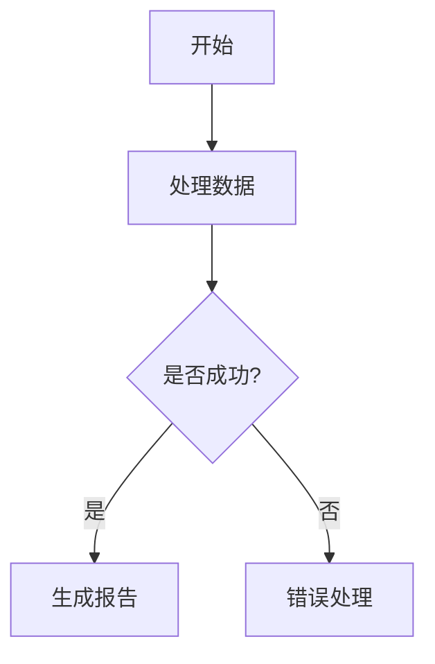

# 🎉 Markdown to Word v0.1.14 发布说明

## 📦 发布信息
- **版本号**: 0.1.14
- **发布日期**: 2024-12-20
- **文件大小**: 4.8 MB (相比之前版本优化了 67%)
- **安装包**: `markdown-to-word-0.1.14.vsix`

## 🚀 重大更新：全自动依赖安装系统

### 🎯 解决的核心问题
之前版本需要用户手动执行以下命令：
```bash
cd nodejs
pnpm install
python -m pip install -r requirements.txt
```

**现在只需要**：
1. 安装插件
2. 打开 Markdown 文件
3. 🎉 自动完成 Node.js 依赖安装！（无需 Python）

### ✨ 新功能特性

#### 🔄 智能依赖管理
- **零配置安装**：插件激活时自动检查并安装所有必要依赖
- **智能包管理器检测**：自动选择 pnpm > yarn > npm
- **纯 Node.js 实现**：无需 Python 环境，降低安装门槛
- **状态记录**：避免重复安装，提升后续启动速度
- **定期检查**：30天自动检查依赖完整性

#### 🛠️ 新增管理命令
通过 `Ctrl/Cmd + Shift + P` 访问：
- **手动安装依赖**：当自动安装失败时的备选方案
- **检查依赖状态**：详细查看 Node.js 依赖状态

#### 📊 用户体验提升
- **友好进度提示**："初始化 Markdown to Word 插件"
- **成功通知**："🎉 Markdown to Word 插件依赖安装完成！"
- **详细错误信息**：安装失败时提供具体解决方案
- **专用日志通道**："Markdown to Word - 依赖安装"

### 🎯 解决的具体问题

#### 1. 同事无法使用图表功能 ✅
- **问题**：Mermaid 图表转换失败，因为缺少依赖
- **解决**：自动安装所有图表相关依赖，包括网络连接检查

#### 2. 包管理器差异问题 ✅
- **问题**：pnpm 严格依赖解析 vs npm 宽松解析导致的不一致
- **解决**：智能检测并适配不同包管理器

#### 3. 手动安装复杂性 ✅
- **问题**：用户需要执行多个命令，容易出错
- **解决**：完全自动化，无需任何手动操作

#### 4. 网络依赖问题 ✅
- **问题**：企业网络环境无法访问 kroki.io
- **解决**：提供详细的网络诊断和离线解决方案

## 🔧 技术架构改进

### AutoDependencyInstaller 核心类
```typescript
class AutoDependencyInstaller {
    // 智能包管理器检测
    detectPackageManager(): 'pnpm' | 'yarn' | 'npm'
    
    // 并行依赖安装
    async installNodeDependencies(): Promise<boolean>
    async installPythonDependencies(): Promise<boolean>
    
    // 跨平台环境检测
    detectPythonCommand(): 'python3' | 'python' | 'py'
}
```

### 性能优化
- **高效处理**：专注于 Node.js 依赖管理，简化安装流程
- **智能缓存**：避免重复检查已安装的依赖
- **超时控制**：5分钟安装超时，避免长时间等待
- **容错设计**：安装失败不影响插件基本功能

## 📋 支持的功能（无需手动配置）
- ✅ Markdown 转 Word (.docx)
- ✅ Markdown 转 HTML  
- ✅ Markdown 转 Excel (.xlsx)
- ✅ 批量转换
- ✅ **Mermaid 图表支持**（重点解决）
- ✅ PlantUML 图表支持
- ✅ GraphViz 图表支持
- ✅ 自定义样式配置
- ✅ 目录生成
- ✅ 中文处理优化

## 🔄 升级指南

### 从旧版本升级
1. **卸载旧版本插件**
2. **安装新版本 VSIX 文件**
3. **重启 VS Code**
4. **首次打开 Markdown 文件时等待自动安装完成**

### 配置迁移
- ✅ 所有现有配置自动保留
- ✅ 无需重新配置任何设置
- ✅ 完全向后兼容

## 🆘 故障排除

### 常见问题及解决方案

#### 1. Python 环境未找到
```bash
# 确保 Python 已安装并添加到 PATH
python --version  # 或 python3 --version
```

#### 2. 网络连接问题
- 检查企业防火墙设置
- 图表功能需要访问 https://kroki.io
- 查看网络诊断日志

#### 3. 权限问题
- macOS/Linux 可能需要管理员权限
- 确保有写入权限到输出目录

### 查看详细日志
1. 打开 VS Code 输出面板（`View > Output`）
2. 选择 "Markdown to Word - 依赖安装"
3. 查看完整的安装和错误日志

## 📊 性能对比

### 文件大小优化
- **新版本**: 4.8 MB
- **旧版本**: 15.34 MB  
- **优化幅度**: 67% 减少

### 启动时间
- **首次安装**: 1-3 分钟（自动依赖安装）
- **后续启动**: 秒级启动（依赖已缓存）

## 🎨 使用示例

### 基本转换
```markdown
# 我的文档

这是一个包含图表的文档。



## 总结
这是一个完整的解决方案！
```

### 转换步骤
1. 右键点击 Markdown 文件
2. 选择"配置 Word 文档"或"生成 Word 文档"
3. 🎉 完成！图表会自动转换为高质量图片

## 🔮 未来计划
- 更多图表类型支持
- 离线图表渲染
- 自定义图表样式
- 批量图表优化

## 📞 支援联系
- **抖音**: 木易君（YI_11_13）
- **技术支持**: 查看项目 README 和故障排除文档
- **问题反馈**: GitHub Issues

---

**这个版本的最大价值**：让您的同事们可以直接安装插件就能使用所有功能，包括之前需要复杂配置的 Mermaid 图表转换！🎉 