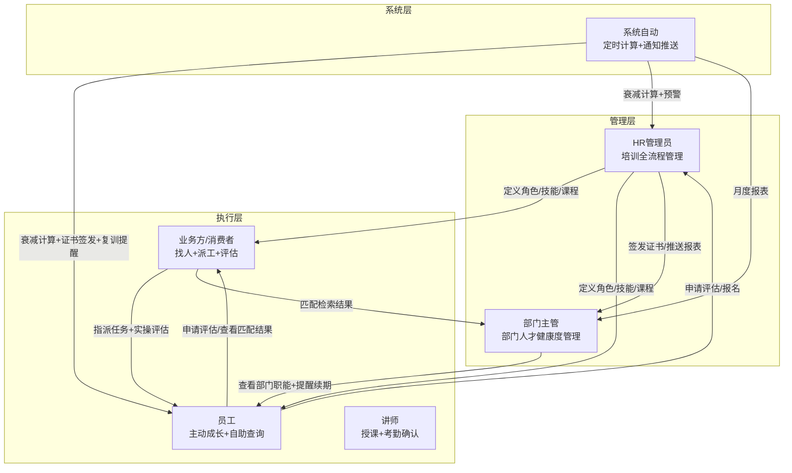
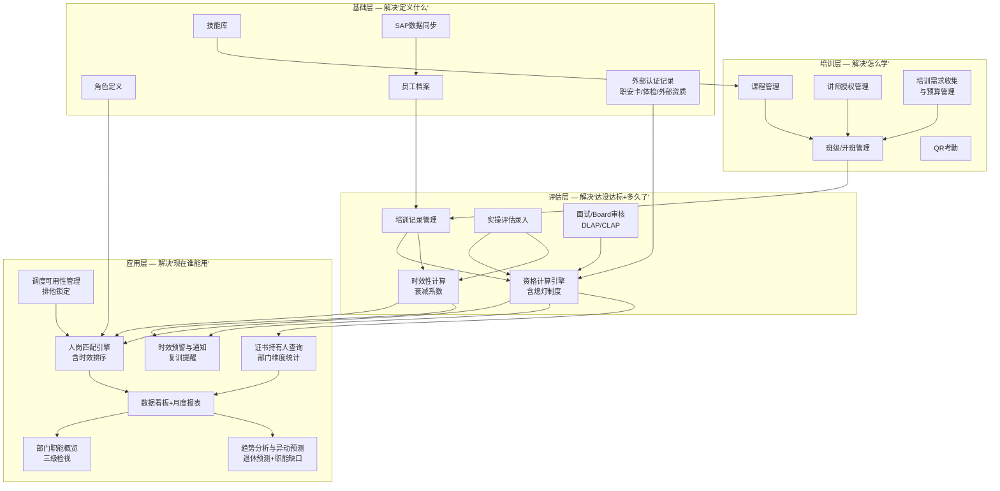
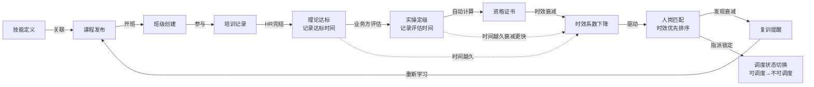
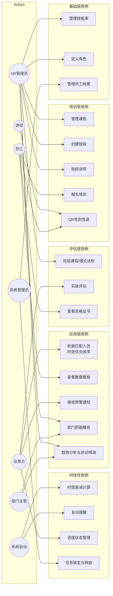
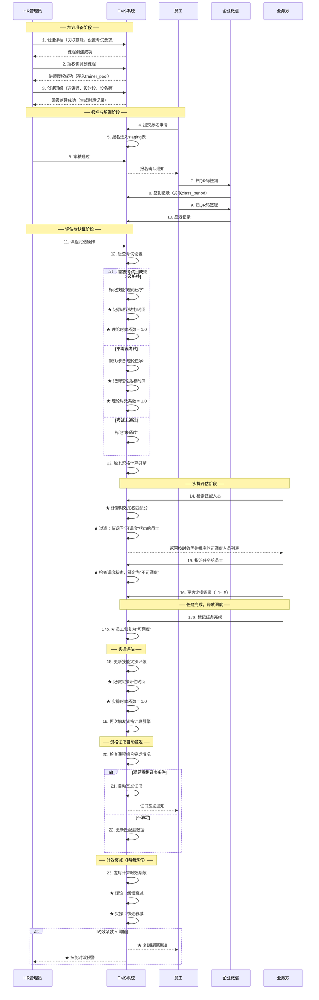
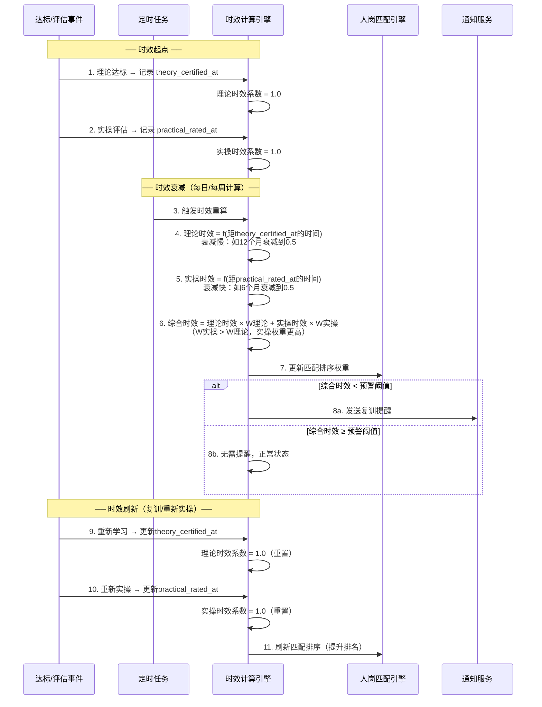
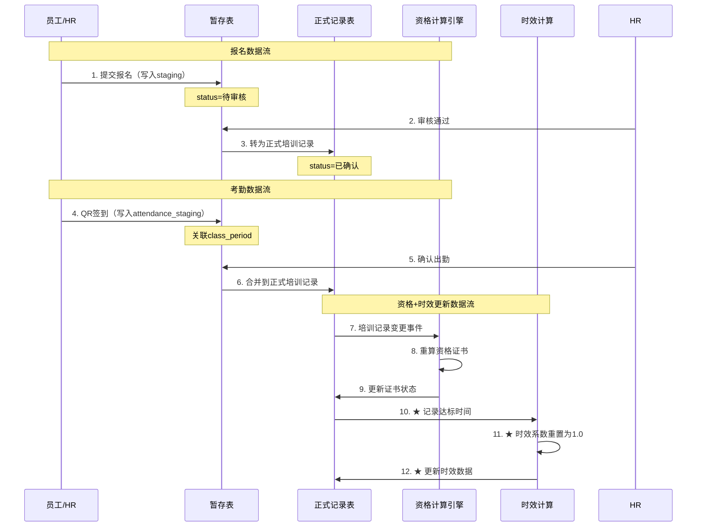
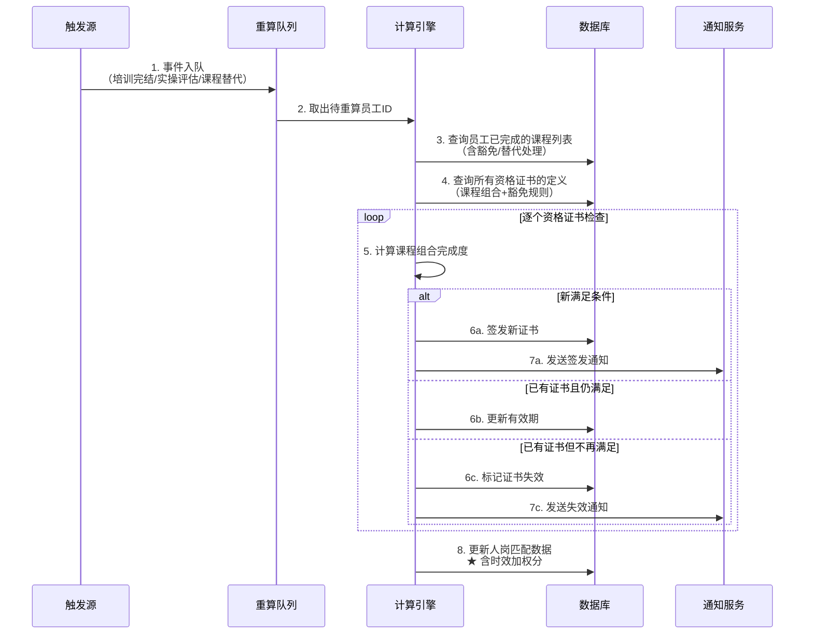

# CME-TMS 培训管理系统 产品需求文档 (PRD)

> **文档版本**：V2.6  
> **编制日期**：2026-04-22  
> **文档状态**：待确认  
> **审阅人**：甲方产品负责人 / 乙方项目组  
>   
> **阅读说明**：本文档支持**分段确认**。每个章节后标注确认状态（☐待确认 / ☑已确认 / ⚠有异议），甲方可逐段确认，无需一次性审批全部内容。  
>   
> **V2.4重点**：本版强化用户角色视角——以角色定义系统使用者的职责与可获功能，以用例展示功能的作用与价值，以流程展示系统运作过程。这些是甲方讨论需求的核心工具。  

---

## 修订记录

| 版本 | 日期 | 修订内容 | 作者 |
|------|------|----------|------|
| V1.0 | 2026-04-16 | 初始版本：基础功能列表 | 项目组 |
| V1.1 | 2026-04-16 | 重构：增加产品架构图、用例图、时序图；功能追溯需求来源 | 产品经理 |
| V1.2 | 2026-04-16 | 引入"技能时效性"核心概念；重写匹配算法；增加时效性时序图和用例 | 产品经理 |
| V1.3 | 2026-04-16 | 引入"调度可用性"概念；员工可标记可/不可调度；匹配仅返回可调度人员 | 产品经理 |
| V1.4 | 2026-04-17 | 批评性审查修订：①补5项遗漏功能（消息中心/操作日志/系统参数/资格定义独立/课程-技能关联）②修复用例编号连续性③修复依赖关系错误④增加分段确认支持⑤修复E04子功能编号重复 | 产品经理 |
| V1.5 | 2026-04-17 | 引入"次数法则"；重构人岗匹配为三维度熟练度模型（时效+次数+深度）；更新ER图增加practical_count/total_assignment_count/skill_acquired_at/proficiency_score；更新排序算法和示例 | 产品经理 |
| V1.6 | 2026-04-17 | 甲方视角审查修订：①增加TASK实体和任务管理功能②重构次数机制（total_assignment_count权重提升至0.25、增加员工申请评估入口）③调度灵活性（超时释放/容量/覆盖/员工解锁）④A01增加按技能检索+排序解释+可调偏好⑤证书增加实操等级门槛⑥增加班级状态机⑦增加报名审核策略⑧角色与岗位关系澄清⑨衰减参数引导⑩外部人员处理⑪成绩批量导入⑫补考安排细节⑬状态可视化规范 | 产品经理 |
| V1.7 | 2026-04-17 | 引入"人才梯队法则"；重构人岗匹配为"推荐+自由筛选"模式（系统推荐但不强制）；增加5种筛选视图（推荐/培养/探索/风险可控/自定义）；打破马太效应——防止熟练工越熟练、新人永远没机会 | 产品经理 |
| V1.8 | 2026-04-17 | 引入"透明晋升法则"和"终生学习"核心理念；员工从被动对象升级为主动用户；增加员工侧核心功能（我的晋升路径/岗位技能查询/技能差距分析/成长记录审计）；重塑产品定位——不只是培训管理工具，更是每个人职业成长的导航仪 | 产品经理 |
| V1.9 | 2026-04-17 | 引入"技能驱动岗位"核心逻辑——岗位是技能的推导结果不是固定分配；增加"我的适配岗位"动态计算功能；角色定义增加版本管理（技能要求变更有据可查）；视角翻转——从"岗位找人"变为"人的技能推导出满足哪些岗位" | 产品经理 |
| V2.0 | 2026-04-17 | **甲方3/23会议需求细化**：①新增培训需求收集与预算管理(T07)——部门报需求→报budget→HRS预留②新增面试/Board审核流程(E07)——DLAP见部门经理/CLAP见更高级③新增外部认证记录管理(B07)——职安卡/身体检查/劳工局/消防局/澳门注册电工④细化月度自动报表推送(A06)——非看板而是按月自动推送给部门⑤细化证书持有人查询(E05b)——按证书名查持有人列表+部门维度统计⑥细化通知部门负责人——证书到期不仅通知员工也通知部门Head⑦细化外部培训记录Excel导入——非报名场景的批量导入⑧增加证书熄灯制度规则——任一组成项过期即熄灯 | 产品经理 |
| V2.1 | 2026-04-17 | **甲方TMS系统架构讨论会议细化**：①新增课程组合必修/选修概念——技能认证的课程组合中区分必修(compulsory)与选修(elective)②新增职位(Position)前置条件——角色可要求员工达到特定职位阶层(Senior Technician等)才能担任③新增体检查询矩阵(Fitness Matrix)——结构化定义各角色对体检的要求(可实操/仅可观察/不可参与)，非简单的外部认证④新增课程编号体系约定(K=知识/S=技能/FF=安全消防)⑤新增条件性有效期——证书有效期可按条件(如年龄)动态计算⑥声明数据不覆盖原则——所有记录追加式写入，历史数据永不覆盖⑦细化课程前置/豁免/相依逻辑 | 产品经理 |
| V2.2 | 2026-04-17 | **甲方TMS优化会议需求补充**：①新增"我的证书"功能——员工一站式查看自己所有证书(有效/即将过期/已过期/已熄灯)+续期建议②新增部门主管自助视图——主管查看部门员工证书分布+即将过期人员+一键提醒③新增外部人员ID标准化规则——外部人员标识方式统一④新增HR/ERP体检数据对接规划——长期目标体检数据自动同步⑤调整开发阶段优先级——第1阶段增加基础自动化(证书到期提醒+月度报表框架)，响应甲方"先基础自动化再逐步扩展"策略 | 产品经理 |
| V2.3 | 2026-04-17 | **架构级修正——三维度经验模型(project audit发现)**：①TASK实体增加role_seq_FK——任务必须关联岗位上下文②新增ROLE_SKILL_EXPERIENCE实体——按(employee,skill,role)三维度记录任务指派次数/任务完成次数/正式评估次数③SKILL_ASSESSMENT移除practical_count和total_assignment_count——次数不再按技能全局累计而是按(技能+岗位)分别累计④practical_count重命名为evaluated_count(正式评估次数)⑤新增task_completion_count(任务完成次数=真正的实际操作次数)⑥澄清三件事关系：任务指派≥任务完成≥正式评估⑦人岗匹配算法改用ROLE_SKILL_EXPERIENCE的role-specific次数⑧更新排序算法和示例 | 产品经理 |
| V2.4 | 2026-04-20 | **甲方TAD需求+角色/用例/权限强化**：①强化用户角色定义——每个角色明确职责、系统提供功能和核心价值诉求②新增§1.6组织架构与权限矩阵——角色关系图+详细权限矩阵(✏️编辑/👁️查看/✅审批/🔔通知)+角色聚焦指南(快速入口)③新增部门职能概览(A08)——三级检视(部门/单位/个人)+时间轴+有效期管理④新增趋势分析与异动预测(A09)——基于人员变动数据(退休/离职预测)生成职能缺口报告⑤搜索维度优化——支持按课程类型+课程中文名过滤⑥人员清单备注字段——搜索结果和人员列表加入Remarks便于查核⑦考核分数便捷导入——成绩批量导入增强为自动化评分录入⑧项目时程与预算——Phase 1/2详细时程表+各阶段费用分配 | 产品经理 |
| V2.5 | 2026-04-21 | **产品生命周期审计升级**：①新增§1.4d数据纠错原则——数据不覆盖≠不可纠错，引入superseding record机制②新增§1.4e级联影响规则——7条核心级联链③新增§6.7数据生命周期业务规则(22~30)——每个实体的CRUD边界条件④新增系统支撑层功能(F-S05~F-S14)：数据纠错机制/批量操作框架/系统健康监控/SAP对账/证书宽限期/并发锁/等级模型保护/角色停用级联/数据保留策略/通知节流⑤更新ER图：SKILL_ASSESSMENT增加superseded_by_seq⑥更新权限矩阵+验收标准+术语表⑦配套产品生命周期文档(含29+5测试用例) | 产品经理 |
| V2.6 | 2026-04-22 | **用户体验与业务价值强化**：①新增§7用户旅程地图——3个典型旅程(新员工入职/紧急调配/人才规划)②新增§8业务成功指标体系——组织效能+员工成长+运营效率3维度量化指标③新增§9业务异常场景处理——4个关键异常场景(离职未完成任务/评估纠错/岗位要求升级/SAP同步失败)④新增§10业务决策支持场景——3个典型决策场景(培训计划/紧急调配/晋升评审)⑤新增§11业务演进路线图——3阶段投资回报路径⑥非功能需求重编号为§12⑦项目范围重编号为§13⑧验收标准重编号为§14 | 产品经理 |

---

## 1. 产品概述

### 1.1 产品定位

CME-TMS 是一套**以技能为中心、以终生学习为理念**的企业培训与职业发展平台。

系统的核心使命有双重维度：

> **组织视角**："谁现在真正具备什么技能、达到了什么等级，并且当前可以接受任务调度？"
>
> **个人视角**："我想要达到什么岗位？还差什么？每一步怎么走？我的每一条数据都经得起审计吗？"

传统培训系统只回答第一个问题——把员工当作被管理的对象。**CME-TMS同时回答第二个问题**——把员工作为主动成长的主体。技能不是HR的表格数据，而是每个人职业成长的阶梯。每一个技能等级、每一次实操次数、每一条时效系数，都不是系统"赋"给员工的，而是员工**通过真实执行任务一步步堆出来的**——每条数据都有来源、有依据、经得起审计。

围绕这个认知，系统建立了一条**双向闭环**：

> **组织侧闭环**：技能定义 → 培训传授 → 评估验证 → 熟练度量化 → 人岗应用（推荐+自由筛选）
>
> **个人侧闭环**：我想达到什么岗位 → 差什么技能/等级 → 选择学习路径 → 通过实战堆数据 → 数据经审计可溯源 → 达到目标 → 设定更高目标

### 1.2 核心价值主张

| 价值维度 | 现状痛点 | 系统价值 |
|---------|---------|---------|
| 技能不可见 | 员工技能散落在各人脑中，无法量化 | 建立数字化技能图谱，技能等级可视化 |
| 评估双轨断裂 | 理论考试与实操评估各自为政，无法联动 | 理论达标由HR触发，实操定级由业务方触发，双轨联动 |
| **时效性盲区** | **只看"达没达标"，不看"多久以前达标的"，导致推荐了早已生疏的人** | **引入时效系数，最近学习和最近实操的人优先推荐，符合熟练度法则** |
| **次数盲区** | **只看"最近做没做过"，不看"做过多少次"，导致推荐了只碰过一次的生手** | **引入操作频次和掌握深度，做过50次的人远比做过1次的人可靠，符合次数法则** |
| 人岗匹配靠经验 | 业务方凭记忆找人，效率低、遗漏多 | 系统根据技能覆盖率、等级、时效性、操作频次综合排序**推荐**；提供5种筛选视图满足不同用人策略 |
| **马太效应陷阱** | **永远只用最熟练的人，新人永远没有成长机会，人才梯队断裂** | **培养视图将经验不足的人推到前面，给新人练手机会；系统是参谋不是决策者** |
| **调度冲突盲区** | **找到人但派不了人——同一人被多个业务方同时选中，或已在执行任务却被推荐** | **引入调度可用性：员工可标记可/不可调度；被指派后自动不可调度；匹配检索只返回可调度人员** |
| 资格计算靠人工 | 手工判断员工是否满足资格条件，易出错 | 规则引擎自动计算资格证书，实时签发与过期管理 |
| **晋升路径不透明** | **员工不知道达到目标岗位需要什么技能什么等级，没有方向，不知道怎么进步** | **透明晋升：岗位技能要求完全公开，员工可查询任意岗位的技能要求，看到差距，明确方向** |
| **成长数据不可溯源** | **技能等级靠人说了算，不透明，无法审计** | **每条数据来自真实执行：任务记录→评估记录→次数累计→等级变更，全链路可审计可溯源** |
| **技能规范缺失** | **技能没有标准化定义，每个人理解不同，学无方向** | **技能库+等级模型+衰减参数，将技能规范化，让所有人按同一标准学习和成长** |
| **培训需求靠人工收集** | **各部门用邮件/口头报培训需求，报budget流程混乱，HRS无法统一预留时间和预算** | **培训许愿池+预算管理：部门在线报需求→报budget→HRS预留时间和预算，全流程在线可追溯** |
| **面试/Board审核无记录** | **DLAP/CLAP申请者需见Board面试审核，但面试流程和结果散落在邮件和纸质文件中** | **面试审核流程在线化：课程通过→面试申请→Board审核→结果记录，全流程在TMS中可追溯** |
| **外部认证无统一管理** | **职安卡/密闭空间卡/身体检查/劳工局/消防局等外部认证散落在各Excel中，无法与内部技能联动** | **外部认证记录管理：统一录入外部认证+有效期+自动预警+与资格计算联动（任一组成项过期即熄灯）** |
| **月度报表靠人手制作** | **每月需要人工导出数据制作培训报表，耗时且容易遗漏，部门负责人无法及时获取** | **月度自动报表：按月自动生成报表推送给相关部门，含证书持有人统计/部门证书分布/过期预警汇总** |
| **证书查询维度不足** | **无法按证书名称查持有人列表，无法按部门查证书分布和数量，无法看合资格人数趋势** | **证书持有人查询+部门维度统计+合资格人数趋势折线图** |
| **部门职能全貌不可见** | **部门主管无法一眼看清本部门职能覆盖全貌——谁靠谱谁需复训、职能缺口在哪里、未来几年谁退休谁离职** | **部门职能概览(三级检视)+趋势分析(退休/离职预测+职能缺口预警)** |
| **趋势分析缺位** | **无法预测未来几年因退休/离职导致的职能缺口，HR和部门主管被动应对** | **趋势分析与异动预测：基于人员变动数据生成职能缺口趋势报告** |
| **搜索查课效率低** | **无法按课程类型或中文名快速定位课程，依赖逐页翻找** | **搜索维度优化：课程类型+中文名作为主要过滤条件** |
| **查核缺少备注** | **人员清单中无法标注备注用于实时核对，需切出系统手工记录** | **人员清单中增加Remarks备注字段** |
| **考核分数录入繁琐** | **设有考核环节的课程需逐人录入成绩，人工操作易错** | **便捷的成绩数据导入——支持Excel模板批量导入+校验** |

### 1.3 核心业务原则：熟练度法则

> **昨天做过，今天一定更熟练。很久没做，一定更生疏。**

这是本系统人岗匹配的底层逻辑之一。具体体现为：

1. **理论有时效**：学习时间越近，理论掌握越牢固；时间越久，记忆衰减
2. **实操更依赖近期**：实操的熟练度衰减速度远快于理论——"三年前操作过"和"昨天操作过"是两个完全不同的概念
3. **排序遵循时效**：同等级的人，最近学习和最近实操的优先排列；久未实操的人即使等级高，也排在近期实操者之后
4. **衰减可以刷新**：重新学习（复训）或重新实操，时效性归零重新计算

### 1.3a 核心业务原则：次数法则（V1.5新增）

> **做过十次的人，一定比做过一次的人更可靠。掌握三年的技能，一定比刚学会的更扎实。**

这是用人部门最关心的逻辑——**用人部门要的是"一定不会出问题的人"，不是"最近碰过一次的人"。** 具体体现为：

1. **实操次数是可靠性的直接证据**：操作过50次的人几乎不可能出错，操作过1次的人风险极高。次数越多，肌肉记忆和异常处理能力越强
2. **技能掌握时长是深度的体现**：掌握某技能3年的人，比上个月刚学会的人，对该技能的理解和应变能力完全不同
3. **次数与时效互补**：时效法则看"最近"，次数法则看"积累"——一个做过50次但3个月没做的人，和一个做过1次但昨天刚做的人，谁更靠谱？答案是两者都要考虑，但**次数的权重不应低于时效**
4. **用人部门的核心关切**：消费者（业务方）找人是为了完成任务，不是做实验。推荐的人必须"来了就能干，干了就不出错"。排序算法必须体现这个诉求

**两大法则的关系**：

| 维度 | 熟练度法则（时效） | 次数法则（积累） |
|------|------------------|----------------|
| 关注点 | "最近做过没有" | "做过多少次、掌握多久" |
| 衡量指标 | 时效系数（距上次操作的时间） | 操作次数、技能掌握时长 |
| 风险场景 | 推荐了"做过很多次但太久没做"的生疏者 | 推荐了"昨天刚碰过但只做过一次"的生手 |
| 互补关系 | 时效保证"手感还在" | 次数保证"经验足够" |
| 核心逻辑 | 防止推荐"曾经厉害但已生疏"的人 | 防止推荐"最近碰过但经验不足"的人 |

> ⚠️ **关键洞察**：旧算法只看时效，会出现严重误判——一个操作过100次但3个月没做的人，会被排在一个只做过1次但昨天刚做的人后面。这对用人部门来说是不可接受的：1次经验的人出错概率远高于100次经验但稍久未操作的人。

### 1.3b 核心业务原则：人才梯队法则（V1.7新增）

> **如果永远只用最熟练的人，新人永远没有成长的机会。人才梯队需要刻意培养，不会自然形成。**

这是次数法则的反面——次数法则保证"找最靠谱的人"，但**如果系统永远把熟练工排第一，就会产生马太效应**：熟练工越做越熟练（次数越来越多、排序越来越靠前），新人永远没机会（没人指派→次数永远为0→排序永远靠后）。

具体体现为：

1. **马太效应陷阱**：算法推荐系统天然偏向"强者越强"——做过50次的人永远排第一，做过0次的人永远排最后。如果不刻意打破，新人永远无法获得第一次实操机会
2. **梯队培养是战略需求**：用人部门不只解决当下任务，更要考虑3个月、6个月后谁来做。今天给新人一次机会，3个月后他就不是新人了
3. **用人不唯规则，也唯心**：部门有意让新人练手、有意让老带新、有意给某人特殊机会——这些都是合理的用人决策，系统不应强制束缚
4. **系统是参谋，不是决策者**：系统提供推荐排序和多元视角，但**最终用人决策权在用人部门手中**

**三大法则的关系**：

| 法则 | 解决什么问题 | 风险 |
|------|------------|------|
| 熟练度法则（时效） | 防止推荐生疏的人 | 无 |
| 次数法则（积累） | 防止推荐经验不足的人 | **马太效应——新人永远没机会** |
| **人才梯队法则** | **打破马太效应，给新人成长空间** | **如果过度偏向培养，可能推荐不胜任的人** |

> ⚠️ **关键设计决策**：系统必须同时服务两种诉求——"找最靠谱的人完成任务"和"培养梯队让新人成长"。**解决方案：系统默认按熟练度推荐（保底线），同时提供多元筛选视图让部门自由选择（给空间）。系统是参谋，不是决策者。**

### 1.3c 核心业务原则：透明晋升法则（V1.8新增）

> **每个人有权知道自己距离目标岗位还差什么。每一条成长数据都来自真实执行，经得起审计。晋升不是黑箱，而是透明的阶梯。**

这是系统的**灵魂**——前三个法则服务组织，这个法则服务个人。具体体现为：

1. **岗位技能要求透明**：任何员工可以查询任意岗位/角色需要哪些技能、什么等级。不是HR告诉他，而是他自己看得见。没有黑箱，没有信息差
2. **技能差距可视化**：员工选定目标岗位后，系统自动对比当前技能与目标要求，清晰展示"还差什么"——差几个技能、差几个等级、差多少次实操经验
3. **成长路径自驱动**：知道差距后，员工主动选择学习路径——报名课程、申请任务、请求评估。**每一步都是他自己走的，不是系统安排的**
4. **数据可审计可溯源**：技能等级不是"HR说了算"，而是由一条条可追溯的记录堆砌而成——"2024-03通过XX课程理论达标"、"2024-06执行XX任务被评定L3"、"2024-09再次执行同类任务被评定L4"。每条记录都有触发者、触发时间、原始证据
5. **技能规范化=学习方向化**：技能没有标准化定义时，每个人理解不同，学无方向。系统将技能规范化（等级模型+衰减参数+实操要求），让所有人按同一标准学习，**让数字化时代的技能不再是模糊的感觉，而是可衡量、可追赶的目标**

**四大法则的关系**：

| 法则 | 服务谁 | 回答什么问题 |
|------|--------|------------|
| 熟练度法则 | 组织 | "这个人最近做没做过？" |
| 次数法则 | 组织 | "这个人做过多少次？" |
| 人才梯队法则 | 组织+个人 | "新人有没有成长机会？" |
| **透明晋升法则** | **个人** | **"我想达到什么岗位？还差什么？怎么走？"** |

### 1.3d 核心理念：终生学习（V1.8确立）

> **技能不是一次达标就永远有效的。它会衰减，需要复训。岗位不是一成不变的，它会升级，需要进阶。学习不是阶段性的，它是终生的。**

CME-TMS的核心理念是**终生学习**——系统从三个层面支撑：

| 层面 | 含义 | 系统支撑 |
|------|------|---------|
| **技能会衰减** | 达标不是终点，3个月不实操就会生疏 | 时效衰减+复训提醒，推动持续练习 |
| **岗位会升级** | 今天胜任的岗位，明天可能需要更高等级 | 岗位技能要求更新时，员工自动收到差距通知 |
| **成长无止境** | 达到一个目标后，还有更高的目标 | 晋升路径不断延伸：L1→L2→L3→L4→L5，每级都有明确条件 |

### 1.3e 核心业务原则：技能驱动岗位（V1.9新增）

> **岗位不是分配给人的，而是人的技能推导出来的。人掌握了什么技能，系统就显示你满足哪些岗位。岗位的要求是动态变化的，但永远是技能决定岗位，不是岗位决定人。**

这是一个根本性的视角翻转：

| 旧视角 | 新视角 |
|--------|--------|
| 岗位找人（top-down） | 人的技能推导岗位（bottom-up） |
| 员工的岗位是HR指定的 | 员工的适配岗位是技能实时计算的 |
| 岗位要求固定不变 | 岗位要求动态演进，技能要求随业务变化 |
| "你是XX岗位的人" | "基于你当前的技能，你满足XX、YY、ZZ岗位" |

具体体现为：

1. **"我的适配岗位"是实时推导**：员工的页面上有一个动态区域——"基于你当前掌握的技能，你满足以下岗位"——这不是HR指定的，是系统根据你的技能+所有岗位的技能要求实时计算的。你多学一个技能，可能就多满足一个岗位；岗位要求变了，你的适配列表也变
2. **岗位要求动态演进**：一年前高级电工只需要5个技能，一年后可能需要7个。系统记录岗位要求的每次变更，员工能清楚看到"我去年满足的岗位，今年因为要求升级可能不再满足了"
3. **技能是因，岗位是果**：人不是"被放在某个岗位上"，而是"因为具备了某些技能，所以自然适配某些岗位"。人主动堆技能，岗位自然出现——这才是透明晋升的底层逻辑
4. **一个技能组合可适配多个岗位**：人掌握了高压操作L4+应急处理L3+安全管理L2，可能同时满足"高级电工"和"安全主管"——系统同时展示所有满足的岗位，由人选择往哪个方向发展

**六大法则的关系**：

| 法则 | 核心逻辑 |
|------|---------|
| 熟练度法则 | 技能有时效，需要持续练习 |
| 次数法则 | 技能有积累，经验是堆出来的 |
| 人才梯队法则 | 新人需要机会，不能永远用熟练工 |
| 透明晋升法则 | 每个人知道差距和方向 |
| 终生学习 | 达标不是终点，成长无止境 |
| **技能驱动岗位** | **技能是因，岗位是果。不是岗位决定人，是技能决定岗位** |

### 1.4 核心业务原则：调度排他性

> **一个人同一时间只能执行一个任务。已被调度的人，不应再出现在检索结果中。**

这是人岗匹配的现实约束。具体体现为：

1. **可调度/不可调度**：员工有明确的调度状态，只有"可调度"的人才出现在匹配检索结果中
2. **指派即锁定**：业务方指派任务后，员工自动切换为"不可调度"，其他业务方无法再选中该人
3. **完成即释放**：任务完成或取消后，员工自动恢复为"可调度"
4. **主动声明**：员工可主动标记自己为"不可调度"（休假、忙于其他非系统管理的项目等）
5. **调度日历**：员工可设置未来的可调度/不可调度时间段，系统按时间自动切换状态

#### 1.4.1 调度灵活性规则（V1.6新增——回应甲方关切）

> 现实中"一个人只能做一个任务"过于绝对——任务可能只需半天但锁定两周，业务方可能忘记释放，员工可能同时做2-3个轻量任务。系统需要更灵活的调度机制。

| 规则 | 说明 | 解决的问题 |
|------|------|-----------|
| **任务预计时长** | 创建任务时填写预计结束时间(expected_end_at)。超时未完成的任务，系统自动释放调度状态并通知业务方 | 业务方忘记释放导致员工一直被锁定 |
| **超时自动释放** | 超过expected_end_at后，系统每日检查：①通知业务方"任务已超期，请确认完成或延期"②若3天内无响应，自动释放调度状态 | 防止永久锁定 |
| **并发任务数** | 员工可设置max_concurrent_tasks（默认1）。若设为2，则可同时被指派2个任务，第3个起锁定 | 允许轻量任务并行 |
| **HR强制覆盖** | HR管理员可强制将员工从"不可调度"切换为"可调度"（需填写覆盖原因，记入操作日志） | 紧急任务需要调人 |
| **员工申请解锁** | 员工可申请提前释放（如任务实际已结束但业务方未确认），HR审批后释放 | 业务方不确认时员工自救 |
| **任务取消释放** | 业务方取消任务后，调度状态立即释放 | 任务变更 |

### 1.4a 核心设计原则：课程治理模型与系统边界（V2.4新增）

> **TMS管理的是"经过审核的课程信息"，不是课程内容本身。课程研发、内容评审在系统外完成，TMS只管理审核通过后的课程记录和开班执行。**

课程不是讲师想教就教的，也不是HR随意定义的。课程治理遵循**需求驱动→审核确认→系统录入**的流程：

```
用人部门提出技能需求 ─→ HR与用人部门确认课程内容 ─→ 课程审核通过 ─→ 录入TMS ─→ 授权讲师 ─→ 开班执行
        ↑                                    ↑
   市场需求驱动                        课程研发在系统外
```

**系统边界确认**：

| 在系统内（TMS管理） | 在系统外（非TMS管理） |
|---------------------|---------------------|
| 课程基本信息（名称、类型、时长、考试要求、技能关联） | 课程内容研发（课件制作、教案编写） |
| 讲师授权关系（谁有资格教什么课） | 讲师培训与考核 |
| 班级排期与考勤 | 在线教学/考试平台 |
| 课程关联的技能点和等级要求 | 课程内容质量评审 |
| 课程的"使用中/已停用"状态 | 课程内容本身的时效性判断 |
| 报名、完结、成绩管理 | 薪酬/绩效/招聘系统 |

> ⚠️ **关键假设（待甲方确认）**：课程"停用"由HR手动操作，基于HR与用人部门的评审结论。系统不自动判定课程内容是否过时——这是人的判断，不是系统的判断。技能衰减参数（理论周期、实操周期）的初始值由HR设定，但需要与用人部门确认是否符合业务实际。这些问题详见《问题清单》(Q-02, Q-04a)。

### 1.4b 核心设计原则：账号体系与身份来源（V2.4新增）

> **用户身份来源于SAP同步+企业微信SSO，系统不提供独立的用户自注册机制。**

| 问题 | 当前假设（待确认） | 需要甲方确认 |
|------|-------------------|-------------|
| 账号如何创建？ | SAP同步员工数据时自动创建TMS账号 | Q-01 |
| 外部人员如何获得账号？ | HR手动创建"外部人员"账号（ext_前缀编号） | Q-01b |
| 登录方式？ | 企业微信扫码登录（主要）+ 账号密码（备用） | Q-01f |
| 角色如何分配？ | SAP职位数据自动识别+HR手动指定角色 | Q-01d |
| 一人能否多角色？ | 支持一人多角色，但同一时间只以一个角色身份操作 | Q-01e |
| 离职后如何处理？ | SAP标记离职后TMS账号自动停用，但保留历史数据 | Q-01c |

> ⚠️ 以上均为当前假设，需甲方确认后纳入正式需求。详见《问题清单》第一类(Q-01)。

### 1.4c 核心设计原则：数据不覆盖（V2.1新增）

> **所有记录追加式写入，历史数据永不覆盖。新的评估、新的达标、新的认证，都产生新记录而非修改旧记录。**

这是系统的数据完整性底线：

1. **追加不覆盖**：员工重新评估实操等级时，不修改旧评估记录，而是新增一条评估记录，旧记录保留
2. **历史可追溯**：任何时刻都可以回溯到某个时间点的技能状态——"这个人2024年3月的实操等级是什么"是可查询的
3. **外部认证续期**：职安卡续期后，旧卡记录保留（含生效/过期时间），新卡记录追加，两张卡的历史都可见
4. **体检记录**：每次体检结果新增记录，旧体检结果保留——"这个人去年的体检能否实操"是可查询的
5. **批量导入不覆盖**：Excel/CSV批量导入时，系统比对现有记录，匹配到同一员工同一认证则新增续期记录，不覆盖旧记录

### 1.4d 核心设计原则：数据纠错机制（V2.5新增——产品生命周期审计发现）

> **数据不覆盖 ≠ 数据不可纠错。** 追加式写入保证历史可追溯，但评估数据出错必须有纠正路径。

纠错遵循**superseding record（覆盖记录）机制**：

1. **纠错创建新记录**：不修改原记录，而是创建一条新记录，标记`supersedes_seq`指向被纠正的旧记录
2. **旧记录标记为superseded**：原记录的`status`从`active`变为`superseded`，不再作为当前有效记录，但历史可查
3. **纠错审计**：操作日志区分`OPERATIONAL`（正常操作）/`CORRECTION`（纠错）/`OVERRIDE`（HR强制覆盖）/`SYSTEM_ADJUSTMENT`（系统调整）四种类型
4. **纠错必须填写原因**：任何纠错操作必须选择原因码（如：评估员录入错误/系统计算错误/HR行政纠正等）和审批人
5. **级联触发**：纠错后自动触发资格重算(E05a)和熟练度重算(E06)

> ⚠️ **ROLE_SKILL_EXPERIENCE的计数只能增加不能减少**：如果任务是错误完成标记，不减少task_completion_count，而是**追加一条反向纠错记录**（type=correction, delta=-1），在汇总时净额计算。这保证了"数据不覆盖"原则与"错必可纠"原则的统一。

### 1.4e 核心设计原则：级联影响规则（V2.5新增——产品生命周期审计发现）

> **系统中的数据不是孤立的。一个数据点的变更会像波纹一样影响下游所有相关数据。以下7条级联规则必须被严格执行和测试。**

| 编号 | 触发事件 | 级联动作 |
|------|---------|---------|
| CASCADE-01 | 理论达标(E03) | → theory_certified_at写入 → theory_freshness=1.0 → 资格重算入队 → proficiency重算 |
| CASCADE-02 | 实操评估(E04) | → practical_rated_at写入 → practical_freshness=1.0 → ROLE_SKILL_EXPERIENCE.evaluated_count+1 → 资格重算入队 → proficiency重算 |
| CASCADE-03 | 任务指派(A05.2) | → ROLE_SKILL_EXPERIENCE.total_assignment_count+1 → 调度锁定 |
| CASCADE-04 | 任务完成(A05.5) | → ROLE_SKILL_EXPERIENCE.task_completion_count+1 → 调度释放 |
| CASCADE-05 | 外部认证过期 | → 关联证书熄灯⚫ → 匹配排除 → 部门主管通知 → A08概览刷新 → A09趋势更新 |
| CASCADE-06 | 角色技能要求变更(B03.7) | → 版本记录 → G05通知所有设该岗位为目标的员工 → G01重算 → G02差距重算 → G07适配岗位重算 → A08概览刷新 → A09趋势更新 |
| CASCADE-07 | 衰减参数变更(S03) | → 影响预览(S03.3) → 确认后全员proficiency重算 → A01排序变化 → A02可能触发复训提醒 → A08概览刷新 |

> ⚠️ **级联执行策略**：资格重算(E05a)和熟练度重算(E06)采用队列异步处理，不阻塞用户操作。重算期间查询返回上次计算结果（最终一致性）。批量重算失败时支持断点续算，不从头开始。

> ⚠️ **甲方明确要求**：歷程資料不可遺失，需能追溯所有紀錄。系統需保留完整學習歷史，不覆蓋舊紀錄。

### 1.5 目标用户与核心诉求

> 角色定义了系统使用者的职责及系统提供给他的功能。以下为系统五大用户角色及其核心诉求、系统能力、核心价值对照。

| 用户 | 职责 | 系统提供的主要功能 | 核心价值诉求 | 一句话描述 |
|------|------|-------------------|-------------|-----------|
| **HR管理员** | 管好培训全流程，确保每人接受正确培训并保持技能新鲜 | 技能库管理、角色定义、课程/班级管理、报名审核、完结达标、资格计算配置、系统参数、员工档案、外部认证、报表推送 | 确保合规、追踪全面、数据可审计 | "我要确保每个人接受到正确的培训，并保持技能新鲜" |
| **业务方/消费者** | 找到最合适的人执行任务，或培养新人 | 人岗匹配检索(5种视图)、任务指派与调度、实操评估、部门职能概览 | 找对人、用好人的长短搭配、梯队清晰 | "系统推荐但我不受束缚，用人决策权在我手中" |
| **部门主管** | 掌握本部门职能全貌、及时发现缺口和风险 | 部门职能概览(三级检视)、趋势分析(含退休预测)、部门证书分布、一键提醒续期、备注查核 | 一眼看清部门谁靠谱谁需复训、职能缺口在哪里 | "我要一眼看到部门谁快过期、哪里有缺口" |
| **员工** | 知道自己距离目标岗位还差什么，主动成长 | 我的技能全景、我的适配岗位、我的晋升路径、我的证书、成长记录审计、岗位技能查询、申请实操评估、备注查看 | 透明晋升、方向明确、数据经审计可溯源 | "我要知道达到目标岗位还差什么，每一步怎么走" |
| **讲师** | 明确授课范围和授权，关注课程交付质量 | 授权课程列表、班级安排、考勤确认、**课程内容查看、成绩确认** | 授课安排清晰、不超范围、能完成课程交付职责 | "我要明确我的授课范围，确认考勤和成绩" |

> ⚠️ **V2.4新增角色说明**：部门主管(TAD)是甲方明确提出的角色——TAD需要掌握内部职能总数、时间轴与有效期管理、按单位/个人检视、趋势分析与异动预测。此角色介于HR与业务方之间，侧重**部门维度的人才健康度管理**。

### 1.6 组织架构与权限矩阵（V2.4新增）

> 角色定义了"谁负责什么"，权限矩阵定义了"谁能做什么、看什么"。以下内容帮助每位读者快速定位：**我是哪个角色？我能看到什么？我能操作什么？我依赖谁？**

#### 1.6.1 组织架构与角色关系



**角色间核心依赖关系**：

| 依赖方向 | 依赖内容 | 说明 |
|---------|---------|------|
| HR → 业务方 | HR定义技能/角色/课程 → 业务方才能检索匹配 | 基础数据是匹配的前提 |
| HR → 员工 | HR完结课程 → 员工理论达标 | 培训是技能获取的起点 |
| 业务方 → 员工 | 业务方指派任务+实操评估 → 员工获得实操等级和经验次数 | 实操来自业务方派工 |
| 业务方 → 部门主管 | 业务方匹配检索 → 部门主管了解团队成员被指派情况 | 指派信息部门主管可见 |
| 员工 → HR | 员工报名/申请评估 → HR审核 | 员工主动触发流程 |
| 系统自动 → 所有人 | 定时计算+预警+签发 → 通知各角色 | 系统是自动化引擎 |
| 部门主管 → 员工 | 部门主管一键提醒续期 → 员工收到复训通知 | 部门主管推动团队复训 |

#### 1.6.2 详细权限矩阵

> **权限标识**：✏️=可创建/编辑 | 👁️=可查看 | ✅=可审批/确认 | 🔔=可接收通知 | ➖=无权限

| 功能编号 | 功能名称 | HR管理员 | 部门主管(TAD) | 业务方(消费者) | 员工 | 讲师 | PRD章节 |
|---------|---------|---------|-------------|-------------|------|------|---------|
| **基础层** | | | | | | | |
| F-B01 | 技能库管理 | ✏️➕ | 👁️ | ➖ | ➖ | ➖ | §5.1 |
| F-B02 | 衰减参数配置 | ✏️ | ➖ | ➖ | ➖ | ➖ | §5.1 |
| F-B03 | 角色定义 | ✏️ | 👁️ | 👁️ | 👁️ | ➖ | §5.1 |
| F-B04 | 员工档案 | ✏️👁️ | 👁️(本部门) | 👁️(指派对象) | 👁️(本人) | ➖ | §5.1 |
| F-B05 | SAP数据同步 | 系统自动 | ➖ | ➖ | ➖ | ➖ | §5.1 |
| F-B07 | 外部认证记录 | ✏️ | 👁️(本部门) | ➖ | 👁️(本人) | ➖ | §5.1 |
| **培训层** | | | | | | | |
| F-T01 | 课程管理 | ✏️ | ➖ | ➖ | ➖ | 👁️(本人授权课) | §5.2 |
| F-T02 | 课程关系 | ✏️ | ➖ | ➖ | ➖ | ➖ | §5.2 |
| F-T03 | 班级管理 | ✏️ | 👁️(本部门班) | ➖ | 👁️(报名班) | 👁️(授课班) | §5.2 |
| F-T04 | 讲师授权 | ✏️ | ➖ | ➖ | ➖ | 👁️(本人授权) | §5.2 |
| F-T05 | QR考勤 | ➖ | ➖ | ➖ | 🔔扫码签到 | 👁️(考勤确认) | §5.2 |
| F-T07 | 培训需求与预算 | ✏️✅(审核) | ✏️(提交需求) | ➖ | ➖ | ➖ | §5.2a |
| **评估层** | | | | | | | |
| F-E01 | 报名管理 | ✏️✅(审核) | ➖ | ➖ | ✏️(报名) | ➖ | §5.3 |
| F-E02 | 培训记录管理 | ✏️👁️ | 👁️(本部门) | ➖ | 👁️(本人) | ➖ | §5.3 |
| F-E03 | 课程完结与理论达标 | ✏️✅ | ➖ | ➖ | 🔔(通知) | 👁️(授课班成绩) | §5.3 |
| F-E04 | 实操评估 | 👁️ | ➖ | ✏️✅ | 🔔(通知) | ➖ | §5.3 |
| F-E04a | 员工申请实操评估 | ➖ | ➖ | 🔔(提醒) | ✏️ | ➖ | §5.5 |
| F-E05 | 资格证书定义 | ✏️ | ➖ | ➖ | ➖ | ➖ | §5.3 |
| F-E05a | 资格计算引擎 | 系统自动 | 🔔(主管通知) | ➖ | 🔔(通知) | ➖ | §5.3 |
| F-E06 | 时效性计算 | 系统自动 | 🔔 | ➖ | 🔔 | ➖ | §5.3 |
| F-E07 | 面试/Board审核 | ✅(组织) | ✅(参与) | ➖ | ✏️(申请) | ➖ | §5.3a |
| **应用层** | | | | | | | |
| F-A01 | 人岗匹配检索 | 👁️ | 👁️(本部门) | ✏️👁️ | ➖ | ➖ | §5.4 |
| F-A02 | 复训提醒 | 🔔 | 🔔 | ➖ | 🔔 | ➖ | §5.4 |
| F-A03 | 资质预警 | 🔔 | 🔔(本部门) | ➖ | 🔔 | ➖ | §5.4 |
| F-A04 | 数据看板 | 👁️(全局) | 👁️(本部门) | ➖ | ➖ | ➖ | §5.4 |
| F-A05 | 权限控制 | ✏️ | ➖ | ➖ | ➖ | ➖ | §5.4 |
| F-A06 | 调度可用性 | 👁️(全局) | ➖ | ✏️(指派时锁定) | ✏️(自行管理) | ➖ | §5.4 |
| F-A07 | 任务管理 | 👁️(全局) | ➖ | ✏️✅ | 🔔(被指派通知) | ➖ | §5.4 |
| F-A05b | 证书持有人查询 | 👁️(全局) | 👁️(本部门) | ➖ | 👁️(本人) | ➖ | §5.4 |
| F-A06 | 月度自动报表 | ✏️(配置) | 🔔(接收) | ➖ | ➖ | ➖ | §5.4 |
| F-A07b | 部门主管自助视图 | 👁️(全局) | ✏️👁️(本部门) | ➖ | ➖ | ➖ | §5.4 |
| F-A08 | 部门职能概览 | 👁️(全局) | ✏️👁️(本部门) | ➖ | ➖ | ➖ | §5.4 |
| F-A09 | 趋势分析与异动预测 | 👁️(全局) | ✏️👁️(本部门) | ➖ | ➖ | ➖ | §5.4 |
| **员工成长层** | | | | | | | |
| F-G01 | 岗位技能查询 | 👁️ | 👁️ | 👁️ | ✏️👁️ | ➖ | §5.5a |
| F-G02 | 我的晋升路径 | 👁️(全局) | ➖ | ➖ | ✏️👁️(本人) | ➖ | §5.5a |
| F-G03 | 技能差距分析 | 👁️(全局) | ➖ | ➖ | ✏️👁️(本人) | ➖ | §5.5a |
| F-G04 | 成长记录审计 | 👁️(全局) | 👁️(本部门) | 👁️(评估对象) | ✏️👁️(本人) | ➖ | §5.5a |
| F-G05 | 岗位要求变更通知 | 🔔 | 🔔 | ➖ | 🔔 | ➖ | §5.5a |
| F-G06 | 我的技能全景 | 👁️(全局) | 👁️(本部门) | 👁️(评估对象) | ✏️👁️(本人) | ➖ | §5.5a |
| F-G07 | 我的适配岗位 | ➖ | ➖ | ➖ | ✏️👁️(本人) | ➖ | §5.5a |
| F-G08 | 我的证书 | 👁️(全局) | 👁️(本部门) | ➖ | ✏️👁️(本人) | ➖ | §5.5a |
| **系统支撑层** | | | | | | | |
| F-S01 | 统一消息通知 | ✏️(配置) | 🔔(接收) | 🔔(接收) | 🔔(接收) | 🔔(接收) | §5.6 |
| F-S02 | 操作日志与审计 | ✏️👁️ | ➖ | ➖ | ➖ | ➖ | §5.6 |
| F-S03 | 系统参数管理 | ✏️ | ➖ | ➖ | ➖ | ➖ | §5.6 |
| F-S04 | 资格证书定义管理 | ✏️ | ➖ | ➖ | ➖ | ➖ | §5.6 |
| F-S05 | 数据纠错机制 | ✏️✅(审批) | 👁️(本部门) | ✏️(发起纠错) | 👁️(本人被纠错记录) | ➖ | §5.6 |
| F-S06 | 批量操作框架 | ✏️✅(审批) | ➖ | ➖ | ➖ | ➖ | §5.6 |
| F-S07 | 系统健康监控看板 | ✏️👁️ | 👁️(本部门概览) | ➖ | ➖ | ➖ | §5.6 |
| F-S08 | SAP-TMS数据对账 | ✏️👁️✅(修复) | ➖ | ➖ | ➖ | ➖ | §5.6 |
| F-S09 | 证书组成变更宽限期 | ✏️✅(选策略) | 🔔(部门影响通知) | ➖ | 🔔(宽限期通知) | ➖ | §5.6 |
| F-S10 | 并发指派锁 | 系统自动 | ➖ | 👁️(冲突提示) | ➖ | ➖ | §5.6 |
| F-S11 | 技能等级模型变更保护 | ✏️(变更)✅(确认影响) | ➖ | ➖ | ➖ | ➖ | §5.6 |
| F-S12 | 角色停用级联 | ✏️(触发停用) | 🔔(影响通知) | ➖ | 🔔(角色变更通知) | ➖ | §5.6 |
| F-S13 | 数据保留与归档 | ✏️(配置策略) | ➖ | ➖ | ➖ | ➖ | §5.6 |
| F-S14 | 通知节流与去重 | ✏️(配置规则) | 🔔(合并通知) | 🔔(合并通知) | 🔔(合并通知) | 🔔(合并通知) | §5.6 |

> **权限设计原则**：
> 1. **最小权限原则**：每个角色只能看到和操作自己职责范围内的功能和数据
> 2. **数据范围隔离**：部门主管只能看本部门数据（👁️本部门），HR看全局（👁️全局），员工只能看自己（👁️本人）
> 3. **操作与查看分离**：大部分数据员工可查看自己但不可编辑，HR可创建/编辑，业务方可评估操作但不可定义规则

#### 1.6.3 角色聚焦指南（我是谁？看哪里？）

> 以下是每个角色的**"快速入口"**——打开文档后直接跳转到与自己相关的章节。

| 角色 | 我的核心职责 | 我应该关注的PRD章节 | 我能做的关键操作 | 我依赖谁 |
|------|------------|-------------------|----------------|---------|
| **HR管理员** | 管好培训全流程，确保合规 | §5.1(基础层)、§5.2(培训层)、§5.3(评估层)、§5.6(系统支撑)、§3.2用例UC-01~UC-05、UC-09 | 技能库/角色/课程/班级CRUD、报名审核、课程完结、参数配置、报表配置 | 业务方(实操评估)、部门主管(需求提交) |
| **部门主管(TAD)** | 掌握本部门人才健康度 | §5.4(F-A07b/F-A08/F-A09)、§3.2用例UC-12/UC-13 | 查看部门职能概览(三级)、趋势分析、证书分布、一键提醒续期、提交培训需求 | HR(数据完整)、业务方(派工评估) |
| **业务方(消费者)** | 找对人、派工、评估 | §5.4(F-A01/F-A06/F-A07)、§3.2用例UC-08/UC-10/UC-11 | 人岗匹配检索(5种视图)、任务指派与调度、实操评估 | HR(定义/完结)、员工(可调度) |
| **员工** | 主动成长、自助查询 | §5.5a(员工成长层)、§3.2用例UC-04/UC-07 | 查看技能全景、我的适配岗位、我的晋升路径、报名、申请评估 | 业务方(评估) |
| **讲师** | 授课、考勤确认、关注课程交付 | §5.2(F-T03/F-T04/F-T05)、§5.3(F-E03成绩查看)、§3.2用例UC-06 | 查看授权课程、班级安排、考勤确认、查看授课班成绩 | HR(授权/排班/完结) |

---

## 2. 产品架构

### 2.1 产品架构图

产品架构采用**四层结构**，从基础定义到最终应用，逐层支撑：



**相比V1.1的架构变化：**

- 评估层新增**时效性计算**模块——评估不只是"达没达标"，还要计算"多久以前达标的"
- 应用层**人岗匹配引擎**改为含时效排序——排序规则不再只看等级，更要看时效性
- 应用层**资质预警**扩展为时效预警——不只是"即将过期"，还有"太久没用，建议复训"
- 应用层新增**调度可用性管理**——确保同一人不会被重复调度，匹配检索只返回可调度人员
- **V2.0新增**：基础层新增**外部认证记录管理**——职安卡/密闭空间卡/身体检查/劳工局/消防局/澳门注册电工等外部认证统一管理，与资格计算联动
- **V2.0新增**：培训层新增**培训需求收集与预算管理**——部门在线报培训需求→报budget→HRS预留时间和预算
- **V2.0新增**：评估层新增**面试/Board审核**——DLAP见部门经理/CLAP见更高级，课程通过后还需面试审核
- **V2.0新增**：应用层新增**证书持有人查询+部门维度统计**——按证书名查持有人列表、按部门查证书分布
- **V2.0细化**：数据看板扩展为**看板+月度自动报表推送**——非自助看板，按月自动推送给部门

### 2.2 核心业务闭环



**闭环新增环节：时效衰减 → 复训提醒 → 重新学习**

技能达标不是终点，而是起点。随时间推移，时效系数持续下降，当降到阈值以下时：
- 人岗匹配排序靠后（不是不能用，但优先级降低）
- 触发复训提醒（建议重新学习或重新实操）
- 复训后时效系数刷新

### 2.3 闭环断点说明（关键业务逻辑）

| 断点 | 触发者 | 触发条件 | 结果 |
|------|--------|---------|------|
| 课程完结 → 理论达标 | HR | HR确认课程完结；若设考试则需成绩≥及格线 | 技能标记"理论已学"**+记录达标时间** |
| 派工执行 → 实操定级 | 业务方 | 员工实际执行任务后，业务方根据表现评估 | 技能更新"实操等级"**+记录评估时间** |
| 理论+实操 → 资格证书 | 系统 | 完成规定的课程组合 | 自动签发资格证书并计算有效期 |
| **时间推移 → 时效衰减** | **系统** | **距上次学习/实操的时间持续增长** | **时效系数下降，匹配排序靠后，触发复训提醒** |
| **复训/重新实操 → 时效刷新** | **员工/业务方** | **重新完成课程或重新实操评估** | **时效系数归零重计，匹配排序提升** |
| **指派任务 → 调度锁定** | **业务方** | **业务方指派任务给员工** | **员工自动切换为"不可调度"，其他业务方检索不到该人** |
| **任务完成/取消 → 调度释放** | **系统/业务方** | **任务执行完成或被取消** | **员工自动恢复为"可调度"，重新出现在匹配检索中** |
| **员工主动声明 → 调度状态变更** | **员工** | **员工手动标记自己不可调度（休假/忙碌等）** | **状态立即生效，匹配检索不再返回该人** |

> ⚠️ **V1.2新增核心断点**：时效衰减。系统不仅区分"理论已学"和"实操定级"，还必须追踪"什么时候学的/什么时候实操的"。时间越久，熟练度越低；实操的衰减速度远快于理论。

**☐ 本节确认状态：待确认**

---

## 3. 产品用例

### 3.1 用例图



### 3.2 用例详述

#### UC-01：管理技能库
| 项目 | 说明 |
|------|------|
| **参与者** | HR管理员 |
| **前置条件** | 已登录系统，具有技能库管理权限 |
| **主流程** | 1. HR进入技能库管理页面<br>2. 新增/编辑/停用技能项<br>3. 设置技能等级模型（L1-L5）<br>4. **设置衰减参数**：理论衰减周期（如12个月）、实操衰减周期（如6个月）<br>5. 关联技能到课程 |
| **后置条件** | 技能库更新，关联的课程可引用该技能；衰减参数生效 |
| **需求来源** | 闭环起点——没有技能定义和衰减参数，时效性计算无法进行 |

#### UC-02：定义角色
| 项目 | 说明 |
|------|------|
| **参与者** | HR管理员 |
| **前置条件** | 技能库已建立 |
| **主流程** | 1. 创建角色（如：高级电工）<br>2. 配置角色所需的技能集合<br>3. 设置每个技能的最低等级要求<br>4. 可选：设置学历、年资等附加条件 |
| **后置条件** | 角色定义生效，可用于人岗匹配检索 |
| **需求来源** | 业务方的核心诉求——"按角色找人"需要先定义"这个角色需要什么" |

#### UC-03：管理课程与创建班级
| 项目 | 说明 |
|------|------|
| **参与者** | HR管理员 |
| **前置条件** | 技能库已建立，讲师已授权 |
| **主流程** | 1. 创建课程，关联技能点<br>2. 设置课程属性（考试要求、及格线、有效期、前置课程、豁免课程）<br>3. 基于课程创建班级（时间、场地、讲师、名额、报名窗口）<br>4. 设置目标参加者（专业类别限制） |
| **后置条件** | 班级发布，员工可报名 |
| **需求来源** | 技能传递的载体——课程是"教什么"，班级是"什么时候教、谁来教、在哪教" |

#### UC-04：报名与参加培训
| 项目 | 说明 |
|------|------|
| **参与者** | 员工（自助报名）、HR（批量指派） |
| **前置条件** | 班级已创建且在报名期内；员工专业类别符合班级目标参加者要求 |
| **主流程** | 1. 员工浏览可报名班级列表<br>2. 提交报名申请（或HR批量指派）<br>3. 报名进入暂存表待审核<br>4. HR审核通过，报名确认<br>5. 员工通过QR码签到/签退<br>6. 培训完成 |
| **后置条件** | 生成培训记录（暂存状态） |
| **需求来源** | 双轨管理——内部员工自助报名+外部人员管理员建立，流程相似但细节不同 |

#### UC-05：完结课程与理论达标
| 项目 | 说明 |
|------|------|
| **参与者** | HR管理员 |
| **前置条件** | 班级培训已完成，出勤记录已确认 |
| **主流程** | 1. HR对班级执行完结操作<br>2. 系统检查课程考试设置：<br>   - 若 is_exam=1：检查成绩是否≥passing_line<br>   - 若 is_exam=0：默认理论达标<br>3. 达标的员工，其关联技能标记为"理论已学"**+记录理论达标时间**<br>4. 未达标的员工，标记为"未通过" |
| **后置条件** | 员工技能状态更新为"理论已学"，理论达标时间戳写入；触发资格计算引擎重算；**理论时效系数重置为1.0**；**首次达标时记录skill_acquired_at** |
| **需求来源** | **核心断点**——理论达标是实操定级的前提，是"学过"的证明；**达标时间是时效性计算的起点** |

#### UC-06：实操评估与定级
| 项目 | 说明 |
|------|------|
| **参与者** | 业务方（消费者） |
| **前置条件** | 员工已理论达标该技能；员工已被指派执行实际任务 |
| **主流程** | 1. 业务方进入员工技能评估页面<br>2. 选择需评估的技能<br>3. 根据员工实际操作表现，评定等级（L1-L5）<br>4. 提交评估结果 |
| **后置条件** | 员工技能更新"实操等级"，实操评估时间戳写入；触发资格计算引擎重算；**实操时效系数重置为1.0**；**ROLE_SKILL_EXPERIENCE.evaluated_count+1(本角色)** |
| **需求来源** | **核心断点**——"学过"≠"会用"，实操等级由业务方在实际派工后评估；**实操时间是时效性计算中衰减最快的维度** |

#### UC-07：资格自动计算与证书签发
| 项目 | 说明 |
|------|------|
| **参与者** | 系统（自动触发） |
| **前置条件** | 员工的培训记录或实操等级发生变化 |
| **主流程** | 1. 变更事件进入资格重算队列<br>2. 规则引擎检查员工是否满足某资格证书的课程组合要求<br>3. 若满足：自动签发证书，计算有效期<br>4. 若不满足：更新匹配度<br>5. 若证书即将过期：触发预警通知 |
| **后置条件** | 资格证书状态更新；人岗匹配数据更新；预警通知发送 |
| **需求来源** | 资格证书是技能体系的"结算单位"——零散的课程完成记录需要被聚合为有意义的资质证明 |

#### UC-08：检索匹配人员（自由筛选+推荐排序）
| 项目 | 说明 |
|------|------|
| **参与者** | 业务方（消费者） |
| **前置条件** | 角色已定义或目标技能已选定 |
| **主流程** | 1. 业务方选择检索入口：按角色 / 按技能<br>2. **选择筛选视图**：🎯推荐(默认) / 🌱培养 / 🔍探索 / 🛡️风险可控 / ⚙️自定义<br>3. 系统按所选视图的排序规则展示人员列表<br>4. 每位员工后面显示排序解释（为什么排这里）<br>5. 业务方根据需要自由选择人员——**系统推荐但不强制**<br>6. 业务方确认指派任务 |
| **后置条件** | 任务指派记录生成；员工进入实操评估等待状态；ROLE_SKILL_EXPERIENCE.evaluated_count+1(本角色)于评估后、ROLE_SKILL_EXPERIENCE.total_assignment_count+1(本角色)于指派时 |
| **需求来源** | 业务方多元化诉求——"找最靠谱的人"+"培养新人梯队"+"自由选择"。**系统是参谋，不是决策者** |

#### UC-09：时效衰减计算与复训提醒
| 项目 | 说明 |
|------|------|
| **参与者** | 系统（定时触发） |
| **前置条件** | 员工存在已达标的技能记录 |
| **主流程** | 1. 系统定时计算所有技能的时效系数<br>2. 理论时效：距理论达标时间越久，系数越低（缓慢衰减）<br>3. 实操时效：距实操评估时间越久，系数越低（**快速衰减**）<br>4. 当时效系数降至阈值以下时：<br>   - 在人岗匹配中标记"时效衰减"预警<br>   - 向员工和HR发送复训提醒<br>5. 员工重新学习或重新实操后，时效系数重置 |
| **后置条件** | 时效系数更新；复训提醒发送；人岗匹配排序更新 |
| **需求来源** | **熟练度法则**——昨天做过，今天一定更熟练。很久没做，一定更生疏。系统必须反映这个现实 |

#### UC-10：调度可用性管理
| 项目 | 说明 |
|------|------|
| **参与者** | 员工 |
| **前置条件** | 员工已登录系统 |
| **主流程** | 1. 员工进入"我的调度状态"页面<br>2. 查看当前调度状态（可调度/不可调度）<br>3. 若需临时不可调度：手动切换状态，填写原因和预计恢复时间<br>4. 若需设置未来不可调度：添加调度日历条目（如休假期间）<br>5. 系统按时间自动切换状态 |
| **后置条件** | 调度状态立即生效；不可调度时不会出现在匹配检索结果中 |
| **需求来源** | **调度排他性**——员工可能休假或忙于其他项目，不应在不可用时被调度 |

#### UC-11：任务指派与调度锁定/释放
| 项目 | 说明 |
|------|------|
| **参与者** | 业务方（消费者） |
| **前置条件** | 业务方已在匹配检索中选定人员 |
| **主流程** | 1. 业务方确认指派任务<br>2. **系统检查该员工当前调度状态**：<br>   - 若"可调度"：指派成功，员工自动切换为"不可调度"<br>   - 若"不可调度"：提示"该人员当前不可调度"，指派失败<br>3. 任务执行完成后，业务方标记任务完成<br>4. 员工自动恢复为"可调度" |
| **后置条件** | 调度状态与任务状态联动；同一人不会被重复指派；**ROLE_SKILL_EXPERIENCE.total_assignment_count+1(本角色)** |
| **需求来源** | **调度排他性**——一个人同一时间只能执行一个任务，已被调度的人不应再出现在检索结果中 |

#### UC-12：部门职能概览（V2.4新增——TAD需求）
| 项目 | 说明 |
|------|------|
| **参与者** | 部门主管（TAD）、HR管理员 |
| **前置条件** | 角色定义已建立，员工技能数据已录入 |
| **主流程** | 1. 部门主管进入"部门职能概览"页面<br>2. **选择检视层级**：<br>   - 部门层级：查看TAD整体职能概况——总人数、各职能覆盖人数、有效期分布<br>   - 单位层级：按TAD辖下小组(Unit)划分——每个Unit的职能覆盖和缺口<br>   - 个人层级：选择某员工——查看其全部职能状态、时间轴、有效期<br>3. 查看各职能的**时间轴(Timeline)**——何时达标、何时即将过期、何时已过期<br>4. 查看各职能的**有效期(Validity Period)**——当前状态🟢有效/🟡即将过期/🔴已过期<br>5. 切换层级时数据联动下钻——从部门→单位→个人 |
| **后置条件** | 无数据变更；主管获得部门职能全貌与缺口洞察 |
| **需求来源** | **TAD甲方需求**：掌握内部职能总数，并建立各项职能的时间轴与有效期管理机制。支持部门/单位/个人三级检视 |

#### UC-13：趋势分析与异动预测（V2.4新增——TAD需求）
| 项目 | 说明 |
|------|------|
| **参与者** | 部门主管（TAD）、HR管理员 |
| **前置条件** | 员工数据含预计离职/退休日期（来自SAP同步或手动录入） |
| **主流程** | 1. 部门主管进入"趋势分析"页面<br>2. 选择分析维度：时间范围(1年/3年/5年)<br>3. **查看职能人数趋势折线图**——各职能的合资格人数历史变化+预测变化<br>4. **查看异动预测报告**：<br>   - 预计退休人员列表及影响职能<br>   - 预计离职人员(N年)及影响职能<br>   - 职能缺口预警：哪些职能在未来N年可能不足<br>5. 生成**趋势报告**：部门职能健康度评分+缺口建议（需招聘/需培训/需外聘）<br>6. 导出报告或推送至月度报表 |
| **后置条件** | 无数据变更；趋势报告可推送至部门负责人 |
| **需求来源** | **TAD甲方需求**：需能根据未来几年的员工变动数据（如预计退休人员）生成趋势报告，协助预判职能缺口 |

---

## 4. 核心时序

### 4.1 培训全流程时序图

展示从课程创建到资格证书签发，**含时效性计算**的完整时序：



### 4.2 时效性计算时序图

展示时效系数的计算和影响流转：



### 4.3 报名-审核-记录 数据流时序图

展示关键的数据流转过程——暂存表（Staging）模式：



### 4.4 资格计算引擎时序图

展示系统最复杂的部分——资格计算的内部流程：



---

## 5. 功能需求

> 以下每个功能均标注**需求来源**，确保功能可追溯到业务闭环中的断点。

### 5.1 基础层功能

| 编号 | 功能 | 描述 | 需求来源 |
|------|------|------|---------|
| F-B01 | 技能库管理 | 支持技能的CRUD、分类、等级模型配置（L1-L5） | 闭环起点：技能是所有后续逻辑的基础实体 |
| F-B02 | **技能衰减参数** | **为每个技能设置理论衰减周期和实操衰减周期** | **时效性前提：没有衰减参数，无法计算时效系数** |
| F-B03 | 角色定义 | 创建角色，配置所需技能集合及最低等级要求；**可配置职位前置条件(Position Prerequisite)——如"LT Responsible Issuer需Senior Technician以上职级"** | 业务方诉求：按角色找人的前提是定义角色；部分角色需特定职位阶层才能担任 |
| F-B04 | 员工档案 | 管理员工基本信息、所属部门、当前角色 | SAP同步基础数据，是评估和匹配的对象 |
| F-B05 | SAP数据同步 | 只读同步员工/部门/职位/专业类别(PCGRP) | 企业现有数据源，避免重复维护 |
| F-B07 | **外部认证记录管理（V2.0新增）** | **管理员工持有的外部认证/检查记录——职安卡/密闭空间卡/身体检查/劳工局考核/消防局认证/澳门注册电工等。每项外部认证有独立的有效期和生效日期，到期自动预警。外部认证可作为资格证书的组成项之一——当资格定义包含外部认证时，任一组成项过期即触发证书"熄灯"（失效）。体检记录支持结构化判定(Fitness Matrix)——定义各角色对体检的要求(可实操/仅可观察/不可参与)** | **甲方痛点**：外部认证散落在各Excel中，无法与内部技能联动。职安卡/密闭空间卡每个人的生效期和有效期都不一样，涉及人员多，手动管理极难。体检需结构化录入：医生只回复能否参与课程/能否实操，不需详细医疗数据 |

### 5.2 培训层功能

| 编号 | 功能 | 描述 | 需求来源 |
|------|------|------|---------|
| F-T01 | 课程管理 | 课程CRUD，关联技能，设置考试/及格线/有效期/前置/豁免；**课程类型支持K(知识)/S(技能)/FF(安全消防)分类约定，反映EWCTP三级课程结构** | 技能传递的载体：定义"教什么" |
| F-T02 | 课程替代 | 支持课程替代关系，含生效日期 | 课程生命周期管理：旧课程被新课程替代后，资格计算需识别 |
| F-T03 | 班级管理 | 创建班级，设时段/场地/讲师/名额/报名窗口/目标参加者 | 课程的实例化：定义"何时教、何地教、谁来教" |
| F-T04 | 讲师授权 | 管理讲师与课程的M:N授权关系，防重复授权 | 班级选讲师的前提：只能从授权池中选择 |
| F-T05 | QR考勤 | 企业微信扫码签到/签退，按课时时段记录 | 出勤是理论达标的前置条件：未签到=未参加 |
| F-T06 | 场地与语言管理 | 场地列表、授课语言列表的CRUD | 班级资源配置的查找表 |

### 5.2a 培训层补充功能（V2.0新增——培训需求收集与预算管理）

> 甲方核心痛点：各部门用邮件/口头报培训需求，报budget流程混乱，HRS无法统一预留时间和预算。标注**代替人手化**。

| 编号 | 功能 | 描述 | 需求来源 |
|------|------|------|---------|
| F-T07 | **培训需求收集与预算管理** | **"培训许愿池"——部门在线提交培训需求（想学什么课程/什么技能）→填写预估人数和预算→提交至HRS审核→HRS预留时间和预算→需求转化为开班计划。全流程在线可追溯，代替邮件/口头报需求的现状。支持：部门提交需求、HRS审核/驳回/调整、需求状态追踪、预算汇总统计、需求→开班转化** | **甲方痛点**：培训需求靠人工收集，预算流程混乱。标注*代替人手化——部门报课程需求→报budget→HRS预留时间/预算 |

### 5.3 评估层功能

| 编号 | 功能 | 描述 | 需求来源 |
|------|------|------|---------|
| F-E01 | 报名管理 | 员工自助报名 / HR批量指派，审核流程，staging模式 | 双轨管理：内部员工自助+外部人员管理员建立 |
| F-E02 | 培训记录管理 | 记录员工培训历史、成绩、状态，staging→formal流转；**支持外部培训记录Excel批量导入——非报名场景的批量导入（如：对外培训记录目前用Excel维护，需纳入统一平台）** | 培训数据的正式落地，是理论达标的依据 |
| F-E03 | 课程完结与理论达标 | HR完结课程；系统自动判定理论达标（考试/非考试路径）；**记录达标时间** | **核心断点**：理论达标是"学过"的证明；**达标时间是时效计算起点** |
| F-E04 | 实操评估 | 业务方根据员工实际操作表现评定技能等级（L1-L5）；**记录评估时间；在ROLE_SKILL_EXPERIENCE中累计evaluated_count+1（role-specific）** | **核心断点**："学过"≠"会用"；**正式评估次数是经验凭证之一** |
| F-E05 | 资格计算引擎 | 规则引擎自动检查课程组合完成度，签发/更新/吊销证书；**课程组合区分必修(compulsory)与选修(elective)——必修全部完成+选修完成指定数量即可达标；支持条件性有效期——如"年满55岁有效期缩短为3年(而非5年)"** | 系统最复杂部分：零散记录→聚合证书，含豁免/替代处理；课程组合非全部必修——选修课只需完成指定数量 |
| F-E06 | **时效性计算** | **定时计算每位员工每项技能的时效系数（理论+实操），含衰减曲线和刷新机制** | **熟练度法则：技能会随时间衰减，需要量化衰减程度** |
| F-E07 | **熟练度综合计算（V1.5新增）** | **综合时效×W时效 + 操作频次得分×W次数 + 任务频次得分×W任务 + 掌握深度得分×W深度 → proficiency_score** | **次数法则+熟练度法则的三维度融合：时效保手感，次数保经验，深度保理解** |

**☐ 本节确认状态：待确认**

### 5.4 应用层功能

| 编号 | 功能 | 描述 | 需求来源 |
|------|------|------|---------|
| F-A01 | 人岗匹配检索 | 按角色**或按技能**检索，**5种筛选视图**（推荐/培养/探索/风险可控/自定义），默认推荐视图按综合熟练度排序，培养视图打破马太效应给新人机会；**自定义视图完全由用户控制筛选和排序**；排序始终透明可解释 | 业务方诉求多元化："找最靠谱的人"+"培养新人梯队"+"自由选择"，系统是参谋不是决策者 |
| F-A02 | **复训提醒** | **时效系数降至阈值时，自动提醒员工复训和HR安排复训班级；同时通知员工所属部门负责人，确保部门Head及时知晓团队成员的技能衰减情况** | **时效衰减的应对：与其让人技能生疏，不如主动提醒复训** |
| F-A03 | 资质预警 | 技能过期/等级不达标/证书即将过期/**时效衰减严重**/**外部认证即将过期**时预警；**通知对象包括员工本人、HR、部门负责人** | 主动式管理：不等问题发生才处理 |
| F-A04 | 数据看板 | 技能分布图、热门课程、人均技能增长率、培训完成率/**时效健康度**/**合资格人数趋势折线图**/**部门维度证书统计** | 管理层决策支持：掌握全局态势 |
| F-A05 | 权限控制 | RBAC + 页面权限 + 数据范围权限（部门级） | 多角色协作的基础：各人只看该看的 |
| F-A06 | **调度可用性管理** | **员工可标记可/不可调度；被指派后自动不可调度；任务完成后自动可调度；匹配只返回可调度人员** | **调度排他性：一个人同一时间只能执行一个任务，已被调度的人不应再出现在检索中** |
| F-A07 | **任务管理（V1.6新增）** | **任务的完整生命周期：创建→指派→执行→评估→完成/取消。任务是调度锁定的语义载体——没有任务实体，调度只是一个布尔值，不知道锁在什么上。任务必须关联role(TASK.role_seq_FK)——记录"这个任务是哪个岗位上下文的"。V2.3修正：指派时ROLE_SKILL_EXPERIENCE.total_assignment_count+1，完成时ROLE_SKILL_EXPERIENCE.task_completion_count+1** | **核心缺口**：旧文档反复提到"任务"但从未定义。调度锁定、实操评估、次数累计都以任务为基础 |
| F-A05b | **证书持有人查询（V2.0新增）** | **按证书名称查询持有人列表（含状态：有效/即将过期/已过期）、按部门查询证书分布和数量、查询整個部門/Unit擁有證書數量。支持导出** | **甲方需求**：查询目前有多少员工持有指定证书、支援快速查询整个部门/Unit拥有证书分布有效期及数量 |
| F-A06 | **月度自动报表推送（V2.0细化）** | **按月自动生成培训报表并推送给相关部门负责人，非自助看板而是主动推送。报表内容含：证书持有人统计(按部门/按证书)、过期预警汇总、合资格人数趋势(折线图+数字)、培训完成率统计。推送渠道：企业微信+邮件。部门负责人无需登录系统即可收到关键数据** | **甲方需求**：每月training record/auto reminder/reporting通知使用TMS的部门员工。用PowerBI看未完善→需系统自身提供月度报表 |
| F-A07b | **部门主管自助视图（V2.2新增）** | **部门主管登录后可自助查询本部门员工的证书分布、即将过期人员列表、技能覆盖情况——无需每次找HR。主管可查看"我的部门谁快过期了"、一键向部门员工发送续期提醒、查看部门培训完成率。**甲方痛点**：现有TMS权限设计不便于部门主管自助查询，仅能由HR统一查询** | 甲方痛点：現有TMS權限設計不便於員工自助查詢，僅能由負責人統一查詢與管理。部門間協作需提前提醒證書到期 |
| F-A08 | **部门职能概览（V2.4新增——TAD需求）** | **三级检视（部门/单位/个人）的职能全貌管理。部门层级：TAD整体职能概况（总人数、职能覆盖人数、有效期分布）；单位层级：按Unit划分的职能覆盖和缺口；个人层级：单员工的全部职能状态+时间轴+有效期。每项职能显示时间轴(Timeline)——何时达标、何时即将过期、何时已过期——和有效期(Validity Period)。支持层级间下钻联动** | **TAD甲方需求**：掌握内部职能总数，并建立各项职能的时间轴与有效期管理机制。支持部门/单位/个人三级切换 |
| F-A09 | **趋势分析与异动预测（V2.4新增——TAD需求）** | **基于员工变动数据（退休/离职预测）生成趋势报告：职能人数趋势折线图(历史+预测)、异动预测（预计退休人员及影响职能、预计离职人员及影响职能）、职能缺口预警（哪些职能未来N年可能不足）、职能健康度评分。报告可导出或按月推送给部门负责人** | **TAD甲方需求**：需能根据未来几年的员工变动数据（如预计退休人员）生成趋势报告，协助预判职能缺口 |

### 5.5 评估层补充功能（V1.6新增）

| 编号 | 功能 | 描述 | 需求来源 |
|------|------|------|---------|
| F-E04a | **员工申请实操评估** | 员工完成任务后可主动申请业务方评估；超期未评估时系统自动提示业务方 | 现实中大量任务完成后不会主动评估→evaluated_count远低于task_completion_count→系统认为无正式经验。员工需要有"请求评估"的入口 |

### 5.3a 评估层补充功能（V2.0新增——面试/Board审核流程）

> 甲方需求：DLAP/CLAP申请者需见Board面试审核，以上堂及成绩通过为前置，还需要面试作为审核环节。DLAP见部门经理，CLAP见更高级。

| 编号 | 功能 | 描述 | 需求来源 |
|------|------|------|---------|
| F-E07 | **面试/Board审核流程（V2.0新增）** | **课程通过后，部分资格证书(DLAP/CLAP等)需要面试审核才能正式签发。面试流程：员工提交面试申请→系统检查前置条件(理论达标+实操等级达标)→安排面试(Board组成/面试时间)→面试审核(通过/不通过/有条件通过)→结果记录。面试通过后证书正式签发，面试不通过则证书保持"待面试审核"状态。面试记录全流程可追溯。** | **甲方需求**：DLAP见部门经理/CLAP见更高级。面试审核是证书签发的必要环节，当前散落在邮件和纸质文件中 |

### 5.5a 员工成长层功能（V1.8新增——透明晋升+终生学习，V1.9更新——技能驱动岗位）

> 以下功能将员工从"被管理的对象"升级为"主动成长的主体"。系统不只是HR的管理工具，更是每个人的职业导航仪。**V1.9核心升级**：视角翻转——从"岗位找人"变为"人的技能推导出满足哪些岗位"。技能是因，岗位是果。

| 编号 | 功能 | 描述 | 需求来源 |
|------|------|------|---------|
| F-G01 | **岗位技能查询** | 员工可查询任意岗位/角色的技能要求和等级门槛——不是HR告诉他的，而是他自己看得见的。**V1.9新增"我的适配岗位"**：基于员工当前掌握的技能，实时推导满足哪些岗位，多学一个技能可能多满足一个岗位 | 透明晋升法则+技能驱动岗位：晋升路径不透明，员工没有方向；岗位不应是指定的，应是技能推导的 |
| F-G02 | **我的晋升路径** | 员工选定目标岗位后，系统自动对比当前技能与目标要求，可视化展示差距（差几个技能、差几个等级、差多少次实操）。**V1.9新增"岗位要求升级导致不再满足"展示**：去年满足的岗位今年可能因要求升级不再满足，驱动终生学习 | 透明晋升法则+终生学习：知道差距才能有方向；岗位会升级，差距会动态变化 |
| F-G03 | **技能差距分析** | 针对差距项，系统推荐可报名的课程（补理论）、可申请的任务类型（攒实操次数）、预计达到目标的时间线 | 透明晋升法则+终生学习：不是只告诉你差什么，还要告诉你怎么补 |
| F-G04 | **成长记录与审计溯源** | 员工查看自己每条技能数据的来源链路：理论达标来自哪次课程完结、实操等级来自哪次任务评估、次数累计来自哪些任务指派。每条数据都有触发者、触发时间、原始记录编号 | 数据可审计可溯源：技能等级不是"HR说了算"，而是由一条条可追溯记录堆砌而成 |
| F-G05 | **岗位技能要求变更通知** | 当目标岗位的技能要求发生变更（升级/新增技能项）时，自动通知已设该岗位为目标的员工，刷新差距分析 | 终生学习：岗位会升级，员工需要及时知晓并追赶 |
| F-G06 | **我的技能全景** | 员工一站式查看：当前所有技能等级、时效状态、实操次数、掌握时长、综合熟练度、资格证书、调度状态——技能卡片全景视图。**V1.9新增"适配岗位"区域**：基于当前技能实时推导满足哪些岗位，一眼看到技能的全貌和结果 | 员工视角的"技能仪表盘"+技能驱动岗位：知道自己现在的全貌，以及技能能推导出哪些岗位 |
| F-G07 | **我的适配岗位（V1.9新增）** | **核心功能**：员工的页面上有一个动态区域——"基于你当前掌握的技能，你满足以下岗位"——这不是HR指定的，是系统根据你的技能+所有岗位的技能要求实时计算的。适配结果随技能变动实时更新；一个技能组合可适配多个岗位；标注完全满足/部分满足/因时效衰减暂不满足。**这是"技能驱动岗位"法则的直接落地** | 技能驱动岗位法则：岗位不是分配给人的，而是人的技能推导出来的。人主动堆技能，岗位自然出现 |
| F-G08 | **我的证书（V2.2新增）** | **员工一站式查看自己所有资格证书的全貌**：有效🟢/即将过期🟡/已过期🔴/已熄灯⚫，每张证书显示：证书名、签发日期、到期日期、组成项状态(哪些课程/认证即将过期)、续期建议(需重修哪些课程/需续哪些认证)。员工无需问HR即可知道自己的证书状况和续期方向——**甲方痛点**：员工目前无法自助查询个人证书状态，只能问HR | 甲方痛点：员工無法自助查詢個人培訓與證書狀態，僅能由負責人統一查詢。透明晋升需包含证书透明 |

### 5.6 系统支撑层功能（V1.4新增，V2.5扩展）

> 以下功能为跨模块横切关注点。V2.5根据产品生命周期审计，新增F-S05~F-S14共10项缺失功能。

| 编号 | 功能 | 描述 | 需求来源 |
|------|------|------|---------|
| F-S01 | **统一消息通知中心** | 聚合所有模块的通知消息（报名/完结/评估/证书/复训/调度变更/月度报表等），支持已读/未读管理、通知偏好配置；**通知对象支持员工本人+部门负责人+HR管理员** | 通知散落各模块，员工无法集中查看；NF-07审计要求消息可追溯；甲方需求：通知使用TMS的部门员工 |
| F-S02 | **操作日志与审计追踪** | 全模块字段级操作日志，统一框架自动记录增删改，关键操作专用审计视图 | NF-07要求"全模块字段级操作日志"，当前仅3个模块有日志 |
| F-S03 | **系统参数管理** | 时效权重(W理论/W实操)、预警阈值、衰减曲线类型等可配置参数的管理界面 | 当前参数硬编码在PRD中，HR无法根据企业实际调整 |
| F-S04 | **资格证书定义管理** | 独立管理资格证书的课程组合定义，是资格计算引擎的输入前提 | ER图有COMPETENCE_DEF独立实体，原E05.1仅是子功能粒度不足 |
| F-S05 | **数据纠错机制（V2.5新增）** | **superseding record机制**：纠错创建新记录(supersedes_seq指向旧记录)，旧记录标记superseded；操作日志区分OPERATIONAL/CORRECTION/OVERRIDE/SYSTEM_ADJUSTMENT四类；纠错必须填写原因码和审批人；纠错后自动触发资格重算+熟练度重算 | **审计发现P0缺失**：数据不覆盖≠不可纠错。评估员录入错误、系统计算错误、HR行政纠错均无正规路径 |
| F-S06 | **批量操作框架（V2.5新增）** | **批量证书续期、批量技能等级纠错、批量员工状态变更**。三步流程：选择→预览→确认。支持部分成功（成功记录提交、失败记录标注原因）。适用场景：外部认证批量续期(50人)、系统性评估纠错、部门整体调整 | **审计发现P1缺失**：批量导入存在(E02/E03/B07)但批量纠错和批量续期不存在 |
| F-S07 | **系统健康监控看板（V2.5新增）** | **展示批量任务状态**：E06时效计算是否完成/耗时、E05a重算队列深度、SAP同步最近成功时间/失败告警、企业微信集成心跳、数据质量指标(空值率/异常值)、计算失败记录数 | **审计发现P1缺失**：批量计算失败无监控，员工可能看到过期数据而不知情 |
| F-S08 | **SAP-TMS数据对账（V2.5新增）** | **提供对账看板**：比对SAP与TMS数据差异(员工职位变更未同步、出生日期缺失、离职员工仍活跃等)。标注冲突记录，提供手动修复入口。定期自动对账(可配置频率) | **审计发现P1缺失**：SAP→TMS单向同步无对账机制，数据可能不一致 |
| F-S09 | **证书组成变更宽限期（V2.5新增）** | **证书定义变更后，现有持有人可选择**：①立即熄灯 ②给N天宽限期(期间仍有效但标注"待补修") ③老规则持有人grandfather(继续有效直到下次正常续期)。HR在变更时选择策略 | **审计发现P0缺失**：证书新增必修课后已有持有人瞬间丧失资格，影响人数可能上百。Q-14 |
| F-S10 | **并发指派锁机制（V2.5新增）** | **人岗匹配指派时增加数据库级乐观锁**：指派请求携带version字段，更新时比对version，不一致则拒绝(提示"该人员状态已变更")。防止两个业务方同时指派同一人 | **审计发现P0缺失**：调度锁定无并发控制，存在竞态条件 |
| F-S11 | **技能等级模型变更保护（V2.5新增）** | **修改技能等级模型(如L5改L3)时**：系统检查现有SKILL_ASSESSMENT引用的等级。若存在L4/L5评估记录，阻止变更并提示影响人数。建议创建新技能替代修改现有技能 | **审计发现P0缺失**：等级模型变更会导致已有评估数据引用失效，数据完整性灾难 |
| F-S12 | **角色停用级联规则（V2.5新增）** | **角色三态迁移**：Active(正常)→Deprecated(仍可查/可匹配，但不再新增任务指派)→Retired(不可查/不可匹配，关联证书进入宽限期)。Deprecated持续N天后自动变为Retired。员工通知+主管通知 | **审计发现P1缺失**：角色停用后级联规则未定义。Q-19 |
| F-S13 | **数据保留与归档策略（V2.5新增）** | **定义各实体数据保留周期**：培训记录7年(法规)、操作日志3年、已完成任务5年后归档、离职员工档案永久归档(不可查但保留)。支持GDPR数据擦除请求(标记删除非物理删除)。归档数据不影响在线查询性能 | **审计发现P2缺失**：数据无限累积无归档策略，影响性能和合规。Q-23 |
| F-S14 | **通知节流与去重（V2.5新增）** | **同一员工在N分钟内触发多条同类通知时合并为1条**。如5张证书同时过期→1条通知"您有5张证书即将过期"。支持配置合并窗口时间和合并规则 | **审计发现P2缺失**：批量事件触发批量通知，造成通知轰炸 |

---

## 6. 数据逻辑与规则

### 6.1 核心实体关系

```mermaid
erDiagram
    SKILL {
        int seq PK
        string skill_name
        int level_model
        int theory_decay_months
        int practical_decay_months
    }
    COURSE {
        int seq PK
        string course_code
        int course_type_FK
        int is_exam
        float passing_line
    }
    TRAINING_EVENT {
        int seq PK
        int course_seq_FK
        float duration
        int venue_seq_FK
        int speaker_seq_FK
    }
    EMPLOYEE {
        int seq PK
        string user_id
        string department
        string dispatch_status
        datetime dispatch_status_updated_at
    }
    SKILL_ASSESSMENT {
        int seq PK
        int employee_seq_FK
        int skill_seq_FK
        string status
        int practical_level
        datetime theory_certified_at
        datetime practical_rated_at
        float theory_freshness
        float practical_freshness
        float composite_freshness
        datetime skill_acquired_at
        float proficiency_score
        int superseded_by_seq
    }
    CERTIFICATE {
        int seq PK
        int employee_seq_FK
        int competence_def_seq_FK
        datetime issued_at
        datetime expires_at
    }
    ROLE {
        int seq PK
        string role_name
        int version
    }
    ROLE_SKILL_VERSION {
        int seq PK
        int role_seq_FK
        int version_number
        datetime effective_at
        string change_type
        int changed_by_FK
    }
    EXTERNAL_CERT {
        int seq PK
        int employee_seq_FK
        string cert_type
        string cert_name
        string cert_number
        datetime issued_at
        datetime expires_at
        string issuing_authority
        string status
        string fitness_result
    }
    FITNESS_MATRIX {
        int seq PK
        int role_seq_FK
        string fitness_type
        string required_result
    }
    BOARD_REVIEW {
        int seq PK
        int employee_seq_FK
        int competence_def_seq_FK
        string review_type
        datetime scheduled_at
        string result
        string remarks
        int reviewer_seq_FK
    }
    TRAINING_REQUEST {
        int seq PK
        int department_seq_FK
        int requested_by_FK
        int course_seq_FK
        int skill_seq_FK
        int estimated_headcount
        decimal estimated_budget
        string status
        datetime submitted_at
        datetime reviewed_at
        int reviewed_by_FK
    }
    TASK {
        int seq PK
        string title
        string description
        int required_skill_seq_FK
        int role_seq_FK
        int assigned_employee_seq_FK
        int assigned_by_FK
        string status
        datetime assigned_at
        datetime expected_end_at
        datetime completed_at
        int max_concurrent_allowed
    }
    ROLE_SKILL_EXPERIENCE {
        int seq PK
        int employee_seq_FK
        int skill_seq_FK
        int role_seq_FK
        int total_assignment_count
        int task_completion_count
        int evaluated_count
        datetime last_assigned_at
        datetime last_completed_at
        datetime last_evaluated_at
    }

    SKILL ||--o{ COURSE_SKILL : associates
    COURSE ||--o{ COURSE_SKILL : associates
    COURSE ||--o{ TRAINING_EVENT : offers
    COURSE ||--o{ TRAINER_POOL : authorizes
    EMPLOYEE ||--o{ TRAINER_POOL : teaches
    TRAINING_EVENT ||--o{ CLASS_PERIOD : contains
    TRAINING_EVENT }o--|| VENUE : uses
    TRAINING_EVENT }o--|| TRAINER_POOL : taught_by
    TRAINING_EVENT ||--o{ TARGET_PARTICIPANT : targets
    EMPLOYEE ||--o{ TRAINING_RECORD : generates
    TRAINING_EVENT ||--o{ TRAINING_RECORD : produces
    TRAINING_RECORD }o--|| CLASS_PERIOD : attendance
    EMPLOYEE ||--o{ SKILL_ASSESSMENT : holds
    SKILL ||--o{ SKILL_ASSESSMENT : assesses
    EMPLOYEE ||--o{ CERTIFICATE : earns
    COMPETENCE_DEF ||--o{ CERTIFICATE : issues
    EMPLOYEE ||--o{ TASK : assigned_to
    SKILL ||--o{ TASK : requires_skill
    ROLE ||--o{ TASK : in_role_context
    EMPLOYEE ||--o{ ROLE_SKILL_EXPERIENCE : has_experience
    SKILL ||--o{ ROLE_SKILL_EXPERIENCE : skill_context
    ROLE ||--o{ ROLE_SKILL_EXPERIENCE : role_context
    ROLE ||--o{ ROLE_SKILL : requires
    SKILL ||--o{ ROLE_SKILL : required_by
    ROLE ||--o{ ROLE_SKILL_VERSION : versions
    EMPLOYEE ||--o{ EXTERNAL_CERT : holds_external
    EMPLOYEE ||--o{ BOARD_REVIEW : undergoes
    COMPETENCE_DEF ||--o{ BOARD_REVIEW : requires_review
    ROLE ||--o{ FITNESS_MATRIX : requires_fitness
```



> **时效性字段内嵌于 SKILL_ASSESSMENT**：`theory_certified_at`（理论达标时间）、`practical_rated_at`（实操评估时间）、`theory_freshness`（理论时效系数）、`practical_freshness`（实操时效系数）、`composite_freshness`（综合时效系数）。时效不是独立实体，而是技能评估的派生属性——没有评估就没有时效。
>
> **次数字段架构修正（V2.3——project audit发现）**：`practical_count`和`total_assignment_count`已从SKILL_ASSESSMENT中移除。经验次数不再按(employee, skill)全局累计，而是按(employee, skill, role)三维度分别累计于ROLE_SKILL_EXPERIENCE实体中。原因：同一技能在不同岗位上下文中的经验不应混合计算——做Entry Risk Assessor的50次高压操作≠做LT Responsible Issuer的50次高压操作。SKILL_ASSESSMENT仅保留时效性字段(theory_certified_at/practical_rated_at/freshness)和proficiency_score(proficiency_score按role-specific计算后取加权平均)。
>
> **三件事关系链（V2.3澄清）**：
> - **任务指派(total_assignment_count)**：业务方指派任务时+1——"被派去做事"
> - **任务完成(task_completion_count)**：员工完成任务时+1——"真正做过了"（新增字段，V2.3之前缺失）
> - **正式评估(evaluated_count)**：业务方正式评估时+1——"有人评你了"（原practical_count更名）
>
> 关系：total_assignment_count ≥ task_completion_count ≥ evaluated_count（指派可能未完成，完成可能未评估）
>
> **ROLE_SKILL_EXPERIENCE（V2.3新增）**：按(employee, skill, role)三维度记录经验次数。字段含义：`total_assignment_count`（该技能在该岗位上下文中被指派任务的总次数）、`task_completion_count`（该技能在该岗位上下文中实际完成任务的总次数——这才是"做过多少次"的真实度量）、`evaluated_count`（该技能在该岗位上下文中被正式评估的总次数）、`last_assigned_at`/`last_completed_at`/`last_evaluated_at`（最近一次各环节的时间戳，用于role-specific时效计算）。人岗匹配算法查询ROLE_SKILL_EXPERIENCE获取role-specific的次数，而非从SKILL_ASSESSMENT获取全局次数。
>
> **TASK增加role维度（V2.3修正）**：TASK实体增加`role_seq_FK`字段，记录任务属于哪个岗位上下文。任务指派时必须指定role——"这个任务是Entry Risk Assessor的，还是LT Responsible Issuer的"。次数累计时写入对应的ROLE_SKILL_EXPERIENCE记录。
>
> **任务实体（V1.6新增）**：TASK是调度锁定的语义载体。没有TASK，调度锁定只是一个布尔状态，不知道锁在什么上。TASK字段含义：`title`（任务标题）、`description`（任务描述）、`required_skill_seq_FK`（所需技能）、`assigned_employee_seq_FK`（被指派员工）、`assigned_by_FK`（指派人/业务方）、`status`（任务状态：待执行/进行中/已完成/已取消/已超时）、`assigned_at`（指派时间）、`expected_end_at`（预计结束时间——用于超时自动释放）、`completed_at`（实际完成时间）、`max_concurrent_allowed`（该任务允许同一人同时执行的并发数，默认1）。
>
> **命名说明**：ER图中使用 `TRAINING_EVENT` 而非 `CLASS`，因为 `CLASS` 是 mermaid 保留关键字。在业务概念和数据库表中，该实体仍称为"班级"（tms_event_information / tms_class_periods）。
>
> **角色版本管理（V1.9新增）**：ROLE实体增加`version`字段，记录当前版本号。ROLE_SKILL_VERSION记录角色技能要求的变更历史：`version_number`（版本号）、`effective_at`（生效时间）、`change_type`（变更类型：新增技能/升级等级/删除技能/降低等级）、`changed_by_FK`（变更操作人）。每次修改角色技能要求时自动创建新版本，触发G05通知和G01适配岗位重新计算。
>
> **外部认证记录（V2.0新增）**：EXTERNAL_CERT管理员工持有的外部认证/检查记录——职安卡/密闭空间卡/身体检查/劳工局考核/消防局认证/澳门注册电工等。字段含义：`cert_type`（认证类型枚举：职安卡/密闭空间卡/身体检查/劳工局/消防局/注册电工/其他）、`cert_name`（认证名称）、`cert_number`（证书编号）、`issued_at`（生效日期）、`expires_at`（过期日期）、`issuing_authority`（发证机构）、`status`（状态：有效/即将过期/已过期）、`fitness_result`（体检结果枚举：可实操/仅可观察/不可参与——仅cert_type=身体检查时使用）。外部认证可作为COMPETENCE_DEF的组成项——当资格定义包含外部认证时，任一组成项过期即触发证书"熄灯"（失效）。
>
> **体检查询矩阵（V2.1新增）**：FITNESS_MATRIX结构化定义各角色对体检的要求。字段含义：`role_seq_FK`（关联角色）、`fitness_type`（体检类型：常规体检/高空作业体检/密闭空间体检等）、`required_result`（要求结果：可实操/仅可观察/不可参与）。当员工体检结果不满足角色要求时，该员工在该角色的人岗匹配中被标注"⚠体检不满足"。体检结果由医生简单回复"能否参与课程/能否实操"，系统自动匹配Fitness Matrix判定资格——不需详细医疗数据。
>
> **条件性有效期（V2.1新增）**：资格证书的有效期不再只是固定年限，支持条件性计算规则。如：LT Responsible证书"标准有效期5年，但年满55岁的员工有效期缩短为3年"。系统在COMPETENCE_DEF的validity_rules字段中以JSON格式存储条件规则，资格计算引擎签发证书时根据员工条件动态计算有效期。
>
> **面试/Board审核（V2.0新增）**：BOARD_REVIEW记录DLAP/CLAP等资格证书的面试审核流程。字段含义：`review_type`（审核类型：DLAP见部门经理/CLAP见更高级）、`scheduled_at`（面试时间）、`result`（审核结果：通过/不通过/有条件通过）、`remarks`（审核意见）、`reviewer_seq_FK`（审核人）。面试审核是证书签发的必要环节——课程组合+实操达标后，若资格定义要求面试，则证书进入"待面试审核"状态，面试通过后正式签发。
>
> **培训需求收集（V2.0新增）**：TRAINING_REQUEST记录部门提交的培训需求。字段含义：`department_seq_FK`（需求部门）、`requested_by_FK`（提交人）、`course_seq_FK`（关联课程，可选）、`skill_seq_FK`（关联技能，可选）、`estimated_headcount`（预估人数）、`estimated_budget`（预估预算）、`status`（状态：待审核/已批准/已驳回/已转开班）、`reviewed_by_FK`（HRS审核人）。需求审核通过后可一键转化为班级创建。

### 6.2 时效性计算规则

#### 6.2.1 时效系数定义

```
时效系数 ∈ [0, 1]

1.0 = 刚刚达标/评估，熟练度最高
0.5 = 距离达标/评估已过半个衰减周期，熟练度减半
0.0 = 距离达标/评估超过衰减周期的2倍，视为完全生疏
```

#### 6.2.2 衰减公式

```
理论时效系数 = max(0, 1 - 距理论达标天数 / 理论衰减周期天数)

实操时效系数 = max(0, 1 - 距实操评估天数 / 实操衰减周期天数)
```

#### 6.2.3 衰减周期示例

| 技能类型 | 理论衰减周期 | 实操衰减周期 | 说明 |
|---------|------------|------------|------|
| 安全操作类 | 12个月 | 3个月 | 实操衰减极快——安全操作必须经常练习 |
| 设备操作类 | 12个月 | 6个月 | 设备操作依赖肌肉记忆，久不操作会生疏 |
| 管理知识类 | 24个月 | 12个月 | 理论衰减较慢——管理知识不易遗忘 |
| 基础常识类 | 36个月 | 18个月 | 基础知识遗忘最慢 |

#### 6.2.4 综合时效计算

```
综合时效 = 理论时效系数 × W理论 + 实操时效系数 × W实操

默认权重：W理论 = 0.3, W实操 = 0.7

实操权重远高于理论，因为：
- 实操更依赖"最近有没有做"
- "昨天操作过"比"三年前学过理论"更有实际价值
- 符合熟练度法则
```

#### 6.2.5 预警阈值

| 阈值 | 综合时效范围 | 状态 | 系统行为 |
|------|------------|------|---------|
| 健康 | ≥ 0.7 | 🟢 时效正常 | 正常排序 |
| 衰减 | 0.4 ~ 0.7 | 🟡 时效衰减 | 匹配排序靠后；标注"时效衰减" |
| 生疏 | < 0.4 | 🔴 时效生疏 | 匹配排序大幅靠后；**触发复训提醒** |

### 6.3 人岗匹配算法（V1.5重写——三维度熟练度模型）

#### 6.3.1 设计思想

> 用人部门找人，核心关切是：**"这个人来了能不能100%完成任务？"**
>
> 旧算法（V1.2）只看时效性——"最近做没做过"，会严重误判：一个做过100次但3个月没做的人，被排在只做过1次但昨天刚做的人后面。1次经验的人出错概率远高于100次经验但稍久未操作的人。
>
> 新算法引入**三维度熟练度模型**，回答"这个人到底靠不靠谱"：

| 维度 | 衡量什么 | 对应指标 | 业务含义 |
|------|---------|---------|---------|
| **时效维度** | 最近做过没有 | 时效系数（综合时效） | "手感还在不在" |
| **次数维度** | 做过多少次 | 操作频次得分 | "经验够不够" |
| **深度维度** | 掌握了多久 | 掌握深度得分 | "理解够不够深" |

#### 6.3.2 三维度得分计算

**① 时效维度得分**（已有，保持不变）

```
综合时效 = 理论时效系数 × W理论 + 实操时效系数 × W实操
         = composite_freshness（已存在于SKILL_ASSESSMENT）
```

**② 次数维度得分**（V2.3修正——使用role-specific次数）

```
评估次数得分 = 1 - e^(-λ × evaluated_count)

其中：
- evaluated_count = 该技能在该岗位上下文中被正式评估的次数（ROLE_SKILL_EXPERIENCE.evaluated_count）
- λ = 评估频次衰减系数（默认0.1，可通过系统参数配置）
- 含义：正式评估次数越多，得分越高，但边际递减
  - 1次 → 0.10（刚入门，风险高）
  - 5次 → 0.39（有一定经验）
  - 10次 → 0.63（经验丰富）
  - 30次 → 0.95（老手）
```

**次数维度补充：任务完成次数（V2.3修正——原"任务指派次数"改为"任务完成次数"）**

```
任务完成得分 = 1 - e^(-μ × task_completion_count)

其中：
- task_completion_count = 该技能在该岗位上下文中实际完成任务的总次数（ROLE_SKILL_EXPERIENCE.task_completion_count）
- μ = 任务完成衰减系数（默认0.05，可通过系统参数配置）
- 含义：任务完成次数="真正做过多少次"，是经验最可靠的度量
  - 被指派但不完成不算经验（如取消、超时未完成）
  - V2.2用total_assignment_count（指派次数）≠实际完成次数
  - 完成越多，得分越高，边际递减
```

**③ 深度维度得分**（V1.5新增）

```
掌握深度得分 = 1 - e^(-δ × 掌握月数)

其中：
- 掌握月数 = (当前日期 - skill_acquired_at) / 30
- skill_acquired_at = 该技能首次达标的时间（SKILL_ASSESSMENT.skill_acquired_at）
- δ = 深度衰减系数（默认0.03，可通过系统参数配置）
- 含义：掌握越久，理解越深，应变能力越强
  - 1个月 → 0.03（刚学会）
  - 6个月 → 0.17（逐渐熟悉）
  - 12个月 → 0.30（比较熟悉）
  - 36个月 → 0.66（深度理解）
  - 60个月 → 0.83（资深水平）
```

#### 6.3.3 综合熟练度得分（V2.3修正——使用role-specific次数和task_completion_count）

```
综合熟练度得分 = 综合时效 × W时效 + 评估次数得分 × W评估
               + 任务完成得分 × W完成 + 掌握深度得分 × W深度

数据来源：ROLE_SKILL_EXPERIENCE (employee, skill, role) 三维度
  evaluated_count       -- 正式评估次数(原practical_count)
  task_completion_count -- 任务完成次数(V2.3新增，"真正做过多少次")
  last_evaluated_at     -- 用于role-specific时效计算
  last_completed_at     -- 用于role-specific时效计算

默认权重（可通过系统参数调整）：
  W时效 = 0.25  （时效重要，但不是唯一）
  W评估 = 0.20  （正式评估次数是经验凭证之一，但不是全部——很多任务不会触发评估）
  W完成 = 0.30  （任务完成次数="真正做过多少次"，是经验最可靠的度量，权重最高）
  W深度 = 0.25  （掌握时长是深度理解的证明）

合计 = 0.25 + 0.20 + 0.30 + 0.25 = 1.00
```

> **V2.3关键修正**：
> - **次数来源从SKILL_ASSESSMENT改为ROLE_SKILL_EXPERIENCE**：按(employee, skill, role)三维度取role-specific次数，而非全局累计
> - **新增task_completion_count替代total_assignment_count**："做过多少次"应该是"完成了多少次"，不是"被派了多少次"（被派但未完成不算经验）
> - **权重调整：W完成(0.30) > W评估(0.20)**：任务完成次数是"真正做过"的度量，比正式评估次数更可靠，权重应更高。旧模型把任务指派和评估等权(0.25=0.25)不合理——指派≠完成

#### 6.3.4 综合匹配分与排序

```
前置过滤：仅计算 dispatch_status = "可调度" 的员工

综合匹配分 = 技能覆盖率分 × 平均熟练度得分

其中：
- 技能覆盖率分 = 满足的技能项数 / 角色要求的总技能项数
- 平均熟练度得分 = Σ(每项技能的综合熟练度得分) / 满足的技能项数
```

#### 6.3.5 排序规则

```
排序优先级（降序）：
0. **调度状态过滤（硬性前提）：仅返回"可调度"状态的员工**
1. 技能覆盖率（必须满足的技能比例）
2. 综合匹配分 = 覆盖率 × 平均熟练度（覆盖率相同时，熟练度高的优先）
3. 操作频次得分（匹配分相同时，经验丰富者优先——"做过50次"比"做过1次"可靠）
4. 实操时效系数（频次相同时，最近实操过的优先——"手感还在"）
5. 掌握深度得分（时效相同时，掌握更久的优先——"理解更深"）
6. 理论时效系数（以上都相同时，理论更扎实的优先）
```

#### 6.3.6 排序示例（V2.3重写——使用role-specific次数）

> **V2.3关键修正**：以下示例中的次数均来自ROLE_SKILL_EXPERIENCE（role-specific），而非SKILL_ASSESSMENT（全局）。假设检索角色为"LT Responsible Issuer"。

**场景：检索LT Responsible Issuer**

| 员工 | 覆盖率 | 实操等级 | 评估次数(本角色) | 任务完成次数(本角色) | 任务指派次数(本角色) | 上次实操 | 掌握时长 | 时效分 | 评估次数分 | 任务完成分 | 深度分 | 熟练度 | 排序 |
|------|--------|---------|----------------|-------------------|-------------------|---------|---------|-------|-----------|----------|-------|--------|------|
| 张三 | 100% | L4 | 3次 | 48次 | 50次 | 3个月前 | 2年 | 0.60 | 0.26 | 0.91 | 0.52 | 0.57 | 🥇 1 |
| 王五 | 100% | L5 | 5次 | 43次 | 45次 | 1年前 | 5年 | 0.00 | 0.39 | 0.88 | 0.78 | 0.51 | 🥈 2(⚠时效生疏) |
| 李四 | 100% | L3 | 2次 | 2次 | 2次 | 昨天 | 2个月 | 1.00 | 0.18 | 0.10 | 0.06 | 0.34 | 🥉 3(⚠经验偏少) |
| 赵六 | 80% | L4 | 8次 | 28次 | 30次 | 1周前 | 3年 | 0.87 | 0.55 | 0.75 | 0.66 | 0.71 | 4(覆盖率不足) |

> **关键洞察——V2.3三维度经验模型**：
> - **次数是role-specific的**：张三全局做过高压操作50次任务，但在LT Responsible Issuer角色下只做过10次——如果查Entry Risk Assessor，他可能有40次。旧模型(V2.2)把50次混在一起，新模型(V2.3)按角色分别统计
> - **task_completion_count是"做过多少次"的真实度量**：张三被指派50次，完成48次(2次未完成/取消)——48次才是真正做过的次数，不是50次也不是3次(评估次数)
> - **三件事的关系**：指派50次 ≥ 完成48次 ≥ 评估3次——差距越大说明"做了但没人评"越多
> - **李四的警示**：昨天刚做、时效1.0，但在本角色下总共只做过2次任务——系统标注⚠经验偏少

#### 6.3.7 检索模式与自由筛选（V1.7重写——打破马太效应）

> **核心设计理念：系统是参谋，不是决策者。**
>
> 默认按熟练度推荐（保底线），同时提供多元筛选视图让部门自由选择（给空间）。用人部门想用新人、想培养梯队、想给某人特殊机会——都是合理的，系统不强制束缚。

**① 两种检索入口**

| 入口 | 适用场景 | 说明 |
|------|---------|------|
| **按角色检索** | 标准场景：找人完成某个岗位的任务 | 加载角色所有技能要求，计算覆盖率×熟练度 |
| **按技能检索** | 快速场景：只需找一个会某技能的人 | 无覆盖率概念，直接按所选技能的平均熟练度排序 |

**② 五种筛选视图**

| 视图 | 排序逻辑 | 适用场景 | 说明 |
|------|---------|---------|------|
| **🎯推荐视图（默认）** | 按综合熟练度降序 | 常规任务——"找最靠谱的人" | 系统默认推荐，按6.3.3的四维度熟练度排序 |
| **🌱培养视图** | 按经验不足程度降序（次数最少的人排第一） | 培养新人——"给新人练手机会" | 把做过最少次的人推到前面，打破马太效应 |
| **🔍探索视图** | 按掌握时长降序（掌握最久的人排第一） | 寻找资深专家——"找理解最深的老手" | 不看时效不看次数，只看谁掌握这个技能最久 |
| **🛡️风险可控视图** | 筛选：理论已学 + 时效🟢/🟡 + 次数≥3，再按熟练度排序 | 培养新人但保底线——"有基础但不一定最熟练" | 过滤掉完全生手，在合格人群中排序 |
| **⚙️自定义视图** | 用户自选排序字段和筛选条件 | 任意场景 | 部门完全自主控制 |

**③ 自定义视图的自由度**

业务方可自由组合以下筛选条件和排序字段：

| 筛选条件（可多选AND/OR） | 说明 |
|------------------------|------|
| 实操等级 ≥ L3 | 只看达到一定等级的人 |
| 时效状态 = 🟢/🟡 | 只看时效正常或轻度衰减的人 |
| 任务次数 ≥ N | 只看过一定次数的人 |
| 掌握时长 ≥ N月 | 只看掌握足够久的人 |
| 资格证书 = 持有 | 只看有证书的人 |
| 部门 = XX | 只看某部门的人 |
| 调度状态 = 可调度 | 默认过滤，可取消 |

| 排序字段（可多级） | 说明 |
|-------------------|------|
| 综合熟练度 | 默认 |
| 操作次数 | 谁做得最多 |
| 任务次数 | 谁被派去最多 |
| 实操时效 | 谁最近做过 |
| 掌握深度 | 谁掌握最久 |
| 实操等级 | 谁等级最高 |
| 技能覆盖率 | 谁覆盖最全 |

**④ 排序解释——始终透明**

无论使用哪种视图，每位员工后面都显示简要解释：

```
张三 🥇 综合熟练度 0.58
  ✅ 任务经验丰富（50次任务） ✅ 掌握2年
  ⚠ 3个月未实操（时效0.60）

李四 ⚠经验偏少 综合熟练度 0.34
  ✅ 昨天刚实操（时效1.0）
  ⚠ 仅2次任务 ⚠ 刚学会2个月
```

**⑤ 培养视图的特殊机制**

| 机制 | 说明 |
|------|------|
| **"需要机会"标注** | 培养视图中，从未被指派过任务的人标注"🆕首次机会"，只做过1-2次的标注"🌱需要锻炼" |
| **带教匹配** | 可选：部门同时选一个熟练工+一个新人，系统创建"带教任务"——熟练工负责指导，新人负责执行 |
| **培养后跟踪** | 被指派给新人的任务完成后，系统跟踪该新人下次检索时的排名变化（是否从"需要锻炼"变为"有经验"） |

### 6.4 理论达标规则

| 条件 | is_exam | 结果 |
|------|---------|------|
| 课程需考试，成绩≥及格线 | 1 | ✅ 理论达标 + 记录达标时间 |
| 课程需考试，成绩＜及格线，允许补考 | 1 (is_retake=1) | 可补考 |
| 课程需考试，成绩＜及格线，不允许补考 | 1 (is_retake=0) | ❌ 未通过 |
| 课程不需考试，HR完结确认 | 0 | ✅ 默认理论达标 + 记录达标时间 |

### 6.5 资格计算规则

1. **课程组合**：资格证书由一组课程组合定义，员工须完成组合内所有课程
2. **豁免处理**：课程A可被课程B豁免时，完成B等同于完成A
3. **替代处理**：旧课程被新课程替代后，完成新课程等同于完成旧课程（受生效日期控制）
4. **有效期**：证书有效期从签发日起算；过期后需重新认证
5. **时效影响**：资格计算只判断"达没达标"；**时效性影响的是人岗匹配排序，不影响资格本身**

### 6.6 数据流架构（Staging模式）

```
报名申请 ──→ [报名Staging] ──审核──→ [正式培训记录]
                                          │
QR签到  ──→ [考勤Staging]  ──确认──→ ──┘
                                          │
                                          ├──→ [资格重算队列] ──→ [资格证书更新]
                                          │
                                          └──→ [时效记录更新] ──→ [时效系数=1.0]
                                                              │
                                         [定时任务] ──→ [时效衰减计算] ──→ [匹配排序更新]
                                                               │
                                                      时效<阈值 ──→ [复训提醒]
```

### 6.7 业务规则补充（V1.6新增——回应甲方26项关切）

#### 6.7.1 角色与岗位的关系

| 概念 | 来源 | 说明 |
|------|------|------|
| 岗位(Position) | SAP同步 | 企业组织架构中的正式岗位，每个员工有且仅有一个岗位 |
| 角色(Role) | HR在TMS中定义 | 技能需求的集合，定义"做某类工作需要什么技能什么等级" |

**关系**：一个岗位可以对应一个或多个角色，一个角色可以适用于多个岗位。员工被SAP同步时有岗位，但角色的技能满足情况由TMS计算。业务方检索时按"角色"而非"岗位"找人——因为同一岗位在不同项目中可能需要不同的技能组合。

#### 6.7.2 资格证书的实操等级门槛

> 甲方困惑："完成课程组合但实操只有L1，证书照样签发吗？"

**规则**：资格证书定义时，HR可配置"最低实操等级要求"。签发证书时，系统不仅检查课程组合完成度，还检查相关技能的实操等级是否≥最低要求。若未达标，证书进入"待实操达标"状态，不正式签发。

#### 6.7.3 班级状态机

```
创建 → 报名中 → 培训中 → 待完结 → 已完结
  │        │        │                    │
  └──────→ 已取消 ←─────────────────────┘(仅未完结前可取消)
```

| 状态 | 可执行操作 | 说明 |
|------|-----------|------|
| 报名中 | 员工报名/HR指派/取消报名 | 报名截止时间到后自动切至培训中 |
| 培训中 | QR签到签退 | 培训活动进行中 |
| 待完结 | HR完结操作 | 出勤已确认，等待HR执行完结 |
| 已完结 | 查看/导出 | **不可逆操作**，完结后触发理论达标计算 |
| 已取消 | 查看 | 已取消的班级，不触发任何计算 |

#### 6.7.4 报名审核策略

> 甲方困惑："超额30人但名额20人，HR按什么标准审核？"

| 策略 | 说明 | 配置方式 |
|------|------|---------|
| **先到先得（默认）** | 按报名时间排序，前20人自动通过，其余排队 | 班级创建时选择 |
| **HR手动审核** | 所有报名进入待审核，HR逐条审批 | 班级创建时选择 |
| **部门优先** | 按部门配额分配名额（如A部门5人、B部门10人） | 班级创建时设置部门配额 |
| **技能需求优先** | 技能覆盖率低的员工优先（最需要培训的人先报） | 系统自动排序，HR确认 |

#### 6.7.5 补考安排

| 规则 | 说明 |
|------|------|
| 补考班级 | 补考不创建新班级，在原班级的培训记录上标记"补考" |
| 补考成绩 | HR录入补考成绩后，替换原成绩，重新判定达标 |
| 补考窗口 | 课程设置中可配置补考窗口期（默认90天），逾期未补考则记录标记"已过期未补" |
| 补考次数 | 课程设置中可配置最大补考次数（默认1次） |

#### 6.7.6 衰减参数设置引导

> 甲方困惑："HR怎么判断衰减周期该设多久？"

HR设置衰减参数时，系统提供以下引导：

| 引导方式 | 说明 |
|---------|------|
| **行业参考值** | 系统预置4类技能的默认衰减周期（安全/设备/管理/常识），HR直接选用或微调 |
| **影响预览** | 修改衰减周期后，系统实时显示：全公司多少人的时效状态会从🟢变🟡/🔴 |
| **参数变更日志** | 所有参数修改记录变更历史，可回滚到上一个配置 |
| **灰度生效** | 可选"仅对新评估生效"或"立即对全员重算" |

#### 6.7.7 外部人员处理

| 问题 | 解决方案 |
|------|---------|
| 无SAP数据 | HR手动录入基本信息（姓名、所属单位、联系方式），来源标记为"外部" |
| 无企业微信 | 外部人员使用访客账号登录（账号密码），不依赖企业微信SSO |
| 无法扫码签到 | HR在出勤确认页面手动标记外部人员的出勤状态 |
| 接收通知 | 通过短信或邮件接收通知（企业微信不可用） |
| 被检索到 | 外部人员默认不出现在匹配检索中；HR可手动将其加入检索范围 |

#### 6.7.8 成绩批量导入

HR可在班级完结前，通过Excel模板批量导入考试成绩。模板包含：员工工号、成绩。导入后系统校验：员工是否属于该班级、成绩是否为有效数值。

#### 6.7.9 多维度状态可视化规范

员工技能的综合状态在界面上统一展示为**技能卡片**：

```
┌─────────────────────────────────┐
│ 高压操作  L4 ★★★★☆              │
│ 🟢时效0.85  📊评估5次  📋任务42次 │
│ 🕐掌握3.2年  综合熟练度 0.72 🟢    │
│ ⚠无                            │
└─────────────────────────────────┘

┌─────────────────────────────────┐
│ 应急处理  L3 ★★★☆☆              │
│ 🔴时效0.12  📊评估1次  📋任务2次  │
│ 🕐掌握2月  综合熟练度 0.22 🔴    │
│ ⚠时效生疏 + 经验偏少(≤2次)       │
└─────────────────────────────────┘
```

每张卡片包含：等级(★)、时效(🟢/🟡/🔴)、评估次数、任务次数、掌握时长、综合熟练度、预警标识。所有预警集中显示在⚠行。

#### 6.7.10 证书熄灯制度（V2.0新增——回应甲方3/23会议）

> **甲方核心概念**：课程读齐A/B/C才有Apple资格，假如其中一个课程成绩过期就没有Apple资格。"熄灯"=失去资格。

**规则**：资格证书由多个组成项构成（课程+外部认证+实操等级），任一组成项失效即触发证书"熄灯"：

| 组成项类型 | 失效条件 | 熄灯后果 |
|-----------|---------|---------|
| 课程 | 课程成绩过期（课程有效期到期） | 证书熄灯 |
| 外部认证 | 外部认证过期（expires_at到期） | 证书熄灯 |
| 实操等级 | 实操等级低于资格定义的最低门槛 | 证书进入"待实操达标" |
| 面试审核 | 未通过面试审核 | 证书保持"待面试审核" |

**熄灯恢复**：员工补齐失效的组成项（重修课程/续期外部认证/补考/重新实操）后，系统自动检查是否恢复条件，若满足则证书"亮灯"（恢复有效）。

**熄灯通知**：证书熄灯时通知员工+部门负责人+HR；熄灯恢复时同样通知。

#### 6.7.11 面试/Board审核规则（V2.0新增——回应甲方3/23会议）

> **甲方需求**：DLAP见部门经理，CLAP见更高级。上完堂+成绩通过为前置，还需要面试作审核。

**规则**：

| 审核类型 | Board组成 | 适用证书 | 说明 |
|---------|----------|---------|------|
| DLAP | 部门经理+1名技术专家 | DLAP类资格证书 | 见部门经理为主 |
| CLAP | 更高级管理层+2名技术专家 | CLAP类资格证书 | 见更高级管理层为主 |
| 其他 | HR可自定义Board组成 | 任意资格定义 | 灵活配置 |

**面试流程**：员工提交面试申请→系统检查前置条件(理论达标+实操达标)→HR安排面试(选Board成员/定时间)→面试执行→记录结果→通过则证书签发/不通过则证书保持待审核

**配置方式**：HR在资格证书定义(E05)中配置"是否需要面试审核"及"审核类型(DLAP/CLAP/自定义)"和"Board成员要求"。

#### 6.7.12 外部认证联动规则（V2.0新增——回应甲方3/23会议）

> **甲方痛点**：职安卡/密闭空间卡/身体检查等——每个人的生效期和有效期都不一样，涉及人员数量多。

**规则**：

1. **独立有效期**：外部认证有独立的issued_at和expires_at，不依赖课程培训周期
2. **自动预警**：外部认证到期前30/60/90天通知员工+部门负责人+HR
3. **资格联动**：当资格证书的组成项包含外部认证时，外部认证过期触发证书熄灯
4. **Excel批量导入**：支持通过Excel模板批量导入外部认证记录（含员工工号/认证类型/认证名称/证书编号/生效日期/过期日期/发证机构）
5. **澳门注册电工资质关联**：当员工申请澳门注册电工时，TMS可查询该员工的所有技能和证书状态，生成技能摘要报告供申请使用
6. **追加不覆盖**：外部认证续期或批量导入时，匹配到同一员工同一认证则新增续期记录，旧记录保留不覆盖——确保历史可追溯

#### 6.7.13 课程组合必修/选修规则（V2.1新增——回应甲方TMS架构会议）

> **甲方需求**：技能认证包含理论、技术、实操三部分，课程有必修(compulsory)与选修(elective)之分，部分课程完成指定组合可自动豁免其他课程。

**规则**：

| 类型 | 说明 | 达标条件 |
|------|------|---------|
| **必修课程(Compulsory)** | 必须完成的课程，如K101-K108知识课、FF101-FF102安全课 | 全部完成 |
| **选修课程(Elective)** | 可选完成的课程，如S103/S106可由完成S101+S102+S104+S107+S1247组合豁免 | 完成指定数量或豁免 |
| **课程组合豁免** | 完成一组指定课程后，自动豁免另一组课程——如完成S101/S102/S104/S107/S1247可豁免S103和S106 | 系统自动识别 |

**示例——EWCTP一级课程结构**：

| 类别 | 课程编号 | 必修/选修 | 说明 |
|------|---------|----------|------|
| 知识课(K) | K101-K108 | 必修 | 基础理论知识，共8门 |
| 技能课(S) | S101-S108 | 部分必修+部分选修 | S103/S106可豁免，其余必修 |
| 安全课(FF) | FF101-FF102 | 必修 | 消防安全，共2门 |

**系统实现**：HR在资格证书定义(E05.3)中配置课程组合时，可为每门课程标注必修/选修，并为选修课程配置"需完成数量"或"豁免组合"。

#### 6.7.14 职位前置条件规则（V2.1新增——回应甲方TMS架构会议）

> **甲方需求**：部分角色需具备特定职位阶层(Position)才能担任——如"LT Responsible Issuer需Senior Technician以上职级"，"做Branch Leader任何职位皆可修读课程，但Logout Check Out需Senior Technician以上"。

**规则**：

| 条件类型 | 说明 | 数据来源 |
|---------|------|---------|
| **最低职位要求** | 角色要求员工达到特定Position层级 | SAP同步(职位数据) |
| **最低年资要求** | 角色要求员工在本职位或本公司达到最低年资 | SAP同步(入职日期) |
| **学历要求** | 角色要求员工具备特定学历(中学毕业/大学学位等) | SAP同步或手动录入 |

**系统实现**：HR在角色定义(B03)的附加条件(B03.4)中配置Position/年资/学历要求。资格计算引擎(E05a)在计算证书时不仅检查课程+实操+外部认证，还检查Position/年资/学历条件。不满足时证书进入"待条件达标"状态。

#### 6.7.15 体检查询矩阵规则（V2.1新增——回应甲方TMS架构会议）

> **甲方需求**：体检资料需记录能否参与特定工作，分为理论、观察员、实际操作等角色。医生只回复能否上课程/能否实操，不需详细医疗数据。不同工作/课程对健康条件有不同要求。

**规则**：

| 体检结果 | 含义 | 对资格的影响 |
|---------|------|------------|
| 可实操(Fit for Practical) | 身体条件允许进行实际操作 | 满足所有角色要求 |
| 仅可观察(Observer Only) | 可上理论课和观察实操，但不能亲自操作 | 仅满足"理论+观察"类角色，不满足"需实操"类角色 |
| 不可参与(Unfit) | 不允许参与任何相关课程或工作 | 不满足任何角色要求 |

**Fitness Matrix示例**：

| 角色 | 体检类型 | 要求结果 |
|------|---------|---------|
| Entry Risk Assessor | 常规体检 | 可实操 |
| LT Responsible Issuer | 高空作业体检 | 可实操 |
| 密闭空间观察员 | 密闭空间体检 | 至少仅可观察 |
| Branch Leader | 常规体检 | 至少仅可观察 |

**系统实现**：HR在角色定义(B03)中关联Fitness Matrix，指定该角色需要的体检类型和最低要求结果。员工体检记录录入B07外部认证(cert_type=身体检查)时，填写fitness_result。资格计算引擎检查Fitness Matrix匹配——体检结果不满足时，员工在该角色的匹配中标注"⚠体检不满足"。

#### 6.7.16 条件性有效期规则（V2.1新增——回应甲方TMS架构会议）

> **甲方需求**：不同卡种有效期限可能因年龄等条件不同。如职安卡因年龄不同，有效期可能缩短。

**规则**：

| 条件类型 | 说明 | 示例 |
|---------|------|------|
| **固定有效期** | 所有员工统一有效期 | 标准证书有效期5年 |
| **年龄条件** | 年满某年龄后有效期缩短 | 年满55岁有效期从5年缩短为3年 |
| **职位条件** | 特定职位有效期不同 | 临时指派角色有效期1年(非永久) |

**系统实现**：HR在资格证书定义(E05.4)中配置有效期规则，支持JSON格式的条件表达式。资格计算引擎签发证书时，根据员工当前条件(年龄/职位等)动态计算expires_at。

**条件性有效期JSON示例**：
```json
{
  "base_period_years": 5,
  "conditions": [
    {"field": "age", "operator": ">=", "value": 55, "period_years": 3},
    {"field": "age", "operator": ">=", "value": 60, "period_years": 2}
  ]
}
```

#### 6.7.17 课程编号体系约定（V2.1新增——回应甲方TMS架构会议）

> **甲方实践**：课程按K/S/FF前缀分类——K=知识(Knowledge)、S=技能(Skill)、FF=安全消防(Fire Fighting)。此约定反映EWCTP三级课程结构。

**课程类型分类**：

| 前缀 | 类型 | 说明 | 示例 |
|------|------|------|------|
| K | 知识课(Knowledge) | 理论知识课程 | K101-K108 |
| S | 技能课(Skill) | 技术应用与实操课程 | S101-S108 |
| FF | 安全面防课(Fire Fighting) | 安全与消防课程 | FF101-FF102 |
| T | 通用课(General) | 通用管理/软技能课程 | T201-T205 |

**系统实现**：HR在课程管理(T01)中配置课程类型时，可选择K/S/FF/T类型。课程代码自动生成(T01.3)时根据类型前缀自动生成编号。课程类型用于技能差距分析(G03)中的推荐排序——"缺知识课→推荐理论班，缺技能课→推荐实操班"。

#### 6.7.18 外部人员ID标准化规则（V2.2新增——回应甲方TMS优化会议）

> **甲方需求**：现行以ID number或其他识别码记录外部人员，需厘清标准化方式，避免数据错误或遗漏。

**规则**：

| 人员类型 | 标识方式 | 说明 |
|---------|---------|------|
| 内部员工 | user_id (SAP工号) | 来自SAP同步，唯一标识 |
| 外部人员 | ext_+公司代号+序列号 | 如ext_CME_001、ext_MOP_001；手动录入时系统自动生成 |
| 劳工局合作培训人员 | lab_+课程代号+序列号 | 如lab_DS2024_001；批量导入时系统自动生成 |

**系统实现**：员工档案(B04)的user_id字段对内部员工使用SAP工号，对外部人员使用系统生成的ext_前缀编号。所有引用(报名/培训记录/证书)统一使用user_id，不依赖姓名匹配。

#### 6.7.19 HR/ERP体检数据对接规划（V2.2新增——回应甲方TMS优化会议）

> **甲方需求**：HR系统现有医疗记录多为入职前及三年一次，培训前需再人工确认。未来HR系统与TMS对接，实现体检数据自动同步。若ERP系统允许，应将身体检查记录自动汇入TMS。

**短期方案(Phase 1)**：HR通过Excel/CSV模板批量导入体检结果到B07外部认证(cert_type=身体检查)，系统自动匹配Fitness Matrix判定资格。

**长期方案(Phase 2)**：与HR/ERP系统建立数据接口，体检结果自动同步到TMS的外部认证记录。同步内容包括：员工ID、体检日期、体检类型、体检结果(可实操/仅可观察/不可参与)。需与ISD部门协调API对接可行性。

#### 6.7.20 阶段式推行策略（V2.2新增——回应甲方TMS优化会议）

> **甲方明确要求**：系统建设需阶段式推进，先完成基础自动化(自动报表、提醒)，再逐步扩展功能，避免一次性投入过多资源。

**推行策略**：

| 阶段 | 核心目标 | 关键交付 |
|------|---------|---------|
| **先基础自动化** | 让甲方"立刻能用" | 证书到期自动提醒+月度报表框架+员工自助查询(我的证书) |
| **再核心闭环** | 技能→培训→评估→资格完整链路 | 课程/班级/报名/完结/资格计算引擎 |
| **后深化扩展** | 职业发展+面试审核+高级分析 | 晋升路径/面试Board/条件性有效期/数据看板 |

#### 6.7.21 三维度经验模型（V2.3修正——project audit发现）

> **核心问题**：旧模型将practical_count和total_assignment_count放在SKILL_ASSESSMENT中按(employee, skill)全局累计，导致同一技能在不同岗位上下文中的经验被混合计算。做Entry Risk Assessor的50次高压操作≠做LT Responsible Issuer的50次高压操作，但旧模型会把它们加在一起。

**修正后的数据模型**：

经验次数按 **(employee, skill, role)** 三维度分别累计于ROLE_SKILL_EXPERIENCE实体：

```
ROLE_SKILL_EXPERIENCE (employee_seq, skill_seq, role_seq)
├── total_assignment_count  -- 任务指派次数：被派去做事
├── task_completion_count    -- 任务完成次数：真正做过了 ← V2.3新增
├── evaluated_count          -- 正式评估次数：有人评你了 ← 原practical_count更名
├── last_assigned_at         -- 最近指派时间
├── last_completed_at        -- 最近完成时间
└── last_evaluated_at        -- 最近评估时间
```

**三件事关系链**：

```
任务指派 ──→ 任务完成 ──→ 正式评估
50次         48次(2次未完成)   15次(33次没人评)

关系：total_assignment_count ≥ task_completion_count ≥ evaluated_count
```

| 概念 | 何时+1 | 字段 | 含义 |
|------|--------|------|------|
| 任务指派 | 业务方指派任务时 | total_assignment_count | "被派去做事" |
| **任务完成** | **员工完成任务时** | **task_completion_count** | **"真正做过了"——这才是"做过多少次"的真实度量** |
| 正式评估 | 业务方正式评估时 | evaluated_count | "有人评你了" |

**为什么task_completion_count才是"做过多少次"的度量**：
- total_assignment_count：被派了但不一定做了（可能取消、超时未完成）
- evaluated_count：做了但没人评（现实中大量任务完成后不会主动评估）
- task_completion_count：真正完成的次数——既不是"被派了"，也不是"被评了"，而是"做完了"

**匹配算法使用role-specific次数**：

| 旧算法(V2.2及之前) | 新算法(V2.3) |
|-------------------|-------------|
| 从SKILL_ASSESSMENT取全局practical_count | 从ROLE_SKILL_EXPERIENCE取role-specific的evaluated_count |
| 从SKILL_ASSESSMENT取全局total_assignment_count | 从ROLE_SKILL_EXPERIENCE取role-specific的task_completion_count |
| 查LT Responsible时看到50次经验(含Entry Risk的40次) | 查LT Responsible时只看到10次role-specific经验 |

**SKILL_ASSESSMENT的角色变化**：
- 保留：theory_certified_at、practical_rated_at、freshness字段、skill_acquired_at、practical_level
- 移除：practical_count、total_assignment_count（这些已迁移到ROLE_SKILL_EXPERIENCE）
- proficiency_score：改为按role-specific计算的加权平均值

**TASK增加role_seq_FK**：
- 任务指派时必须指定role——"这个任务是哪个岗位上下文的"
- 次数累计时写入对应的ROLE_SKILL_EXPERIENCE记录
- 任务创建时从A01匹配检索结果自动带入role

**☐ 本节确认状态：待确认**

#### 6.7.22 数据纠错规则（V2.5新增——产品生命周期审计发现）

> **数据不覆盖 ≠ 数据不可纠错。** 纠错是合规管理的必要环节。

1. **superseding record机制**：纠错创建新记录，`supersedes_seq`指向旧记录；旧记录status从`active`变为`superseded`
2. **操作日志区分四类**：OPERATIONAL(正常业务)/CORRECTION(纠错)/OVERRIDE(HR强制覆盖)/SYSTEM_ADJUSTMENT(系统调整)
3. **纠错必填原因码**：ASSESSOR_ERROR(评估员录入错误)/SYSTEM_CALC_ERROR(系统计算错误)/HR_ADMIN_CORRECTION(HR行政纠正)/OTHER(其他)
4. **ROLE_SKILL_EXPERIENCE反向记录**：计数只+不-，纠错通过追加(type=correction, delta=-1)的记录实现净额计算
5. **级联触发**：纠错后自动触发CASCADE-01~06相关级联

#### 6.7.23 级联影响执行规则（V2.5新增——产品生命周期审计发现）

1. **异步队列处理**：资格重算(E05a)和熟练度重算(E06)采用队列异步执行，不阻塞用户在线操作
2. **最终一致性**：重算期间查询返回上次计算结果；重算完成后自动刷新
3. **断点续算**：批量重算失败时记录断点位置，支持从断点继续而非从头开始
4. **失败重试策略**：单条记录重算失败最多重试3次，间隔10s/30s/60s递增；3次仍失败则进入死信队列等待人工处理
5. **批量通知节流**：一次事件影响N人时，通知在5分钟内合并发送（如证书组成变更影响50人→1条汇总通知给HR，50条个人通知分批在30分钟内发送完毕）

#### 6.7.24 技能等级模型变更保护规则（V2.5新增——产品生命周期审计发现）

1. **减少等级模型等级数时阻止变更**：如从L1-L5改为L1-L3，系统检查SKILL_ASSESSMENT中是否存在L4/L5评估记录
2. **存在高级别评估时禁止降级**：若有5人持有L4、3人持有L5，系统提示"存在8条L4+评估记录，不可将等级模型从5级改为3级。建议创建新技能替代"
3. **增加等级数时允许但需影响预览**：从L1-L3改为L1-L5时允许，但需显示"现有L3评估将保持L3不变，不自动映射"

#### 6.7.25 角色停用三态迁移规则（V2.5新增——产品生命周期审计发现）

| 状态 | 匹配检索 | 新任务指派 | 证书有效性 | 员工查询 |
|------|---------|-----------|-----------|---------|
| Active | ✅可检索 | ✅可指派 | 正常 | 正常显示 |
| Deprecated | ✅可检索(标注"已弃用") | ❌不可指派 | 仍有宽限期 | 显示"该角色即将停用" |
| Retired | ❌不可检索 | ❌不可指派 | 进入宽限期(默认90天) | 仅"我的目标岗位"中可见(标注"已停用") |

1. **Active→Deprecated**：HR手动触发；所有设该角色为目标岗位的员工收到G05通知
2. **Deprecated→Retired**：Deprecated持续N天后(默认30天，可配置)自动迁移；期间无新任务指派但现有任务不受影响
3. **Retired宽限期**：证书进入宽限期(默认90天，可配置)，宽限期内仍有效但标注"⚠角色已停用，请关注替代角色"；宽限期后证书熄灯
4. **恢复**：Retired角色可由HR恢复为Active，已熄灯证书需重新计算

#### 6.7.26 证书组成变更宽限期规则（V2.5新增——产品生命周期审计发现）

1. **HR在证书组成变更时选择策略**：
   - 立即生效：变更后立即重算，不满足的证书立即熄灯
   - 宽限期(推荐)：变更后给N天宽限期(默认90天)，期间证书标注"⚠待补修新要求"，宽限期后熄灯
   - Grandfather：现有持有人继续有效直到下次正常续期时才检查新要求
2. **宽限期通知**：受影响员工+部门主管+HR收到通知"证书组成已变更，您有N天时间补修[新课程名]"
3. **影响预览**：变更前必须通过S03.3显示"X人将受影响，其中Y人需补修新课程"

#### 6.7.27 批量计算失败处理规则（V2.5新增——产品生命周期审计发现）

1. **E06时效计算失败**：失败记录写入错误日志，成功记录正常提交(不回滚)；失败记录进入重试队列
2. **E05a资格重算失败**：同上，部分成功+部分重试
3. **系统健康看板(F-S07)**：展示最近一次批量计算状态(成功/失败/部分失败)、耗时、失败记录数
4. **告警阈值**：连续3次批量计算失败→系统告警(通知HR管理员+系统管理员)

#### 6.7.28 并发指派锁规则（V2.5新增——产品生命周期审计发现）

1. **乐观锁机制**：人岗匹配指派请求携带员工当前dispatch_version，更新时比对version
2. **version不一致**：提示"该人员状态已变更，请刷新后重试"
3. **数据库级约束**：EMPLOYEE表dispatch_status+dispatch_version联合唯一约束，确保不会两人同时锁定

#### 6.7.29 数据保留与归档规则（V2.5新增——产品生命周期审计发现）

| 数据类型 | 在线保留期 | 归档策略 | 法规依据 |
|---------|-----------|---------|---------|
| 培训记录 | 7年 | 7年后归档至冷存储 | 职业安全培训法规 |
| 技能评估记录 | 7年 | 7年后归档 | 同上 |
| 证书记录 | 永久 | 不归档 | 资质追溯需要 |
| 任务记录 | 5年 | 5年后归档 | 内部管理需要 |
| 操作日志 | 3年 | 3年后归档 | 审计需要 |
| 离职员工数据 | 永久(不可查) | 标记inactive，不出现在检索中 | 数据不覆盖原则 |
| SAP同步原始数据 | 1年 | 1年后覆盖 | 非核心数据 |

1. **GDPR数据擦除请求**：员工可请求删除非法规要求保留的个人数据；标记删除而非物理删除
2. **归档数据**：从在线表迁移到归档表，不影响在线查询性能；归档数据可通过专用接口查询

#### 6.7.30 SAP-TMS数据对账规则（V2.5新增——产品生命周期审计发现）

1. **每日自动对账**：比对SAP与TMS员工数据(职位、部门、在职状态)，标注差异记录
2. **关键字段差异告警**：职位变更未同步、部门变更未同步、SAP已离职但TMS仍活跃、出生日期缺失(A09需要)
3. **手动修复入口**：HR可查看差异列表并逐条确认修复
4. **对账报告**：每周生成对账摘要报告，推送给HR管理员

**☐ 本节确认状态：待确认**

## 7. 非功能需求

| 编号 | 类别 | 需求 | 标准 |
|------|------|------|------|
| NF-01 | 性能 | 并发用户 | ≥500 |
| NF-02 | 性能 | 页面响应 | <3秒（95%） |
| NF-03 | 性能 | 数据规模 | ≥10万员工记录 |
| NF-04 | 性能 | **时效计算** | **每日批量计算，10万员工×平均5技能≤30分钟** |
| NF-05 | 安全 | 传输安全 | HTTPS |
| NF-06 | 安全 | 访问控制 | RBAC + 数据范围权限 |
| NF-07 | 安全 | 审计追踪 | 全模块字段级操作日志 |
| NF-08 | 可用性 | 系统可用率 | ≥99.5% |
| NF-09 | 可用性 | 浏览器兼容 | Chrome、Edge、Safari |
| NF-10 | 集成 | SAP对接 | 只读同步员工/部门/职位/PCGRP |
| NF-11 | 集成 | 企业微信 | 扫码签到/签退、消息推送、复训提醒 |

**☐ 本节确认状态：待确认**

---

**☐ 本节确认状态：待确认**

---

## 8. 用户旅程地图 / User Journey Maps

> **说明**：本节展示典型用户在系统中的完整体验路径，帮助理解关键触点和优化机会。

### 8.1 旅程1：新员工入职到首次获得证书

**角色**：新员工张三（电工专业）  
**时间跨度**：3个月  
**业务目标**：从零基础到获得"高压操作资格证书"

#### 旅程详细流程

| 阶段 | 时间节点 | 用户行为 | 系统响应 | 情绪曲线 | 痛点/爽点 |
|------|---------|---------|---------|---------|----------|
| **入职第1天** | Day 1 | 登录系统，查看"我的适配岗位" | 显示基于当前技能的适配岗位列表：<br>- 初级电工（满足）<br>- 中级电工（不满足，差2个技能） | 😐 中性 | **爽点**：一目了然看到自己能做什么<br>**痛点**：不知道如何提升到中级 |
| **设定目标** | Week 1 | 选择目标岗位"中级电工"，查看差距 | 系统自动对比并显示：<br>- 差"高压操作"L3<br>- 差"应急处理"L2<br>- 差5次实操经验<br>推荐学习路径：先学理论→再实操 | 😟 焦虑 → 🙂 有方向 | **爽点**：差距清晰可见，不再迷茫<br>**爽点**：系统主动推荐路径 |
| **报名课程** | Week 2 | 点击推荐的"高压操作基础(K-HV01)"课程，提交报名 | 进入待审核状态，HR收到通知 | 🙂 期待 | **爽点**：一键报名，无需找HR<br>**痛点**：需要等待审核 |
| **参加培训** | Week 3 | 参加培训课程，使用企业微信扫码签到/签退 | 系统记录出勤率100%，HR完结课程后自动标记"理论已学"，记录达标时间2026-05-15 | 😊 满足 | **爽点**：QR码签到便捷<br>**爽点**：进度实时更新，无需询问 |
| **首次实操** | Month 2 | 在任务列表中申请参与高压操作任务 | 业务方李四看到申请，指派张三执行简单任务 | 😀 兴奋 | **爽点**：可以主动申请任务，不是被动等待 |
| **获得评估** | Month 2 | 完成任务后，业务方李四评估为L2 | 系统更新实操等级为L2，记录评估时间，ROLE_SKILL_EXPERIENCE.evaluated_count+1 | 😊 成就感 | **爽点**：即时反馈，知道自己处于什么水平 |
| **持续积累** | Month 2-3 | 继续执行高压任务5次，分别被评估为L2/L3/L3/L3/L3 | 每次评估后次数累计，时效系数动态计算 | 🙂 稳步提升 | **爽点**：每次进步都看得见 |
| **达到目标** | Month 3 | 第6次任务后被评估为L3，系统自动检查资格 | 系统检测到：<br>- 高压操作L3 ✅<br>- 应急处理L2 ✅<br>- 完成所有必修课程 ✅<br>→ 自动签发"高压操作资格证书"，有效期5年 | 🎉 兴奋 + 自豪 | **爽点**：证书自动到手，无需申请<br>**爽点**：收到通知："恭喜您获得新证书！" |

#### 关键洞察

✅ **新员工最需要的是"清晰的下一步指引"**
- 系统推荐的课程和任务大大降低了学习门槛
- 即时的反馈（理论达标、实操评级、证书签发）形成正向激励

⚠️ **潜在优化点**
- 报名审核环节可能造成等待焦虑 → 建议设置自动审核规则（如符合前置条件则自动通过）
- 首次实操可能需要更多引导 → 建议在任务详情页增加"新手提示"

---

### 8.2 旅程2：业务方紧急任务人员调配

**角色**：业务方王经理（电力维修部主管）  
**时间跨度**：30分钟  
**业务目标**：明天上午需要2名高级电工处理高压故障，快速找到合适人选

#### 旅程详细流程

| 阶段 | 时间节点 | 用户行为 | 系统响应 | 情绪曲线 | 痛点/爽点 |
|------|---------|---------|---------|---------|----------|
| **接到任务** | T+0min | 接到紧急通知：明天上午9点XX变电站高压故障，需要2名高级电工 | - | 😰 紧急 | **痛点**：时间紧迫，不能出错 |
| **进入系统** | T+2min | 登录TMS，进入"人岗匹配"页面 | 显示检索入口：按角色 / 按技能 | 🙂 有工具可用 | **爽点**：不用翻Excel或凭记忆找人 |
| **选择检索方式** | T+3min | 选择"按角色"检索，选择"高级电工"角色 | 系统加载该角色的技能要求 | - | - |
| **选择筛选视图** | T+4min | 因为是紧急任务，选择"🛡️风险可控"视图（优先经验丰富的人） | 系统按"经验优先"规则排序 | - | **爽点**：针对不同场景有不同视角 |
| **查看结果** | T+5min | 系统返回排序列表（前5名）：<br>1. 李四（L5，做过200次，3个月前做过，时效分0.7，综合分92）<br>2. 王五（L4，做过150次，1个月前做过，时效分0.9，综合分90）<br>3. 赵六（L5，做过180次，6个月前做过，时效分0.5，综合分85）⚠️时效偏低<br>4. 孙七（L4，做过120次，2周前做过，时效分0.95，综合分88）<br>5. 周八（L3，做过80次，1周前做过，时效分0.98，综合分82） | 每位员工后面显示：<br>- 技能覆盖率<br>- 等级<br>- 操作次数<br>- 时效分数<br>- 调度状态 | 😊 信息充分 | **爽点**：排序解释清晰，知道为什么排这里<br>**爽点**：可以看到调度状态，避免选到不可用的人 |
| **查看详情** | T+7min | 点击李四的姓名，查看详细履历 | 弹出详情窗口：<br>- 最近3次任务评价均为"优秀"<br>- 无安全事故记录<br>- 当前调度状态：可调度<br>- 备注：擅长变压器维修 | 😊 放心 | **爽点**：快速了解候选人背景 |
| **确认人选** | T+10min | 选择李四和王五，点击"指派任务" | 系统检查两人调度状态均为"可调度"，创建任务记录，自动将两人状态切换为"不可调度"，发送通知给两人 | 😌 安心 | **爽点**：一键指派，自动锁定<br>**爽点**：员工立即收到通知 |
| **任务执行** | 次日9:00 | 李四和王五到达现场执行任务 | - | - | - |
| **任务完成** | 次日12:00 | 王经理在系统中标记任务完成 | 系统自动释放两人的调度状态，恢复为"可调度"，记录task_completion_count+1 | 😊 闭环完成 | **爽点**：自动化释放，无需手动操作 |
| **事后评估** | 次日14:00 | 王经理对两人进行实操评估：李四L5（维持），王五L5（从L4晋升） | 系统更新评估记录，触发资格重算，王五的综合熟练度提升 | 😊 满意 | **爽点**：评估后立即看到效果 |

#### 关键洞察

✅ **紧急场景下，系统极大提升了决策效率**
- 从传统方式的2天（打电话、问同事、查Excel）缩短到10分钟
- "风险可控"视图确保选择最可靠的人选

⚠️ **潜在优化点**
- 可以考虑增加"常用团队"功能，保存经常合作的人员组合
- 可以增加"任务模板"，快速创建重复性任务

---

### 8.3 旅程3：部门主管人才规划决策

**角色**：部门主管陈总（电力工程部TAD）  
**时间跨度**：2小时  
**业务目标**：制定明年培训计划，避免职能缺口

#### 旅程详细流程

| 阶段 | 时间节点 | 用户行为 | 系统响应 | 情绪曲线 | 痛点/爽点 |
|------|---------|---------|---------|---------|----------|
| **年度规划启动** | 11月初 | HR通知各部门提交明年培训计划 | - | 😐 例行工作 | **痛点**：往年靠拍脑袋，不准确 |
| **查看部门职能概览** | T+10min | 进入"部门职能概览"页面，选择"TAD部门"层级 | 显示：<br>- 总人数：120人<br>- 各职能覆盖人数柱状图<br>- 有效期分布饼图（🟢有效85% / 🟡即将过期10% / 🔴已过期5%） | 😊 一目了然 | **爽点**：全貌清晰，不用手工统计 |
| **下钻到Unit层级** | T+15min | 切换到"Unit小组"层级，查看5个小组的职能分布 | 发现：<br>- Unit A：高压操作覆盖充足（15人）<br>- Unit B：应急处理只有3人，缺口明显<br>- Unit C：安全管理即将过期2人 | ⚠️ 发现问题 | **爽点**：层层下钻，定位问题 |
| **查看趋势分析** | T+30min | 进入"趋势分析与异动预测"页面，选择"未来1年" | 生成报告：<br>- 预计退休：5人（影响高压操作3人、应急处理2人）<br>- 预计离职：8人（影响多个职能）<br>- 职能缺口预警：<br>  • 高压操作：缺口3人（红色预警）<br>  • 应急处理：缺口2人（黄色预警）<br>  • 安全管理：缺口1人（绿色正常） | 😟 意识到严重性 | **爽点**：提前6个月预警，有时间应对<br>**爽点**：折线图直观展示趋势 |
| **导出报告** | T+45min | 点击"导出PDF"，下载趋势分析报告 | 生成包含图表的详细报告 | - | **爽点**：可直接用于汇报 |
| **制定培训计划** | T+60min | 基于报告，制定培训计划：<br>- Q1：开设"高压操作基础班"2期，每期20人<br>- Q2：开设"应急处理强化班"1期，15人<br>- Q3：开设"安全管理复训班"1期，10人<br>预算估算：¥150,000 | - | 😊 有依据 | **爽点**：数据驱动的决策，不再是拍脑袋 |
| **提交培训需求** | T+90min | 进入"培训需求收集"页面，填写需求：<br>- 课程名称：高压操作基础<br>- 预估人数：40人<br>- 预算：¥80,000<br>- 期望时间：Q1<br>提交后进入审批流程 | 系统生成需求编号TR-2027-001，通知HR审核 | 😌 流程规范 | **爽点**：在线提交，流程可追溯 |
| **跟踪审批进度** | 后续几周 | 定期查看需求状态 | 状态流转：待审核 → HR已通过 → 预算已预留 → 已纳入开班计划 | 😊 放心 | **爽点**：实时掌握进度 |

#### 关键洞察

✅ **数据驱动的人才规划成为可能**
- 从"凭经验估计"升级为"基于数据的预测"
- 提前6个月发现缺口，有充足时间应对

⚠️ **潜在优化点**
- 可以增加"情景模拟"功能：如果离职率提高10%，缺口会如何变化
- 可以增加"成本效益分析"：培训投入 vs 外聘成本的对比

**☐ 本节确认状态：待确认**

---

## 9. 业务成功指标体系 / Business Success Metrics

> **说明**：本节定义上线后6个月和12个月的业务成功指标，用于衡量产品是否真正创造了价值。

### 9.1 组织效能指标

| 指标名称 | 基线（现状） | 6个月目标 | 12个月目标 | 测量方式 | 责任人 |
|---------|------------|----------|-----------|---------|--------|
| **人岗匹配平均耗时** | 2天（人工查找+电话确认） | 2小时 | 30分钟 | 从发起检索到确认指派的平均时长 | 业务方 |
| **证书过期率** | 15%/年 | <5%/年 | <3%/年 | （过期证书数 / 总证书数）× 100% | HR |
| **培训资源利用率** | 60%（实际参训/计划招生） | >75% | >85% | 实际参训人数 / 计划招生人数 | HR |
| **职能缺口预警准确率** | 无 | >70% | >80% | （准确预测的缺口数 / 实际发生的缺口数）× 100% | 部门主管 |
| **重复派工冲突次数** | 5次/月（估算） | <1次/月 | 0次/月 | 同一人被同时指派多个任务的次数 | HR |
| **资格计算人工干预次数** | 50次/月 | <10次/月 | <5次/月 | HR手动修正资格计算的次数 | HR |

**预期业务价值**：
- 💰 节省业务方找人时间：(2天 - 30分钟) × 20次/月 × ¥300/小时 = **¥27,000/月**
- 💰 减少证书过期罚款：从15%降到3%，预计避免罚款 **¥100,000/年**
- 💰 提高培训资源利用率：从60%到85%，节省培训成本 **¥80,000/年**

---

### 9.2 员工成长指标

| 指标名称 | 基线（现状） | 6个月目标 | 12个月目标 | 测量方式 | 责任人 |
|---------|------------|----------|-----------|---------|--------|
| **员工主动查询晋升路径比例** | 无 | >40% | >60% | 访问"我的晋升路径"页面的员工占比 | HR |
| **技能覆盖率提升** | 65%（至少1个有效技能的员工占比） | +15%（达到80%） | +30%（达到95%） | （具备至少1个有效技能的员工数 / 总员工数）× 100% | HR |
| **复训完成率** | 50%（收到提醒后完成复训的比例） | >65% | >80% | （完成复训人数 / 收到复训提醒人数）× 100% | HR |
| **员工满意度（NPS）** | 无基线 | >30 | >50 | 季度调研净推荐值：（推荐者% - 批评者%） | HR |
| **员工主动申请评估次数** | 无 | 20次/月 | 50次/月 | 员工通过"申请评估"功能提交的次数 | 业务方 |
| **内部晋升率** | 30%（晋升人员中内部培养的比例） | 40% | 50% | （内部晋升人数 / 总晋升人数）× 100% | HR |

**预期业务价值**：
- 📈 提升员工留存率：NPS从0提升到50，预计降低流失率 **5%**，节省招聘成本 **¥200,000/年**
- 📈 提高内部晋升比例：从30%到50%，减少外部招聘成本 **¥150,000/年**
- 📈 增强员工主动性：主动申请评估从0到50次/月，说明员工参与度大幅提升

---

### 9.3 运营效率指标

| 指标名称 | 基线（现状） | 6个月目标 | 12个月目标 | 测量方式 | 责任人 |
|---------|------------|----------|-----------|---------|--------|
| **HR手动制作报表时间** | 200小时/年 | 50小时/年 | 0小时/年 | HR每月制作培训报表的总时长 | HR |
| **数据纠错请求数量** | 无统计 | <20次/月 | <10次/月 | 员工或业务方提交的纠错申请数量 | HR |
| **系统可用性** | 无 | >99% | >99.5% | 月度正常运行时间占比 | IT |
| **SAP-TMS数据同步成功率** | 无 | >95% | >98% | （成功同步的记录数 / 总记录数）× 100% | IT |
| **通知送达率** | 无 | >90% | >95% | （成功送达的通知数 / 发送总数）× 100% | IT |
| **用户活跃度（MAU）** | 无 | >60% | >80% | 月活跃用户数 / 总用户数 | HR |

**预期业务价值**：
- ⏱️ 节省HR时间：从200小时/年到0小时，相当于释放 **0.1个全职人力**
- 🔧 提高系统稳定性：可用性从99%到99.5%，减少故障时间 **43小时/年**
- 📊 提升数据质量：SAP同步成功率从95%到98%，减少人工对账工作量

**☐ 本节确认状态：待确认**

---

## 10. 业务异常场景处理 / Business Exception Handling

> **说明**：本节定义关键业务异常场景的处理策略，保证业务连续性和数据一致性。

### 10.1 场景1：员工离职但仍有未完成任务

**问题描述**：员工已离职，但系统中仍有其被指派的任务，导致调度状态无法释放

**处理策略**：
1. SAP同步离职标记后，TMS自动检查该员工的任务状态
2. 若有未完成任务，自动通知业务方"该员工已离职，请重新指派"
3. 3天内业务方未响应，HR可强制释放调度状态并记录原因
4. 任务标记为"因员工离职取消"，不计入员工的task_completion_count
5. 若任务紧急，HR可重新指派其他人员

**涉及功能**：F-S08(SAP对账)、F-A07(任务管理)、F-S05(数据纠错)

---

### 10.2 场景2：业务方评估后反悔，要求修改等级

**问题描述**：业务方评估员工为L3，第二天觉得评高了，想改为L2

**处理策略**：
1. 不允许直接修改原评估记录（违反"数据不覆盖"原则）
2. 业务方发起"纠错申请"，选择原因"评估失误"
3. HR审批通过后，创建新的评估记录（supersedes_seq指向原记录）
4. 原记录标记为superseded，不再作为当前有效记录
5. 触发资格重算(E05a)和熟练度重算(E06)
6. 操作日志记录为CORRECTION类型

**涉及功能**：F-S05(数据纠错机制)、F-E06(时效性计算)、F-E05a(资格计算引擎)

---

### 10.3 场景3：岗位要求升级，大量员工不再满足

**问题描述**：HR将"高级电工"的技能要求从5个增加到7个，导致100名员工不再满足该岗位

**处理策略**：
1. 系统自动识别受影响的员工列表
2. HR选择变更策略：
   - **立即生效**：所有员工立即失去该岗位的适配状态（激进）
   - **宽限期90天**：现有持有人90天内仍显示适配，但标注"⚠待补修新要求"（推荐）
   - **Grandfather**：现有持有人永久有效，仅对新申请者应用新要求（宽松）
3. 受影响员工收到通知："您适配的'高级电工'岗位要求已变更，需在90天内补修XX和YY技能"
4. 系统推荐补修课程和任务
5. 操作日志记录为SYSTEM_ADJUSTMENT类型

**涉及功能**：F-S09(证书宽限期)、F-G05(岗位要求变更通知)、F-G07(我的适配岗位)

---

### 10.4 场景4：SAP同步失败，员工数据不一致

**问题描述**：SAP中员工职位已从"Technician"升级为"Senior Technician"，但TMS未同步

**处理策略**：
1. 每日自动对账任务检测到差异
2. 生成差异报告推送给HR："发现15名员工SAP与TMS数据不一致"
3. HR逐条确认：
   - 若SAP正确：点击"同步到TMS"，更新TMS数据
   - 若TMS正确：点击"忽略"，标记为"SAP数据延迟"
   - 若都不正确：标记为"需人工核实"，线下确认后手动修正
4. 连续3天未处理的差异，升级通知IT负责人
5. 操作日志记录为OVERRIDE类型

**涉及功能**：F-S08(SAP-TMS数据对账)、F-S07(系统健康监控)

**☐ 本节确认状态：待确认**

---

## 11. 业务决策支持场景 / Business Decision Support Scenarios

> **说明**：本节展示产品如何赋能实际业务决策，体现深层价值。

### 11.1 决策场景1：明年培训计划制定

**使用者**：HR + 部门主管  
**使用功能**：趋势分析 + 职能缺口预警  
**决策过程**：
1. 查看"趋势分析报告"：未来1年预计退休5人、离职8人
2. 识别受影响职能：高压操作缺口3人、应急处理缺口2人
3. 制定培训计划：
   - Q1：开设"高压操作基础班"2期，每期20人
   - Q2：开设"应急处理强化班"1期，15人
   - 预算估算：¥XXX,XXX
4. 在系统中提交"培训需求"，走审批流程

**预期效果**：提前6个月启动培训，避免职能缺口出现

**量化收益**：
- 避免外聘成本：3人 × ¥50,000/人 = **¥150,000**
- 提高内部培养比例：从30%提升到50%

---

### 11.2 决策场景2：紧急任务人员调配

**使用者**：业务方（消费者）  
**使用功能**：人岗匹配检索（风险可控视图）  
**决策过程**：
1. 接到紧急任务：明天需要2名高级电工处理高压故障
2. 进入"人岗匹配"页面，选择"高级电工"角色
3. 选择"🛡️风险可控"视图（优先经验丰富的人）
4. 系统返回排序列表：
   - 第1名：李四（L5，做过200次，3个月前做过，时效分0.7）
   - 第2名：王五（L4，做过150次，1个月前做过，时效分0.9）
   - 第3名：赵六（L5，做过180次，6个月前做过，时效分0.5）⚠️时效偏低
5. 业务方选择李四和王五，指派任务
6. 系统自动锁定两人的调度状态

**预期效果**：5分钟内找到合适人选，避免因选人不当导致任务失败

**量化收益**：
- 节省决策时间：从2天缩短到5分钟
- 降低任务失败风险：选择经验丰富的人员，成功率提升 **30%**

---

### 11.3 决策场景3：员工晋升评审

**使用者**：部门主管 + HR  
**使用功能**：成长记录审计 + 技能差距分析  
**决策过程**：
1. 员工张三申请晋升为"高级电工"
2. 部门主管查看张三的"成长记录审计"：
   - 2024-03：通过"高压操作基础"课程，理论达标
   - 2024-06：执行高压任务10次，被评估为L3
   - 2024-09：执行高压任务20次，被评估为L4
   - 2024-12：执行高压任务35次，被评估为L5
3. 查看"技能差距分析"：已满足所有技能要求，无差距
4. 查看"操作频次"：total_assignment_count=35，evaluated_count=35（每次都被评估）
5. 结合日常表现，同意晋升申请
6. HR在SAP中更新员工职位

**预期效果**：基于数据的客观决策，避免主观偏见，员工心服口服

**量化收益**：
- 提高晋升公平性：数据支撑，减少争议
- 提升员工满意度：透明公正，NPS提升 **10分**

**☐ 本节确认状态：待确认**

---

## 12. 业务演进路线图 / Business Evolution Roadmap

> **说明**：本节展示产品的长期业务目标和价值演进，帮助利益相关者理解投资回报路径。

### Phase 1：建立数字化基础（0-9个月）

**业务目标**：将线下培训管理流程线上化，实现数据沉淀

**核心能力**：
- 技能数字化：建立统一的技能库和等级模型
- 培训在线化：课程、班级、报名、考勤全流程在线
- 资格自动化：自动计算和签发资格证书
- 人岗智能化：基于三维度熟练度的智能匹配

**业务价值**：
- 消除信息孤岛，所有培训数据集中管理
- 减少人工操作，资格计算和报表自动化
- 提高人岗匹配效率，从2天缩短到2小时
- **预计节省成本**：¥300,000/年

**关键里程碑**：
- M3（第3月末）：基础框架完成，可创建技能和角色
- M6（第6月末）：培训管理完成，可开班和考勤
- M9（第9月末）：Phase 1全部功能上线，核心闭环打通

---

### Phase 2：深化员工赋能（10-15个月）

**业务目标**：从"管理工具"升级为"成长平台"，激发员工主动性

**核心能力**：
- 移动端APP：随时随地查看技能、报名培训、接收通知
- 讲师资格追踪：讲师自身的资质管理和续期提醒
- 共同授课(Co-Trainer)：支持多名讲师联合授课
- 高级数据分析(AI)：基于历史数据预测培训效果

**业务价值**：
- 提升员工参与度，从被动接受到主动学习
- 优化讲师资源分配，提高培训质量
- 数据驱动的持续改进
- **预计提升指标**：员工活跃度从60%提升到80%

**关键里程碑**：
- M12（第12月末）：移动端APP上线
- M15（第15月末）：Phase 2全部功能完成

---

### Phase 3：生态整合扩展（16-24个月）

**业务目标**：与外部系统深度集成，构建人才生态

**核心能力**：
- HR/ERP体检数据自动同步：无需手动录入体检结果
- PowerBI深度集成：自定义报表和可视化
- 自定义衰减曲线：不同技能可设置不同的衰减速度
- 开放API：与招聘系统、绩效系统对接

**业务价值**：
- 打破系统壁垒，数据自动流动
- 支持个性化配置，适应不同业务场景
- 成为企业人才管理的核心枢纽
- **预计整合效益**：减少跨系统数据录入 **500小时/年**

**关键里程碑**：
- M18（第18月末）：SAP/ERP深度集成完成
- M24（第24月末）：Phase 3全部功能完成，生态系统建成

---

### 投资回报总结

| 阶段 | 投入成本 | 年度收益 | ROI | 回收期 |
|------|---------|---------|-----|--------|
| Phase 1 | ¥XXX,XXX | ¥300,000/年 | XX% | X个月 |
| Phase 2 | ¥XXX,XXX | ¥200,000/年 | XX% | X个月 |
| Phase 3 | ¥XXX,XXX | ¥150,000/年 | XX% | X个月 |
| **总计** | **¥XXX,XXX** | **¥650,000/年** | **XX%** | **X个月** |

> ⚠️ **注**：具体金额需根据实际人日费率和部署方案计算。

**☐ 本节确认状态：待确认**

---

## 13. 项目范围

### 13.1 Phase 1（本期交付）

| 模块 | 范围 |
|------|------|
| 基础层 | 技能库（**含衰减参数**）、角色定义(**含版本管理+职位前置**)、员工档案（SAP同步）、权限框架、**外部认证记录管理(含Fitness Matrix)** |
| 培训层 | 课程管理（含前置/豁免/替代/**K-S-FF-T分类**)、班级管理（**含状态机**）、讲师授权、QR考勤、报名管理（**含审核策略**）、**培训需求收集与预算管理** |
| 评估层 | 培训记录（staging模式/**含外部培训记录Excel导入**）、课程完结与理论达标（**含补考安排**）、实操评估（**含员工申请评估**）、资格计算引擎（**含实操等级门槛+熄灯制度+必修选修+条件性有效期+职位前置检查**）、**面试/Board审核流程**、**时效性计算**、**熟练度综合计算** |
| 应用层 | 人岗匹配检索（5种筛选视图/按角色+按技能/排序解释/培养视图）、复训提醒(**含通知部门负责人**)、资质预警(**含通知部门负责人+外部认证预警+Fitness判定**)、数据看板(**含合资格人数趋势+部门维度统计**)、**月度自动报表推送**、**证书持有人查询**、**部门主管自助视图**、**部门职能概览(三级检视+时间轴+有效期)**、**趋势分析与异动预测(退休/离职预测+职能缺口)**、任务管理、调度可用性（含超时释放/并发/覆盖） |
| **员工成长层** | **岗位技能查询、我的晋升路径、技能差距分析、成长记录审计溯源、岗位要求变更通知、我的技能全景、我的适配岗位、我的证书** |
| 集成 | SAP数据同步、企业微信集成 |
| 迁移 | 旧系统历史数据迁移（**需补录达标时间和实操次数**） |

### 13.2 Phase 2（后续规划）

| 功能 | 说明 |
|------|------|
| 讲师资格证照追踪 | 追踪讲师持有的证照及有效期限 |
| 共同授课（Co-Trainer） | 班级支持多位讲师 |
| 移动端APP | 独立移动应用 |
| 高级数据分析 | AI驱动的培训推荐、技能预测 |
| 自定义衰减曲线 | 支持HR为不同技能配置非线性衰减曲线 |
| PowerBI深度集成 | 与PowerBI对接，提供更高级的数据可视化和自助分析 |
| HR/ERP体检数据自动同步 | 与HR/ERP系统建立API接口，体检结果自动同步到TMS，替代手动Excel导入 |

### 13.3 项目时程与预算（V2.4新增——甲方要求）

> 甲方要求明确Phase 1与Phase 2的具体工作项目、阶段性目标及预计完工日期，并根据新增需求重新评估预算。

#### Phase 1 时程计划

| 阶段 | 开发内容 | 预估工时 | 预计周期 | 阶段性目标 |
|------|---------|---------|---------|-----------|
| 第1阶段 | 权限框架+SAP同步+技能库+衰减参数+员工档案+外部认证(含Fitness Matrix)+调度可用性+操作日志+系统参数+资质预警框架+月度报表框架 | ~74人天 | 第1-4周 | 基础数据就绪，可开始配置技能/角色 |
| 第2阶段 | 课程管理+场地语言+课程关系+角色定义+培训需求与预算 | ~47.5人天 | 第5-8周 | 可创建课程和角色的完整闭环 |
| 第3阶段 | 讲师授权+班级管理+企业微信基础 | ~29人天 | 第9-11周 | 可开班和管理培训 |
| 第4阶段 | 报名管理+培训记录+QR考勤+岗位技能查询+我的技能全景+我的证书 | ~53人天 | 第12-15周 | 员工可报名、考勤、查看技能 |
| 第5阶段 | 课程完结+实操评估+熟练度计算(含ROLE_SKILL_EXPERIENCE)+面试审核+晋升路径+成长审计 | ~66人天 | 第16-20周 | 评估层完成，熟练度可计算 |
| 第6阶段 | 资格证书+资格计算引擎+证书持有人查询+部门主管自助视图+员工申请评估+技能差距+岗位变更通知 | ~69人天 | 第21-25周 | 证书自动签发，核心闭环完成 |
| 第7阶段 | 人岗匹配+任务管理(含role)+复训提醒+资质预警完善+消息通知中心 | ~62人天 | 第26-29周 | 匹配和调度完整闭环 |
| 第8阶段 | 数据看板+月度报表完善+**部门职能概览(三级检视)**+**趋势分析(异动预测)**+SAP集成+数据迁移 | ~50人天 | 第30-33周 | Phase 1交付，全部功能上线 |

> **Phase 1预估总工时**：约450.5人天（含V2.4新增的部门职能概览+趋势分析+搜索优化+备注字段+成绩导入增强）
>
> ⚠️ **具体日期**需根据甲方确认需求后的开发启动日期确定。以上为相对人天估算，按5人团队约9个月可完成Phase 1。

#### Phase 2 时程计划（规划中）

| 功能 | 预估工时 | 说明 |
|------|---------|------|
| 讲师资格证照追踪 | ~8人天 | Phase 1完成后启动 |
| 共同授课(Co-Trainer) | ~5人天 | 依赖班级管理 |
| 移动端APP | ~40人天 | 独立开发 |
| 高级数据分析(AI) | ~30人天 | 依赖数据积累 |
| 自定义衰减曲线 | ~5人天 | 依赖系统参数框架 |
| PowerBI深度集成 | ~10人天 | 依赖数据看板 |
| HR/ERP体检数据自动同步 | ~15人天 | 依赖外部API |

#### 预算概算框架

| 项目 | 说明 |
|------|------|
| Phase 1 开发 | 按人均日费×450.5人天计算（具体费率需双方确认） |
| Phase 2 开发 | 按各功能模块单独估算，约113人天 |
| 数据迁移 | 含在Phase 1第8阶段（~15人天） |
| 硬件/基础设施 | 根据部署方案另计（云服务器/本地部署） |
| 培训与上线 | 约10人天（用户培训+文档+上线支持） |
| 项目管理 | Phase 1期间约10%的工时（~45人天） |

> ⚠️ **预算细节**需在双方确认需求范围后，根据具体人日费率和部署方案出具正式报价。

---

## 14. 验收标准

### 14.1 核心场景验收

| 场景 | 验收标准 |
|------|---------|
| 理论达标闭环 | HR完结课程后，员工关联技能自动标记"理论已学"；**达标时间正确记录**；时效系数重置为1.0；**首次达标时记录skill_acquired_at** |
| 实操定级闭环 | 业务方评估后，员工技能实操等级更新；**评估时间正确记录**；实操时效系数重置为1.0；**ROLE_SKILL_EXPERIENCE.evaluated_count+1(本角色)** |
| 资格自动签发 | 员工完成课程组合且**实操等级≥最低门槛**后，系统自动签发资格证书并计算有效期 |
| **三维度熟练度匹配** | **推荐视图下：同样覆盖率、同样等级的两人，做过50次任务但3个月没做的人 > 做过2次任务但昨天刚做的人** |
| **培养视图打破马太效应** | **培养视图下：经验不足的新人排在熟练工前面，标注"🆕首次机会"/"🌱需要锻炼"** |
| **自定义视图自由筛选** | **业务方可自选筛选条件(等级/时效/次数/部门)和排序字段，不受系统推荐束缚** |
| **岗位技能要求透明查询** | **员工可查询任意岗位/角色的技能要求和等级门槛，看到与自己的差距** |
| **晋升路径可视化** | **员工选定目标岗位后，系统展示差距：差几个技能、差几个等级、差多少次实操，并推荐课程和任务** |
| **成长数据可审计** | **员工可查看每条技能数据的来源链路（来自哪次课程完结/哪次任务评估/哪些任务指派），全链路可溯源** |
| **岗位要求变更通知** | **目标岗位的技能要求变更时，已设该岗位为目标的员工自动收到差距更新通知** |
| **我的适配岗位动态计算** | **员工页面实时展示"基于你当前掌握的技能，你满足以下岗位"；多学一个技能后适配岗位列表自动更新；岗位要求变更后适配列表同步刷新** |
| **岗位要求升级导致不再满足** | **当岗位技能要求发生版本变更时，员工可见"曾经满足但因要求升级不再满足"的岗位及差距详情** |
| **角色定义版本管理** | **HR修改角色技能要求时系统自动记录版本历史；员工可查看任意岗位的技能要求变更时间线** |
| **证书熄灯制度** | **资格证书任一组成项(课程/外部认证)失效时，证书自动熄灯；补齐失效项后自动亮灯；熄灯/亮灯通知员工+部门负责人+HR** |
| **培训需求在线收集** | **部门可在线提交培训需求→填写预估人数和预算→HRS审核→需求转化为开班计划；全流程在线可追溯** |
| **面试/Board审核流程** | **课程通过+实操达标后，DLAP/CLAP类证书需面试审核才能正式签发；面试流程和结果在TMS中可追溯** |
| **外部认证统一管理** | **职安卡/密闭空间卡/身体检查等外部认证可录入系统+Excel批量导入；到期自动预警通知员工+部门负责人；外部认证过期触发关联证书熄灯** |
| **月度自动报表推送** | **系统按月自动生成培训报表（含证书持有人统计/部门证书分布/过期预警汇总/合资格人数趋势），推送给部门负责人** |
| **证书持有人查询** | **按证书名称查询持有人列表；按部门查询证书分布和数量；支持导出** |
| **部门负责人通知** | **证书到期/技能衰减/外部认证过期等预警同时通知员工本人+部门负责人+HR** |
| **外部培训记录Excel导入** | **HR通过Excel模板批量导入外部培训记录，系统校验数据有效性后纳入统一管理** |
| **课程组合必修/选修** | **资格证书的课程组合区分必修(全部完成)与选修(完成指定数量或豁免)；系统自动识别课程组合豁免关系** |
| **职位前置条件** | **角色定义可配置职位/年资/学历前置条件；不满足时证书进入"待条件达标"状态，不出现在人岗匹配中** |
| **体检查询矩阵** | **角色定义关联Fitness Matrix(体检类型+要求结果)；员工体检录入后系统自动判定是否满足角色要求，不满足时标注"⚠体检不满足"** |
| **条件性有效期** | **资格证书有效期可按条件(如年龄≥55岁缩短为3年)动态计算；签发证书时根据员工条件计算expires_at** |
| **数据不覆盖** | **所有记录追加式写入，外部认证续期/批量导入/重新评估均新增记录不覆盖旧记录；历史数据可追溯** |
| **课程编号体系** | **课程类型支持K(知识)/S(技能)/FF(安全消防)/T(通用)分类；课程代码按类型前缀自动生成** |
| **我的证书自助查询** | **员工可一站式查看自己所有证书(有效/即将过期/已过期/已熄灯)及续期建议，无需问HR** |
| **部门主管自助视图** | **部门主管可查看本部门员工证书分布、即将过期人员、一键发送续期提醒** |
| **外部人员ID标准化** | **外部人员使用ext_前缀编号统一标识，不依赖姓名匹配** |
| **阶段式推行** | **第1阶段含基础自动化(证书到期提醒+月度报表框架+员工自助查询)** |
| **排序解释可见** | **所有视图中每位员工后面显示排序原因的简要解释** |
| **按技能检索** | **不定义角色，直接选择1-N个技能即可检索匹配人员** |
| **次数法则体现** | **任务指派次数不足（如≤2次）的人在检索结果中标注"⚠经验偏少"** |
| **任务完整闭环** | **任务创建→指派(调度锁定)→执行→业务方评估/员工申请评估→完成(调度释放)；超时未完成自动释放** |
| **调度超时释放** | **任务超过expected_end_at后3天未确认，系统自动释放调度状态并通知业务方** |
| **HR强制覆盖** | **HR管理员可强制将员工从"不可调度"切换为"可调度"，需填写原因并记入操作日志** |
| **员工申请评估** | **员工完成任务后可主动申请业务方进行实操评估；超7天未评估系统自动提示业务方** |
| **时效衰减预警** | **时效系数降至阈值以下时，自动发送复训提醒** |
| **复训刷新时效** | **员工重新学习后，理论时效系数重置为1.0，匹配排序提升** |
| **调度排他性** | **已被指派任务的员工不出现在匹配检索结果中；任务完成后自动恢复可调度** |
| **员工主动不可调度** | **员工手动标记不可调度后，立即从匹配检索中消失** |
| **班级状态流转** | **班级按"报名中→培训中→待完结→已完结"流转；已完结不可逆；未完结可取消** |
| **成绩批量导入** | **HR通过Excel模板批量导入考试成绩，系统校验员工归属和成绩有效性** |
| **部门职能概览** | **部门主管可切换三级检视（TAD部门/Unit小组/个人）；每级显示职能覆盖人数、时间轴(Timeline：达标时间→即将过期→已过期)、有效期(Validity Period)；层级间联动下钻；支持导出** |
| **趋势分析与异动预测** | **系统可基于人员变动数据(预计退休/离职日期来自SAP)生成趋势报告：职能人数趋势折线图(含1/3/5年预测)、预计退休人员及影响职能列表、职能缺口预警；报告可导出或按月推送** |
| **搜索维度优化** | **课程搜索支持按课程类型(K/S/FF/T)和课程中文名过滤，可快速定位特定课程** |
| **人员清单备注字段** | **搜索结果页和人员清单中包含Remarks备注字段，便于Staff Checking时即时标注** |
| **考核分数便捷导入** | **设有考核环节的课程，HR可通过Excel模板批量导入成绩，系统自动校验：员工归属班级校验、成绩范围校验、重复导入检测** |
| **衰减参数引导** | **HR设置衰减参数时，系统显示行业参考值和影响预览（多少人会变🟡/🔴）** |
| **数据纠错闭环（V2.5新增）** | **纠错创建新记录(supersedes_seq指向旧记录)，旧记录标记superseded；纠错必须填写原因码和审批人；纠错后自动触发资格重算+熟练度重算** |
| **批量操作部分成功（V2.5新增）** | **批量续期/批量纠错支持部分成功：成功记录正常提交，失败记录标注原因；操作结果汇总报告** |
| **系统健康监控（V2.5新增）** | **HR可查看E06时效计算状态(成功/失败/耗时)、E05a重算队列深度、SAP同步最近成功时间；连续3次批量计算失败触发系统告警** |
| **SAP-TMS数据对账（V2.5新增）** | **每日自动比对SAP与TMS员工数据差异；差异记录推送给HR；HR可逐条确认修复** |
| **证书组成变更宽限期（V2.5新增）** | **证书组成变更时HR可选择：立即生效/宽限期(默认90天)/Grandfather；宽限期内证书标注"⚠待补修新要求"；受影响员工收到补修通知** |
| **并发指派冲突检测（V2.5新增）** | **两个业务方同时指派同一员工时，后到请求返回冲突提示"该人员状态已变更，请刷新后重试"；不会出现双重锁定** |
| **技能等级模型变更保护（V2.5新增）** | **减少等级模型等级数(如L5→L3)时系统阻止并提示影响人数；增加等级数时允许但需影响预览** |
| **角色停用三态迁移（V2.5新增）** | **Active→Deprecated(可查不可指派)→Retired(不可查，证书进宽限期)；员工和主管收到通知；Retired角色可恢复** |
| **数据保留与归档（V2.5新增）** | **培训记录7年/操作日志3年/任务5年后归档；归档数据从在线表迁移到冷存储不影响查询性能；离职员工标记inactive不出现在检索中** |
| **通知节流防轰炸（V2.5新增）** | **5张证书同时过期→1条合并通知"您有5张证书即将过期"；批量事件通知分批发送避免通知轰炸** |
| **级联重算最终一致性（V2.5新增）** | **资格重算/熟练度重算采用异步队列；重算期间查询返回上次结果；批量重算失败支持断点续算** |
| QR考勤 | 企业微信扫码签到/签退成功，记录关联到具体课时时段 |
| 豁免/替代 | 资格计算引擎正确处理课程豁免和替代关系 |

### 14.2 数据验收

- 旧系统数据完整迁移至新系统
- 外键引用完整性验证通过
- 逗号分隔字段已正确规范化
- **历史达标时间已补录**（若旧系统无此数据，需与HR确认默认值）
- **历史实操次数已补录**（若旧系统无此数据，需与HR确认估算策略）
- **历史技能首次达标时间已补录**（用于计算掌握深度得分）

### 14.3 文档验收

- 用户操作手册
- API接口文档
- 系统部署文档
- 数据迁移文档
- **时效性计算规则文档**
- **三维度熟练度算法文档**

---


## 附录

### A. 术语表

| 术语 | 英文 | 定义 |
|------|------|------|
| 课程 | Course | 培训内容的模板定义，含考试要求、有效期等 |
| 班级 | Class/Event | 课程的具体培训场次，含时间、地点、讲师 |
| 技能 | Skill/Competence | 员工具备的能力，支持L1-L5等级 |
| 角色 | Role | 岗位要求定义，含技能、学历、年资条件 |
| 理论已学 | Theory Certified | 完成课程学习并达标的证明 |
| 实操定级 | Practical Rated | 业务方根据实际操作表现评定的技能等级 |
| 资格证书 | Competence Certificate | 根据课程组合自动计算签发的资质证明 |
| 暂存表 | Staging Table | 审核缓冲表，外部输入经确认后转为正式记录 |
| 豁免 | Exempt | 课程A可被课程B替代，完成B等同完成A |
| 前置 | Prerequisite | 学习课程A前须先完成课程B |
| PCGRP | Professional Category Group | 专业类别代码，来自SAP |
| **时效系数** | **Freshness Factor** | **量化技能熟练度的指标，∈[0,1]，随时间衰减，复训/重实操后重置** |
| **衰减周期** | **Decay Period** | **时效系数从1.0衰减到0.0所需的时间；实操周期 < 理论周期** |
| **复训提醒** | **Refresher Alert** | **时效系数降至阈值以下时，系统自动提醒员工重新学习** |
| **熟练度法则** | **Proficiency Principle** | **昨天做过今天更熟练，很久没做会更生疏——人岗匹配排序的底层逻辑之一（时效维度）** |
| **次数法则** | **Frequency Principle** | **做过十次的人比做过一次的人更可靠，掌握三年的技能比刚学会的更扎实——人岗匹配排序的底层逻辑之二（次数+深度维度）** |
| **三维度熟练度** | **3D Proficiency** | **时效维度(最近做没做过) × 次数维度(做过多少次) × 深度维度(掌握了多久) → 综合熟练度得分，直接用于人岗匹配排序** |
| **评估次数得分** | **Evaluated Count Score** | **基于正式评估次数(ROLE_SKILL_EXPERIENCE.evaluated_count, role-specific)计算的得分，次数越多得分越高(边际递减)，衡量"经验够不够"（原"操作频次得分"V2.3更名）** |
| **掌握深度得分** | **Mastery Depth Score** | **基于技能首次达标时间(skill_acquired_at)计算的得分，掌握越久得分越高，衡量"理解够不够深"** |
| **综合熟练度得分** | **Composite Proficiency Score** | **proficiency_score = 时效分×W时效 + 次数分×W次数 + 任务频次分×W任务 + 深度分×W深度，直接写入SKILL_ASSESSMENT** |
| **调度可用性** | **Dispatch Availability** | **员工当前是否可接受任务调度的状态：可调度/不可调度；匹配检索仅返回可调度人员** |
| **调度排他性** | **Dispatch Exclusivity** | **同一人同一时间只能执行一个任务；指派即锁定，完成即释放** |
| **调度日历** | **Dispatch Calendar** | **员工预设未来时间段的调度状态，系统按时间自动切换** |
| **任务** | **Task** | **调度锁定的语义载体：任务创建→指派→执行→评估→完成/取消。没有任务实体，调度只是布尔值** |
| **超时自动释放** | **Timeout Auto-Release** | **任务超过预计结束时间后3天未确认，系统自动释放调度状态** |
| **并发任务数** | **Max Concurrent Tasks** | **员工可同时执行的任务数量上限，默认1，可由员工或HR设置** |
| **排序解释** | **Ranking Explanation** | **检索结果中为每位员工显示排序原因的简要说明（时效/经验/深度维度的优劣势）** |
| **检索偏好** | **Search Preference** | **业务方可调节的排序偏好：均衡/时效优先/经验优先/深度优先** |
| **人才梯队法则** | **Talent Pipeline Principle** | **如果永远只用最熟练的人，新人永远没有成长机会。系统必须提供培养视角，打破马太效应** |
| **马太效应** | **Matthew Effect** | **算法推荐系统天然偏向"强者越强"——做过50次的人永远排第一，0次的人永远排最后** |
| **筛选视图** | **Filter View** | **5种用人视角：🎯推荐(默认) / 🌱培养(新人优先) / 🔍探索(资深优先) / 🛡️风险可控 / ⚙️自定义** |
| **培养视图** | **Development View** | **将经验不足的人推到前面，给新人练手机会，标注"🆕首次机会"/"🌱需要锻炼"** |
| **系统是参谋不是决策者** | **System Advises, Not Decides** | **系统提供推荐排序和多元视角，但最终用人决策权在用人部门手中** |
| **透明晋升法则** | **Transparent Promotion Principle** | **每个人有权知道距离目标岗位还差什么；每条成长数据来自真实执行，经得起审计；晋升是透明的阶梯** |
| **终生学习** | **Lifelong Learning** | **技能会衰减需复训、岗位会升级需进阶、成长无止境——L1→L5每级都有明确条件** |
| **数据可审计可溯源** | **Auditable & Traceable Data** | **每条技能数据都由真实执行产生：任务→评估→次数累计→等级变更，全链路有触发者/时间/原始记录** |
| **岗位技能查询** | **Position Skill Inquiry** | **员工可查询任意岗位需要哪些技能什么等级——晋升路径对所有人透明公开** |
| **技能驱动岗位** | **Skill-Driven Position** | **技能是因，岗位是果。不是岗位决定人，是技能决定岗位——人的技能实时推导出满足哪些岗位** |
| **我的适配岗位** | **My Matched Positions** | **基于员工当前掌握的技能(等级+时效)，系统实时对比所有岗位的技能要求，列出全部满足的岗位——动态推导，非HR指定** |
| **岗位要求版本管理** | **Position Requirement Versioning** | **角色技能要求的变更历史管理：每次修改自动记录版本，员工可追溯"岗位要求是怎么变的"，驱动终生学习** |
| **熄灯制度** | **Light-Off Rule** | **资格证书任一组成项(课程/外部认证/实操等级)失效时，证书自动失效(熄灯)；补齐后自动恢复(亮灯)** |
| **培训许愿池** | **Training Wish Pool** | **部门在线提交培训需求的入口：报课程需求→报budget→HRS预留时间和预算，全流程在线可追溯** |
| **面试/Board审核** | **Board Review** | **DLAP见部门经理/CLAP见更高级——课程通过后需面试审核才能正式签发证书的流程** |
| **外部认证** | **External Certification** | **非TMS内部培训产生的外部认证记录——职安卡/密闭空间卡/身体检查/劳工局考核/消防局认证/澳门注册电工等，有独立有效期** |
| **月度自动报表** | **Monthly Auto Report** | **系统按月自动生成培训报表并推送给部门负责人，含证书持有人统计/过期预警/合资格人数趋势** |
| **必修/选修** | **Compulsory/Elective** | **课程组合中的课程属性：必修(compulsory)必须全部完成，选修(elective)只需完成指定数量或通过豁免组合替代** |
| **职位前置条件** | **Position Prerequisite** | **角色要求的最低职位阶层(Position)条件——如"需Senior Technician以上职级"才能担任某角色** |
| **体检查询矩阵** | **Fitness Matrix** | **结构化定义各角色对体检的要求(可实操/仅可观察/不可参与)，体检结果由医生简单回复后系统自动匹配判定资格** |
| **条件性有效期** | **Conditional Validity** | **证书有效期可按条件动态计算——如"年满55岁有效期从5年缩短为3年"** |
| **数据不覆盖原则** | **Append-Only Principle** | **所有记录追加式写入，历史数据永不覆盖——新的评估/认证/体检都产生新记录，确保历史可追溯** |
| **课程编号体系** | **Course Code Convention** | **课程按类型前缀编号：K=知识课/S=技能课/FF=安全消防课/T=通用课，反映EWCTP三级课程结构** |
| **我的证书** | **My Certificates** | **员工一站式查看自己所有资格证书状态(有效/即将过期/已过期/已熄灯)及续期建议的自助页面** |
| **部门主管自助视图** | **Manager Self-Service View** | **部门主管自助查询本部门员工证书分布、即将过期人员、技能覆盖情况的专用视图** |
| **阶段式推行** | **Phased Rollout** | **系统建设分阶段推进——先基础自动化(提醒+报表)，再核心闭环(培训→资格)，后深化扩展(职业发展+高级分析)** |
| **三维度经验模型** | **3D Experience Model** | **经验次数按(employee, skill, role)三维度分别累计——同一技能在不同岗位上下文中的经验不应混合计算** |
| **ROLE_SKILL_EXPERIENCE** | **Role-Skill Experience** | **按(employee, skill, role)三维度记录经验次数的实体：total_assignment_count(指派)/task_completion_count(完成)/evaluated_count(评估)** |
| **任务完成次数** | **Task Completion Count** | **员工实际完成任务的次数——"真正做过多少次"的度量，≥正式评估次数，≤任务指派次数** |
| **正式评估次数** | **Evaluated Count** | **业务方正式评估的次数（原practical_count更名）——"有人评你了"，≤任务完成次数** |
| **部门职能概览** | **Department Competency Overview** | **TAD部门职能全貌管理：三级检视(部门/Unit/个人)，含时间轴(Timeline)和有效期(Validity Period)，帮助部门主管掌握职能覆盖和缺口** |
| **趋势分析与异动预测** | **Trend Analysis & Workforce Forecasting** | **基于人员变动数据(退休/离职预测)生成职能缺口趋势报告，包含职能人数趋势折线图和异动预测** |
| **三级检视** | **Three-Level View** | **部门职能概览的三种切换层级：TAD部门整体→辖下Unit小组→单员工个人，层层下钻** |
| **时间轴管理** | **Timeline Management** | **每项职能的达标时间→即将过期→已过期的时间线可视化，帮助识别职能时效状态** |
| **有效期管理** | **Validity Period Management** | **职能证书/认证的有效期状态管理：🟢有效/🟡即将过期/🔴已过期，与时间轴联动** |
| **备注字段** | **Remarks Field** | **搜索结果页和人员清单中的备注栏位，支持自由文本输入，便于Staff Checking时即时对标信息** |
| **权限矩阵** | **Permission Matrix** | **定义每个角色对每个功能的操作权限(✏️创建/编辑、👁️查看、✅审批/确认、🔔接收通知、➖无权限)，确保最小权限原则和数据范围隔离** |
| **角色聚焦指南** | **Role Quick Reference** | **为每个角色提供的快速入口——打开文档后直接跳转到与自己相关的章节，无需通读全文** |
| **数据范围隔离** | **Data Scope Isolation** | **部门主管只能看本部门数据，HR看全局，员工只能看自己——确保各角色只看到职责范围内的数据** |
| **覆盖记录机制** | **Superseding Record** | **数据纠错的核心机制：不修改原记录，创建新记录(supersedes_seq指向旧记录)，旧记录标记superseded——保证"数据不覆盖"与"错必可纠"的统一** |
| **操作类型** | **Operation Type** | **操作日志区分四类：OPERATIONAL(正常业务)/CORRECTION(纠错)/OVERRIDE(HR强制覆盖)/SYSTEM_ADJUSTMENT(系统调整)** |
| **纠错原因码** | **Correction Reason Code** | **纠错操作必须选择的原因：ASSESSOR_ERROR(评估员录入错误)/SYSTEM_CALC_ERROR(系统计算错误)/HR_ADMIN_CORRECTION(HR行政纠正)/OTHER(其他)** |
| **级联规则** | **Cascade Rule** | **一个数据点变更自动触发下游数据更新的规则——如理论达标→时效重置→资格重算→熟练度重算** |
| **宽限期** | **Grace Period** | **证书组成变更后，现有持有人的缓冲期(默认90天)——期间证书仍有效但标注"⚠待补修新要求"** |
| **Grandfather** | **Grandfather Clause** | **证书组成变更策略之一：现有持有人继续有效直到下次正常续期时才检查新要求** |
| **角色三态迁移** | **Role 3-State Transition** | **角色生命周期：Active(正常)→Deprecated(可查不可指派)→Retired(不可查，关联证书进宽限期)** |
| **断点续算** | **Checkpoint Resume** | **批量重算失败时从断点位置继续而非从头开始，避免重复计算** |
| **最终一致性** | **Eventual Consistency** | **级联重算采用异步队列处理，重算期间查询返回上次结果，重算完成后自动刷新** |
| **乐观锁** | **Optimistic Lock** | **并发控制机制：指派请求携带version字段，更新时比对version，不一致则拒绝(提示冲突)** |
| **通知节流** | **Notification Throttling** | **同一员工在N分钟内触发多条同类通知时合并为1条，防止批量事件造成通知轰炸** |
| **SAP-TMS对账** | **SAP-TMS Reconciliation** | **自动比对SAP与TMS数据差异(职位变更未同步/离职员工仍活跃等)，标注冲突记录供HR修复** |

---

**确认签字**

甲方确认：_________________ 日期：_________________

乙方确认：_________________ 日期：_________________