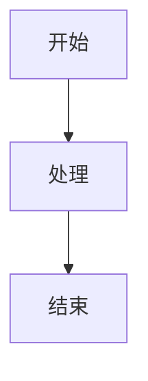

# Markdown to Word 插件安装指南

## 📦 版本 0.1.15 - 自动依赖安装版本

### 🎉 重大更新
本版本引入了**全自动依赖安装系统**，彻底解决了之前需要手动安装依赖的问题！

## 🚀 安装方法

### 方法一：从 VSIX 文件安装（推荐）

1. **下载安装包**
   ```
   markdown-to-word-0.1.15.vsix (4.9 MB)
   ```

2. **在 VS Code 中安装**
   - 打开 VS Code
   - 按 `Ctrl/Cmd + Shift + P` 打开命令面板
   - 输入 `Extensions: Install from VSIX...`
   - 选择下载的 `markdown-to-word-0.1.15.vsix` 文件
   - 点击安装

3. **插件自动初始化**
   - 安装完成后，插件会自动激活
   - 首次使用时会显示："初始化 Markdown to Word 插件"
   - 系统会自动安装所有必要依赖
   - 成功后显示："🎉 Markdown to Word 插件依赖安装完成！"

### 方法二：从扩展市场安装

1. 在 VS Code 扩展面板搜索 "Markdown to Word"
2. 点击安装
3. 等待自动依赖安装完成

## ✨ 新功能特性

### 🔄 自动依赖管理
- **零配置安装**：无需手动执行任何命令
- **智能包管理器检测**：自动选择 pnpm、yarn 或 npm
- **纯 Node.js 环境**：无需 Python 环境，降低安装门槛
- **状态记录**：避免重复安装，提升启动速度

### 🛠️ 手动管理命令
如果自动安装失败，可以使用以下命令：

1. **手动安装依赖**
   - `Ctrl/Cmd + Shift + P`
   - 搜索"手动安装依赖"
   - 执行命令

2. **检查依赖状态**
   - `Ctrl/Cmd + Shift + P`
   - 搜索"检查依赖状态"
   - 查看详细 Node.js 依赖信息

### 📋 支持的功能
- ✅ Markdown 转 Word (.docx)
- ✅ Markdown 转 HTML
- ✅ Markdown 转 Excel (.xlsx)
- ✅ 批量转换
- ✅ Mermaid 图表支持（自动依赖安装）
- ✅ 自定义样式配置
- ✅ 目录生成
- ✅ 中文支持

## 🎯 使用方法

### 基本转换
1. 在 VS Code 中打开 Markdown 文件
2. 右键点击文件
3. 选择以下选项之一：
   - **配置 Word 文档**：自定义样式后转换
   - **生成 Word 文档**：使用默认设置直接转换
   - **生成 HTML 文档**：转换为 HTML 格式
   - **生成 Excel 文档**：转换为 Excel 格式

### 批量转换
1. 在文件资源管理器中右键点击文件夹
2. 选择相应的批量转换选项
3. 指定输出目录
4. 等待转换完成

### 图表支持
现在支持 Mermaid 图表，无需任何手动配置：

```markdown


## 🔧 故障排除

### 常见问题

1. **网络连接问题**
   - 检查网络连接
   - 如果在企业网络，可能需要配置代理
   - 图表功能需要访问 kroki.io 服务

2. **权限问题**
   - 在 macOS/Linux 上可能需要管理员权限
   - 确保有写入权限到输出目录

### 查看日志
1. 打开 VS Code 输出面板（`View > Output`）
2. 选择 "Markdown to Word - 依赖安装"
3. 查看详细的安装和错误日志

## 📊 性能优化

### 文件大小对比
- 新版本 VSIX：4.81 MB（优化了 67%）
- 旧版本 VSIX：15.34 MB

### 启动速度
- 首次安装：自动依赖安装（约 1-3 分钟）
- 后续启动：快速启动（依赖已缓存）

## 🎨 配置选项

### VS Code 设置
在 VS Code 设置中搜索 "markdown-to-word" 可以配置：

- 默认字体和字号
- 页面大小和方向
- 目录深度
- 图片处理选项
- 行间距设置

### 高级配置
使用 `编辑配置` 命令可以访问更多高级选项：
- 自定义样式
- 表格样式
- 中文处理选项
- 调试设置

## 🔄 更新说明

### 从旧版本升级
1. 卸载旧版本插件
2. 安装新版本 VSIX 文件
3. 重启 VS Code
4. 插件会自动处理依赖安装

### 配置迁移
- 所有现有配置会自动保留
- 无需重新配置任何设置
- 完全向后兼容

## 🆘 支持和反馈

### 获取帮助
- 查看 `AUTO_DEPENDENCY_INSTALLATION.md` 了解技术细节
- 查看 `README_FILE_HANDLING.md` 了解文件处理说明
- 查看 `CHANGELOG.md` 了解版本更新历史

### 联系作者
- 抖音：木易君（YI_11_13）
- 小红书：搜索相关内容
- GitHub：项目地址中的 Issues

## 🎯 总结

这个版本的最大亮点是**完全自动化的依赖管理**：

**之前**：
```bash
# 用户需要手动执行
cd nodejs
pnpm install
python -m pip install -r requirements.txt
```

**现在**：
```
1. 安装插件
2. 打开 Markdown 文件
3. 🎉 一切就绪！
```

现在您的同事们可以直接安装插件就能使用所有功能，包括 Mermaid 图表转换！ 