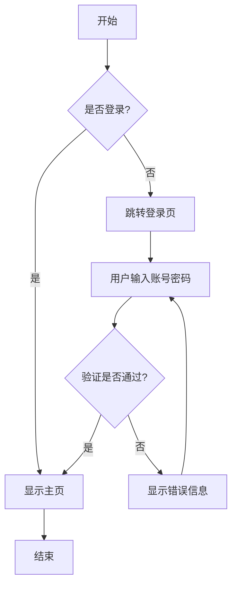
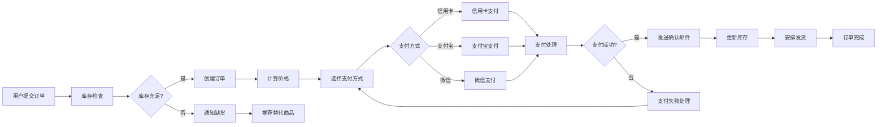
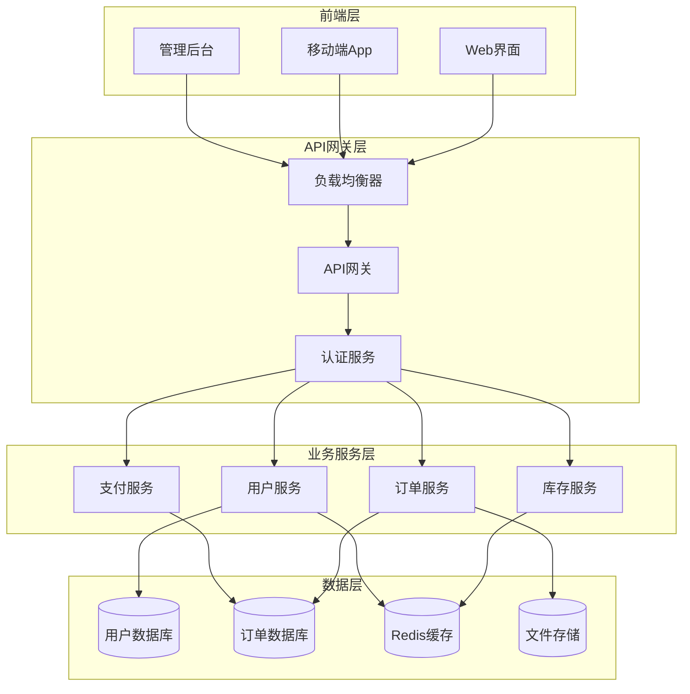
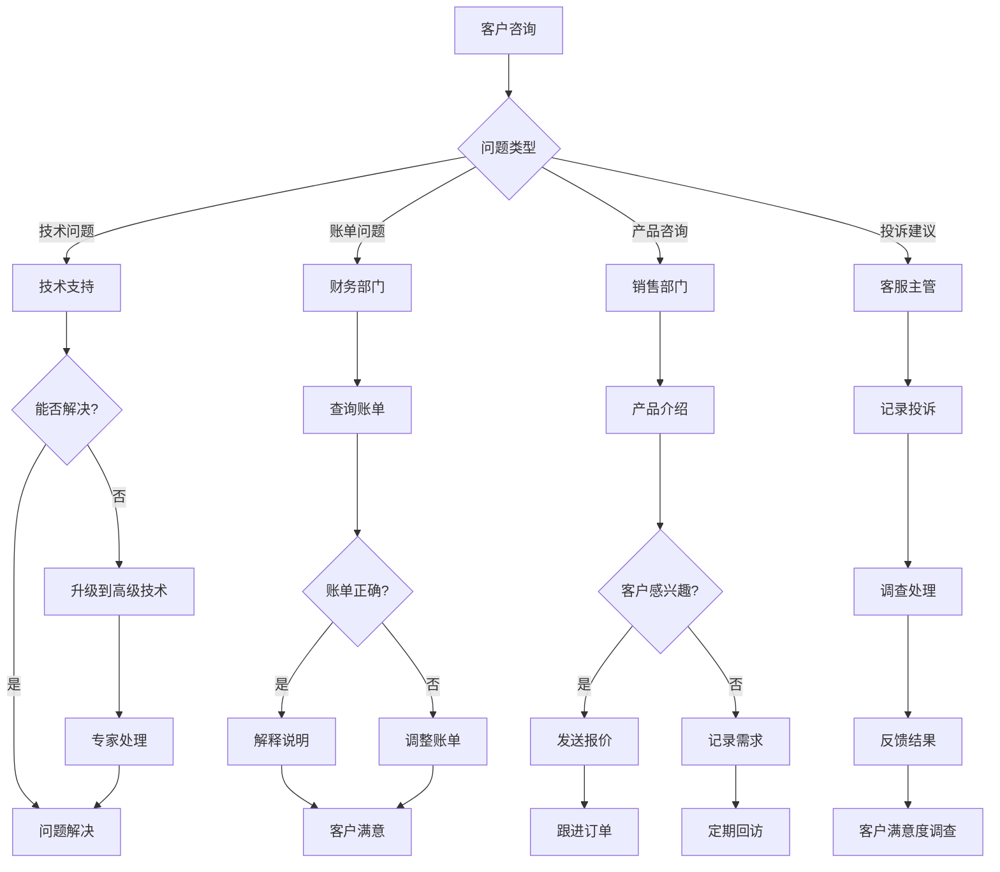
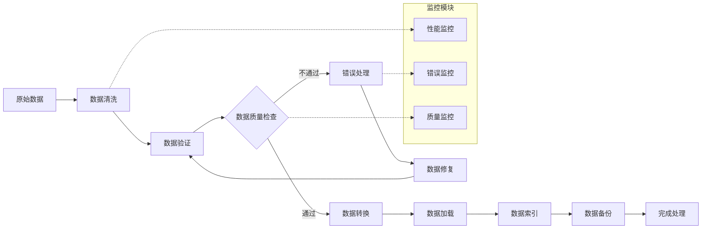
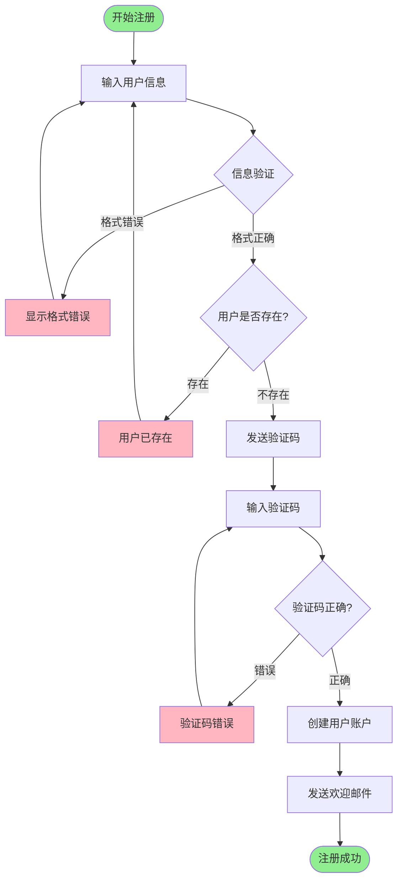
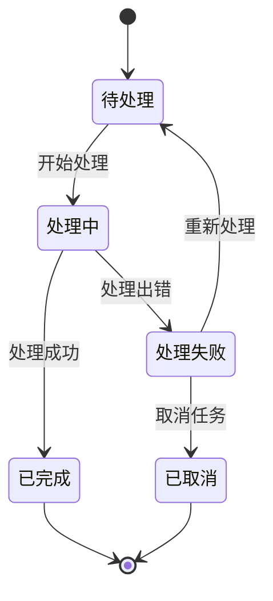
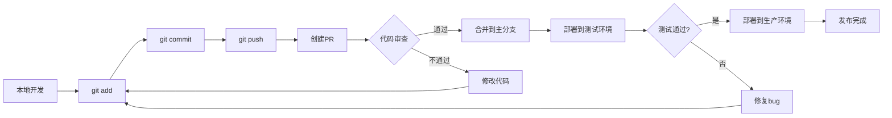

# 流程图测试文档

本文档包含多种类型的流程图，用于测试 Markdown 到 Word 转换功能中的图表处理能力。

## 1. 基础流程图

## 2. 复杂业务流程图

## 3. 系统架构流程图

## 4. 决策树流程图

## 5. 数据处理流程图

## 6. 用户注册流程图

## 7. 简单的状态转换图

## 8. Git 工作流程图

## 测试说明

本文档包含了以下类型的流程图：

1. **基础流程图** - 简单的条件判断流程
2. **复杂业务流程图** - 多分支、多决策点的业务流程
3. **系统架构流程图** - 包含子图的系统架构展示
4. **决策树流程图** - 复杂的决策分支结构
5. **数据处理流程图** - 包含监控模块的数据处理流程
6. **用户注册流程图** - 带样式的用户交互流程
7. **状态转换图** - 使用 stateDiagram 语法
8. **Git工作流程图** - 开发流程示例

这些流程图涵盖了不同的复杂度和使用场景，可以全面测试 Markdown 到 Word 转换功能中的图表渲染能力。

## 预期测试结果

- 所有流程图应该能够正确渲染为图片
- 图片应该清晰可读
- 中文字符应该正确显示
- 不同类型的图表语法都应该被支持
- 图片应该适当缩放以适应Word文档页面